# ctower — canonical system specification

| Field | Value |
|---|---|
| Status | Canonical target-system truth |
| Version | 1.6 |
| Date | 2026-07-17 |
| Owners | Operator/CEO (product and human gates), Commander (orchestration contract), Engineering Manager (architecture and risk contract) |
| Decision authority | [`DECISIONS.md`](DECISIONS.md) |

**Implementation reality:** The ctower service described here is **target architecture**. The only verified implementation today is the legacy local Mission Control/Control Tower substrate: JSONL ledgers, coordination task/status files, `bin/mux`, `tmux -L mc`, and the local Control Tower UI. No statement in this specification should be read as evidence that the target service already exists.

## Executive summary

ctower is the durable trust and orchestration layer for teams of human operators and replaceable AI-agent runtimes. It turns an inbound conversation, command, or external event into a permanent, inspectable work record; moves valuable work through a versioned software-factory workflow; binds every completion claim to evidence; controls real external effects at the capability boundary; survives runner, process, and host loss; and asks for human attention only when policy says human judgment is necessary.

The product contract is intentionally simple for the operator. There are five and only five primary surfaces:

1. **Home** — Commander omnibox, current conversation, and ranked Needs You actions.
2. **Board** — the only cross-ticket work index.
3. **Ticket detail** — the canonical journey, including conversation, workflow, live run, documents, evidence, gates, delivery, custody, and immutable timeline.
4. **Fleet** — agent profiles, runners, workspaces, routines, permissions, budgets, and health.
5. **Analytics** — attention, throughput, quality, recovery, cost, and improvement outcomes.

All other concepts are contextual views, not competing destinations. An inbound discussion may remain a durable conversation without becoming Board work. Once actionable work creates a ticket, that ticket keeps one permanent identity through planning, implementation, verification, release, incident handling, retro, resolution, closure, and any later reopen episode.

The architecture separates concerns that older documents sometimes collapsed:

- **Ticket lifecycle** says whether the promised outcome is open, active, waiting, resolved, closed, or cancelled.
- **Workflow state** says which pinned workflow stage and attempt is active.
- **Execution state** says whether a durable job is accepted, leased, running, or terminal.
- **Gate state** records immutable gate instances and verdict attempts.
- **Delivery state** is derived from linked changes, releases, deployments, environment verifications, and incidents.
- **Attention state** records an exact human action, owner, deadline, and resolution.
- **Custody state** records the one accountable ticket owner separately from stage executors and reviewers.

The Commander is the durable accountable reasoning seat for that journey. Capability policy resolves the
strongest available healthy general-reasoning profile for each fresh Commander job—currently an Opus-class
or Codex xhigh-class profile may qualify, but no vendor/model is permanently privileged. The same Commander
principal retains orchestration ownership across model, process, harness, and context-window replacement
until verified production, retro, and resolve/close. It delegates heavy implementation while recording a
versioned `orchestration_plan`: risk facts, `mandatory_stage_gates`, `review_round_topology`, review-round
execution/pass requirements, repair-attempt limits, and rationale. Consumed round and repair counts are
append-only server facts, never plan-authored values. The workflow engine enforces floors, evidence,
independence, stable cross-digest failure lineage, effects, and the hard anti-spin ceiling; the Commander
applies judgment inside those bounds.

The trusted control plane runs on an authenticated private VPS. Python is the sole trusted implementation language for the control plane, runner, CLI, and release helper; TypeScript is used only for the browser UI. FastAPI, strict Pydantic v2 contracts, psycopg3, and plain SQL provide one server-side command model to both web and CLI clients. Standard CPython 3.14.6 is the recommended greenfield pin, subject to the L0 compatibility gate and append-only supersession of D6; 3.13.14 is the explicit fallback, while 3.12 remains the historical locked pin until that gate is accepted. Postgres is the transactional record tier. Every authoritative mutation passes through one authenticated, idempotent append path that serializes per aggregate, checks idempotency before compare-and-swap, extends a hash chain, and writes an outbox row in the same transaction. `NOTIFY` is a latency hint, never the durable queue. Content-addressed object storage holds bytes; Postgres holds immutable digests and provenance; a vault holds secrets while ctower stores only references.

The worker plane is replaceable. Increment 2 wraps the existing `bin/mux`/tmux substrate behind a durable runner protocol. Every attempt pins an immutable composition of `HarnessSpec`, `SupervisorSpec`, `TargetSpec`, `WorkspaceSpec`, and `TelemetrySpec`, plus an `EnvironmentRevision`, `ImageRevision`, and `PlacementDecision`. Tmux is one Supervisor Adapter and optional same-host continuity view; it is never ticket identity, durable completion proof, or audit authority. Later VPS and sandbox runners use the same outbound-connected protocol, but real remote pools remain outside the first two increments. Jobs have accepted, leased, running, and terminal states; leases carry fencing tokens; structured events and active log chunks carry ordered cursors; reconnect replays from the last acknowledged cursor; steer, cancel, and checkpoint are durable commands. A vendor or provider session ID is only a resume/allocation hint, never identity.

Ctower begins in a brand-new `ctower` monorepo. Mission Control and the inspected Paperclip/Crabbox sources are migration or research provenance only, not runtime dependencies. The trusted control plane is a Python modular monolith: `ctower-api` and its control worker share one kernel artifact; `ctower-runner`, `ctower-web`, and `ctowerctl` are separately deployable clients of authored contracts. One deep Catalog Module applies a universal `VersionedComponent` envelope to workflows, policies, profiles, skills, tools, environments, images, placement, extensions, cadence, and integrations. A secret-free `CompanyBundle` is portable desired-state authoring over the same authenticated command API as the UI, never a file-watched control plane.

Ctower is extension-ready, not extension-led. The trusted kernel alone owns ticket, workflow, policy, evidence, gate, Attention, job, effect, and secret truth. One deep **Extension Host Module** verifies revision-pinned data-only manifests, separates requested capabilities from grants, and invokes only scoped isolated work. The first two increments implement only the runner, evidence, provider, and ingress Seams required by the golden path; arbitrary plugin workers, executable third-party UI, broad connectors, and a marketplace are deferred.

Trust is earned, not inferred. Acceptance criteria are frozen before implementation. Evidence binds criterion, artifact digest, source revision, command, environment, producer, verifier, and time. Artifact changes invalidate dependent proof. Authors cannot approve their own work. Elevated and critical review can be sealed and double-blind. Normal staging and production promotion is autonomous only after the required gates pass; no runner has standing production authority. The effect broker issues a short-lived scoped grant and records an immutable receipt at the actual deploy, send, IAM, or destructive boundary. A production verification failure becomes an incident and rollback/triage path, never an ordinary retry.

Rollout is intentionally narrow. **Increment 1** preserves the locked trust-spine wedge: authenticated ticket log, criteria/evidence/gates, Needs You, spool-backed CLI, health, backup/restore, and one freeze/import/rewire cutover with no dual write. **Increment 2** executes exactly one real software-factory ticket end to end on `bin/mux`, including workflow stages, durable jobs, independent gates, effect-brokered staging and production, live verification, runner-loss recovery, retro, and closure. General-purpose Catalog editors, a marketplace, remote runner pools, sandbox fleets, visual workflow editors, broad analytics, and multi-tenant commercialization wait.

The north star is **operator attention minutes per verified resolved ticket**, always paired with throughput, escaped defects, and time-to-detection so silence cannot game the result. ctower succeeds when the operator can trust Home in under ten seconds, ordinary transitions proceed autonomously, every side effect reconciles to authority, and process improvements measurably reduce future attention or defects.

## Table of contents

- [Document contract](#document-contract)
- [User stories](#user-stories)
- [Human information architecture](#human-information-architecture)
- [Domain model](#domain-model)
- [Workflow and verification architecture](#workflow-and-verification-architecture)
- [Technical architecture](#technical-architecture)
- [Security, trust, and operations](#security-trust-and-operations)
- [Paperclip and legacy boundary](#paperclip-and-legacy-boundary)
- [Acceptance criteria](#acceptance-criteria)
- [KPIs](#kpis)
- [Build increments](#build-increments)
- [Temporary bootstrap backlog](#temporary-bootstrap-backlog)

## Document contract

### Canonical status and source precedence

This file is the single current product, UX, domain, architecture, workflow, security, operations, acceptance, KPI, and build-increment specification for ctower. An unfamiliar principal engineer should be able to implement the first two increments from this file plus the append-only rationale ledger.

When sources differ, use this order:

1. A later operator-locked decision in `DECISIONS.md`.
2. This `SPEC.md`, version 1.3 or a later reviewed version.
3. Executable contracts generated from this spec: migrations, OpenAPI, workflow schemas, policy fixtures, and conformance tests.
4. `ARCHITECTURE.md` as a compact derived explanation of this specification; it never defines behavior or wins a conflict.
5. Historical architecture, design, engineering-plan, review, kickoff, vision, and research documents for provenance only.
6. Legacy implementation behavior, only where this specification explicitly adopts it as an Increment 1 or Increment 2 adapter.

No historical document is an alternate implementation spec. If executable code and this file disagree before the implementation has passed its acceptance criteria, the discrepancy is a defect or an explicitly reviewed spec change; it is not evidence that the code silently superseded the contract.

### What belongs where

| Home | Content | Mutation rule |
|---|---|---|
| `SPEC.md` | Current product and system truth; stable increment definitions; temporary bootstrap backlog until import | Reviewed revision; contradictions removed rather than accumulated |
| `DECISIONS.md` | Append-only operator decisions and rationale, including superseded reasoning | Append only; prior entries are never rewritten |
| `ARCHITECTURE.md` | One compact, terminal-safe ASCII atlas derived from this specification | Updated with `SPEC.md`; never creates requirements, execution authority, or a second architecture truth |
| Temporary bootstrap backlog in this file | Stable work IDs, dependency order, ownership, exit evidence, and designated validation commands before ctower has a ticket API | One-time imported into ctower; after import, ticket state lives only in ctower and this section retains definitions, not live status |
| Executable contracts | DDL, OpenAPI, schemas, policy fixtures, protocol conformance tests | Generated or reviewed against the corresponding stable backlog item |
| Historical documents | Provenance, discarded alternatives, research evidence, and review history | Read-only except for the standardized historical banner |

### Reality and evidence labels

- **Current/verified** means observed in the legacy local substrate or demonstrated by acceptance evidence.
- **Increment 1** and **Increment 2** mean committed build scope, not implemented behavior.
- **Target** means required architecture after those increments or a deliberately deferred extension.
- UI, API, runner, backup, release, or security behavior is never described as live until its acceptance evidence exists.

### North star

Durable and trackable completion of work, with feedback and an improvement loop, while minimizing operator attention per verified outcome. Visibility exists to remove status chasing, not to create another dashboard habit.

### Goals

1. Capture every accepted inbound message or event durably before reasoning begins.
2. Keep one permanent ticket identity for each independently valuable outcome.
3. Make the full work journey reconstructable without relying on chat memory, terminal scrollback, a vendor session, or a living process.
4. Execute a versioned software-factory workflow with typed attempts, deterministic gates, bounded repair, and explicit escalation.
5. Prove completion with criterion-bound evidence and independent verdicts.
6. Enforce authorization at both record transitions and real-world effect boundaries.
7. Survive runner, model, process, network, and host loss through leases, checkpoints, replay, reconciliation, and restore.
8. Provide API/CLI parity and a five-surface human experience over one server-side policy model.
9. Make agent profiles, skills, tools, context, compute, costs, and outcomes versioned and attributable.
10. Measure and improve attention, throughput, quality, recovery, cost, and process effectiveness.
11. Make configuration portable and attributable through one component lifecycle and one authenticated CompanyBundle apply path.
12. Keep execution portable across local and future remote capacity without granting providers, images, or extensions authority over work truth.

### Non-goals and deferred scope

- Replacing GitHub, GitLab, cloud providers, email systems, or observability vendors as their native system of record.
- A generic ITSM suite or multi-domain catalog in the first two increments.
- Multi-tenant SaaS billing, public self-service signup, or enterprise organization-chart navigation.
- A visual workflow/policy editor, automatic risk classifier, general plugin marketplace, or broad sandbox catalog in Increment 2.
- A general extension worker, executable third-party UI, third-party migrations, production Crabbox integration, remote placement pools, warm pools, or custom-image management runtime in the first two increments.
- Treating raw terminal output, `.status.md`, Paperclip activity, JSONL, or vendor sessions as authoritative state.
- Giving agents standing production, IAM, payment, publish, send, or destructive credentials.
- Creating child tickets for routine stage handoffs; child tickets exist only for independently valuable outcomes.

### Product principles

1. **One durable join point:** the ticket is the operator-facing work record; related aggregates stay distinct underneath.
2. **No proof, no done:** resolution is a server command that validates criteria, evidence, gates, and required delivery facts.
3. **One history, two steering speeds:** asynchronous comments and direct live steering both become ordered ticket/run inputs.
4. **Unknown is loud:** loss of transport, projection completeness, runner health, or reconciliation health must not render as calm.
5. **Execution is composition:** every attempt pins independently replaceable Harness, Supervisor, Target, Workspace, and Telemetry components; unknown or incompatible components fail closed.
6. **Durability before continuity:** a fresh runner must reconstruct work without a vendor session; session resume is optional acceleration.
7. **Default autonomous, policy-gated:** routine recovery and transitions require no human; taste, new architecture/security boundaries, destructive/irreversible choices, business decisions, and incidents do.
8. **Effects are brokered:** a gate that does not constrain the real side effect is theater.
9. **Fewer complete paths:** one fully verified golden path is more valuable than a broad incomplete platform.
10. **No split brain:** one writable source of truth after cutover; adapters and projections never dual write.
11. **Placement before provision:** hard constraints, candidate exclusions, target/environment/image revisions, and fencing are committed before any provider mutation; mutable active pointers affect future attempts only.
12. **Extension requests are not grants:** extensions propose scoped inputs or effects through the kernel Interface and never acquire canonical mutation, standing-secret, or primary-navigation authority.

### Scope boundary

ctower owns durable inbound threads, tickets and relations, workflow execution, durable jobs, agent/run provenance, artifacts and evidence, gate policy, attention, delivery truth, effect grants/receipts, incidents, routines, costs, retros, projections, API/CLI/UI, and authorization. External SCM, cloud, messaging, IAM, payment, and observability systems remain authoritative for the effects they perform; ctower links and reconciles their audit IDs.

## User stories

Each story names observable user value and links to pass/fail acceptance criteria. “I can see” means the value is available from the API and the appropriate human surface, not inferred from a terminal.

| ID | Actor | Testable story and observable value | Acceptance criteria |
|---|---|---|---|
| US-OP-01 | Operator/CEO | I submit a message in Home and immediately receive a durable thread event ID; actionable input produces or links one permanent ticket while discussion remains off the Board. | [AC-PROD-01](#ac-prod-01), [AC-DUR-01](#ac-dur-01), [AC-UX-01](#ac-ux-01) |
| US-OP-02 | Operator/CEO | I open Home and identify every genuine current policy-qualified decision or incident requiring me in under ten seconds, without informational, Commander-owned, or service-recovery noise, while degraded completeness is visibly `STATE UNKNOWN`. | [AC-UX-02](#ac-ux-02), [AC-UX-03](#ac-ux-03), [AC-UX-08](#ac-ux-08), [AC-OPS-03](#ac-ops-03) |
| US-OP-03 | Operator/CEO | I watch the active run, see ordered structured progress and optional terminal output, steer by comment or direct input with one durable transcript, and see the last accepted or refused readiness/transition evaluation explaining why work did or did not move. | [AC-PROD-03](#ac-prod-03), [AC-RUN-03](#ac-run-03), [AC-UX-05](#ac-ux-05), [AC-UX-07](#ac-ux-07) |
| US-OP-04 | Operator/CEO | I interrupt or reassign work and see exactly who retained ticket accountability, who executed each attempt, and why custody changed. | [AC-PROD-04](#ac-prod-04), [AC-WF-05](#ac-wf-05), [AC-RUN-04](#ac-run-04) |
| US-OP-05 | Operator/CEO | I approve, revise, reject, defer, or explicitly waive a policy-declared human gate from Needs You and the workflow resumes idempotently from that protected decision without fabricating evidence. | [AC-WF-07](#ac-wf-07), [AC-WF-16](#ac-wf-16), [AC-EVD-04](#ac-evd-04), [AC-UX-04](#ac-ux-04) |
| US-OP-06 | Operator/CEO | I can distinguish merged, staging verified, production verified, rolled back, and incident states without relying on wording such as “shipped.” | [AC-REL-01](#ac-rel-01), [AC-REL-04](#ac-rel-04), [AC-UX-06](#ac-ux-06) |
| US-OP-07 | Operator/CEO | **Pending recommendation:** I use a familiar Board without losing factory truth: priority, queue lane, precise stage, blockers, accountable custody, active assignment, and delivery milestone remain separate and explainable. | [AC-TM-01](#ac-tm-01), [AC-TM-02](#ac-tm-02), [AC-TM-05](#ac-tm-05) |
| US-CMD-01 | Commander | Every accepted command is deduplicated, durably classified, and routed to a pinned workflow before I dispatch work, so process death cannot drop intent. | [AC-DUR-01](#ac-dur-01), [AC-WF-01](#ac-wf-01), [AC-RUN-01](#ac-run-01) |
| US-CMD-02 | Commander | I plan and decompose an outcome using relations; I create child tickets only for independently valuable work and preserve blocker and provenance graphs. | [AC-PROD-02](#ac-prod-02), [AC-WF-02](#ac-wf-02) |
| US-CMD-03 | Commander | I resolve the strongest healthy permitted reasoning profile, select and explain a pinned workflow and versioned `orchestration_plan`, and choose review/repair rigor while the server enforces mandatory floors and the automatic ceiling. | [AC-WF-03](#ac-wf-03), [AC-WF-11](#ac-wf-11), [AC-WF-12](#ac-wf-12), [AC-WF-19](#ac-wf-19), [AC-WF-21](#ac-wf-21), [AC-WF-22](#ac-wf-22), [AC-WF-24](#ac-wf-24), [AC-SEC-03](#ac-sec-03), [AC-RUN-02](#ac-run-02) |
| US-CMD-04 | Commander | After my process/model/session dies or an executor changes, a fenced replacement reconstructs context from durable state and continues my accountable orchestration ownership through verified production and retro/close without duplicate dispatch. | [AC-DUR-04](#ac-dur-04), [AC-WF-20](#ac-wf-20), [AC-RUN-05](#ac-run-05), [AC-OPS-04](#ac-ops-04) |
| US-CMD-05 | Commander | I distinguish review-round executions from per-lineage repair attempts, amend their versioned limits only with evidence, and receive one deduplicated escalation when a selected budget/no-progress limit is exhausted rather than spinning across changed digests. | [AC-WF-08](#ac-wf-08), [AC-WF-14](#ac-wf-14), [AC-WF-21](#ac-wf-21), [AC-WF-23](#ac-wf-23), [AC-UX-04](#ac-ux-04) |
| US-AGT-01 | Assignee agent | I claim one stage attempt with a fenced lease, receive a complete versioned stage contract and context manifest, and know the exact entry checklist, exit evidence, timeout, permissions, and validation command. | [AC-WF-04](#ac-wf-04), [AC-WF-13](#ac-wf-13), [AC-RUN-01](#ac-run-01), [AC-RUN-02](#ac-run-02) |
| US-AGT-02 | Assignee agent | I can checkpoint, reconnect, replay ordered commands, and continue after runner or vendor-session loss without pretending the old session is identity. | [AC-DUR-04](#ac-dur-04), [AC-RUN-03](#ac-run-03), [AC-RUN-05](#ac-run-05) |
| US-AGT-03 | Assignee agent | I upload artifacts and evidence once by digest, link them to criteria and my attested run, and receive explicit invalidation if dependencies change. | [AC-EVD-01](#ac-evd-01), [AC-EVD-02](#ac-evd-02), [AC-EVD-03](#ac-evd-03) |
| US-AGT-04 | Assignee agent | I cannot self-approve protected gates or perform a production effect with ordinary runner credentials. | [AC-EVD-04](#ac-evd-04), [AC-SEC-04](#ac-sec-04), [AC-REL-03](#ac-rel-03) |
| US-AGT-05 | Assignee agent | I receive the same stage/job contract on local, VPS, or sandbox capacity and can inspect the exact harness, supervisor, target, workspace, telemetry, environment, image, and placement revisions without changing ticket semantics. | [AC-RUN-07](#ac-run-07), [AC-RUN-10](#ac-run-10), [AC-RUN-11](#ac-run-11) |
| US-ENG-01 | Engineer/maintainer | From a clean clone I get one fast command and one full command that enforce strict types, formatting, lint, Module boundaries, source-size/complexity limits, generated drift, observability, secrets, Interface tests, and Adapter conformance identically in hooks and CI; any exception is exact, visible, independently approved, and expiring. | [AC-QUAL-02](#ac-qual-02), [AC-QUAL-03](#ac-qual-03), [AC-QUAL-04](#ac-qual-04), [AC-QUAL-05](#ac-qual-05), [AC-QUAL-06](#ac-qual-06), [AC-QUAL-07](#ac-qual-07), [AC-QUAL-08](#ac-qual-08) |
| US-REV-01 | Reviewer/QA/CSO/Engineering Manager | I receive an immutable review input digest and cannot be assigned to review my own authored output. | [AC-EVD-04](#ac-evd-04), [AC-WF-06](#ac-wf-06) |
| US-REV-02 | Reviewer/QA/CSO/Engineering Manager | For elevated or critical work, I submit a sealed verdict without seeing the other reviewer’s report; conflicts are revealed only after both verdicts and resolved independently. | [AC-WF-06](#ac-wf-06), [AC-EVD-05](#ac-evd-05) |
| US-REV-03 | Reviewer/QA/CSO/Engineering Manager | I verify code, UI use, tenant isolation, architecture, security, or documentation against declared criteria and attach reproducible evidence rather than a prose assertion. | [AC-EVD-01](#ac-evd-01), [AC-EVD-05](#ac-evd-05), [AC-WF-07](#ac-wf-07), [AC-WF-17](#ac-wf-17) |
| US-REV-04 | Reviewer/QA/CSO/Engineering Manager | When an artifact digest changes, every verdict that depended on it becomes invalid before the workflow can advance; an implementation repair after review must obtain fresh QA before re-review. | [AC-EVD-03](#ac-evd-03), [AC-WF-09](#ac-wf-09), [AC-WF-15](#ac-wf-15) |
| US-OPS-01 | DevOps/release runner | I perform staging or production promotion only through a short-lived effect grant bound to the release digest, target, policy, and idempotency key. | [AC-REL-02](#ac-rel-02), [AC-REL-03](#ac-rel-03), [AC-REL-08](#ac-rel-08), [AC-SEC-04](#ac-sec-04) |
| US-OPS-02 | DevOps/release runner | I record deployment and environment verification independently, so merge or deploy success cannot imply user-visible correctness. | [AC-REL-01](#ac-rel-01), [AC-REL-04](#ac-rel-04) |
| US-OPS-03 | DevOps/release runner | A failed production smoke or live QA opens an incident, revokes authority, rolls back or contains when safe through the effect broker, and routes triage before any fix attempt. | [AC-WF-18](#ac-wf-18), [AC-REL-05](#ac-rel-05), [AC-REL-06](#ac-rel-06) |
| US-OPS-04 | DevOps/release runner | I can prove backup, restore, reboot reconciliation, and rollback readiness with dated drill evidence. | [AC-DUR-05](#ac-dur-05), [AC-OPS-05](#ac-ops-05), [AC-REL-06](#ac-rel-06) |
| US-OPS-05 | Platform operator/DevOps | I create a revision-pinned routine with cron/timezone or event triggers, see every due occurrence including skipped/coalesced outcomes, and survive scheduler/worker restarts without losing, duplicating, or flooding work; agent wakes remain event-driven by default. | [AC-OPS-13](#ac-ops-13), [AC-OPS-14](#ac-ops-14), [AC-OPS-15](#ac-ops-15) |
| US-ADM-01 | Platform administrator | I create and revise agent profiles, souls, skills, tools, models, budgets, and placement policy without mutating prior run provenance. | [AC-RUN-02](#ac-run-02), [AC-SEC-03](#ac-sec-03), [AC-OPS-07](#ac-ops-07) |
| US-ADM-02 | Platform administrator | I register, rotate, quarantine, and revoke runners and scoped credentials without storing plaintext credentials in ctower records. | [AC-SEC-01](#ac-sec-01), [AC-SEC-02](#ac-sec-02), [AC-RUN-06](#ac-run-06) |
| US-ADM-03 | Platform administrator | I enforce tenant/project scope, capacity, concurrency, cost, storage, and egress quotas server-side and see budget stops as typed workflow events. | [AC-SEC-05](#ac-sec-05), [AC-OPS-06](#ac-ops-06), [AC-OPS-07](#ac-ops-07) |
| US-ADM-04 | Platform administrator | I reconcile external effects, detect bypasses, restore from PITR/object backups, and surface any incomplete state as degraded rather than healthy. | [AC-SEC-06](#ac-sec-06), [AC-OPS-03](#ac-ops-03), [AC-OPS-05](#ac-ops-05) |
| US-ADM-05 | Platform administrator | I upgrade schema, service, workflow, policy, and runner protocol revisions with compatibility checks and a rollback path that preserves accepted events. | [AC-DUR-06](#ac-dur-06), [AC-REL-08](#ac-rel-08), [AC-OPS-08](#ac-ops-08) |
| US-ADM-06 | Platform administrator | I validate, semantically plan, apply, and export a secret-free CompanyBundle through the same command API as the web UI; published resource revisions and exact run pins remain attributable after Git/YAML changes. | [AC-ADM-01](#ac-adm-01), [AC-COMP-01](#ac-comp-01), [AC-COMP-03](#ac-comp-03) |
| US-ADM-07 | Platform administrator | I publish, supersede, revoke, roll back, and garbage-collect execution-environment and image revisions while accepted/running attempts remain pinned to immutable digests. | [AC-RUN-12](#ac-run-12), [AC-SEC-09](#ac-sec-09), [AC-OPS-11](#ac-ops-11) |
| US-ADM-08 | First operator/platform administrator | From a genuinely empty installation, I use one short-lived local/private bootstrap capability exactly once to create the first tenant, my operator/admin identity, the durable Commander principal, and vault-binding references in one audited transaction; replay, remote origin, expiry, or a second bootstrap is refused. | [AC-ADM-02](#ac-adm-02), [AC-SEC-03](#ac-sec-03), [AC-DUR-02](#ac-dur-02) |
| US-SEC-01 | Security reviewer | I can prove reusable images, warm capacity, caches, terminal sessions, and extension invocations contain no standing credentials or login sessions and cannot cross tenant, kernel, or provider boundaries. | [AC-EXT-01](#ac-ext-01), [AC-EXT-03](#ac-ext-03), [AC-SEC-09](#ac-sec-09), [AC-SEC-10](#ac-sec-10), [AC-SEC-11](#ac-sec-11) |
| US-LEARN-01 | Operator and Commander | After release or incident, I receive a retro linked to measurable defects, retries, attention, and cost; accepted improvements version future workflows, skills, or policy and are later evaluated. | [AC-WF-10](#ac-wf-10), [AC-PROD-05](#ac-prod-05), [AC-OPS-08](#ac-ops-08) |

## Human information architecture

### Locked five-surface model

| Primary surface | Canonical question | Required content | Explicitly contextual, not a new primary route |
|---|---|---|---|
| **Home** | What do I want, and what genuinely needs me now? | Commander omnibox/thread, current ticket summary, ranked Needs You, health/completeness banner | Approvals, questions, escalations, incident decisions |
| **Board** | Where is every valuable outcome? | Searchable/filterable tickets, lifecycle, workflow stage, owner, risk, attention, delivery summary, relations | Goals, projects, saved views, dependency maps |
| **Ticket detail** | What happened, what is happening, what proves it, and why did or did not it move? | Outcome, workflow map, live run, conversation, documents, criteria, evidence, gates, custody, delivery, costs, timeline, retro, and the last accepted/refused readiness or transition evaluation with its exact unmet checklist | Artifacts, annotations, changes, releases, incidents |
| **Fleet** | Who and what can execute, and is it healthy? | Agent profiles/revisions, runners/nodes, jobs/runs/sessions, workspaces, routines, tools, budgets, capacity, trust | Org chart, provider settings, gateways, secret references |
| **Analytics** | Is the system reducing attention while preserving outcomes? | KPI definitions and trends, stage/cost/quality/recovery analysis, bypass reconciliation, improvement effectiveness | Raw exports, audit queries, cost drill-down |

Global navigation exposes Home, Board, Fleet, and Analytics in that order; Ticket detail is the fifth
primary surface but opens contextually from a ticket or directly by permanent ticket ID rather than as an
empty global destination. Home combines the Commander and Needs You; they are not separate destinations.
Board is the only required cross-ticket index. Mobile may present a condensed layout, but it must preserve
Home decisions and health truth rather than introduce another information architecture.

#### Locked screenshot inventory and contextual placement

The product and UI-QA screenshot inventory contains exactly these five primary surfaces; a test, Adapter,
extension, or configuration cannot add a sixth. Paperclip screenshots are research provenance mapped into
this inventory, not a license to reproduce its page-per-noun navigation.

| Primary screenshot surface | Included concepts from the research inventory | Never a primary destination |
|---|---|---|
| **Home / Needs You** | Commander omnibox/thread, current ticket, exact operator actions, health | Separate Commander dashboard, approvals inbox, generic Activity |
| **Board** | Tasks, Goals, Projects as filters/groups; priority, lane, precise stage, blocker, owner, delivery | Separate Tasks, Goals, Projects, Issues, or dependency-board routes |
| **Ticket detail** | Artifacts, current workspace, runs/transcript, evidence, gates, changes, releases, incidents | Global Artifacts, Workspaces, Timeline, or Approvals routes |
| **Fleet** | Agents, org context, skills, workspaces, routines, Harness/Supervisor/Target/Workspace/Telemetry Adapters, budgets and health | Agent store, Skills Store, Routines, Environments, or Adapters as primary routes |
| **Analytics** | Timeline analysis, Costs, Activity, quality/recovery/attention trends | Writable status, raw event log as ordinary navigation |

Members, invites, identities/access, secret bindings, execution environments, image lifecycle, provider
targets, and extension installation are secondary **Admin** contexts reached from the five surfaces. Admin
does not count as a primary product surface. Extensions may contribute only host-rendered contextual schemas
such as `ticket.context_panel`, `ticket.timeline_annotation`, `ticket.artifact_renderer`,
`fleet.adapter_health`, `analytics.readonly_widget`, or `admin.extension_settings`; they cannot create routes,
write projections, mount inside Needs You, replace Ticket history, or hide `STATE UNKNOWN`.

#### Recommended task-management projection (pending operator confirmation)

The following is a cohesive target contract and is testable in L0, but its product shape remains an
**architecture recommendation until the operator explicitly confirms it**. It is not an operator-locked
decision in `DECISIONS.md`.

Three axes remain orthogonal:

| Axis | Values | Authority |
|---|---|---|
| Priority | `P0`, `P1`, `P2` | Append-only Work facts; P0 requires incident/security/production-critical or explicitly authorized urgent-business evidence |
| Board lane | `Backlog`, `To Do`, `In Progress`, `In Review`, `Blocked`, `Done` | Deterministic rebuildable server projection; never a client-authored status |
| Factory stage | `Think -> Plan -> Design -> Implement -> Local QA -> Review -> Docs -> Release -> Staging QA -> Production release -> Production QA -> Retro` | Pinned Workflow run and stage instances |

If this recommendation is confirmed, actionable ticket/episode creation atomically appends its first
priority fact. The server default is `P2`; an authenticated caller may request `P1`, while `P0` still needs
the declared urgent evidence/authorization. No actionable episode can exist between creation and that
initial fact, and reopen appends the new episode's initial priority from explicit policy/current-priority
carry-forward rather than silently inheriting mutable state.

The lane fold is exact and versioned:

1. A terminal resolved/closed lifecycle episode derives `Done`; cancellation is a separate terminal
   disposition and is excluded from the default six-lane Board.
2. Any open effective blocker with Board impact derives `Blocked` while preserving the exact resume stage
   and otherwise-derived lane.
3. Active `Local QA`, `Review`, `Staging QA`, and `Production QA` derive `In Review`.
4. Every other active stage/attempt derives `In Progress`.
5. Admitted and logically ready work waiting for a WIP/capacity slot derives `To Do`.
6. Accepted work not yet admitted/committed to execution derives `Backlog`.

Queueing is not blocking. `Blocked` requires one or more durable blocker records, each with type/reason
class, owner, source, affected stage, open time, resolution condition, next check/SLA, dependency/reference,
and resolution evidence. All effective blockers must clear; only operator-action blockers qualify for Needs
You. Watchdogs recheck, age, and escalate blockers rather than parking them silently.

Board drag/drop and CLI moves issue typed intents—`admit`, `defer`, `block`, `unblock`, or `reopen`—with
expected version and reason. The server may refuse with the exact unmet checklist and an unchanged state
version; there is no unrestricted `PATCH status`. Priority changes similarly record from/to, actor, reason,
policy, and command. Agents cannot self-escalate to P0. Scheduling first enforces capability, trust,
readiness, gates, environment/image, WIP, quota, and no-colocation constraints, then applies priority with
bounded aging/fairness. Preemption is permitted only at a safe checkpoint and never bypasses verification or
effect policy.

Board cards show priority, precise factory stage, `ticket_custodian`, `current_assignee`, blocker age/reason,
risk, and delivery milestone. Filters/grouping include project, goal, stage, priority, owner, and risk.
Ticket detail owns the full stage stepper plus blocker and priority histories. Board `Done` is a task-lifecycle
projection; governing delivery `DONE` means staging verified. A ticket may be delivery `DONE` while Board is
still `In Progress` during production release, production QA, retro, and resolve/close.

### Omnibox classification and promotion

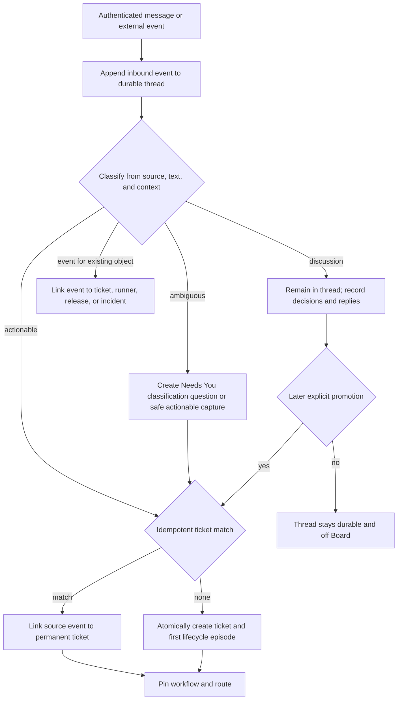

The inbound event is durable before classification. Discussion therefore cannot be lost and does not create Board noise. Promotion stores every source message ID, and ticket creation/linking is atomic with the provenance edge so a retry cannot create two tickets.

### Autonomous software-factory happy path

```mermaid
flowchart LR
    I[Intake] --> T[Think]
    T --> P[Plan]
    P --> D[Design]
    D --> M[Implement]
    M --> L[Local verification and QA]
    L --> R[Risk-derived review]
    R --> X[Documentation]
    X --> F[Release preflight]
    F --> G[Merge]
    G --> S[Staging deploy]
    S --> Q[Staging QA]
    Q --> U[Production deploy]
    U --> V[Production smoke and live QA]
    V --> E[Retro]
    E --> C[Resolve and close]
```

Each arrow is a server-evaluated transition against a pinned workflow revision, not a prompt convention. Routine transitions are autonomous when entry and exit contracts are satisfied. The same permanent ticket links every stage attempt and delivery record.

### Human gate, Needs You, and resume

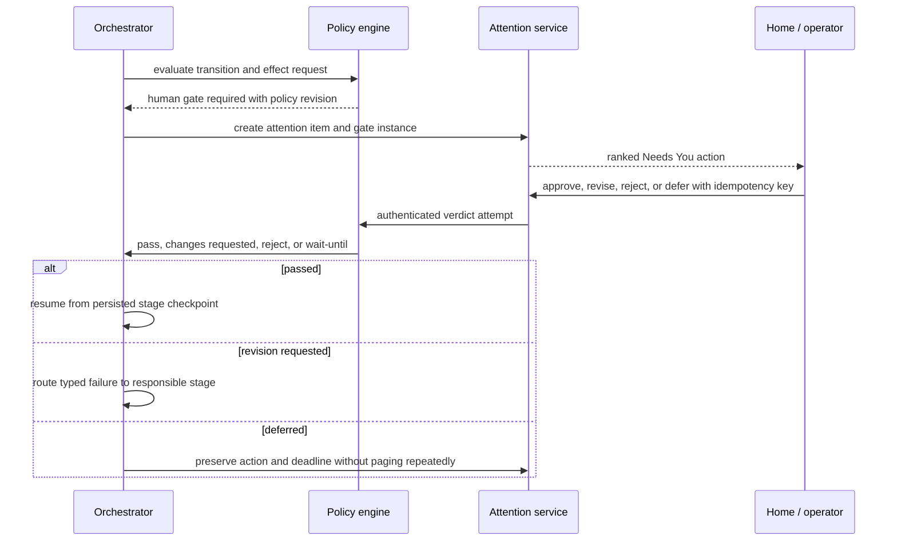

The attention item does not transfer ticket custody. The operator decision is authenticated, version-bound, and replay-safe. Resume uses durable workflow and checkpoint state rather than a surviving chat session.

Needs You is a strict server projection, not a synonym for notifications or open work. A row qualifies only
when its current Attention state is `open`, its effective owner is the operator, the pinned policy classifies
the requested action as human-owned, and the linked gate/incident/decision is still unresolved on the current
digest. Informational notices, Commander-owned plan/budget choices, ordinary service recovery, runner
restarts, projection repair, and actions already resolved/expired/superseded are excluded. An incident appears
only when policy names a current operator decision, not merely because an incident record exists. The
projection coalesces one dedupe key and removes or refreshes a row within the 60-second freshness SLO when
ownership, policy qualification, digest, or resolution changes.

### Live observation, steering, interruption, and reassignment

```mermaid
sequenceDiagram
    participant H as Operator
    participant API as ctower API
    participant J as Durable job
    participant R as Runner
    participant N as New executor
    R->>API: ordered structured events cursor 41..52
    API-->>H: live projection plus optional raw terminal
    H->>API: steer input with ticket, attempt, and client command ID
    API->>J: append durable input command
    J->>R: deliver command at cursor 53
    H->>API: interrupt and reassign with reason
    API->>J: cancel current lease; increment fencing token
    J-->>R: cancel token 8
    API->>N: offer job with token 9 and checkpoint digest
    N->>API: accept, replay after cursor 53, resume
    API-->>H: custody unchanged or explicitly transferred; executor history preserved
```

Structured events and durable commands are authoritative. The raw terminal is a compatibility view. A late result from the interrupted runner carries the old fencing token and is rejected without erasing its forensic log.

### Verification failure, proof invalidation, and bounded repair

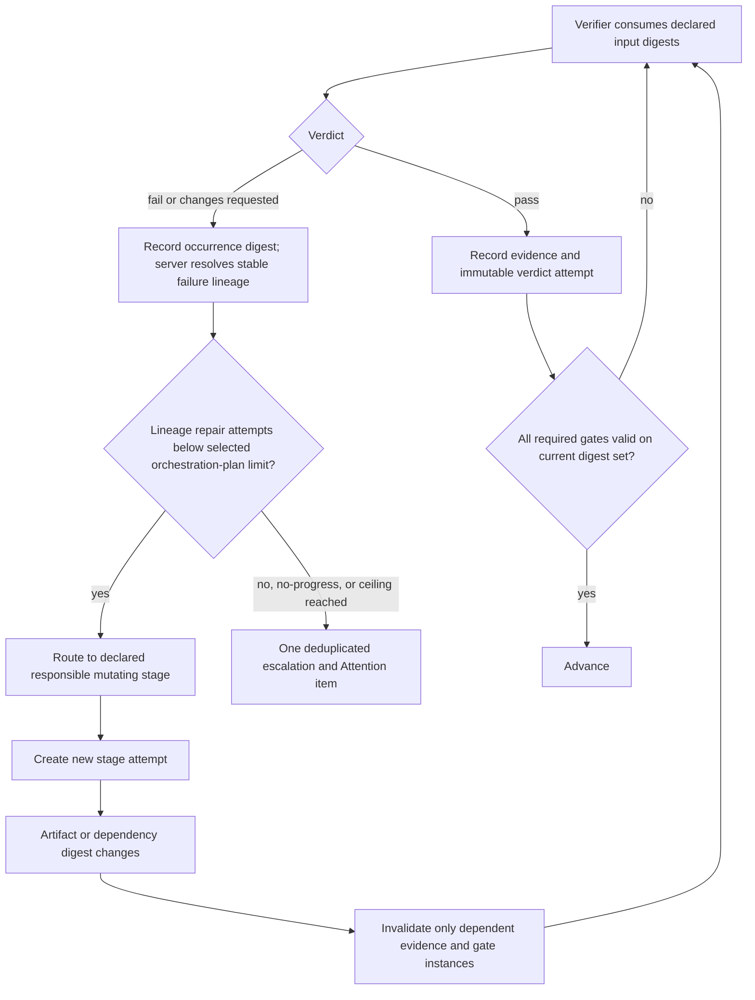

The repair-attempt budget is keyed by a server-controlled stable failure-lineage key, not by the changing
candidate digest and not by a global ticket counter. Each occurrence still records its exact input digest.
The server deterministically keeps the same lineage for the same stage, failure class, normalized subject,
verifier rule revision, and environment class across `d1 -> d2 -> d3`; only a policy-declared split rule or
an independent lineage adjudicator may create a child lineage linked to its predecessor. Verifier prose or
a new digest cannot mint capacity. Two genuinely unrelated lineages do not consume one another’s budget.
The Commander selects limits inside the policy floor and hard automatic ceiling, while append-only server
events own consumption; reassignment, prose, or a new reasoning session cannot reset it. A repair never
overwrites old attempts; it creates new artifacts and invalidates the exact downstream proof graph that
depended on changed digests.

### Staging and production promotion, incident, and rollback

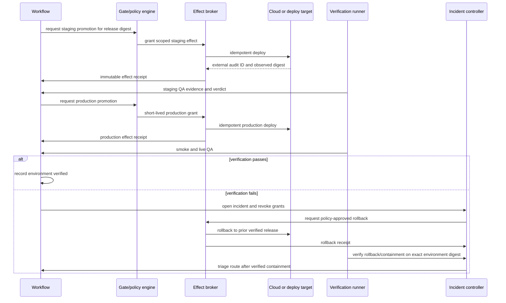

Merge, deployment, and verification are distinct facts. A production failure enters incident containment first. Safe automatic rollback is a compensating effect; unsafe or ambiguous rollback becomes a Needs You decision. Fix-forward work begins only after triage chooses the responsible stage.

### Runner loss, lease expiry, reconciliation, and resume

```mermaid
stateDiagram-v2
    state "accepted" as JAccepted
    state "leased" as JLeased
    state "running" as JRunning
    state "terminal" as JTerminal
    [*] --> JAccepted
    JAccepted --> JLeased: runner accepts offer; token increments
    JLeased --> JRunning: run.started with current token
    JRunning --> JRunning: heartbeat, event, checkpoint
    JLeased --> JLeased: heartbeat missed; health projection becomes suspect
    JRunning --> JRunning: heartbeat missed; health projection becomes suspect
    JLeased --> JAccepted: lease_expired event; close lease, token++, requeue
    JRunning --> JAccepted: lease_expired event; close lease, token++, requeue
    JAccepted --> JLeased: replacement runner claims
    JLeased --> JRunning: restore checkpoint and replay commands
    JLeased --> JTerminal: server cancellation or terminal lost by policy
    JRunning --> JTerminal: succeeded, failed, cancelled, or terminal lost
    JTerminal --> [*]
```

Suspect is an observed-health projection, not an authoritative job state. The durable state remains leased or running until expiry. Reconciliation is idempotent, increments the fencing token, and can resume on a different runner without changing ticket identity or silently treating a lost job as success.

### Cross-surface navigation rules

- Every Needs You item links to the exact ticket section, gate, incident, or runner recovery action.
- Board rows show a derived summary only; mutations occur through commands and canonical detail views.
- Ticket detail renders one chronological typed timeline while allowing anchored views for workflow, evidence, and delivery.
- Ticket detail shows the latest readiness/transition evaluation: requested edge, accepted/refused result,
  rule and policy revisions, current input digest, every unmet item and owner, evaluation time, linked
  evidence, and before/after aggregate versions. A refusal has equal visibility and proves no state mutation.
- Fleet links a current run back to its ticket and links an agent profile to every immutable revision used by historical runs.
- Analytics links every aggregate metric to query definitions and drill-down records; it cannot become a second source of status.
- Empty Home is positive only when health and completeness checks are green. Otherwise it is `STATE UNKNOWN`, never “All clear.”

## Domain model

### Aggregate boundaries and relationships

An aggregate owns only the invariants that must be transactional together. Cross-aggregate coordination uses authenticated commands, immutable event references, and the transactional outbox; it does not enlarge the ticket into a god object.

| Aggregate or entity | Boundary and owned truth | Key relationships |
|---|---|---|
| **Inbound thread / conversation** | Durable channel-neutral thread, participants, source scope, ordered inbound/outbound command events, classification, and promotion provenance | May link zero or more tickets; source event IDs are immutable aliases |
| **Inbound conversation/command event** | Original payload reference, authenticated or source-verified actor, taint level, idempotency key, classification result, and append position | Belongs to one thread; may promote/link a ticket or attach to another aggregate |
| **Ticket** | Permanent ID, tenant/project scope, promised outcome, lifecycle episode pointer, accountable owner, aggregate version, and ticket-event hash-chain head | Links relations, workflow runs, criteria, attention, changes, costs, and retros; does not own their internal state |
| **Priority fact / blocker (pending recommendation)** | Append-only priority changes and durable typed unmet conditions with owner, source, affected stage, resolution contract, next check/SLA, and evidence | Work truth is orthogonal to risk, stage, Board lane, delivery, and Attention; multiple effective blockers coexist |
| **Ticket relation** | Typed edge with source, target, actor, rationale, and validity; `parent_of`, `depends_on`, `blocks`, `duplicates`, `relates_to`, `caused_by` | Parent graph and blocker graph are separately cycle-checked; child tickets require independent value |
| **Lifecycle episode** | One open-to-terminal interval with opening event, outcome, resolution/closure/cancellation facts, and optional next episode | `reopened` closes no history; it starts a new numbered episode on the same ticket |
| **Workflow component revision** | Immutable named stage graph, roles, capabilities, contracts, transitions, retry policy, failure routes, and gate policy inside the universal component envelope | One workflow run pins one revision/digest; revisions are never edited in place |
| **Execution policy revision** | Participant/capability resolution, activated optional gates, review/repair limits, timeouts, model/harness/environment placement, budgets, escalation, and waiver constraints | A run pins a compatible revision; policy may narrow/select within a Workflow but cannot invent a stage, edge, or terminal condition |
| **Workflow run** | Application of one workflow version to one lifecycle episode, desired/observed state, and terminal disposition | Owns stage instances; links ticket episode and policy snapshot |
| **Commander orchestration plan / revision** | Immutable per-ticket revision naming resolved Commander capability/profile, risk facts, `mandatory_stage_gates`, `review_round_topology`, selected maximum round executions/current-digest pass requirement, per-lineage repair-attempt limits, rationale, evidence, and superseded revision | One active revision per workflow run; owns limits/topology/rationale only. It may carry a labeled non-authoritative counter snapshot at an event watermark, but never accepts or owns consumed counts. |
| **Stage definition** | Immutable node within a workflow version, including entry/exit contracts and allowed parallelism | Copied by reference into stage instances; never derives from ticket status |
| **Stage instance** | One logical occurrence of a stage in a workflow run, dependency readiness, required gates, and terminal result | Owns ordered attempts; parallel instances only where graph permits |
| **Stage attempt** | One execution/verification attempt, input digest manifest, executor, failure occurrence/lineage references, timeout, output digest manifest, and disposition | Links one or more durable jobs/runs and evidence; does not transfer ticket custody |
| **Failure lineage / occurrence / repair consumption** | Server-owned normalized defect identity plus immutable digest-specific occurrences and append-only repair-consumed events | A lineage remains stable across candidate mutations; deterministic policy or independent adjudication alone may split it. A monotonic projection supplies current consumption and exhaustion. |
| **Assignment / custody interval** | Exclusive accountable ticket owner or exclusive stage-attempt executor over a time interval, including from/to, actor, reason, and source command | Ticket ownership, stage execution, and reviewer assignment are different assignment kinds |
| **Durable job / lease** | Dispatch state, command payload digest, capability requirements, priority, attempt, lease deadline, fencing token, heartbeat, cancellation, and terminal result | Job may create execution runs on runners; a stage attempt may use several sequential jobs |
| **Agent-profile component revision** | Stable profile key plus immutable soul, operating instructions, skills, tool policy, harness/model policy, memory/context rules, budget, and placement constraints inside the universal component envelope | Execution run pins exactly one profile revision/digest and concrete resolved skill/tool revisions |
| **Runner / node** | Registered workload identity, protocol version, capabilities, trust class, capacity, allowed scopes, heartbeat, and quarantine/revocation state | Hosts execution runs and workspaces; never writes record tables directly |
| **Execution run / session** | One bounded adapter execution with runner, job token, profile revision, context manifest, timestamps, usage, outcome, and ordered event cursor; vendor session handle is optional metadata | Run can allocate cost across tickets/stages; session is never identity |
| **Effective run manifest / placement decision** | Immutable per-attempt pins for Harness, Supervisor, Target, Workspace, Telemetry, environment, image, target/allocation/incarnation, resources, egress, isolation, candidate exclusions, and rationale | Component or placement change creates a new attempt; mutable active pointers and provider handles cannot rewrite it |
| **Execution environment / image revision** | Immutable desired toolchain, OS/architecture, image digest, network, resources, cache/reuse/scrub, attestation, provenance, lifecycle, and future active pointer | Distinct from staging/production release environments; reusable bytes never contain standing credentials/login sessions |
| **Target / allocation / incarnation** | Stable capacity registration, one fenced job reservation, and one observed host/VM/sandbox generation | Ctower allocation/fencing is authority; provider lease/run/resource IDs are scoped observations only |
| **Workspace / checkpoint** | Workspace provider, source revision, mutable work location, ownership lease, checkpoint manifests, cleanup state, and recovery preconditions | A checkpoint is content-addressed and linked to a run/stage attempt; cleanup cannot destroy sole uncommitted evidence |
| **Artifact / document / revision** | Artifact identity, kind, trust disposition, content digest, metadata, keyed document revisions, locks, annotations, and retention | Referenced as input or output; approved revisions are immutable and later edits create new revisions |
| **Acceptance criterion** | Stable criterion ID, exact pass condition, evidence contract, active/superseded state, author, and frozen version | Belongs to ticket episode or stage; resolution evaluates all active criteria |
| **Evidence / attestation** | Verifier claim binding criterion, artifact/input digest set, command, source revision, environment, producer run, verifier principal, trust, timestamp, expiry, and signature/attestation | Evidence can satisfy criteria or feed gates; dependency edges drive invalidation |
| **Gate instance / verdict attempt** | Immutable required gate bound to policy revision and input digest set; ordered authenticated verdict attempts with rationale and evidence | New digest creates a new or invalidated instance; prior verdict is never overwritten |
| **Attention item** | Exact human action, policy qualification, reason code, owner, recommendation, alternatives, consequence/default, deadline, dedupe key, and resolution | Needs You includes only current open operator-owned policy-qualified decisions/incidents; informational, Commander-owned, and service-recovery items remain outside that projection. |
| **Transition/readiness evaluation** | Immutable requested edge, accepted/refused result, rule/policy revisions, current input digest, every unmet item and owner, evaluated time, linked evidence, and before/after versions | Ticket detail exposes the latest evaluation. A refusal records no state mutation and retains the exact command result. |
| **Change** | Source-control or configuration change identity, repository/component, commit/diff digest, merge request, authors, and merge fact | Many changes may serve one ticket; one change may serve multiple tickets through explicit allocation |
| **Release** | Immutable release candidate digest and included changes/artifacts, source revision, rollback predecessor, and promotion policy snapshot | Owns deployment attempts by environment; tickets derive delivery summaries from linked releases |
| **Deployment attempt** | One requested effect to one environment with grant, receipt, observed artifact digest, timestamps, and outcome | Never implies environment verification; rollback is another deployment attempt with a compensating relation |
| **Environment verification** | Smoke/live/QA result for exact environment and deployed digest with URL/probe/user-flow evidence | May pass, fail, or expire; production failure links an incident |
| **Effect grant / receipt** | Short-lived authorization and immutable result for deploy, send, publish, payment, IAM, or destructive action at the actual boundary | Grant binds ticket/stage/policy/digest/target/idempotency; receipt binds external audit ID |
| **Incident** | Detection, severity, affected environment/effect, containment, rollback, communications, root cause, and resolution | Production verification failures create or link incidents before repair routing |
| **Routine / trigger** | Versioned scheduled, webhook, event, or manual trigger; catch-up, concurrency, scope, and idempotency policy | Creates inbound events or durable jobs through ordinary command paths |
| **Extension revision / grant / invocation** | Content-addressed data-only manifest, requested capabilities, separately approved scoped grant, lifecycle/active pointer, invocation identity, contextual contributions, health, and tombstone | Extension Host invokes through kernel commands/jobs only; no kernel-table, standing-secret, primary-route, or direct effect authority |
| **Cost allocation** | Usage/currency/source record and explicit fractional allocation to ticket, workflow, stage, run, and project | Allocation fractions sum to 1 per cost record; shared sessions never double count |
| **Retro / process improvement** | Evidence-backed comparison of expected and actual outcome; defect/retry/attention/cost findings; proposed workflow/skill/policy change; owner and effectiveness window | Accepted improvement creates a linked ticket/change and a new immutable configuration revision |

### Wake, reasoning-heartbeat, routine, cron, and watchdog contract

Ctower does not use `heartbeat` as one overloaded implementation noun. Five distinct facts have separate
owners, states, events, and health signals:

| Term | Normative meaning | Authority boundary |
|---|---|---|
| **Trigger** | Versioned reason work may become due: assignment, event, mention, gate resolution, schedule, webhook, manual command, retry, or reconciliation | Proposes an occurrence or wake; never invokes a model directly |
| **Wake intent** | Idempotent committed request to create or coalesce a bounded job with exact cause, scope, and revision pins | Durable before dispatch; receipt by a worker is a later fact |
| **Reasoning heartbeat** | Operator-facing name for one bounded execution run that claims a wake job, records progress/checkpoints, and terminates | The authoritative entity is `execution_run`; it is not agent identity or memory |
| **Lease heartbeat** | Runner liveness/progress frame that may renew only the current fenced job lease | Cannot instruct reasoning, advance Workflow, approve proof, or imply success |
| **Scheduler beat** | Deterministic due-trigger scan that materializes Routine occurrences | Does not create one operating-system cron process per agent or Routine |

The event and schema vocabulary uses `wake_intent`, `job`, `execution_run`, `lease.heartbeat`, and
`scheduler.scan`. A UI may label an execution run “heartbeat,” but may not collapse these states.

#### Event-driven default and Routine revisions

New profiles have periodic reasoning wakes disabled. Assignment, comment/mention, gate resolution,
steering, retry, and reconciliation append event-driven wake intents. Recurring business work is a
versioned **Routine** with one or more schedule, signed-webhook, event, or manual triggers. Polling is
allowed only when a source has no push interface and must be an explicit named Routine with an owner,
cost, staleness target, and disable switch.

A Routine revision immutably pins its instruction template and typed variables; tenant/project/goal and
optional parent ticket; default stage/capability; trigger definitions; IANA timezone and daylight-saving
policy; concurrency, catch-up, idempotency, backlog, timeout, cost, and escalation policies; and referenced
Profile, Skill, Workflow, Execution Policy, environment, and secret references. Every occurrence pins the
exact Routine and component revisions. Editing, pausing, disabling, or rolling back affects future
occurrences only. Pausing a schedule, pausing an agent, draining a runner, and stopping a project are
different commands with different server-enforced effects.

#### Durable scheduling and cron semantics

The logical scheduler runs inside the control worker. A service manager timer may kick a stalled or idle
worker, but is never Routine truth. For each due trigger revision, one database transaction:

1. inserts a unique occurrence keyed by `(trigger_revision_id, scheduled_for)`;
2. evaluates catch-up, concurrency, pause, quota, and idempotency policy;
3. appends a visible `queued`, `coalesced`, `skipped`, or refused outcome;
4. creates the ordinary inbound event, ticket command, or wake job when required;
5. writes the outbox record; and
6. advances `next_fire_at` under compare-and-swap.

Commit precedes dispatch. Duplicate scans, restarts, and outbox replay therefore converge on one logical
occurrence. Database time selects due work. Each schedule occurrence stores the UTC instant plus original
local civil time, timezone, and offset decision. The default DST policy is `wall_clock_once`: a nonexistent
civil time is visibly skipped; a repeated ambiguous time fires once at the earlier offset. Fixed elapsed
polling uses a UTC interval trigger.

The concurrency policy is exactly one of `coalesce_if_active`, `skip_if_active`,
`serialize_one_pending`, or `always_enqueue_bounded`. The catch-up policy is exactly one of
`skip_missed`, `coalesce_latest`, or `enqueue_missed_with_cap`. Defaults are `coalesce_if_active` and
`skip_missed`; the latter records the missed window. Every due occurrence remains inspectable even when no
job is created, and downtime cannot cause a silent unbounded flood.

#### Wake claim and reasoning-run protocol

A wake intent and outbox row commit atomically after dedupe/coalescing, current-state, policy, budget,
cooldown, and capability checks. The dispatcher creates or reveals an accepted job. A runner claims it
under a lease and monotonically increasing fencing token. The execution run then:

1. pins Profile, Persona, Skill, Workflow, policy, harness/model, environment, image, workspace, context
   manifest, and wake-cause revisions;
2. re-fetches ticket, job, cancellation, and authorization state before mutation;
3. reads the specific cause before a compact eligible inbox and claims work before acting;
4. emits ordered structured progress, log cursors, costs, and content-addressed checkpoints;
5. submits outputs, comments, evidence declarations, and requested transitions only through authenticated,
   idempotent commands;
6. records one explicit terminal, waiting, or blocked result and reconciles touched external effects; and
7. releases the current lease, after which a stale token has no state-changing or effect authority.

Process exit, terminal scrollback, tmux existence, and vendor session status prove neither success nor
failure. Session resume is an optional acceleration; committed state and pinned context reconstruct a fresh
run. A revision-pinned `HEARTBEAT.md` may define concise role procedure, but is never scheduler, Workflow,
gate, assignment, counter, or completion authority.

Resolving a human gate or structured question commits its result and optional continuation wake in the same
transaction. The wake identifies the exact interaction revision, result digest, intended
assignee/capability, and idempotency key. Direct steering is an ordered durable command with
`queued -> delivered -> acknowledged|rejected|expired|superseded`; writing text into a terminal is not
delivery proof. Cancellation immediately fences new state-changing commands and protected effects rather
than waiting for a later reasoning or lease heartbeat.

#### Deterministic watchdogs and health

Four independent detectors own separate watermarks:

| Detector | Reads | May do automatically |
|---|---|---|
| Scheduler completeness | due occurrences, scan watermark, clock skew, outbox lag | claim/replay due work; mark completeness degraded on gaps |
| Runner liveness | current fenced lease, heartbeat, cursor, checkpoint, incarnation | mark suspect, expire, fence, and requeue/resume |
| Ticket progress | stage age, blocker SLA, stopped subtree, stable no-progress lineage | re-evaluate or create one scoped watchdog-review job |
| Control/effect reconciliation | projections, receipts, provider inventory, backups, synthetics | replay, quarantine, open incident, or alert the accountable owner |

A watchdog agent reviews a **detected fingerprinted condition**; it is not the liveness clock. One unchanged
desired/observed-state fingerprint creates at most one review, so a quiet failure cannot generate endless
comments or model wakes. Changed evidence produces a new fingerprint. Custom watchdog instructions may
narrow review but cannot expand scope, mutate protected truth, bypass a gate, or leave the ticket subtree.
Unknown or stale scheduler, outbox, projection, lease, receipt, backup, or synthetic watermarks make health
and Fleet visibly degraded/`STATE UNKNOWN`, never calm.

### Universal VersionedComponent Catalog and company desired state

Every publishable configuration object uses one `VersionedComponent` envelope and one Catalog Interface.
Category payloads remain strict and deep; the common envelope prevents each category from reinventing
identity, lifecycle, compatibility, provenance, pinning, and revocation.

```yaml
schema: ctower.versioned-component/v1
kind: workflow
key: engineering.software-factory
scope: {tenant: jakit-labs, project: null}
revision: 1
content_digest: sha256:<canonical-payload-digest>
schema_ref: ctower.workflow/v1
lifecycle: published              # draft | published | deprecated | revoked
compatibility:
  ctower: ">=1.0.0,<2.0.0"
  requires: []
provenance:
  - {kind: migration_source, source: paperclip-company/software-factory-process, digest: sha256:<source>}
supersedes: null
payload_ref: object:sha256:<canonical-payload-digest>
```

The server supplies component ID, tenant/scope validation, actor, timestamps, signature/approval facts,
schema version, and append metadata. Published payloads are immutable. Deprecation/revocation and
supersession append facts; an optional compare-and-swap active pointer affects future resolution only.
Every run/config evaluation pins `(kind, key, revision, content_digest)` and fails closed on ambiguity,
incompatibility, revocation, or digest mismatch. A mid-run policy/plan change is a new append-only revision
and cannot rewrite consumed work, evidence, verdicts, or already-resolved placement.

| Component kind | Payload authority class | What it may own; what it may not own |
|---|---|---|
| Company Bundle | Declarative authoring/export container | Desired references and assignments only; not runtime truth, a job, or a second Catalog |
| Project | Declarative scoped configuration | Repository/outcome/config references; not ticket lifecycle |
| Workflow and Stage | Executable kernel interpretation | Declared graph, legal transitions/failure routes, gate locations, terminal conditions; Stage is a payload child/revision reference, not a second engine |
| Execution Policy | Executable kernel interpretation | Participant/capability selection, optional gates, limits, timeouts, placement, budgets, escalation/waiver constraints; cannot invent Workflow nodes or edges |
| Gate/Evidence Policy | Executable kernel interpretation | Evidence contracts, verifier independence, invalidation, gate topology; never a verdict |
| Agent Profile, Persona | Declarative content resolved by Runtime | Soul/instructions/model/harness/tool/placement rules; never durable principal or assignment truth |
| Skill | Declarative content/materialization | Immutable instructions, schemas, fixtures, provenance; prose cannot advance Workflow state |
| Tool/Capability | Declarative request/compatibility contract | Named operation and constraints; a request is never a grant |
| Environment and Image | Declarative desired execution contract plus observed attestation refs | Future placement requirements and immutable digests; never provider/ticket authority or mutable `latest` identity |
| Placement Policy | Executable kernel interpretation | Hard constraints, no-colocation and ordered preferences; never provider-side scheduling authority |
| Extension | Declarative manifest/lifecycle | Requested capabilities and contextual contributions; executable invocation only through isolated Extension Host grants |
| Sprint/Cadence policy | Declarative scheduling policy | Admission/cadence bounds and goals; never ticket status or timer-only transition authority |
| Notification/Integration | Adapter configuration | Source/delivery/effect schema and scoped target refs; never Attention, effect, or receipt truth |
| Harness, Supervisor, Target, Workspace, Telemetry, Effect Provider | Adapter contract revisions | Replaceable implementation identity/capabilities at a real Seam; kernel retains job/effect truth |

Stable operational subject rows such as projects, routines, targets, and installations store only durable
identity, relationships, current command state, and observations. They reference their matching component
definition/revision and never repeat the authored payload or revision lifecycle. Conversely, a component
revision cannot contain a live ticket, lease, verdict, receipt, counter, health observation, or provider
handle. Category conformance tests compare these ownership allowlists so “configuration” cannot become a
shadow record tier.

The Catalog Module exposes a small Interface:

```text
stage | publish | resolve | supersede | deprecate | revoke(VersionedComponent)
    -> CatalogDecision
```

Removing it would spread lifecycle, digests, compatibility, provenance, active-pointer, and exact-pin logic
across Workflow, Runtime, Effects, skills, images, and Admin. It therefore passes the deletion test and earns
depth, leverage, and locality. Category validators remain private behind that Interface; there are no
parallel Factory, skill, extension, runner-component, or image catalogs.

#### Factory is one named Workflow package

`engineering.software-factory` is a named Workflow category/package evaluated by the generic Workflow
Module, not a `Factory` aggregate, table, service, Interface, or second state machine. It references a
separately pinned Execution Policy plus Gate/Evidence policies and content revisions. Workflow owns the
stage graph, legal edges/failure routes, gate locations, and terminal contract. Execution Policy owns who
may execute, activated optional gates, review/repair maxima, timeouts, budgets, model/harness/environment
placement, escalation, and waiver constraints; it can only select or narrow behavior declared by Workflow.

The current `paperclip-company/skills/company/JAK/software-factory-process/SKILL.md` is migration
provenance and human guidance. Its durable rules become machine-checkable payloads/checklists: every ticket
serves a goal; one ticket is one end-to-end outcome; work class selects the appropriate route; acceptance
criteria are frozen and evidence-bound; artifacts exist before approval; routine handoffs are stages;
autonomous gates proceed without operator status chasing; taste/business/architecture/new-security-boundary/
destructive forks remain operator gates. Its fixed `<=2` round prose and old “DONE only after prod” wording
are deliberately not imported: D9 risk-scaled server-owned limits/lineages and the canonical MERGED/DONE/
RELEASED plus Board-close definitions govern. A generated SKILL may explain a pinned Workflow, but prose is
never Workflow authority.

#### First-tenant trust-root ceremony

An empty installation has one deliberately narrower trust-root ceremony before any tenant-scoped
CompanyBundle command can exist. The root-owned installer creates one **instance bootstrap capability** as
a random token whose digest, allowed local/private origin, absolute expiry of at most 15 minutes, and unused
state are stored in Postgres; the plaintext is delivered once through a root-readable local channel and is
accepted only from the root-owned Unix socket or configured private-admin origin. The operator passes it by
stdin to `ctowerctl bootstrap first-tenant`, never by argv, URL, environment, task file, or log.

`POST /v1/bootstrap/first-tenant` requires `Idempotency-Key`, locks the singleton capability, proves the
instance has zero tenants, and in one serializable transaction creates the tenant, a disabled historical
`bootstrap_installer` principal `B0`, the initial human operator/platform-admin principal, the durable
Commander principal, and vault-binding references; writes the canonical command result/events/outbox and
an immutable receipt digest attributed to B0; marks the capability consumed; and disables B0. Exact replay
of the same token/key/hash returns the original receipt without re-execution. Different-body replay, wrong
origin, expiry, revoked capability, a consumed capability under any other key/body, or any existing tenant
returns a typed refusal with zero mutation. After success the bootstrap route is permanently closed to new
commands for that instance. Later tenants, members, principals, Commander transfers, and component revisions
use ordinary authenticated Admin/Catalog commands. The bootstrap creates no profile, skill, workflow,
credential value, session, ticket, verdict, or runtime fact.

#### CompanyBundle validate, plan, apply, and export

A `CompanyBundle` is a portable set of small YAML resources referencing stable component keys/revisions for
company identity, goals, projects, workflows, execution/gate/evidence policies, profiles, personas, skills,
tools/capabilities, environments/images, placement, extensions, cadence, notifications, and integrations.
It follows one path:

```text
validate schemas
    -> semantic plan/diff
    -> security + compatibility + conformance checks
    -> stage immutable VersionedComponent revisions
    -> atomically activate the CompanyBundle pointer
```

`ctowerctl company bundle validate|plan|apply|export` and the secondary Admin UI invoke the same generated
OpenAPI command operations. Validate/plan are read-only; apply is authenticated, authorized, idempotent, and
append-only; export is normalized and deterministic. Export -> validate -> plan must produce zero semantic
diff. YAML/Git are never watched for runtime changes and are not required for liveness. Ctower stores the
activated bundle/component revisions and digests. Bundles reject ticket/run/job/lease/cursor/receipt/
watermark/health/counter/verdict state, secret values, login sessions, runtime handles, mutable provider
references, and `latest`; secret-binding names or vault-reference classes are allowed, while authenticated
runtime commands create the actual bindings.

### Relationship map

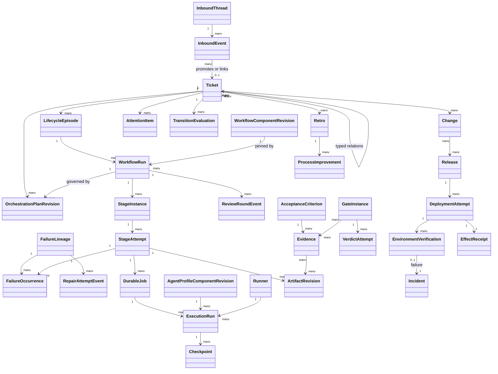

The ticket is the human join point, not the transaction boundary for the entire graph. A ticket-detail query composes these linked records into one journey; mutation and concurrency remain local to each aggregate.

### Orthogonal state models

| Dimension | Authoritative states/facts | Meaning |
|---|---|---|
| Ticket lifecycle | `open`, `active`, `waiting`, `resolved`, `closed`, `cancelled` | Outcome state for the current lifecycle episode. `resolved` means criteria/gates/delivery contract passed; `closed` means administratively complete; `cancelled` means intentionally stopped without the promised outcome. |
| Priority | `P0`, `P1`, `P2` facts | Recommended operator/business ordering; never risk, stage, or permission. Every change is append-only and P0 is evidence/authority restricted. |
| Board lane | `Backlog`, `To Do`, `In Progress`, `In Review`, `Blocked`, `Done` projection | Recommended deterministic projection over admission/readiness, stage, blockers, and terminal lifecycle; never a writable generic status. |
| Blockers | Typed `opened`, `rechecked`, `resolved`, `expired`, `superseded` facts | Explicit unmet conditions; queueing is not blocking and multiple effective blockers may coexist. |
| Reopen | `reopened` event | Starts episode N+1 on the same permanent ticket, records reason and prior episode, and never rewrites prior resolution evidence. It is not a stable status. |
| Workflow run | `pending`, `running`, `waiting`, `succeeded`, `failed`, `cancelled` | Overall execution of a pinned workflow version for one episode. |
| Stage instance | `blocked`, `ready`, `active`, `waiting_gate`, `succeeded`, `failed`, `skipped`, `cancelled` | Process position; independent of ticket lifecycle. |
| Stage attempt | `created`, `executing`, `verifying`, `passed`, `failed`, `timed_out`, `cancelled`, `superseded` | Immutable attempt history and failure routing. |
| Durable job | `accepted`, `leased`, `running`, `terminal` plus terminal outcome `succeeded|failed|cancelled|lost` | Dispatch and runner protocol. Health projections such as suspect do not rewrite the job state. |
| Gate instance | `required`, `collecting`, `verdict_recorded`, `invalidated`, `superseded` | Requirement and validity for one policy/input snapshot. Verdict attempts are `pass|fail|changes_requested|error|abstain`. |
| Delivery | Immutable merge facts, release candidates, deployment attempts, environment verifications, rollbacks, and incidents | No single mutable delivery enum is authoritative. UI summaries are derived. |
| Attention | `open`, `snoozed`, `resolved`, `expired`, `cancelled` | Exact human action record; expiration re-evaluates policy rather than silently clearing it. |
| Custody and assignment | Half-open intervals `[assigned_at, released_at)` | `ticket_custodian`, `current_assignee`, `stage_owner`, `reviewer_assignment`, and `runner_lease_owner` are distinct; routine owner changes do not create handoff tickets. |

### Non-negotiable invariants

1. **INV-01 — One append path.** Every authoritative mutation enters through the server’s authenticated command/append module; clients and runners never write record tables directly.
2. **INV-02 — Authenticated actor.** Actor, tenant, principal type, and scopes come from verified credentials or source authentication, never from payload text.
3. **INV-03 — Idempotency before CAS.** The append transaction checks `(principal_id, client_command_id)` and request hash before aggregate-version comparison, so an exact retry returns its original result even after the version advances.
4. **INV-04 — Serialized sequence.** Each aggregate stream has a server-assigned monotonic sequence and version updated under row lock or equivalent serializable claim.
5. **INV-05 — Hash chain.** Each event commits `prev_hash` and canonical `hash`; independently stored anchors make unauthorized history rewriting detectable.
6. **INV-06 — Permanent ticket identity.** Ticket IDs never mutate when type, department, owner, workflow, or lifecycle episode changes.
7. **INV-07 — Durable ingress first.** Reasoning begins only after the inbound event is committed or visibly quarantined; accepted input is never held only in model context.
8. **INV-08 — Discussion is not Board work.** A discussion thread remains durable without a ticket; promotion atomically records source event provenance.
9. **INV-09 — Continuous accountable custody.** Every actionable lifecycle episode that is not `closed` or `cancelled` has exactly one current `ticket_custodian` interval with no gap or overlap. It is normally a durable Commander principal; an operator may take custody only through an explicit protected suspension/transfer. A stage executor, collaborator, reviewer, runner, model session, or provider handle is never an eligible custodian. Transfer atomically closes and opens intervals, fences the old Commander reasoning lease, records context/checkpoint handoff, and starts no new work until the new custodian can rehydrate it. `resolved` retains custody through administrative close; only close/cancellation ends the interval.
10. **INV-10 — Child value.** A child ticket represents an independently valuable outcome; routine persona or stage handoffs remain within one workflow run.
11. **INV-11 — Reopen is an event.** Reopening starts a new lifecycle episode; prior closure, proof, and delivery facts stay immutable.
12. **INV-12 — Workflow pinning.** A workflow run pins an immutable workflow version and policy snapshot; later definitions do not silently alter in-flight work.
13. **INV-13 — Declared parallelism.** Stage instances execute in parallel only when the pinned graph explicitly permits it and their dependency sets are satisfied.
14. **INV-14 — Exclusive attempt lease.** One stage attempt has at most one current executor lease/fencing token; stale-token results cannot transition state.
15. **INV-15 — Session is never identity.** Vendor session IDs, process IDs, tmux names, and terminal panes are optional execution metadata; durable job/run/ticket IDs are identity.
16. **INV-16 — No proof, no done.** A ticket cannot resolve unless every active frozen criterion has current evidence, every required gate has a valid passing verdict, and the workflow’s delivery contract is satisfied.
17. **INV-17 — Frozen criteria.** Implementation cannot weaken or delete active criteria; an authorized revision creates a new criterion version and invalidates affected proof.
18. **INV-18 — Criterion-bound evidence.** Evidence binds a criterion, exact digest set, source revision, command, environment, producer, verifier, and time; a blob’s existence alone is not evidence truth.
19. **INV-19 — Author cannot review self.** No principal or effective agent identity that authored an input artifact may issue a satisfying independent verdict for it.
20. **INV-20 — Digest-based invalidation.** A dependency digest change invalidates every downstream evidence item and gate instance that declared that dependency before advancement can continue.
21. **INV-21 — Immutable gate history.** Gate verdicts are attempts on immutable instances; rework creates invalidation/new instances, never overwrites a prior verdict.
22. **INV-22 — Sealed review.** In sealed double-blind review, reviewers cannot read one another’s assignment, work product, or verdict until all required sealed verdicts are committed.
23. **INV-23 — Bounded by stable failure lineage.** Repair budgets apply to a server-controlled typed failure lineage that survives candidate-digest changes. Verifier prose or a new digest cannot split/reset it; exhaustion creates one deduplicated escalation and blocks automatic repeat.
24. **INV-24 — Production failure is an incident.** Failed production smoke/live QA creates or links an incident, revokes unused effect authority, and performs rollback/containment assessment before repair routing.
25. **INV-25 — No standing production authority.** General runners and agent profiles never hold reusable production, IAM, payment, publish, send, or destructive credentials.
26. **INV-26 — Effect at boundary.** A protected external effect requires a valid short-lived grant and produces an immutable receipt at the actual integration boundary; a ticket transition alone grants no authority.
27. **INV-27 — External reconciliation.** An externally observed protected effect without a matching valid receipt becomes a security/operations incident.
28. **INV-28 — Unknown health never calm.** Missing heartbeats, outbox lag, projection gaps, stale reconciliation, or failed synthetic checks render degraded or `STATE UNKNOWN`, never “All clear.”
29. **INV-29 — Ordered replay.** Runner commands and events have monotonic cursors; reconnect resumes from acknowledged cursors and safely deduplicates replay.
30. **INV-30 — Checkpoint before cleanup.** A workspace containing the sole copy of uncommitted work cannot be archived/destroyed without a durable checkpoint, artifact upload, or explicit destructive authorization.
31. **INV-31 — Tainted ingress.** External content is structurally marked data, scanned/quarantined as needed, and cannot become privileged instructions through string interpolation.
32. **INV-32 — No plaintext credentials.** Records, event payloads, logs, artifacts, and runner commands contain vault references or short-lived opaque handles, never long-lived plaintext secrets.
33. **INV-33 — Explicit cost allocation.** Each shared usage/cost record is fractionally allocated exactly once; ticket totals cannot double count a run spanning multiple tickets.
34. **INV-34 — Projections are disposable.** Board, Home, Fleet, Analytics, search, and activity views are rebuildable and never accepted as authoritative write targets.
35. **INV-35 — No dual write after cutover.** Mission Control JSONL, Paperclip, status files, and ctower cannot all accept ticket mutations; after the barrier every mutation goes through ctower.
36. **INV-36 — Accepted writes are recoverable.** A successful command response corresponds to committed record state and outbox; an offline client record is either acknowledged later or visibly quarantined, never silently dropped.
37. **INV-37 — Tenant/project scope.** Every scoped aggregate and object carries tenant identity; project scope is explicit where applicable; cross-scope access is server-authorized and audited.
38. **INV-38 — Retention separates bytes from audit.** Sensitive bytes can expire or be crypto-erased while non-sensitive digest/provenance/tombstone metadata remains auditable according to policy.
39. **INV-39 — Delivery is not inferred.** Merge, staging deployment, staging QA, production deployment, production verification, rollback, and incident are separate facts.
40. **INV-40 — Retro closes the loop.** A released feature or incident produces a retro; a process defect yields either a linked improvement with an evaluation window or an evidence-backed no-change decision.
41. **INV-41 — Strongest-capability Commander.** Each Commander reasoning job resolves the strongest available healthy general-reasoning profile permitted by the versioned capability policy and records candidates, exclusions, selection, and failover; token price cannot outrank capability for this seat.
42. **INV-42 — Commander accountable until terminal.** One durable Commander principal owns orchestration from accepted intent through verified production and retro/resolve/close or explicit cancellation; changing the model, harness, process, executor, or context window never silently transfers or ends that accountability.
43. **INV-43 — Versioned rigor plan; server-owned consumption.** The active `orchestration_plan` records risk-derived `mandatory_stage_gates`, `review_round_topology`, round execution/pass requirements, per-lineage repair limits, independence, evidence, and rationale. Append-only review/repair events and their monotonic projections exclusively own consumed counts; a plan command cannot author or reset them.
44. **INV-44 — Hard automatic ceiling.** Low has floor/default 1, standard 2, elevated 3, and critical 3 for review and ordinary repair budgeting. The Commander may justify a raise through 5; the engine refuses automatic work above ceiling 5, and exhaustion creates one deduplicated escalation. Operator authorization is required to exceed the ceiling or lower/waive a waivable floor.
45. **INV-45 — Universal component pinning.** Every published configuration category uses the same immutable `VersionedComponent` envelope; runtime pins exact revision/digest and no category invents a parallel lifecycle or active-pointer authority.
46. **INV-46 — Workflow/policy separation.** Workflow alone declares stages, legal edges, failure routes, gate locations, and terminal conditions. Execution Policy may select, constrain, budget, or activate declared options but cannot create a missing node or edge.
47. **INV-47 — CompanyBundle is transport.** YAML/Git validate, plan, apply, and export through authenticated commands; they contain no secrets/runtime state and are never watched or needed for liveness.
48. **INV-48 — Effective execution composition.** An attempt's Harness, Supervisor, Target, Workspace, Telemetry, environment, image, and placement pins are immutable. Unknown/unavailable/incompatible/digest-mismatched Adapters fail closed; no fallback-to-generic-process exists.
49. **INV-49 — Scoped supervisor handles.** PID, tmux name, socket, provider run, and harness session are scoped to runner incarnation, target incarnation, attempt, and fencing epoch. Name/process existence proves neither health nor success.
50. **INV-50 — Persist before broadcast.** Structured events, command state/ACKs, terminal results, and raw-log chunk metadata are durable before WebSocket notification. Reconnect replays after a durable cursor; a missing range creates a visible `log_gap` fact.
51. **INV-51 — Requested capability is not authority.** An Extension or component request is distinct from an effective scoped/expiring grant. Manifest parsing executes no code, and invocation identity cannot address kernel tables or canonical transitions.
52. **INV-52 — Five surfaces remain closed.** No extension, Adapter, provider, or Admin feature may create a sixth primary route, write canonical projections, replace Ticket history, or hide degraded health.
53. **INV-53 — Placement is resolved before provision.** Hard constraints, no-colocation, candidate exclusions, target/adapter/environment/image revisions, rationale, allocation, and fencing commit before provider mutation; soft cost/latency preference never relaxes a hard rule.
54. **INV-54 — Active pointers are future-only.** Moving a component/environment/image active pointer never mutates an accepted/running attempt, checkpoint, proof, or historical run. A material change creates a new attempt and invalidates declared dependent evidence.
55. **INV-55 — No secret-bearing reusable state.** Images, caches, warm entries, checkpoints, logs, and setup sessions cannot retain long-lived credentials, CLI/browser login state, private keys, tokens, or PII. Secrets are projected just in time after boot and revoked/scrubbed at end.
56. **INV-56 — Provider observations are not transitions.** Remote providers and Crabbox return scoped observations/receipts only. Ctower validates/appends them; provider success, disappearance, cleanup, or image capture cannot advance Workflow, satisfy evidence, or promote an image.
57. **INV-57 — Board/task axes remain orthogonal.** If the recommended task-management contract is confirmed, priority, Board lane, blocker, detailed stage, lifecycle, delivery, custody, assignment, and runner lease remain independently attributable; Board controls emit typed intents rather than status patches.

## Workflow and verification architecture

### Versioned Workflow and Execution Policy contract

A Workflow definition is immutable after publication. Editing creates a new revision. A Workflow run stores
the exact Workflow, Execution Policy, Gate/Evidence Policy, risk, component, and resolved role/capability
digests. In-flight runs stay on their pins unless an authorized migration command names source/destination
revisions, stage mapping, compatibility proof, evidence invalidation, and rollback. The named
`engineering.software-factory` package is the first Workflow, never another engine.

The implementation schema must validate at least this shape:

```yaml
workflow:
  key: engineering.software-factory
  version: 1
  status: published
  input_contract: software_change_ticket_v1
  terminal_contract: verified_release_and_retro_v1
  policy_refs:
    execution: software-factory-execution-v1
    risk: engineering-risk-v1
    gates: software-factory-gates-v1
    commander_capability: commander-capability-v1
  defaults:
    lease_seconds: 90
    heartbeat_seconds: 20
    timeout_route: reconcile_then_escalate
  budget_policy:
    hard_automatic_ceiling: 5
    tier_floors_and_defaults:
      low: {passing_current_digest_rounds: 1, max_round_executions: 1, repair_attempts_per_lineage: 1}
      standard: {passing_current_digest_rounds: 2, max_round_executions: 2, repair_attempts_per_lineage: 2}
      elevated: {passing_current_digest_rounds: 3, max_round_executions: 3, repair_attempts_per_lineage: 3}
      critical: {passing_current_digest_rounds: 3, max_round_executions: 3, repair_attempts_per_lineage: 3}
  orchestration_plan:
    schema: ctower.orchestration-plan/v1
    required:
      - commander_profile_resolution
      - risk_facts_and_policy_floor
      - mandatory_stage_gates
      - review_round_topology
      - passing_current_digest_rounds_required
      - max_review_round_executions
      - repair_attempt_limit_policy_by_lineage
      - rationale
  stages:
    - key: implement
      depends_on: [design]
      role: engineer_or_designer
      capabilities: [source.read, source.write, tests.run]
      entry: [criteria_frozen, design_contract_satisfied]
      outputs: [change_manifest, implementation_summary]
      exit: [candidate_digest_recorded]
      timeout: PT48H
      failures:
        verification_failure:
          route: implement
          invalidate: [candidate_and_downstream]
        requirement_defect:
          route: plan
          invalidate: [plan_and_downstream]
      gates: []
  transitions:
    - from: implement
      to: local_verification_qa
      when: stage_passed
  parallel_groups: []
```

The published definition includes JSON Schema for inputs/outputs, a normalized failure taxonomy, allowed transition predicates, capability names, evidence contracts, timeouts, compensation, policy overlays, and the `orchestration_plan` contract. Free-form agent prose may explain work but cannot add a transition, reset a counter, or create authority not present in the pinned definition.

The Commander appends orchestration-plan revision 1 before execution. It records the eligible Commander
profiles and why the strongest available healthy one won, risk inputs, `mandatory_stage_gates` that must
pass once for each relevant current digest/environment, the independent participants repeated inside
`review_round_topology`, the required count of passing topologies on the current digest, the maximum total
round executions, per-lineage repair-attempt limits, evidence, and rationale. It never accepts a consumed
count from a client. The floor/default is low=1, standard=2, elevated=3, and critical=3 for both required
passing rounds/initial maximum executions and ordinary lineage repair limits. New evidence may justify a
later revision that adds a reviewer or raises an execution/repair limit through the hard automatic ceiling
of 5. The engine rejects a plan below the policy floor, above 5, missing a mandatory gate/reviewer, carrying
a client-authored consumption field, or setting a limit below already consumed server facts. Exceeding 5
or lowering/waiving a waivable floor requires an authenticated operator decision; hard invariants remain
non-waivable.

### Workflow and stage state machine

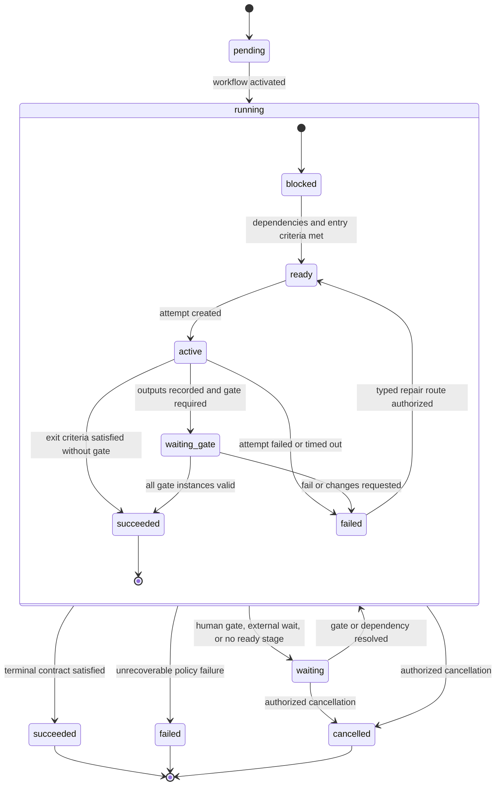

The workflow run and each stage instance have separate states. A stage failure does not imply ticket cancellation or workflow failure. The orchestrator derives readiness from dependencies and entry criteria, creates immutable attempts, and advances only through declared transitions.

### Default software-factory path

The required default path is:

`intake -> think -> plan -> design -> implement -> local verification/QA -> risk-derived review -> documentation -> release preflight -> merge -> staging deploy -> staging QA -> production deploy -> production smoke/live QA -> retro -> resolve/close`

“Design” is always evaluated but may produce a reasoned `not_applicable` artifact for a non-UI, non-architecture change. “Production deploy” remains a distinct stage even for an internal service. A stage may be skipped only when the pinned definition names the skip predicate and evidence; an agent cannot declare a stage irrelevant ad hoc.

### ASCII enforcement model: how autonomous movement is enforced

This subsection is the terminal-safe explanation of the default path above. The diagrams are explanatory views of the same versioned workflow, stage, evidence, and effect contracts; they do not define an alternate state machine. The [stage contracts](#stage-contracts), [risk policy](#deterministic-risk-and-review-policy), [transition transaction](#transition-transaction), and [acceptance criteria](#acceptance-criteria) remain normative.

Automatic progression follows one trigger law: **a committed event triggers the reconciler; no agent comment, wall-clock timer, terminal line, or uncommitted callback alone advances authoritative state**. A timer may request reconciliation, and a comment may be committed as an inbound command event, but only the resulting committed facts can make a stage ready. On every committed event, the reconciler evaluates the pinned graph and current evidence, dispatches each newly eligible stage, or records the exact reason it cannot.

#### Full feature/request factory

```text
[DURABLE COMMANDER PRINCIPAL: strongest healthy profile per reasoning wake]
          | owns orchestration through verified production + retro/close
          v
[authenticated request]
          |
          v
+----------------+   +------+   +--------------------+   +-----------+
| INTAKE + THINK |-->| PLAN |-->| DESIGN + DESIGN QA|-->| IMPLEMENT |
+----------------+   +------+   +--------------------+   +-----------+
       | material business/taste -> [Needs You: operator]     |
                                                               v
                 +----------+   +----------------+   +---------------+
                 | LOCAL QA |-->| RISK REVIEW(S)|-->| DOCUMENTATION |
                 +----------+   +----------------+   +---------------+
                                                               |
                                                               v
                                                     [RELEASE PREFLIGHT]
                                                               |
                                                               v
              [MERGE] -> [STAGING DEPLOY] -> [STAGING QA]
                                                     | pass
                                                     v
                                           [PRODUCTION DEPLOY]
                                                     |
                                                     v
                                        [PRODUCTION SMOKE + LIVE QA]
                                             | pass          | fail
                                             v               v
                                          [RETRO]   [INCIDENT + REVOKE]
                                             |               |
                                             v               v
                                      [RESOLVE/CLOSE] [CONTAIN + ROLLBACK]
                                                             |
                                                             v
                                                  [VERIFY CONTAINMENT]
                                                             |
                                                             v
                                                         [TRIAGE]
                                                             |
                                                             v
 +-----------------------------------------------------------------------+
 | TYPED FAILURE ROUTER (server policy chooses exactly one owning stage) |
 +-----------------------------------------------------------------------+
   | requirement -> PLAN             | design -> DESIGN
   | implementation/product -> IMPLEMENT
   | documentation-only -> DOCUMENTATION
   | release/config/environment -> RELEASE PREFLIGHT / OPERATIONS
   | production -> INCIDENT / CONTAIN / VERIFIED ROLLBACK / TRIAGE first

 All non-production stage failures enter the router directly. Production failure reaches
 it only after incident containment is verified and triage records the owning repair stage.
```

The default is forward motion without a human shepherd: a passing gate commits a verdict event, the reconciler observes it, marks the declared successor ready, creates its durable job, and eligible runners compete for the fenced lease. This is the autonomous transition contract, not a client-side convention. Failure is also motion: a structured finding/repair packet names the failure occurrence and stable lineage, responsible stage, invalidated proof, remaining server-owned budget, and deterministic next transition.

#### Pre-build design loop and capability routing

```text
[ticket intent]
      |
      v
[office-hours@rev] --Commander/strongest healthy profile--> [operator intent]
      |
      v
[plan-ceo-review@rev] ---> [human CEO decision if business/taste is material]
      |
      v
[plan-eng-review@rev] --Engineering Manager/Opus--> [architecture risk verdict]
      |
      v
[plan-design-review@rev] --Designer A/Sonnet--> [design brief]
      |
      +--> [design-shotgun@rev: option A]
      +--> [design-shotgun@rev: option B]
      +--> [design-shotgun@rev: option C]
      |
      v
[material taste?] -- yes --> [Needs You: operator selects direction]
      | no                         |
      +--> [policy-selected direction] <---+
      |
      v
[design-html@rev: inspectable mockup by Designer A/Sonnet]
      |
      v
[independent pre-build Design QA: Designer B/Sonnet]
      | PASS                                  | FAIL + findings
      v                                       +------------------+
[implementation-ready design digest]                             |
      |                                                          |
      v                                                          |
[IMPLEMENTATION]                           [return to design] <---+
```

Skills are **versioned capabilities, not agents**. A stage contract requires skill revisions; the scheduler binds those capabilities to an eligible, independently authorized agent profile and concrete harness/model. Changing a skill creates a new revision and affects only newly bound attempts unless the workflow is explicitly migrated. A persona is an authorization and responsibility class; a harness/model is an execution placement choice; neither substitutes for the skill contract.

| Skill or gate capability | Default responsible persona / harness | Authority and independence rule |
|---|---|---|
| `office-hours@revision` | Commander / strongest available healthy general-reasoning profile | Shapes intent; the operator owns business, value, scope, and taste calls. The resolved profile and rationale are recorded. |
| `plan-ceo-review@revision` | Commander / strongest available healthy general-reasoning profile | Prepares the decision packet but never impersonates the human CEO. A required CEO verdict is an authenticated operator event. |
| `plan-eng-review@revision` | Engineering Manager / Opus | Reviews architecture and risk before build. A new architecture direction remains an operator gate. |
| `plan-design-review@revision` | Designer / Sonnet | Produces a design critique or brief; a satisfying reviewer cannot be the design author. |
| `design-shotgun@revision` or `design-shotguns@revision` | Designer / Sonnet | Produces genuinely different options. Material taste selection belongs to the operator. |
| `design-html@revision` | Designer / Sonnet | Produces the inspectable pre-build mockup and design contract. |
| Pre-build `design-review@revision` (**Design QA**) | Independent Designer / Sonnet | Must not be the design author. Fable may assist as a non-authoritative scout/summarizer only; it is neither accountable Commander nor authoritative Design QA/final gate. |
| Post-build rendered `design-review@revision` | Independent Designer / Sonnet | Judges screenshot fidelity, hierarchy, controls, units, bounded content, and visible defects; not the UI author. |
| Functional `ui-qa@revision` | QA / Codex xhigh | Uses every control, proves its outcome and tenant isolation in a browser; never merely loads the page. |
| Backend implementation capabilities | Engineer / Codex, effort scaled to risk | Owns non-UI code and tests. Codex never receives `apps/ctower-web` implementation under current routing. |
| `apps/ctower-web` implementation capabilities | Designer / Sonnet | All frontend implementation remains Designer/Sonnet, including UI bug fixes. |
| Independent code review | Review / Codex xhigh | Cannot review its own authored diff; elevated work uses the policy-selected sealed bundle. |
| Security review | CSO / Codex xhigh; Opus escalation | Independent of author; a new security boundary requires Opus analysis and the human operator decision. |
| Documentation | Tech-writer / Pi, or Codex when code truth requires it | Documentation is verified against the current candidate digest. |
| Release and operations | DevOps / Hermes | Persistent reconciliation and brokered deployment only; ordinary runner credentials have no production authority. |
| High-judgment release/taste decision | Opus analysis and/or human operator as policy states | Opus can advise; only the authenticated operator supplies a required taste/business/protected waiver verdict. |

Every name above must resolve before a workflow can publish or dispatch. L0 materializes canonical
digest-addressed definitions for `office-hours`, `plan-ceo-review`, `plan-eng-review`,
`plan-design-review`, singular `design-shotgun` (with `design-shotguns` accepted only as an import alias),
`design-html`, `design-review`, and `ui-qa`. Each revision stores content, schema, fixtures, source
provenance, owning persona, required inputs/outputs, and adapter-rendering rules in the ctower skill
catalog. Existing repository skills are imported with source digest; missing commands receive reviewed
first-class definitions rather than placeholder references. Persona adapters materialize the immutable
revision into their native harness form and record the output digest. Publication and dispatch fail if a
workflow skill reference lacks content, provenance, conformance fixtures, or a reproducible adapter
materialization.

#### Implementation, QA, review, and repair

```text
Actors:  AUTHOR = implementation persona
         QA     = independent QA/Codex xhigh
         REVIEW = independent Review/Codex xhigh

 [AUTHOR implements digest d1]
              |
              v
 [QA verifies d1] -- FAIL occurrence o1 / lineage L1 --> [repair packet L1]
       | PASS                          |
       v                               v
 [REVIEW sees d1]              [AUTHOR changes to d2]
       |                               |
       |                               +--> invalidates QA(d1), REVIEW(d1)
       |                                    |
       |                                    v
       |                              [fresh QA verifies d2]
       |                                    |
       +-- FAIL F2 --> [AUTHOR changes to d3]
                              |
                              +--> invalidates QA(d2), REVIEW(d2)
                                   |
                                   v
                             [fresh QA verifies d3]
                                   |
                                   v
                             [fresh REVIEW sees d3]
                                   |
                                   v
                                  PASS

 REVIEW ROUND r = complete review_round_topology on one current digest
 REPAIR ATTEMPT k = one mutation for one server-owned failure_lineage_key

 k < selected plan limit (policy floor <= limit <= 5) -> repair and fresh proof
 exhausted / no progress -> one deduplicated escalation -> STOP automatic repair
```

An implementation mutation after QA or review normally invalidates the candidate-dependent QA evidence and all later review evidence. “Only declared downstream proof” prevents unrelated proof from being discarded, but the default software-factory dependency graph declares source, build, functional QA, and code-review digests as dependent. The engine therefore cannot route a repaired candidate directly back to Review; fresh QA must pass first. The Commander decides whether the evidence justifies the next repair and review round inside the active `orchestration_plan`; the engine owns counter integrity, floors, the ceiling, and invalidation.

#### Enforcement engine

```text
 [risk facts + evidence] --> [Commander orchestration_plan revision]
                                      |
 [policy floors + ceiling 5] ---------+--> [engine validates plan]
                                                   |
 [append-only round/repair events] --> [monotonic counter projections]
                                                   |
 [versioned stage contract + checklist] -----------+
                                                   |
                                                   v
 [readiness evaluation on committed state]
       | NOT READY                    | READY
       v                              v
 [exact unmet checklist]      [durable job: accepted]
                                      |
                                      v
                          [lease + fencing token]
                                      |
                                      v
                         [attempt submits artifacts,
                          evidence, and output digests]
                                      |
                                      v
                              [gate evaluation]
                   +------------------+------------------+
                   |                  |                  |
                 PASS          REPAIRABLE FAIL       HUMAN FLOOR
                   |                  |                  |
                   v                  v                  v
          [commit transition] [finding/repair packet] [Needs You]
                   |                  |                  |
                   v                  v                  |
          [reconciler dispatches] [budget available?]    |
             [next stage]          | yes     | no        |
                                   v         v           |
                              [return] [escalate once] <--+

 Protected external effect path:
 [all gates valid] -> [short-lived grant] -> [effect boundary]
     -> [immutable receipt] -> [external audit reconciliation]
```

Every published stage carries a complete, versioned contract and checklist. The minimum implementation shape is:

```yaml
stage_contract:
  schema_version: ctower.stage-contract/v1
  workflow_key: engineering.software-factory
  workflow_revision: 1
  orchestration_plan_ref: orchestration-plan-revision-id
  stage_id: local_verification_qa
  contract_revision: 3
  eligible_capability_persona:
    capabilities: [ui-qa]
    personas: [qa]
  required_skill_revisions:
    - skill: ui-qa
      revision: sha256:skill-revision-digest
  model_harness_policy:
    allowed:
      - harness: codex
        model_class: xhigh
    forbidden_authoring_scopes: [apps/ctower-web]
  independence_constraints:
    not_artifact_author: true
    not_design_author: true
    effective_identity_distinct_from: [implementation_executor]
  inputs:
    schema: ui_qa_input/v1
    required: [candidate_digest, environment_manifest, criteria_revision]
  entry_checklist:
    - candidate_digest_is_current
    - reproducible_environment_is_ready
    - independent_qa_is_eligible
  output_artifacts:
    schema: ui_qa_output/v1
    required: [browser_recording, screenshots, control_outcome_report, tenant_isolation_report]
  evidence_requirements:
    - criterion_binding
    - command_and_environment
    - producer_and_verifier_attestation
    - exact_candidate_digest
  gate_policy:
    policy_revision: ui-gates-v3
    verdicts_required: [functional_ui_qa]
  pass_fail_transitions:
    pass: risk_derived_review
    fail:
      implementation_defect: implement
      design_defect: design
      requirement_defect: plan
  invalidation_dependencies:
    invalidated_by: [candidate_digest, ui_contract_digest, api_contract_digest, tenant_fixture_digest]
    invalidates_on_failure_or_change: [ui_qa_verdict, downstream_review, release_preflight]
  failure_lineage_budget:
    policy_floor_from_risk: 2
    selected_limit_from_plan: 2
    hard_automatic_ceiling: 5
    consumed_attempts_are_immutable: true
    occurrence_fields: [stage_id, failure_class, normalized_subject, verifier_rule_revision, relevant_input_digest, environment_class]
    lineage_fields: [stage_id, failure_class, normalized_subject, verifier_rule_revision, environment_class]
    lineage_resolver: server_policy
    split_authority: deterministic_policy_or_independent_adjudicator
    consumed_source: append_only_repair_attempt_events
  timeout:
    duration: PT4H
    action: reconcile_then_escalate
  escalation_owner: commander
  effect_permissions: []
```

The contract revision is immutable after publication. A stage attempt stores the contract digest, active
orchestration-plan revision, and fully resolved capability/profile/run manifest. Entry checklist, lineage
resolution, and budget evaluation are server-side; a runner receives the result but cannot change it.
`selected_limit_from_plan` is illustrative for a standard ticket and is not a global constant. The exact
input digest belongs to the immutable occurrence but is deliberately absent from `lineage_fields`, so the
same unresolved defect on `d1`, `d2`, and `d3` spends one counter. Effect permissions enumerate only effects
that stage may request through the broker; an empty list means no external side effect authority.

#### Commander versus workflow engine

```text
 HUMAN OPERATOR                         COMMANDER (durable principal)
 owns business/taste,                   strongest healthy profile each wake
 architecture/security-boundary,        owns orchestration until terminal
 destructive and waiver decisions       versions workflow/risk/reviewer/
          |                              round/repair plan + rationale;
          |                              may raise rigor, reassign, pause,
          |                              resume, or request a transition
          +-------------------+-------------------+
                              | authenticated commands
                              v
                 +------------+-------------+
                 | CTOWER WORKFLOW ENGINE   |
                 | - pins plan/policy revs  |
                 | - enforces rigor floors  |
                 | - checks evidence        |
                 | - checks independence    |
                 | - counts review/repair   |
                 | - caps automation at 5   |
                 | - fences leases          |
                 | - brokers effects        |
                 +------------+-------------+
                              |
              +---------------+----------------+
              | accepted transition            | refused command
              v                                v
       [committed event]              [exact unmet checklist]
              |                       [no state mutation]
              v
       [reconciler drives]

 Rule: Commander proposes and explains; the server decides whether movement is legal.
```

Commander commands are validated requests, never raw updates to a `state` column:

| Command | Valid effect | Required refusal behavior |
|---|---|---|
| `advance` | Requests one declared successor after re-evaluating current exit, evidence, gates, dependencies, policy, and expected version. | `422 transition_refused` with machine-readable and human-readable unmet checklist naming each missing/invalid item and owning stage; no partial transition. |
| `return` | Requests a declared repair/requirement/design route and commits the contract-defined downstream invalidations. | Refuse an undeclared edge, a stale expected version, or a return that would preserve proof declared dependent on the mutation. |
| `reassign` | Closes the current executor interval, fences the old lease, and selects an eligible replacement without changing ticket custody unless separately requested. | Refuse an ineligible capability/persona, author-as-reviewer, scope mismatch, or unsafe non-checkpointable handoff; name the violated constraints. |
| `pause` | Prevents new dispatch/effects at the next safe contract boundary and records who, why, and what remains active. | Refuse any representation that an already-started external effect was paused; reconcile or contain that effect first. |
| `resume` | Re-evaluates policy, freshness, lease, environment, and entry checklist before dispatch. | Refuse stale evidence, expired grants, unresolved incident/security state, or unmet entry items with the exact checklist. |

The Commander may raise the risk tier, add a reviewer/gate, or append an evidence-backed
`orchestration_plan` revision that increases maximum review-round executions, current-digest passing-round
requirements, or a per-lineage repair-attempt limit through 5. The prior plan remains immutable; consumed
round and repair facts live only in append-only server events/projections. Review rounds and repair attempts
are different ledgers: a review round is one execution of `review_round_topology` on one current digest; a
repair attempt is one mutation for one stable failure lineage. The Commander cannot submit consumed values,
silently lower a computed tier or policy floor, remove a mandatory participant, mark evidence valid, satisfy
independence, reset either counter, mint an effect receipt, or force a state transition. `advance --force`
does not exist.

Lowering or waiving a required, policy-waivable gate requires a separate protected `gate.waive` command authenticated as the human operator. The waiver binds ticket, workflow/stage/gate instance, exact input and policy digests, waived requirement, reason, considered alternatives, risk accepted, scope, expiry or one-use limit, and command ID. The engine records a `gate_waived` fact and audit entry; it never rewrites the gate as passed or fabricates evidence. The UI labels the waiver through release and retro, and any bound digest change invalidates it. Core identity, tenant isolation, append/idempotency, non-forgeable receipts, and other declared hard invariants are non-waivable; the refusal identifies that floor. A model, Commander, reviewer, or runner can recommend a waiver but cannot authorize one.

#### Risk-scaled review profiles

```text
 observed change facts
          |
          v
 +--------+----------------------------------------------------------+
 | LEAN / LOW      floor/default 1 round + 1 repair/lineage          |
 |                 deterministic checks + independent Review         |
 | STANDARD        floor/default 2 rounds + 2 repairs/lineage        |
 |                 independent QA + Review + docs verification       |
 | UI OVERLAY      Designer/Sonnet author                            |
 |                 + independent pre-build Design QA                 |
 |                 + QA/Codex-xhigh functional browser proof         |
 |                 + independent rendered design review              |
 |                 + operator taste gate when material               |
 | ELEVATED        floor/default 3 rounds + 3 repairs/lineage        |
 |                 Standard + applicable UI/EngMgr/CSO overlays      |
 |                 + sealed independent verdicts where required      |
 | CRITICAL        floor/default 3 rounds + 3 repairs/lineage        |
 |                 sealed Review + CSO + relevant QA/EngMgr          |
 |                 + operator for new boundary/destructive decision  |
 +--------+----------------------------------------------------------+
          |
          v
 highest matching floor wins; Commander may justify raises through ceiling 5
```

| Profile | Passing-current-digest rounds / max executions / repair floor and default | `mandatory_stage_gates` (once per relevant current digest/environment) | `review_round_topology` (repeated per round execution) | Automatic progress condition |
|---|---|---|---|---|
| **Lean / low** | 1 / 1 / 1 per lineage | Declared deterministic checks and any docs/applicability gate | Independent Review/Codex xhigh on the exact digest | One current-digest passing topology, all stage gates current, and no runtime/UI/security/data/effect trigger. |
| **Standard** | 2 / 2 / 2 per lineage | Independent functional QA appropriate to behavior, docs code-truth verification, release preflight, and environment QA at their stages | Independent Review/Codex xhigh; any policy-added perspective is named in the plan | Two complete passing topologies on the same current digest, all stage gates current, and zero blocking findings. |
| **UI overlay** | Inherits the base tier; never lowers it | Independent pre-build Design QA, functional browser/tenant QA, docs/preflight/environment QA, and operator taste only when material | Base topology plus independent post-build rendered Design Review/Designer-Sonnet | Mockup gate precedes implementation; functional and visual proof binds the current rendered candidate/environment. |
| **Elevated** | 3 / 3 / 3 per lineage | Standard gates plus applicable Engineering Manager plan gate, CSO threat gate, UI/data/migration gates, and protected operator gate only when policy requires it | Independent Review plus every applicable repeated CSO/rendered-design/additional perspective named by policy; sealed where required | Three passing topologies on the same current digest, all overlays current, and effective identities satisfy the sealed graph. |
| **Critical** | 3 / 3 / 3 per lineage; incident/security zero-repair overrides may be stricter | Elevated gates plus the human operator for the triggering architecture/security/destructive/business decision and independent production live QA | Sealed Review/Codex xhigh plus CSO/Codex xhigh and any policy-selected additional perspective, all from independent effective identities | Three current-digest passing topologies and every non-waived gate are current; effect-broker policy separately passes. Model-family diversity applies only if an explicit policy selects distinct eligible profiles. |

The UI overlay composes with the base tier; it does not reduce an elevated or critical change to “UI.”
Likewise, an operator taste approval does not replace functional QA, code review, CSO review, or the
effect boundary. Every round execution consumes one append-only round fact whether it passes, fails, or is
later invalidated; only a complete pass on the currently active digest counts toward
`passing_current_digest_rounds_required`. A digest mutation invalidates candidate-dependent passing rounds.
If remaining execution capacity cannot produce the required current-digest passes, the Commander must
append an evidence-backed raise within ceiling 5 or the engine exhausts once; it cannot ignore a failed
round. A stricter zero-ordinary-repair incident/security rule is containment, not a waiver of review rigor.

Independent effective identities are always mandatory where the table says independent. Model-family
diversity is not implied by two Codex assignments and is not part of the base critical bundle. A versioned
policy may additionally require diversity only by selecting at least two distinct eligible profile families;
the resolver then rejects same-family placement and the conformance suite exercises that negative fixture.

#### Ticket custody versus stage handoffs

```text
 TICKET CT-123: accountable orchestration custody (one durable principal)

 [Commander: profile A]====[fresh job/profile B]====[fresh job/profile C]====> terminal
         same principal and orchestration_plan; model/session changes are not transfers

 [operator-authorized Commander transfer, if any] -> atomic, reasoned, audited interval
 [operator emergency suspension, if any]          -> operator custody; autonomous progress paused

 STAGE EXECUTION: separate short-lived assignment intervals

 plan       [Engineering Manager/Opus]
 design             [Designer A/Sonnet]
 design QA                    [Designer B/Sonnet]
 implement                              [Designer A/Sonnet]
 functional QA                                    [QA/Codex xhigh]
 review                                                   [Review/Codex xhigh]
 docs                                                             [Writer/Pi]
 release                                                                  [DevOps/Hermes]

 REVIEW CUSTODY: a third assignment kind
 - never implies ticket ownership
 - never authorizes source mutation
 - must satisfy author/effective-identity independence

 A stage handoff changes executor/reviewer intervals, not ticket custody.
 A ticket-custody transfer does not silently reassign an active leased job.
```

Commander accountability persists across the whole outcome through production verification and
retro/close; fresh reasoning jobs and stronger-profile failover continue the same principal. Stage
executors own only the bounded attempt and its output; reviewers own only the verdict assignment; the
effect broker owns only enforcement of a granted external effect. Every true interval transfer records
from/to, actor, reason, command, stage/run context, and fencing result. The UI shows all three without
collapsing them into a single “assignee.” An eligible `ticket_custodian` is a tenant/project-authorized
durable Commander principal resolved by capability policy. The sole exception is an explicit protected
operator suspension, which pauses new autonomous dispatch until custody is atomically transferred to an
eligible Commander. Reviewer, executor, runner, model profile, session, and provider identities are always
ineligible. The protected transfer command locks the episode and current interval, verifies `from` and
version, checkpoints/fences the old Commander job, closes and opens intervals in the same transaction, and
only then permits context rehydration; a crash cannot expose a zero-custodian committed state.

#### Worked UI-feature example: tenant-scoped usage filter

This example is a target execution trace, not a claim that the ctower runtime already implements it. Ticket `CT-EXAMPLE-UI-001` asks for a tenant-scoped date filter on a Usage page. Changing the filter must refresh totals and the bounded table, keep units honest, preserve tenant isolation, and expose no dead control. The deterministic tenant-sensitive data rule classifies it as **elevated + UI overlay**, even though no new architecture/security boundary is assumed. The elevated policy floor/default begins at three passing current-digest review rounds, three maximum round executions, and three ordinary repair attempts per stable failure lineage, with hard automatic ceiling 5.

| Step | Pinned skill/persona/harness | Gate, committed fact, and automatic transition |
|---|---|---|
| 1. Intent | `office-hours@r4`, durable Commander principal; capability policy resolves the strongest healthy permitted general-reasoning profile | The resolution event records ranked eligible profiles, health/exclusions, and selection. Operator confirms the observable outcome and comparison period. `intent_accepted` makes plan ready. |
| 2. Business packet | `plan-ceo-review@r2`, same Commander principal on a fresh reasoning job if needed | No impersonated CEO verdict: the operator accepts the product constraint. A model/session replacement does not end Commander accountability. |
| 3. Plan and budget | Commander publishes `orchestration_plan@rev1`; `plan-eng-review@r7`, Engineering Manager/Opus | Plan records elevated+UI facts; `mandatory_stage_gates=[prebuild_design_qa,functional_ui_qa,docs_code_truth,release_preflight,staging_qa,production_live_qa]`; `review_round_topology=[code_review,rendered_design_review]`; `passing_current_digest_rounds_required=3`; `max_review_round_executions=3`; `repair_attempts_per_lineage=3`; independence; ceiling 5; evidence; and rationale. It contains no consumed counts. Engine validation makes design ready. |
| 4. Options and mockup | `plan-design-review@r5`, `design-shotgun@r3`, and `design-html@r6`, Designer A/Sonnet | Designer A produces three filter placements and an inspectable mockup. Operator selects the attached-to-table option because placement is material taste. |
| 5. Pre-build Design QA | `design-review@r8`, independent Designer B/Sonnet | Checks one card level, control attachment, hierarchy, strict columns, units, bounded table, and complete states. Pass on mockup digest commits `design_gate_passed`; implementation becomes ready. |
| 6. UI implementation | `apps.ctower-web.implement@r9`, Designer A/Sonnet | Current routing forbids Codex frontend authorship. The durable job is leased to Designer A; source/build manifests produce candidate `d1`. |
| 7. Functional UI QA | `ui-qa@r11`, independent QA/Codex xhigh | QA uses the filter as tenant Alpha, verifies the API request, totals/table change, refresh persistence, empty/error states, and isolation from tenant Beta. This mandatory stage gate runs once per current candidate/environment digest and is not repeated merely because a review round executes. |
| 8. Independent review rounds | `code-review@r10`, Review/Codex xhigh; post-build `design-review@r8`, independent Designer C/Sonnet | Each execution runs exactly `review_round_topology` on one digest. Round 1 fails and consumes execution 1 but supplies no passing-current-digest credit. The unit mismatch is new evidence: plan rev2 raises only `max_review_round_executions` from 3 to 4, retains the elevated requirement of three passing rounds and the three-repair lineage floor, and adds no consumed values. After repair and fresh QA, complete rounds 2, 3, and 4 all pass on `d3`. |
| 9. Docs and release | `docs@r3`, Tech-writer/Pi; `release@r12`, DevOps/Hermes; independent staging/production QA | With fresh QA, clean current-digest rounds 2–4, and zero blocking findings, docs bind current behavior. Preflight causes brokered merge, staging deploy, independent staging QA, production deploy, production smoke, and independent live QA on the exact deployed digest and real URL to dispatch in order. Failure of smoke or live QA opens incident containment; neither routes directly to repair. |
| 10. Close | Accountable Commander plus server resolution validator | The same durable Commander principal reconciles both production smoke and independent live-QA evidence, records the retro and budget outcomes, and requests resolution/close only when the complete criterion/evidence manifest is current. |

The trace deliberately exercises two repair loops:

1. **Repair loop one — QA failure.** On candidate `d1`, QA clicks the filter and the table does not refresh. QA submits failure class `ui.control.dead`, normalized subject `usage.date_filter`, verifier-rule revision `control_changes_bounded_table@2`, and candidate/environment digests. The server records occurrence `o1(d1)` and resolves stable lineage `L1=(local_qa,ui.control.dead,usage.date_filter,control_changes_bounded_table@2,browser_tenant_fixture)`. The Commander judges a repair warranted inside plan rev1; the server appends repair-consumed event 1 of limit 3 for `L1` and routes to Designer A. Candidate `d2` invalidates QA(`d1`) and all downstream proof; fresh QA on `d2` passes before Review can become ready. Because this isolated defect adds no broader risk evidence, the Commander records no budget raise.
2. **Repair loop two — review failure and rigor amendment.** Review-round execution 1 on `d2` finds totals use bytes while the table label says MB. The server records occurrence `o2(d2)` under distinct stable lineage `L2=(risk_review,ui.unit_mismatch,usage.units,presentation_units_match@4,local_render)`. Round execution 1 is append-only consumed and does not satisfy the three-pass current-digest requirement. The Commander judges repair attempt 1 of limit 3 warranted. Because the mismatch crossed summary/table representations, it appends plan rev2 with evidence/rationale, raising maximum round executions from 3 to 4 (still below ceiling 5) while keeping three required passing rounds. Designer A emits `d3`; that invalidates QA(`d2`) and Review(`d2`). The reconciler dispatches fresh functional QA on `d3` before review-round execution 2, then the complete topology runs cleanly in executions 2, 3, and 4 on `d3`. No mandatory stage gate or reviewer is removed.

If the same dead-control defect survives `d1 -> d2 -> d3 -> d4`, the server records four occurrences with
different input digests but the same `L1`: repairs after the first three failures append attempts 1, 2, and
3, while the fourth identical failure finds the selected lineage limit exhausted, creates exactly one
deduplicated escalation, and dispatches no fourth repair. Reassignment, a new Commander profile, new prose,
or changed digests cannot reset either ledger. The Commander could raise an unexhausted limit through 5 only
with new evidence; beyond 5 requires an authenticated operator decision. If production smoke or independent
live QA failed instead, the engine would commit an incident, revoke unused grants, request brokered
containment and rollback, verify the rollback/containment on the real environment, and only then create
triage naming an owning stage; it would not send the candidate directly back to implementation.

#### End-to-end operating simulation: company bootstrap to production close

This target-system simulation follows `CT-USAGE-042`, a tenant-scoped Usage date filter and CSV export,
from an empty company to terminal close. It is a concise, reconstructable form of the 53-step committed-fact
trace. The five ASCII diagrams are explanatory views of the same domain states, commands, events, evidence,
and projections defined elsewhere in this specification; they are **not new state machines or sources of
truth**.

The fixture is elevated with UI and security overlays. Its initial plan requires three current-digest passing
review rounds, allows three round executions and three repairs per stable lineage, and retains ceiling 5.
`C0` is the durable Commander principal; changing its resolved model/job does not change custody. `E1` is
Engineer, `D1` UI author, `D2/D3` independent design reviewers, `Q1` QA, `RV1` Review, `S1` CSO, `W1`
Tech-writer, and `O1` DevOps.

**View 1 — company and software-factory bootstrap**

```text
+---------------- CompanyBundle apply ----------------+
| tenant + goals + projects + repositories             |
| identities + C0 Commander + scoped secret bindings   |
+---------------------------+---------------------------+
                            v
+---------------- VersionedComponent Catalog -----------+
| Workflow + Execution/Gate/Evidence policies           |
| profiles + personas + skills + tools/capabilities     |
| environments/images + placement + effect providers   |
+---------------------------+---------------------------+
                            v
+---------------- execution composition ----------------+
| Harness | Supervisor | Target | Workspace | Telemetry |
+---------------------------+---------------------------+
                            v
+---------------- conformance and activation ------------+
| refs/digests/signatures/compatibility/independence     |
| recovery + no-effect dry run: PASS -> atomic pointer   |
| any failure -> exact refusal; no partial activation    |
+-------------------------------------------------------+
```

**View 2 — durable intake through approved design**

```text
[OP request]
     |
     v
+-- commit inbound event + command result + outbox --+
     |
 [classify/dedupe] --match--> [link existing]
     | none
     v
[create CT-USAGE-042; custody=C0; pin Workflow/Policy]
     |
[goal + Think + frozen criteria + elevated plan]
     |
[EM review] -> [D1 three options + inspectable HTML]
     |                  |
     |          material taste -> Needs You/OP
     +------------------+
                        v
               [D2 Design QA passes]
                        |
                  [Implement ready]
```

**View 3 — implementation, QA, review, release, and incident branch**

```text
[E1 API/export + D1 UI] -> d1 -> [Q1 Local QA FAIL L1]
                                  |
                           repair 1/3 -> d2
                                  |
                     fresh QA(d2) PASS
                                  |
        [round 1: RV1 + S1 + D3 FAIL L2]
                                  |
                plan rev2 max 3->4; repair -> d3
                                  |
                   fresh QA(d3) PASS
                                  |
              [rounds 2,3,4 PASS on d3]
                                  |
 [Docs -> preflight -> MERGED -> staging deploy/QA -> DONE]
                                  |
                  [production deploy + smoke/live QA]
                       | PASS                 | FAIL
                       v                      v
                   RELEASED       incident -> revoke -> contain/
                       |            rollback -> verify -> triage
                       v
                [retro -> resolve -> close]
```

**View 4 — custody, assignment, ownership, review, and lease are separate**

```text
ticket_custodian:  C0 ================================================= close
stage_executor:    C0 -> EM1 -> D1 -> E1/D1 -> Q1 -> RV1/S1/D3 -> W1 -> O1 -> C0
stage:              Think  Plan  Design Implement  QA     Review      Docs Release  Retro
reviewer_assignment:    EM1   D2         Q1    RV1/S1/D3           Q1/live-QA
runner_lease_owner:  RC1 RL3 RL4 RL7 -> RL8 RL9..RL15 RVPS2/RVPS3 RC6

This is a derived schematic, not a second event log. Steps 18, 23, 24/28, 30/33/38, 34/39-41, 42,
43-50, and 51 supply the named stage-executor, reviewer, and runner assignments; only steps 24 and 28
change the current implementation assignee. Routine executor/reviewer changes append typed assignment
intervals and create no handoff ticket. Ticket custody does not move in this fixture.
C0/job-A === C0/job-B === C0/job-C is one principal across profile/session failover.
```

**View 5 — durable control plane, replaceable data plane, observation, and steering**

```text
Operator: Home / Ticket / ctowerctl
             | command + Idempotency-Key
             v
+---------------- TRUSTED CONTROL PLANE ----------------+
| authz -> append/hash/outbox -> Workflow/Policy/Proof  |
| -> Runtime jobs/leases/fencing -> Effects/Attention   |
| projections <- durable events/cursors/log refs        |
+----------------------+--------------------------------+
                       | outbound authenticated protocol
=======================+=================================
                       v
+---------------- REPLACEABLE DATA PLANE ----------------+
| ctower-runner -> Supervisor -> Target -> Harness       |
| Workspace materialize/checkpoint + Telemetry uploader |
+-------------------------------------------------------+

LIVE_INPUT: commit -> queued -> delivered -> harness ACK | rejected | expired
INTERRUPT_AND_RESUME: commit -> checkpoint -> interrupt/fence -> new attempt -> replay
WebSocket/tmux terminal is a view; cursor replay is truth. `send-keys` success is not an ACK.
```

The chronological contract is:

| # | Committed command or fact | Resulting authoritative state / automatic next action |
|---:|---|---|
| 1 | `bootstrap.first_tenant(client_command_id=boot-001)` from the root-owned local socket using the one-use instance capability | One serializable transaction creates `jakit-labs`, disabled historical actor `B0`, operator/admin `OP`, durable Commander `C0`, vault-binding refs, canonical events/outbox, and the exact command result. |
| 2 | `bootstrap.capability.consumed(receipt=BR-1)` | Capability/B0 are disabled, the route is permanently closed because a tenant exists, exact replay returns BR-1, and wrong-origin/expired/second-use attempts produce no mutation. |
| 3 | `goal_project_repository.created` | Business outcome and source scope resolve. |
| 4 | `profiles_personas_skills.published` | Immutable content revisions/provenance become resolvable. |
| 5 | `execution_components.published` | Harness/Supervisor/Target/Workspace/Telemetry revisions and digests exist. |
| 6 | `targets_environments.registered` | Local runner plus staging/production target isolation is recorded. |
| 7 | `secret_bindings.created` | Vault refs/JIT policy validate; no plaintext enters bundle or record. |
| 8 | `workflow_and_policies.published@1` | Named software-factory Workflow awaits conformance. |
| 9 | `factory_conformance.passed` | Composition, authz, recovery, independence, and fake effects pass. |
| 10 | `company_bundle.activated@1` | Atomic future pointer moves; new tickets may pin exact revisions. |
| 11 | `inbound.accepted` | Source event, payload digest, command result, hash, and outbox commit. |
| 12 | `inbound.classified(actionable,no_match)` | Idempotent ticket creation becomes eligible. |
| 13 | `ticket.created(CT-USAGE-042)` | Episode 1 opens with `ticket_custodian=C0`. |
| 14 | `workflow.pinned@1` | Think becomes ready with exact Workflow/Execution/Gate/Evidence pins. |
| 15 | `commander_profile.resolved` | Strongest healthy eligible profile starts a job for principal C0. |
| 16 | `intent.accepted` | Observable behavior/non-goals/material-taste fact committed. |
| 17 | `orchestration_plan.published@rev1` | Elevated+UI+security topology and limits 3/3/3, ceiling 5; no consumed fields. |
| 18 | `plan_eng_review.passed` | Architecture/authz/rollback/test packet accepted by EM1. |
| 19 | `criteria.frozen` | Filter, totals, CSV, tenant isolation, states, and units become immutable requirements. |
| 20 | `design_options.uploaded` | D1 attaches three options/rationale; taste predicate evaluates true. |
| 21 | `attention.decided(select-attached-filter)` | OP taste verdict commits; C0 custody does not move. |
| 22 | `design_html.uploaded` | Inspectable selected mockup and data contract bind to digest. |
| 23 | `prebuild_design_qa.passed` | D2 verifies hierarchy, units, bounded table, and error/empty states. |
| 24 | `current_assignee.changed(C0,E1)` | Implement begins; stage owner Engineer; runner `RL7/epoch12`. |
| 25 | `checkpoint.saved(cp-9)` | Source, patch, and object manifest are durable. |
| 26 | `lease.expired(RL7/epoch12)` | Old epoch fenced; job returns to recoverable queue; ownership/counters unchanged. |
| 27 | `lease.granted(RL8/epoch14)` | Checkpoint/cursors restore; late epoch12 result is rejected. |
| 28 | `current_assignee.changed(E1,D1)` | Backend complete; UI work continues in same ticket/stage contract. |
| 29 | `candidate.published(d1)` | Deterministic tests pass; Local QA becomes ready. |
| 30 | `qa.failed(o1 -> L1)` | Dead filter routes to D1; no generic retry/status patch. |
| 31 | `repair.consumed(L1,1/3)` | Consumption commits before repair dispatch. |
| 32 | `candidate.published(d2)` | Candidate-dependent QA/review(d1) invalidates; fresh QA required. |
| 33 | `functional_ui_qa.passed(d2)` | Real controls/export/Alpha-Beta isolation pass; Review ready. |
| 34 | `review_round.1.failed(d2)` | RV1/S1/D3 find CSV formula injection `L2`; round execution 1 consumed. |
| 35 | `orchestration_plan.published@rev2` | New evidence raises max executions 3->4; required passes remains 3. |
| 36 | `repair.consumed(L2,1/3)` | E1 receives exact finding and owning-stage route. |
| 37 | `candidate.published(d3)` | QA/review(d2) invalidates; round/repair consumption remains. |
| 38 | `functional_ui_qa.passed(d3)` | Fresh current-digest functional/tenant/security checks pass. |
| 39 | `review_round.2.passed(d3)` | Full sealed topology passes once on current digest. |
| 40 | `review_round.3.passed(d3)` | Second current-digest passing credit. |
| 41 | `review_round.4.passed(d3)` | Third required pass; Docs becomes ready. |
| 42 | `docs_code_truth.passed` | Docs/API/UI/runbook/release-note digests agree. |
| 43 | `release_preflight.passed(REL-42)` | CI, rollback predecessor, and current gates allow scoped merge effect. |
| 44 | `merge.receipt` | Status is **MERGED only**; staging deployment becomes ready. |
| 45 | `staging_deploy.receipt` | Exact digest observed; staging QA ready; still not DONE. |
| 46 | `production.promote` refused | `staging_qa_missing` and `e2e_current_digest_missing`; before=after; no grant/job. |
| 47 | `staging_qa.passed` | Real URL/control/export/screenshots/isolation pass; delivery is **DONE**. |
| 48 | `production_deploy.receipt` | Exact prod digest/predecessor/audit ID; not RELEASED. |
| 49 | `production_smoke.passed` | Critical probes/user path pass; independent live QA continues. |
| 50 | `production_live_qa.passed` | Exact production flow and tenant checks pass; delivery is **RELEASED**. |
| 51 | `retro.recorded` | Attention, waits, L1/L2, rounds, recovery, cost, and improvement window recorded. |
| 52 | `ticket.resolve` | Server proves current criteria/evidence/gates/delivery/retro; episode resolved. |
| 53 | `ticket.close` | Terminal close releases C0 custody; later work reopens episode 2, never rewrites this trace. |

At every requested edge, unmet readiness returns RFC 9457 `transition_refused` with requested edge,
rule/policy revisions, exact unmet codes/owners/evidence, and identical before/after versions. It creates no
grant, job, or state mutation. Production smoke/live-QA failure instead commits incident -> revokes unused
grants -> brokered containment/rollback -> exact-environment verification -> triage -> typed owning-stage
repair. It never routes directly to implementation.

### Stage contracts

Timeouts below are initial policy values for the golden path. A timeout creates a reconciliation action; it does not by itself authorize duplicate execution. Review rounds and repair attempts use the active `orchestration_plan`: low=1, standard=2, elevated=3, and critical=3 are policy floors/defaults; the Commander may justify a raise through the hard automatic ceiling of 5. A stricter zero-repair incident/security route overrides ordinary repair without weakening required review.

| Stage | Entry criteria | Required artifacts and exit evidence | Executor / capability | Timeout | Typed failure route, invalidation, and escalation |
|---|---|---|---|---|---|
| **Intake** | Authenticated/source-verified inbound event committed | Classification record; provenance; ticket create/link result; initial lifecycle episode; workflow candidate | Commander/service with `inbound.classify`, `ticket.create` | 60 s p95, 5 min hard | Ambiguous intent -> one classification Attention item; duplicate -> link; poison content -> quarantine. Identical failures stop at the active lineage limit and escalate once. |
| **Think** | Actionable ticket and outcome owner identified | Problem statement, observable value, constraints, non-goals, assumptions, initial risks, operator-attention budget | Commander; operator supplies business intent | 4 h soft | Outcome ambiguity -> operator question; scope defect -> new think attempt; invalidate all downstream planning evidence. |
| **Plan** | Think artifact approved by policy | Versioned plan, decomposition/relations, frozen draft criteria, validation plan, placement, rollback, preliminary risk inputs | Commander + Engineering Manager capability when sizeable | 1 business day | Missing dependency -> plan; architecture fork -> operator architecture gate; plan revision invalidates design and downstream. |
| **Design** | Plan digest fixed; applicability evaluated | Product/UX mockup and design contract, architecture/security design as applicable, or evidence-backed not-applicable record | Designer for UI; Engineering Manager for architecture; CSO for threat boundary; operator for taste/new direction | 1 business day | Taste rejection -> design; architectural rejection -> plan; security-boundary change -> operator gate. Any design digest change invalidates implementation and downstream. |
| **Implement** | Criteria frozen; required design gates pass; workspace and executor lease ready | Change manifest, source revision/diff digest, implementation summary, migrations/config changes, checkpoint | Engineer or Designer with scoped source/test capabilities | 48 h without accepted checkpoint | Compile/test defect -> implement; requirement defect -> plan; design defect -> design; lease loss -> reconcile/resume. Changed candidate digest invalidates all downstream proof. |
| **Local verification/QA** | Candidate digest and reproducible environment manifest | Unit/integration/contract results; browser use evidence where applicable; screenshots/video/logs; tenant-isolation proof for scoped UI/data; verifier attestation | Independent QA or deterministic trusted runner, never author-only | 4 h | Product defect -> implement/design/plan by taxonomy; environment defect -> verification retry; selected per-lineage repair limit/no-progress -> one escalation. |
| **Risk-derived review** | Local verification passes on current digest; risk inputs locked | Independent review verdicts, coding-standard/architecture findings, CSO/design/QA overlays, sealed-review reveal record if required | Review plus matrix-selected independent roles | 8 h | Changes requested -> declared responsible stage; reviewer conflict -> independent conflict resolver; input digest change invalidates the gate instance. |
| **Documentation** | Current candidate passed required review, or policy permits docs before final review with later recheck | User/operator docs, architecture/current-truth docs, runbook, change/release notes; code-truth verification | Tech-writer or author plus independent doc verifier | 4 h | Doc-only defect -> documentation; runtime discrepancy -> implement/design; any code change triggered by docs invalidates code-dependent gates. |
| **Release preflight** | Review and docs valid; change set clean; release target known | Release manifest/digest, included changes/tickets, migration and rollback plan, environment/config diff, all gate snapshot, quota/capacity check | Release runner with read/preflight capabilities | 2 h | Missing evidence -> owning stage; migration risk -> plan/design; capacity/secret failure -> operations recovery; no promotion grant issued. |
| **Merge** | Preflight passes; required review threads resolved; merge policy valid | SCM merge fact with external audit ID, main revision, release candidate mapping | Effect broker or scoped SCM integration | 30 min | Conflict/rebase -> implement with new digest; policy denial -> Needs You only if human judgment required; receipt mismatch -> incident. |
| **Staging deploy** | Merge fact and release digest; staging policy pass | Scoped effect grant, deploy receipt, target, observed digest, deployment logs, rollback candidate | Effect broker + DevOps runner | 30 min | Transient infra failure -> same stage within lineage budget; artifact mismatch -> incident/triage; release defect -> responsible mutating stage. |
| **Staging QA** | Staging reports exact release digest healthy enough to test | Browser-driven user flow, sees data and uses controls, API probes, tenant isolation where relevant, screenshots, environment-verification verdict | Independent QA on staging | 2 h | Product defect -> implement/design/plan; deploy/config defect -> staging deploy/preflight; changed release invalidates staging verification. |
| **Production deploy** | Staging QA and e2e pass; rollback ready; policy snapshot current | Short-lived production effect grant, immutable receipt, deployed digest, external audit ID, rollout observations | Effect broker + DevOps runner; no standing authority | 30 min | Failed/ambiguous effect -> incident; policy denial blocks. Human gate only for operator-only dimensions, not routine promotion. |
| **Production smoke/live QA** | Production receipt confirms expected digest | Real URL/probe, smoke results, critical user flow, screenshots or machine evidence, data/tenant checks, live verification verdict | Independent QA/verification runner | 15 min smoke, 2 h live QA | Any failure -> incident, grant revocation, rollback safety evaluation, containment, then triage. Never direct ordinary retry. |
| **Retro** | Production verified or incident contained; actual telemetry complete | Expected-vs-actual report, attention/retry/defect/cost analysis, causes, improvement or no-change decision, evaluation window | Commander + relevant leads; operator only for business judgment | 24 h | Missing telemetry -> operations data repair; process defect -> linked improvement; retro cannot rewrite delivery truth. |
| **Resolve/close** | Terminal workflow contract; all criteria/gates/current evidence valid; required retro recorded | Server-generated resolution event, criterion/evidence manifest, final delivery summary; later administrative close event | Server-validated command; accountable owner may request | 5 min | 422 unmet list routes to exact owning stage; close denied until resolution or authorized cancellation. Reopen later starts a new episode. |

### Deterministic risk and review policy

Risk derives from observed change properties and requested capabilities, not a self-selected ticket label. The policy stores the facts and rule IDs that produced the tier.

#### Base tiers

| Tier | Deterministic classification | Passing-current-digest rounds / max executions / repair policy floor/default | Minimum independent gate bundle |
|---|---|---|---|
| **Low** | Documentation, tests, or mechanical refactor only; no runtime behavior, dependency, schema, auth, secret, infrastructure, UI behavior, external effect, or protected data change | 1 / 1 / 1 per lineage | One independent Review on exact digest plus declared deterministic checks |
| **Standard** | Bounded runtime behavior change with reversible rollout; no elevated/critical trigger | 2 / 2 / 2 per lineage | Independent Review + independent QA appropriate to the behavior + docs verification |
| **Elevated** | Any auth/authorization logic; secret or PII handling; database/schema migration with tested rollback; cross-service API; shared infrastructure; concurrency/durability; tenant-sensitive UI/data; material architecture implementation; high blast-radius capability | 3 / 3 / 3 per lineage | Standard bundle + applicable CSO/Engineering Manager/UI overlays; two sealed independent verdicts when two model-based gates inspect the same artifact |
| **Critical** | New security/trust boundary; production IAM/network/firewall/DNS/key-management change; irreversible/destructive data action; payment/publish/send authority; public external surface; rollback-impossible migration; incident recovery with material uncertainty | 3 / 3 / 3 per lineage; stricter zero-repair incident routes allowed | Sealed double-blind Review and CSO from independent effective identities, relevant QA/Engineering Manager, and operator gate for the triggering human-only decision; family diversity only when an explicit policy selects distinct eligible profiles |

If multiple rules match, the highest tier wins. The Commander chooses and explains the exact review topology
and budgets at or above that floor in a versioned plan; it may raise them through 5 as evidence evolves. A
policy change cannot lower the tier/floor of an in-flight run without an operator-authorized verdict
recorded against the old and new policies.

#### Mandatory overlays

| Overlay | Trigger | Additional contract |
|---|---|---|
| **UI** | Any user-visible layout, control, navigation, data presentation, or browser behavior | Designer owns UI implementation; operator taste approves mockup where taste is material; local UI QA uses every control and proves outcome/tenant isolation; rendered screenshot design review checks hierarchy, units, bounded tables, no dead controls, no unresolved template text, and approved-mockup fidelity. |
| **Architecture** | New module boundary, persistent model, cross-service protocol, infra topology, or deep refactor | Engineering Manager reviews plan before build; a new system/data/infra direction is an operator architecture gate. |
| **Security** | Auth, scopes, secrets, PII, ingress, egress, tool exposure, runner trust, effect capability | CSO reviews threat model and implementation; a new security boundary is operator-only. |
| **Data/migration** | Schema/data transform or retention/erasure change | Backup/restore proof, forward/backward compatibility, dry-run counts, rollback or compensating plan, and post-change reconciliation. |
| **Release/effect** | Merge, deploy, send, publish, payment, IAM, destructive action | Effect broker grant/receipt, external audit reconciliation, target/digest binding, and rollback/compensation. |
| **Incident** | Production verification failure or unmatched protected effect | Immediate incident/containment path, loud Attention item, grant revocation, rollback assessment, and post-incident retro. |

#### Sealed double-blind behavior

1. The gate engine selects reviewers; the author cannot nominate a satisfying reviewer.
2. Each reviewer receives the same immutable artifact/evidence digest manifest and policy questions, without the other reviewer’s identity, notes, or verdict.
3. Verdict attempts are encrypted or access-restricted until all required sealed submissions arrive or their deadlines expire.
4. The gate engine then reveals both records atomically. Agreement is evaluated mechanically; disagreement creates an independent conflict-resolution assignment that cannot be held by the author or either original reviewer.
5. A verdict binds the reviewer’s effective identity, model/harness family where applicable, input digests, evidence, and policy version.
6. Changes requested return through the typed failure route. Reviewers do not edit the authored artifact inside their gate attempt.
7. A changed input digest invalidates the old gate instance; reviewers receive a new instance and cannot rubber-stamp by reference alone.

### Operator-only gates

The operator/CEO is reserved for product/business taste, a genuinely new architecture direction, a new security boundary, destructive or irreversible action, external business commitments such as pay/publish/send when policy requires it, ambiguous incident choices, explicit prioritization/scope decisions, authorizing automatic review/repair beyond ceiling 5, and lowering/waiving a waivable policy floor. Normal code review, staging, and production promotion are not per-deploy operator gates when the full automated policy has passed and the effect is rollback-ready. Policy can still classify a particular production action as operator-only because of its capabilities or irreversibility.

### Review rounds, failure lineages, and budgets

A **review-round execution** runs exactly `review_round_topology`—the independent reviewers and repeated
perspectives selected by policy/Commander—against one immutable artifact/evidence digest manifest. It does
not implicitly rerun `mandatory_stage_gates` such as functional QA, documentation verification, preflight,
staging QA, or production live QA. Those gates must separately be current for their declared candidate or
environment digest. Each started round appends one immutable execution/terminal event and consumes total
execution capacity whether it passes, fails, errors, or is later invalidated. It supplies passing credit only
when its complete topology passes with zero blocking findings and its digest is still current. Advancement
requires both: all mandatory stage gates current and at least
`passing_current_digest_rounds_required` passing executions on the same current digest. A digest mutation
invalidates affected passing credit but never erases the consumed execution fact.

A **failure occurrence fingerprint** (the per-occurrence failure fingerprint) identifies one verifier
observation and therefore includes its exact
input digest:
`sha256(stage_definition_id + failure_class_id + normalized_subject_id + verifier_rule_revision + relevant_input_digest + environment_class)`.
It is evidence, not the budget key. The server resolves the budget key as
`failure_lineage_key = sha256(stage_definition_id + failure_class_id + normalized_subject_id + verifier_rule_revision + environment_class + policy_split_discriminator)`
after validating and normalizing every field against the pinned taxonomy. The ordinary split discriminator
is fixed to `root`, so the same unresolved defect across `d1`, `d2`, and `d3` maps to one lineage/counter.
Clients and verifiers cannot submit a lineage key or arbitrary discriminator.

A new lineage requires either (a) a deterministic pinned-policy split rule whose structured predicate is
true, or (b) a `lineage_split_adjudicated` event from an independently assigned adjudicator who is neither
the author nor the failing verifier. That event references the parent lineage, both occurrence digests,
rule/policy revision, evidence, and rationale. The engine rejects an unlinked split and a split whose only
difference is candidate digest, prose, run/model/session ID, or timestamp. Conformance must prove that the
same defect surviving `d1 -> d2 -> d3` consumes one lineage to exhaustion.

A **repair attempt** is one mutating response to one stable lineage. The active orchestration-plan revision
supplies its selected limit at or above the risk floor and at most 5; the server appends a repair-consumed
event before dispatch and updates one monotonic CAS projection. Plan revisions own limits/topology/rationale
only. They never accept authoritative consumed values; an optional displayed counter snapshot is explicitly
non-authoritative and names its event watermark. Reassignment, a Commander/model restart, changed prose, or
candidate mutation resets neither round nor repair accounting.

The Commander may append a plan revision that raises an unexhausted maximum-execution or repair limit
through 5 only when new evidence justifies it; prior selections and server consumption events remain
visible. Under-floor, mandatory-gate/reviewer-removing, client-authored-count, below-consumed-limit, and
over-ceiling plans are rejected. If remaining round capacity cannot meet the required current-digest passes,
or a lineage/no-progress limit is exhausted, the engine creates exactly one escalation keyed by
`(ticket, workflow_run, stage, failure_lineage_key|review_budget)` and blocks further automatic dispatch.
Later duplicate occurrences attach evidence to that escalation rather than paging or cycling. Operator
authorization is required beyond 5 or to lower/waive a waivable floor.

Production incidents, credential compromise, hash-chain failure, cross-tenant access, and unmatched effects have zero ordinary repair budget: they enter incident/security handling immediately.

### Verification loops at every layer

Each verification loop below produces committed evidence or a typed, bounded failure route; no loop may
convert process completion into outcome truth by inference.

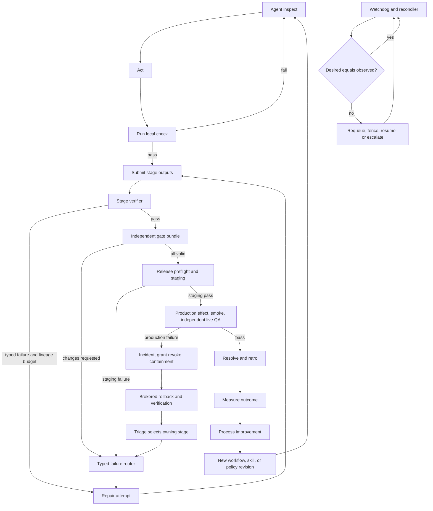

The six loops have different authorities: the agent may repair within its attempt; the stage verifier controls the exit contract; independent gates control review truth; the release loop controls environments and effects; the watchdog controls liveness/reconciliation; and retro changes only future versioned process definitions.

#### Loop contracts

| Loop | Trigger | State read | Permitted action | Stop/escalation |
|---|---|---|---|---|
| Within an agent run | Agent has not met its declared goal/check | Current stage context, workspace, command results | Inspect, edit, run checks, checkpoint | Turn/time/tool budget or cancellation; never self-declare protected pass |
| Stage verification and repair | Attempt submits output or times out | Entry/exit contract, output digests, verifier results, stable lineage, append-only repair events, monotonic counter projection, plan revision | Pass attempt or append consumption and create typed repair route within selected lineage limit | Selected per-lineage limit/no-progress, hard ceiling 5, then one escalation |
| Independent review/gate | Review becomes ready | Current input digest, policy, evidence, `review_round_topology`, `mandatory_stage_gates`, append-only round executions and current-digest passing credit | Execute topology; pass/fail/changes/abstain; Commander may evidence-raise maximum executions or topology | Required current-digest passing rounds and all stage gates current, or exhaustion/deadline/conflict/operator-only gate |
| Release/staging/production | Release candidate ready | Gate snapshot, release digest, environment state | Grant effect, deploy, verify, rollback/contain | Production failure always incident; no quiet retry |
| Watchdog/reconciler | Timer, heartbeat loss, outbox lag, state mismatch | Desired jobs/runs, leases, cursors, runners, receipts | Fence, requeue, replay, alert, reconcile | Bounded recovery; unknown state is loud |
| Retro/process improvement | Release verified or incident resolved | Expected/actual telemetry, evidence, attention, defects, costs | Create improvement/no-change record; publish new revisions | Effectiveness window closes only with measured subsequent outcomes |

### Test and evidence matrix

Evidence is current only while its declared inputs, environment class, verifier authority, and expiry remain valid.

| Major stage/fact | Verifier | Required evidence | Invalidation trigger | Failure route |
|---|---|---|---|---|
| Intake durability | API integration test + synthetic source | Accepted command ID, committed inbound event, outbox row, create/link result | Hash-chain failure, missing outbox, source dedupe conflict | Quarantine and operations incident if accepted response was returned |
| Think/plan | Commander plus policy-selected Engineering Manager/operator | Versioned documents, decision references, criteria draft, dependency/risk record | Plan/decision digest change | Repeat plan or operator decision; downstream invalidation |
| Design | Designer/Engineering Manager/CSO and operator where required | Approved mockup/design/architecture/threat-model revision and verdicts | Design digest or scope change | Design/plan route |
| Implementation | Agent inner loop + trusted build runner | Candidate digest, source revision, build output, checkpoint, change manifest | Any source/dependency/config digest change | New implementation attempt |
| Local tests | Deterministic trusted runner | Command, exit status, test report, environment/image digest, source digest, attestation | Source/test/config/image change or expiry | Implementation or environment repair |
| UI QA | Independent QA | Real user-flow steps, visible data, every control outcome, screenshots/video, tenant-isolation identity | UI/API/data fixture/deployment digest change | Design or implementation |
| Code review | Independent Review | Review report against coding standards, input diff digest, resolved findings | Diff or relevant policy change | Implementation/plan |
| Security review | Independent CSO | Threat model, authz tests, secret/taint/egress findings, input digest | Security-relevant change or policy update | Design/implementation; new boundary -> operator |
| Documentation | Independent doc/code-truth check | Doc revision, referenced API/code digests, link/check command results | Referenced behavior changes | Documentation or implementation |
| Release preflight | Release controller | Release manifest, gate snapshot, migration/rollback tests, capacity and secret-ref health | Included change/gate/environment policy change | Owning stage; no grant |
| Merge | SCM integration/effect broker | External merge audit ID, main revision, included digest | Revert/new merge | New release candidate |
| Staging deployment | Effect broker + environment observer | Grant, receipt, external deploy ID, observed digest, logs | New deployment or config drift | Deploy repair or incident on mismatch |
| Staging QA | Independent QA/e2e runner | Live staging URL, user flow, screenshots, API/e2e results, deployed digest | Deployment/config/data change | Implement/design/deploy route |
| Production deployment | Effect broker + external reconciliation | Short-lived grant, receipt, target, release digest, external audit ID | New deployment, receipt mismatch, policy revocation | Incident |
| Production smoke/live QA | Independent live verifier | Real URL/probes, critical user flow, screenshot/telemetry, exact production digest | New deployment, drift, expiry | Incident, rollback/containment, triage |
| Resolution | Server command | Active criteria-to-evidence map, valid gate set, terminal workflow and delivery facts, retro link | Any dependency invalidation before close | 422 unmet list and exact stage route |
| Runner recovery | Reconciler/conformance test | Lease expiry, new fencing token, replay cursor, checkpoint restore, rejected stale result | Missing cursor/checkpoint or conflicting live lease | Quarantine runner and escalate recovery |
| Retro improvement | Commander/owner plus analytics query | Baseline, subsequent comparison window, defect/attention/cost data, linked change | Metric definition or cohort change | Recompute or evidence-backed no-change |

### Transition transaction

For a stage transition, the server:

1. Authenticates the command and tenant scope.
2. Returns an exact idempotent replay if `(principal, client_command_id, request_hash)` already exists.
3. Locks the workflow run and relevant stage instance, compares expected versions, and re-evaluates dependencies.
4. Loads the pinned workflow/risk/gate policy and current digest/evidence graph.
5. Verifies the stage exit contract and valid required gate instances.
6. Appends the stage/workflow events, invalidations, new ready-stage facts, attention/outbox entries, and command result atomically.
7. Emits `NOTIFY` only after commit as a hint; consumers drain the durable outbox by cursor.

The transition never shells out to a runner inside the database transaction. External execution is represented by a committed durable job and occurs afterward under a lease.

## Technical architecture

### System context

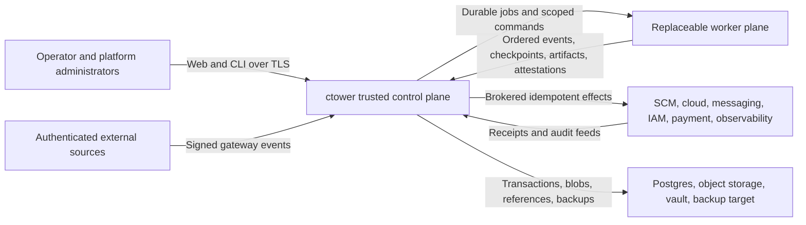

ctower is the sole writable orchestration source of truth. Humans and gateways submit commands; workers execute leased jobs; external systems remain authoritative for their own effects but must return audit identifiers. The record tier is inside the trusted boundary and is reconstructable without any worker.

### Logical containers and modules

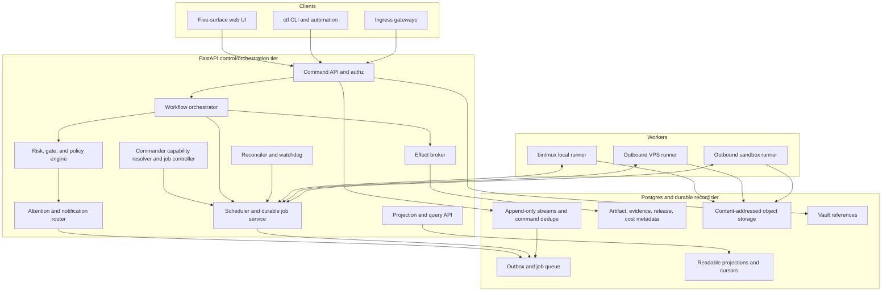

The first deployment may run these modules in one FastAPI process plus supervised background workers, but
their interfaces remain explicit. The Commander is one durable accountable principal expressed as a
sequence of fresh leased reasoning jobs, not an immortal context window. At each wake, the controller
filters published profiles by Commander capability, trust, tool/context fit, health, and policy, selects the
highest operator-approved reasoning-capability rank, and records the candidate set, exclusions, winner,
policy revision, and rationale. Current Opus-class or Codex xhigh-class profiles may qualify; price breaks a
tie only after capability/health/reliability. If the selected profile fails, the next strongest healthy
eligible profile continues the same orchestration lease and plan. Fable is eligible only for
non-authoritative scout/summarizer/polling jobs and cannot acquire the Commander principal or a final gate.
The scheduler and reconciler are deterministic services; model calls do not own liveness truth.

### Trusted control plane, record tier, and replaceable worker plane

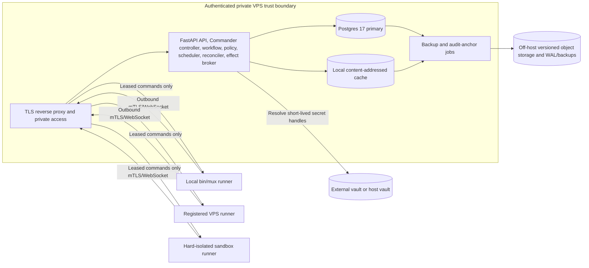

The VPS is private and authenticated; no runner needs an inbound public port. The record tier is trusted but separately privileged: the service role cannot run migrations or update/delete append-only records. Local `bin/mux` is the first runner implementation. Remote and sandbox runners wait until the same protocol passes conformance and placement policy requires them.

### Durable job, run, evidence, gate, and effect sequence

```mermaid
sequenceDiagram
    participant W as Workflow orchestrator
    participant A as Authenticated runner API / job service
    participant D as Postgres record tier
    participant R as Runner
    participant O as Object storage
    participant P as Gate/policy engine
    participant B as Effect broker
    participant X as External target

    W->>A: create accepted job command
    A->>D: append job event and outbox transaction
    R->>A: authenticated claim request under workload identity
    A->>D: atomic lease and fencing transaction
    A-->>R: lease ID, deadline, fencing token, command cursor
    R->>A: authenticated run.started and ordered event frames
    A->>D: validate token/cursor; append events
    R->>A: declare artifact digest and request upload
    A-->>R: scoped digest-bound upload URL
    R->>O: upload artifact bytes by digest
    O-->>R: durable object confirmation
    R->>A: authenticated terminal result, artifact manifest, attestation
    A->>D: validate token; append terminal/object metadata
    D->>P: evaluate evidence and required gate instances
    P->>D: append immutable verdict attempt
    W->>D: request protected effect for exact release digest
    D->>B: issue short-lived grant after policy pass
    B->>X: idempotent effect with scoped credential
    X-->>B: external audit ID and observed result
    B->>D: immutable effect receipt
    D-->>W: transition may continue
```

Every durable boundary is visible. Runners call only authenticated control-plane APIs; only control-plane
modules hold record-tier credentials and write Postgres. A scoped presigned object upload stores bytes but
cannot create object metadata, evidence, or workflow truth. A runner finishing does not advance the workflow
by itself; evidence and gates do. The effect broker obtains authority only after the policy snapshot passes
and records the external result before delivery state can advance.

### Required stack and deployment posture

- **Runtime:** Python for the trusted control plane, runner, CLI, and release helper; TypeScript for the browser. Standard GIL CPython 3.14.6 is the recommended exact build/image pin after the L0 compatibility fixture and append-only D6 supersession; 3.13.14 is the recorded fallback. FastAPI, Pydantic v2, and uvicorn remain fixed. Increment 1 uses one application worker because wake/outbox jobs are initially co-located, while database leases/advisory locks still prevent duplicate ownership.
- **Database:** Postgres 17; psycopg3 with explicit pools; plain SQL migrations, folds, and commands. No ORM is required. No generic event-sourcing framework is introduced in the first two increments.
- **Migrations:** a one-shot `ctower_admin` migrator under a global advisory lock with immutable migration checksums. The long-running `ctower_svc` role has no migration credentials.
- **Messaging:** transactional outbox and job tables are durable. Postgres `NOTIFY` is a hint that prompts a drain; startup and periodic cursor-based drains guarantee recovery.
- **Objects:** S3-compatible content-addressed storage in target topology; a verified local digest-addressed store is acceptable for Increment 1 only if it is backed up off-host. Object keys are `sha256/<first-two>/<full-digest>` and writes verify digest before commit.
- **Secrets:** vault or OS credential-store references. The server resolves a short-lived handle only for an authorized execution/effect boundary. Database fields never accept raw credentials.
- **Networking:** TLS; authenticated private access such as Tailscale/VPN or an equivalent private reverse proxy; server-side browser session; CSRF protection; no API token in browser JavaScript.
- **Interfaces:** OpenAPI is the command/query contract. The web UI and `ctl` CLI invoke the same server endpoints. Authorization, state validation, risk, gates, and transition logic are always server-side.
- **Observability:** OpenTelemetry-compatible structured logs, traces, and metrics with correlation/causation IDs. Raw execution logs live in object storage, not in the application log stream.

### Language, Module depth, and repository-quality architecture

#### Language allocation and runtime acceptance

ctower deliberately uses two implementation languages, not a language per subsystem:

| Surface | Language | Architectural reason |
|---|---|---|
| `ctower-kernel`, API, control worker | Python | Transaction- and policy-heavy work benefits from strict runtime contracts, explicit psycopg3 transactions, and rapid versioned policy development. |
| Runner, `ctowerctl`, `systemd-vps` release helper | Python | Shared generated contracts and failure semantics keep the first real runner/effect Adapters local. The privileged helper is a tiny separately packaged process behind a typed Unix-socket Interface, not a general Python plugin host. |
| Browser web application | TypeScript | Strict browser view models, accessibility tooling, and the generated TypeScript API client. The browser remains outside the trusted authority boundary. |
| Future narrow provider/runner helper | Go or Rust only after a new decision | A single-binary, performance, or privilege-isolation case must be measured and must sit behind an already justified Seam. Neither language is part of Increment 1 or 2. |

The L0 runtime compatibility gate installs and imports FastAPI, Pydantic plus its mypy plugin, psycopg3,
uv, Ruff, mypy, OpenTelemetry API/SDK/contrib at composition roots, schema/OpenAPI generation, and the
release-helper package; builds all wheels and Linux images; and runs the contract skeleton under standard
CPython 3.14.6. A failure records the exact incompatible dependency and selects 3.13.14. There is no silent
runtime fallback and no initial free-threaded-build matrix. D6 remains historical and authoritative for the
old 3.12 pin until the compatibility evidence and append-only decision are accepted.

#### Deep Module rule

A **Module** owns a substantial cohesive decision or authority and hides it behind one small, explicit
**Interface**. Its private implementation is replaceable without teaching callers its internals. A public
**Seam** exists only where two independently valuable real Adapters need the same contract; a fake alone
does not earn a Seam. Every new top-level Module must pass the deletion test: removing it would otherwise
redistribute real complexity across multiple callers. `utils`, `common`, `helpers`, `manager`,
package-per-noun, pass-through re-export, and service-per-table Modules are forbidden by default.

The highest-risk Modules use these shapes:

| Module | Public Interface shape | Hidden implementation and boundary |
|---|---|---|
| Workflow | `evaluate(WorkflowContextSnapshot, WorkflowCommand) -> WorkflowDecision` | Graph legality, readiness, risk/budget/lineage evaluation, typed routes, and invalidations. It receives immutable facts and returns append/effect/job/Attention intents; it does not import Work, Proof, Runtime, or Effects persistence. |
| Proof | `decide(ProofCommand) -> ProofDecision` | Criteria, object/artifact digest validity, evidence DAG, attestations, gate independence, freshness, and invalidation. Storage/scanner/signer observations cannot directly pass a gate. |
| Runtime | Command-oriented offer/claim/renew/frame/reconcile decisions | Durable jobs, leases, fencing, manifests, cursors, checkpoints, placement, and terminal acceptance. Runner SDK owns framing/composition but has no ticket or database authority. |
| Effects | Grant/apply/inspect/reconcile/rollback decisions over a narrow provider port | Desired/observed state, receipts, releases, incidents, ambiguity, rollback. Provider mechanics never decide authorization or delivery truth. |
| Repository Policy | `verify(repository_root, profile) -> PolicyReport` | One parsed repository model, ownership graph, private-import rules, source budgets, generated drift, telemetry rules, and expiring exceptions. Hooks, `just`, and CI are thin callers. |

Catalog, Work, Attention, and Projections remain separate deep Modules because each passes a different
deletion test. There is no `Factory`, `TaskManager`, `NotificationCenter`, second scheduler, generic
provider manager, or package-per-Adapter authority.

#### Typed boundary and source-design rules

- Every authored Python function and method is typed. Strict mypy with the Pydantic plugin is the
  authoritative static gate. `Any` is forbidden at public Interfaces; arbitrary external JSON is a
  recursive tainted value until a named validator returns a typed model.
- Every untrusted or cross-process contract—HTTP, event, CompanyBundle, Catalog payload, spool item,
  runner frame, checkpoint/evidence manifest, provider observation, effect grant/receipt, and telemetry
  context—is a strict immutable Pydantic v2 model with extra fields forbidden. Internal immutable values
  may use frozen typed dataclasses; serialization inheritance does not invade pure domain decisions.
- TypeScript uses `strict`, unchecked-index safety, exact optional properties, implicit-override/return and
  switch checks, unknown catch variables, exhaustive unions, no explicit `any`, no floating promises, and
  no console/debug output. Generated clients are the only web/API contract path.
- Ruff is the only Python linter and formatter; Prettier is the only TypeScript formatter. Formatting is
  never a review debate. Mypy, Ruff, TypeScript, ESLint, generated-code, secret, architecture, test, and
  coverage failures are merge-blocking.

The Repository Policy Module counts authored logical lines with language-aware parsing rather than raw
`wc -l` and applies the following default budgets:

| Rule | Warning | Hard failure |
|---|---:|---:|
| Authored executable source or test file | >500 logical lines | >600 logical lines |
| Function or method | >40 logical lines | >60 logical lines |
| Cyclomatic complexity | >8 | >10 |
| Control-flow nesting | >2 | >3 |
| Public exports from one Module | >15 | >25 |
| Public methods on one class | >10 | >15 |
| Direct Module dependency fan-out | >8 | >12 |

Generated/vendor code, lockfiles, binary assets, machine-emitted reports, captured protocol fixtures, and
golden snapshots use digest/drift/compile/size gates rather than LOC. Declarative schemas/workflow packs use
schema-specific validation. Hand-authored migrations and tests are not blanket-exempt. Splitting one
oversized file into forwarding/re-export files still fails the pass-through, fan-out, deletion-test, and
Interface-locality rules.

There is one exception store, `tools/checks/exceptions.yaml`. An exception binds an ID, exact rule, exact
path, explicit temporary limit, owner, reason, ctower ticket, independent approver, creation date, and an
expiry no later than 30 days. CI fails expired or unmatched exceptions and reports all active ones. Inline
`noqa`, type/ESLint/coverage disables, and secret-ignore entries must cite an exact rule/error code and
exception ID. Cross-tenant/auth/fencing invariants, fake proof, direct record-tier access from an untrusted
plane, secret findings, and generated drift are non-waivable.

#### Deterministic generation and one dependency law

Authored schemas live only under `contracts/`. Every generator records input, tool/version, command, and
output digests in `generated/.generated-manifest.json`; generated files carry a do-not-edit header. The
read-only codegen gate regenerates into a temporary directory, compares normalized bytes/manifests,
validates schema references and operation IDs, and compiles/typechecks both language clients. Hand edits,
duplicate authored schemas, missing outputs, or nondeterminism fail.

Imports follow one acyclic ownership policy: authored contracts generate clients/models; kernel Modules
may depend only on allowlisted public Module Interfaces and generated Python models; applications depend on
Interfaces/generated clients; runner SDK depends on generated runner contracts; web depends on the
generated TypeScript client; provider Adapters depend only on their port and generated contracts. No
runner, web, CLI, YAML pack, provider, extension, or generated client may import/connect to record-tier
persistence. A new cross-Module edge changes executable policy in the same reviewed change.

#### Observability from day one

Observability explains system behavior; it is never Record authority or Proof. Every process boundary
carries a strict, frozen `TelemetryContext` generated from an authored contract, with trace/span flags,
correlation and causation IDs, tenant/actor/command identity, and applicable ticket/workflow/stage/job/
runner/fence/effect/component/deployment IDs. Missing required context is a validation failure. Prompts,
secrets, user content, artifact bytes, and high-cardinality IDs never become metric labels.

Public Module Interfaces and real Adapter Seams are instrumented at their wrappers. Durable asynchronous
work uses span links rather than a days-long parent span. Kernel implementations may depend on the
OpenTelemetry API or typed context only; SDKs/exporters live in application composition roots. Structured
JSON logs carry event/outcome/reason and trace/correlation context, while raw execution streams remain
content-addressed artifacts. Traces/metrics export through an owned collector; export failure cannot roll
back a Record transaction, but it makes completeness visibly unhealthy. Because the Python OTel logging
surface is less stable than traces/metrics, domain code uses a stable typed log record and does not couple
to exporter SDKs.

Conformance drives one golden command from API/CLI ingress through Record/outbox, worker, runner, Proof,
Effects, and Projections; proves context continuity and required low-cardinality metrics; asserts no secret
or content in telemetry; and stops/restarts the collector to prove bounded buffering and a visible
`telemetry_export_failed` health state. Protected effects, auth denials, gate decisions, incidents,
rollbacks, stale-fence rejections, proof denials, and reconciliation failures are retained/sampled at 100%.

#### One local and CI verification contract

The repository exposes two non-mutating commands:

```text
just check   = warm <2 minute gate: Ruff format/lint, strict mypy, Repository Policy fast profile,
               TypeScript format/lint/typecheck, worktree secret scan, repository/contracts/Module tests

just verify  = just check + deterministic codegen + full Repository Policy + all Interface/conformance/
               acceptance/chaos tests + branch coverage + Playwright + history secret scan + clean diff
```

“All” is evaluated against the committed, versioned `tools/checks/expected-suites.toml` for the current
contract/increment scope. Each entry names the stable backlog owner, test path/command, applicable phase,
and required/deferred status. `just verify` fails when any suite declared required for the active manifest
is missing, empty, skipped without an exact exception, or failing; it reports later-phase suites as
`not yet required`, never as passing. CT-L0-007 creates the command and closes against the L0-007 manifest;
each later backlog item expands the same manifest in the change that makes its suite current. Thus one
non-mutating verification contract grows monotonically without no-op placeholder tests or a dependency
cycle that requires I1/I2 suites before their owning contracts exist.

Pre-commit runs syntax/hygiene, Ruff, Prettier/ESLint on staged web files, Gitleaks/private-key detection,
and the staged Repository Policy profile. Pre-push invokes `just check`. Required CI executes frozen uv and
pnpm installs, `just check`, `just verify`, and security/release jobs from pinned action/tool revisions;
release consumes the exact verified commit/artifacts and does not rebuild from mutable inputs. `SKIP` or a
local hook bypass never waives required CI.

Tests use the **Interface as the test surface**. Module tests import only the public Interface and cover
success, denial, idempotency, stale state, restart/rebuild, authorization, and applicable state/property
cases. Adapter conformance is shared by every real implementation of a Seam. Acceptance tests use generated
clients and real process boundaries, not database/private imports. Authored Python starts at 90% branch
coverage and TypeScript at 90% lines/85% branches, while Record, Access, Workflow, Proof, Runtime fencing,
and Effects grant decisions target complete decision-branch coverage. Coverage supports these behavioral
gates; it never substitutes for them.

#### Pinned Increment 2 staging, production, and self-upgrade boundary

Increment 2 pins one named live adapter alongside its deterministic fake:

| Record | Pinned identity and isolation | Provider action / audit |
|---|---|---|
| Project | `project_key=ctower`; repository record pins the source provider/repository ID | Release identity is `release_id + source_digest + bundle_digest + schema_revision + config_digest`; every candidate names a verified rollback predecessor. |
| Provider target | `provider_target_key=vps-primary-systemd`; adapter `systemd-vps/v1` | Allowlisted actions are `release.install`, `service.switch`, `service.restart`, `service.observe`, and `service.rollback`; provider audit is the release supervisor’s hash-chained receipt journal. |
| Staging environment | `environment_key=ctower-staging`; separate `ctower-staging` Linux user, service unit, release symlink/root, database/schema, object prefix, secret refs, port, and private endpoint record | Deploy action targets only `ctower-staging.service`; independent QA loads the endpoint from the environment record and proves exact release digest. |
| Production environment | `environment_key=ctower-production`; separate `ctower` Linux user, `ctower.service`, release symlink/root, production database/object prefix/secret refs, and private live endpoint record | Deploy/rollback targets only `ctower.service`; smoke plus an independent live-QA job must prove the exact digest and real URL. |

`ctower-release-supervisor.service` is a root-owned, separately supervised helper outside the FastAPI
process being upgraded. It exposes an allowlisted root-owned Unix socket to the effect broker identity; the
application and general runners hold neither root nor `systemctl`/release-directory credentials. A
short-lived grant binds environment, action, release/bundle/config/schema digests, predecessor, maximum use,
and idempotency key. The supervisor verifies the immutable bundle, writes and fsyncs a `started` receipt to
its root-owned hash-chained journal, installs into a digest-addressed release directory, atomically switches
the environment symlink, restarts only the allowlisted unit, probes the observed release ID, and writes a
terminal receipt. The returned external audit ID is the journal sequence/hash.

For ctower self-upgrade, the supervisor remains alive while FastAPI drains and restarts. If the new service
does not report the expected release/health before deadline, the supervisor switches to the recorded
predecessor, restarts, verifies rollback on the environment endpoint, and appends the rollback receipt before
the incident controller may triage. On restart, ctower resumes from `provider_audit_cursors`, imports any
supervisor receipts written while it was down, and reconciles the original effect grant/idempotency key;
missing, duplicated, or mismatched journal entries fail closed. Updating the supervisor itself is not part
of the golden ticket and requires its own operator-reviewed infrastructure release.

The adapter contract ships both a deterministic fake `systemd-vps/fake` (crash points before/after each
receipt/symlink/restart step) and live `systemd-vps/v1` evidence from the named staging and production
records. Increment 2 cannot exit on fake-provider evidence alone.

### Logical responsibilities inside deep Modules and composition roots

These are logical responsibilities and process adapters, not additional public Modules or
microservices. The owning-Module column is normative; implementation stays behind that Module's small
Interface or in the named application composition root.

| Logical responsibility | Owning deep Module / composition root | Owns | Must not own |
|---|---|---|---|
| Ingress adapter | `ctower-api` composition -> Access/Work Interfaces | Source auth, normalization, dedupe keys, taint/quarantine, attachment upload, inbound command | Ticket classification truth outside the command response; direct runner prompts |
| Command API | `ctower-api` composition -> Access/Record Interfaces | Authentication, authorization, request validation, idempotency, CAS, append transaction, stable error model | Long-running execution inside transactions |
| Commander capability resolver/controller | Workflow with Catalog/Runtime Interfaces | Strongest-healthy profile resolution, durable per-ticket orchestration accountability/lease, fresh reasoning jobs, context manifests, versioned `orchestration_plan` limit/topology/rationale proposals, response to stage outcomes through terminal verification | Heavy implementation, canonical state in model memory, consumed-count authorship, direct database writes, gate verdict forgery, counter reset, or bypass of floors/ceiling |
| Workflow orchestration | Workflow | Pinned graph, readiness, immutable accepted/refused transition evaluations, stage/attempt transitions, typed owning-stage routes, invalidation, terminal contract | Runner process lifecycle internals or human UI state |
| Risk/policy evaluation | Workflow | Deterministic tier facts, overlays, separate stage-gate/round requirements, stable lineage normalization/split policy, human-only rules, policy version | Self-reported risk labels/lineage keys as authority |
| Gate evaluation | Proof; Workflow owns only round/route accounting | Gate instances, reviewer assignment, sealed access, verdict attempts, conflicts, expiry/invalidation; Workflow consumes immutable Proof decisions into round facts | Artifact mutation, plan-authored consumed counts, or external effects |
| Scheduling/job control | Runtime | Durable accepted jobs, priorities, capability matching, leases, fencing, command cursors, cancellation | Ticket ownership or gate verdicts |
| Reconciliation/watchdog | Runtime for jobs/cursors; Effects for receipts; Projections for view watermarks | Desired-vs-observed state, lease expiry, cursor/receipt/projection reconciliation, synthetic checks behind the owning Interfaces | Guessing success from process absence or creating a cross-Module manager |
| Effect brokerage | Effects | Short-lived grants, just-in-time credential resolution, idempotent external action, immutable receipt | Standing credentials on runners; approving its own policy |
| Attention/notification | Attention | Durable action items, ranking, dedupe, recipient routing, delivery retries, acknowledgment | Inferring separate competing Needs You truth per client |
| Artifact/evidence handling | Proof | Digest verification, object metadata, document revisions, evidence dependencies, trust/quarantine | Treating any uploaded byte as valid evidence |
| Projection/query handling | Projections | Home, Board, Ticket, Fleet, Analytics, search, activity, health/completeness | Authoritative mutations |
| Audit/analytics | Projections for KPI/cost/retro reads; Effects for external reconciliation | KPI query versions, external reconciliation, cost allocation, retro comparison | Rewriting source events to improve metrics or becoming a second audit authority |

### Greenfield monorepo and deep-Module boundaries

Implementation starts in a new repository named `ctower`. No Mission Control, Paperclip, or Crabbox source
is copied into the kernel. Their pinned commits and exports remain provenance for requirements, selective
Adapter implementation, and one-time migration. The trusted control plane is a modular monolith, not a set
of domain microservices: `ctower-api` and `ctower-control-worker` are separate process entry points from the
same control artifact; `ctower-runner`, `ctower-web`, and `ctowerctl` are separately deployable clients of
versioned contracts. The root-owned release supervisor remains an Effect Provider Adapter.

The complete initial repository tree at architecture granularity is:

```text
ctower/
├── CLAUDE.md
├── AGENTS.md -> CLAUDE.md
├── README.md
├── SPEC.md
├── DECISIONS.md
├── .python-version
├── .node-version
├── .editorconfig
├── .gitignore
├── .pre-commit-config.yaml
├── .gitleaks.toml
├── pyproject.toml
├── uv.lock
├── package.json
├── pnpm-workspace.yaml
├── pnpm-lock.yaml
├── tsconfig.base.json
├── eslint.config.mjs
├── prettier.config.mjs
├── justfile
├── playwright.config.ts
├── apps/
│   ├── ctower-api/
│   │   ├── pyproject.toml
│   │   └── src/ctower_api/
│   │       ├── http.py
│   │       ├── worker.py
│   │       ├── wiring.py
│   │       └── settings.py
│   ├── ctower-runner/
│   │   ├── pyproject.toml
│   │   └── src/ctower_runner/
│   │       ├── daemon.py
│   │       ├── compose.py
│   │       ├── cli.py
│   │       └── adapters/
│   │           ├── harness/
│   │           ├── supervisor/
│   │           ├── target/
│   │           ├── workspace/
│   │           └── telemetry/
│   ├── ctower-web/
│   │   ├── package.json
│   │   ├── tsconfig.json
│   │   ├── public/
│   │   └── src/
│   │       ├── bootstrap.ts
│   │       ├── routes.ts
│   │       ├── shared/
│   │       └── surfaces/
│   │           ├── home/
│   │           ├── board/
│   │           ├── ticket/
│   │           ├── fleet/
│   │           └── analytics/
│   └── ctowerctl/
│       ├── pyproject.toml
│       └── src/ctowerctl/
│           ├── cli.py
│           ├── spool.py
│           ├── replay.py
│           └── commands/
├── packages/
│   ├── ctower-kernel/
│   │   ├── pyproject.toml
│   │   ├── migrations/
│   │   └── src/ctower_kernel/
│   │       ├── interface.py
│   │       ├── access/
│   │       ├── record/
│   │       ├── catalog/
│   │       ├── work/
│   │       ├── proof/
│   │       ├── attention/
│   │       ├── runtime/
│   │       ├── effects/
│   │       ├── workflow/
│   │       ├── extension_host/
│   │       ├── projections/
│   │       └── _adapters/
│   ├── ctower-runner-sdk/
│   │   ├── pyproject.toml
│   │   └── src/ctower_runner_sdk/
│   │       ├── manifest.py
│   │       ├── protocol.py
│   │       ├── registry.py
│   │       ├── testing.py
│   │       ├── harness/interface.py
│   │       ├── supervisor/interface.py
│   │       ├── target/interface.py
│   │       ├── workspace/interface.py
│   │       └── telemetry/interface.py
│   └── ctower-systemd-vps/
│       ├── pyproject.toml
│       └── src/ctower_systemd_vps/
│           ├── adapter.py
│           ├── fake.py
│           └── supervisor/
├── contracts/
│   ├── components/
│   │   ├── versioned-component.schema.json
│   │   ├── category-registry.schema.json
│   │   └── catalog.openapi.yaml
│   ├── company/company-bundle.schema.json
│   ├── domain/
│   │   ├── events/
│   │   └── task-management/
│   ├── http/
│   ├── workflow/
│   ├── evidence/
│   ├── runner/
│   ├── execution/
│   │   ├── environment-revision.schema.json
│   │   ├── image-revision.schema.json
│   │   ├── placement-decision.schema.json
│   │   └── remote-provider-adapter.schema.json
│   ├── effects/
│   ├── observability/
│   │   └── telemetry-context.schema.json
│   ├── extensions/
│   ├── packs/
│   ├── compatibility/
│   └── codegen/
├── generated/
│   ├── .generated-manifest.json
│   ├── python/ctower-contracts/
│   ├── python/ctower-client/
│   └── typescript/ctower-client/
├── company/
│   ├── company.bundle.yaml
│   └── docs/
│       ├── goals.md
│       └── operating-model.md
├── packs/
│   ├── manifests/core-v1.yaml
│   ├── workflows/engineering.software-factory/v1.yaml
│   ├── policies/
│   │   ├── execution/software-factory-v1.yaml
│   │   ├── risk/software-factory-v1.yaml
│   │   ├── gates/software-factory-v1.yaml
│   │   ├── scheduling/priority-fair-v1.yaml
│   │   ├── effects/systemd-vps-v1.yaml
│   │   └── capability/commander-v1.yaml
│   ├── personas/<persona>/v1/
│   ├── skills/<skill>/v1/
│   ├── checklists/
│   └── ui/contextual-slots-v1.yaml
├── tests/
│   ├── repository/
│   ├── contracts/
│   │   ├── components/
│   │   ├── company/
│   │   ├── repository/
│   │   ├── task-management/
│   │   ├── execution/
│   │   └── extensions/
│   ├── modules/
│   │   ├── record/
│   │   ├── catalog/
│   │   ├── work/
│   │   ├── proof/
│   │   ├── attention/
│   │   ├── workflow/
│   │   ├── runtime/
│   │   ├── effects/
│   │   ├── extension_host/
│   │   └── projections/
│   ├── conformance/
│   │   ├── http/
│   │   ├── runner/
│   │   │   ├── harness/
│   │   │   ├── supervisor/
│   │   │   ├── target/
│   │   │   ├── workspace/
│   │   │   ├── telemetry/
│   │   │   └── composition/
│   │   ├── remote-provider/
│   │   └── effect-provider/
│   ├── acceptance/increment-1/
│   ├── acceptance/increment-2/
│   ├── e2e/golden-ticket/
│   ├── e2e/task-management/
│   ├── chaos/
│   └── fixtures/
├── deploy/
│   ├── compose/dev.yaml
│   ├── postgres/roles.sql
│   ├── systemd/
│   │   ├── ctower-api.service
│   │   ├── ctower-control-worker.service
│   │   ├── ctower-runner.service
│   │   ├── ctower-web.service
│   │   └── ctower-release-supervisor.service
│   ├── vps/
│   ├── private-edge/
│   └── observability/
│       ├── otel-collector.yaml
│       ├── dashboards/
│       └── alerts/
├── images/
│   ├── control/Dockerfile
│   ├── runner/Dockerfile
│   └── web/Dockerfile
├── tools/
│   ├── codegen/
│   ├── checks/
│   │   ├── __init__.py
│   │   ├── __main__.py
│   │   ├── interface.py
│   │   ├── policy.toml
│   │   ├── expected-suites.toml
│   │   ├── exceptions.yaml
│   │   └── _impl/
│   ├── migration/mission-control/
│   └── release/
├── docs/
│   ├── runbooks/
│   ├── operations/
│   ├── security/
│   └── contributing/
├── examples/
│   ├── http/
│   ├── runner-component/
│   └── declarative-pack/
└── .github/workflows/
    ├── verify.yml
    ├── conformance.yml
    ├── acceptance.yml
    └── release.yml
```

The frontend framework is deliberately unselected until its L0 review; TypeScript/pnpm and the five-route
contract are fixed, but React, Vite, Next, or another framework is not silently chosen by this tree. A real
remote Target may later add `images/sandbox/<target-key>/`; that directory is absent until an Adapter passes
the unchanged conformance suite, so the tree does not pretend remote runtime scope exists.

Dependency direction is structural and acyclic:

```text
contracts -> generated contracts/clients -> apps
packs -----^                              |
                                             v
ctower-web/ctowerctl ----------------> generated clients
ctower-runner -> runner-sdk ---------> generated contracts
ctower-api -> kernel ----------------> generated contracts
ctower-api -> injected effect Adapter

FORBIDDEN: kernel -> app/runner/web/CLI/provider implementation
FORBIDDEN: runner/provider/web/CLI/import/extension -> Postgres record tier
FORBIDDEN: generated clients -> server or policy implementation
```

| Deep Module | Small Interface and owned complexity | Forbidden ownership |
|---|---|---|
| Record | `transact` plus cursor reads; idempotency-before-CAS, locks, hash, exact replay, outbox | Domain policy or client rendering |
| Access | `authorize(actor, action, scope, facts)`; identity, tenant/project scope, default deny | Payload-supplied actor/scope |
| Catalog | `stage/publish/resolve/supersede/deprecate/revoke`; universal component lifecycle and pins | Category business interpretation or arbitrary code execution |
| Work | Ticket/lifecycle/custody/relations and recommended priority/blocker commands | Workflow stage, Board projection, runner lease |
| Proof | Criteria, artifacts, evidence, attestations, gates, dependency invalidation | Artifact authors self-verifying or external effects |
| Attention | Qualification/open/decide/dedupe/recipient lifecycle | A second notifications-owned Needs You truth |
| Workflow | Evaluate/reconcile/route generic pinned graph, stage/attempt, readiness, lineage/budgets | Provider lifecycle, proof internals, or named Factory engine |
| Runtime | Profiles, jobs, leases/fencing, effective manifests, cursors/checkpoints, fair scheduling | Ticket/gate/effect authority |
| Effects | Exact grants/receipts, environments, releases, reconciliation, incidents/rollback | Standing credentials or policy self-approval |
| Extension Host | Verify data-only manifest, grant, isolate, invoke, audit, disable/rollback | Kernel tables, transitions, gate/evidence minting, effects, secrets, primary navigation |
| Projections | Rebuild Home/Board/Ticket/Fleet/Analytics and watermarks | Any authoritative mutation |

These Interfaces are the test surfaces. Private implementation stays inside its Module. The deletion test
justifies each: removing Record, Catalog, Proof, Workflow, Runtime, Effects, or Extension Host redistributes
hard invariants across many callers. A catch-all utils package, service-per-noun, generic plugin worker,
remote manager, second scheduler, or package-per-Adapter fails the current deletion/two-real-Adapter test.
One durable home is mandatory: authored schemas in `contracts/`, migrations in kernel `migrations/`,
generated clients in `generated/`, fixtures in `tests/fixtures/`, conformance by Seam in
`tests/conformance/`, deployment manifests in `deploy/`, and import compatibility in
`tools/migration/mission-control/`.

### Physical schema inventory

All IDs exposed through APIs are UUIDv7 or stable human ticket IDs. `created_at` and `updated_at` are server timestamps in UTC. Every tenant-scoped table has `tenant_id NOT NULL` even where omitted below for brevity, and foreign keys include tenant consistency through composite keys or constraint triggers. Soft deletion is used only for projections/configuration; immutable evidence and event history use tombstones and retention policies.

Authority is explicit and closed over this inventory:

| Ownership class | Meaning | Storage rule |
|---|---|---|
| **Authoritative current/configuration** | Stable identities and server-controlled current pointers such as tenants, projects, principals, tickets, workflow runs, jobs, leases, environments, and provider targets | Mutated only by authenticated commands/CAS; every referenced FK target appears in this inventory. |
| **Immutable revision/fact** | Published policies/skills/workflows/profiles/plans, domain events, occurrences, consumption events, verdicts, receipts, aliases/import dispositions, and transition evaluations | Insert-only after publication/commit; correction appends a successor or tombstone. |
| **Rebuildable projection** | Home/Board/Ticket/Fleet/Analytics views, round/repair totals, delivery summaries, and consumer watermarks | Rebuilt from immutable facts; never accepted as command input or authority. |
| **External authoritative bytes/effects** | Object bytes and provider-side effects/audit records | Postgres stores immutable digest/provenance/receipt metadata and reconciles external authority; it never infers success. |

Schema conformance enumerates every actual FK and fails if its target table/key is absent here. References
that are intentionally polymorphic use a declared `(subject_type, subject_id)` registry plus a constraint
trigger, not a pretend SQL FK. No JSON field may hide a required authority that the inventory leaves unnamed.
Unless a row names a runtime-specific immutable record such as an orchestration plan or artifact revision,
`Workflow revision`, `policy revision`, `skill revision`, `profile revision`, `environment revision`,
`image revision`, and analogous `*-revision FK` phrases below are typed foreign keys to
`component_revisions` with a matching `component_definitions.kind`; they do not imply parallel
category-specific revision tables.

#### Identity, ingress, tickets, and events

| Table | Primary/foreign/unique constraints | Critical indexes and checks |
|---|---|---|
| `instance_bootstrap_capabilities` | singleton `id PK`; token digest unique; optional consumed tenant/bootstrap-principal/command-result refs populated atomically | only deliberate instance-scoped trust-root row; local/private origin, created/expiry/used/revoked, receipt digest; usable only while tenant count is zero; no plaintext token and no reset/delete after consumption |
| `tenants` | `id PK`; `slug UNIQUE` | active/status index; no cross-tenant implicit default |
| `projects` | `id PK`; tenant and Project component-definition FKs; one-to-one definition binding | authoritative runtime scope/status and relationships only; authored project config/revisions remain in Catalog; disabled projects cannot receive new work/effects |
| `repositories` | `id PK`; project/provider-target FKs; `UNIQUE(provider_target_id, external_repository_id)` | canonical clone/source identity; source URL is metadata, not credential |
| `provider_targets` | `id PK`; tenant FK; stable provider/adapter/target key unique per tenant | authoritative adapter/action allowlist, audit-feed kind, credential `vault_ref`, status, reconciliation SLO; no plaintext secret |
| `environments` | `id PK`; project/provider-target FKs; `UNIQUE(project_id, environment_key)` | authoritative `staging|production|test` class, endpoint/probe refs, isolation scope, deploy action, credential policy, audit cursor source |
| `principals` | `id PK`; `tenant_id FK`; `UNIQUE(tenant_id, kind, external_subject)` | `(tenant_id, status)`; kinds include bootstrap_installer, operator, commander, agent, reviewer, runner, gateway, service, admin; bootstrap_installer exists disabled only for first-tenant attribution |
| `principal_credentials` | `id PK`; `principal_id FK`; `vault_ref NOT NULL`; `UNIQUE(principal_id, credential_version)` | expiry/revocation partial index; check that no plaintext-value column exists |
| `inbound_threads` | `id PK`; `tenant_id FK`; `UNIQUE(tenant_id, source_kind, source_thread_ref)` | `(tenant_id, last_event_at DESC)` |
| `inbound_events` | `id PK`; `thread_id FK`; `UNIQUE(thread_id, seq)`; `UNIQUE(tenant_id, source_kind, source_event_ref)` when source ref exists | `(classification, created_at)`; payload digest required; taint/trust enum check |
| `command_results` | `PRIMARY KEY(principal_id, client_command_id)`; principal FK; request hash, canonical HTTP status/headers/body or compact exact-replay tombstone | immutable dedupe authority; same key with different request hash is conflict; tombstone retains stable exact outcome through audit retention |
| `tickets` | human `id PK`; `tenant_id FK`; `current_episode_id FK`; accountable principal FK; `UNIQUE(tenant_id, source_kind, source_ref)` where direct source exists | `(tenant_id, lifecycle_summary, updated_at DESC)`; `version >= 0`; `head_hash` required after first event |
| `ticket_events` | internal `id PK`; ticket FK; `UNIQUE(ticket_id, seq)`; `(principal_id, client_command_id) FK command_results`; command event ordinal unique; optional causation-event FK | `(ticket_id, kind, seq)`; every event references its originating command; first event iff `prev_hash IS NULL`; insert-only grants |
| `event_schemas` | `PRIMARY KEY(kind, schema_version)`; schema digest unique | published schemas immutable; append validates kind/version |
| `ticket_relations` | `id PK`; source/target ticket FKs; `UNIQUE(source_ticket_id, relation_type, target_ticket_id, episode_scope)` | source and target indexes; no self-edge; cycle checks for parent and dependency graphs |
| `lifecycle_episodes` | `id PK`; ticket FK; `UNIQUE(ticket_id, episode_number)` | one current episode partial unique; terminal timestamps/outcome checks |
| `assignment_intervals` | `id PK`; principal FK; subject ID/type; source command/event FKs | partial unique on current `(subject_type, subject_id, assignment_kind)`; interval end after start; constraint trigger requires exactly one gapless eligible `ticket_custodian` for every nonterminal actionable episode and atomic terminal release/transfer |
| `acceptance_criteria` | `id PK`; ticket/episode FK; stable key and version; `UNIQUE(ticket_id, episode_id, criterion_key, version)` | one active version partial unique; frozen/superseded checks |
| `import_runs` | `id PK`; importer-principal FK; source-system/snapshot digest/watermark unique | immutable freeze/import manifest, start/end/result/counts; correction is a new run linked to predecessor |
| `source_aliases` | `id PK`; import-run/ticket/reviewer-principal FKs; `UNIQUE(tenant_id, source_system, source_id)` | immutable source digest, disposition, imported time; duplicate/link/exclusion target uses the declared polymorphic subject registry |

#### Workflow, jobs, agents, and execution

| Table | Primary/foreign/unique constraints | Critical indexes and checks |
|---|---|---|
| `component_definitions` | `id PK`; tenant/scope FKs; `UNIQUE(scope, kind, component_key)` | universal stable identity for every `VersionedComponent` category; no category-specific definition table |
| `component_revisions` | `id PK`; definition/author/source-object FKs; `UNIQUE(definition_id, revision)`; content digest unique per scope/kind | immutable envelope/payload/schema/compatibility/provenance/supersedes/lifecycle; publication conformance required |
| `component_dependencies` | source/target component-revision FKs; relation; composite PK | exact compatible pins; cycle and revoked/incompatible dependency checks at publication |
| `component_active_pointers` | scope/definition PK; current component-revision FK; expected version | CAS future-only pointer; moving it never mutates accepted/running/history pins |
| `company_bundle_applications` | `id PK`; bundle component-revision/actor FKs; command-result FK; previous/current pointer versions | immutable validate/plan/apply/export provenance, semantic diff, checks, staged revisions, atomic activation result |
| `skill_materializations` | `id PK`; skill/profile component-revision FKs; harness Adapter component revision; output-object FK | immutable materialized digest/provenance; dispatch requires compatible current pins; no skill-specific revision authority |
| `workflow_stage_definitions` | `id PK`; workflow and Stage component-revision FKs; `UNIQUE(workflow_revision_id, stage_key)` | immutable binding of a typed Stage contract into one Workflow graph; Workflow owns placement/edges/terminal semantics and Stage is not a second engine |
| `workflow_transitions` | workflow component-revision and from/to stage-definition FKs; unique normalized predicate | graph validation at publish; Execution Policy cannot add absent edges |
| `workflow_runs` | `id PK`; ticket episode, Workflow component-revision, Execution Policy, Gate/Evidence Policy FKs; `UNIQUE(ticket_episode_id, run_number)` | exact component digests; one active primary run per episode unless Workflow declares auxiliary run |
| `orchestration_plan_revisions` | `id PK`; workflow-run/Commander-principal/Execution-Policy component-revision FKs; `UNIQUE(workflow_run_id, revision)`; supersedes FK | immutable risk facts, separate mandatory-stage-gate/review-topology digests, passing/max round limits, per-lineage repair limits, evidence/rationale; schema rejects consumed fields |
| `commander_profile_resolutions` | `id PK`; orchestration-plan/workflow-run/Agent-Profile component-revision FKs; resolution sequence unique per run | candidate/exclusion/health/capability-policy digests; selected profile highest eligible rank; failover reason/time |
| `review_round_events` | `id PK`; workflow-run/plan-revision FKs; `UNIQUE(workflow_run_id, round_number, event_ordinal)` | append-only started/terminal/invalidated facts with topology/input digests; terminal pass requires complete topology and zero blockers |
| `review_round_counters` | workflow-run PK/FK; last round-event FK; total executions/current-digest passing counts | rebuildable monotonic projection only; CAS watermark; never client-authored or copied into plan authority |
| `failure_lineages` | `id PK`; workflow-run/stage-definition/policy-revision FKs; lineage key unique per run | server-normalized fields exclude candidate digest; optional parent/split-event FK; client cannot supply key/discriminator |
| `failure_occurrences` | `id PK`; lineage/stage-attempt/verifier-principal FKs; `UNIQUE(lineage_id, occurrence_fingerprint)` | immutable exact input digest, rule revision, evidence and finding packet; same defect across changed digests retains lineage FK |
| `lineage_split_events` | `id PK`; parent/child-lineage, policy-revision, adjudicator-principal FKs | immutable deterministic-rule or independent-adjudication authority; author/failing-verifier overlap denied |
| `repair_attempt_events` | `id PK`; lineage/occurrence/plan-revision/stage-attempt FKs; attempt number unique per lineage | append-only `consumed|terminal|invalidated` facts; dispatch requires atomic consumed event first; no update/delete |
| `repair_budget_counters` | lineage PK/FK; last repair-event FK; selected-limit plan-revision FK | rebuildable monotonic projection; consumed attempts, exhaustion, ceiling; one open escalation key; never plan/client authority |
| `stage_instances` | `id PK`; workflow-run and stage-definition FKs; `UNIQUE(workflow_run_id, stage_key, occurrence)` | `(workflow_run_id, state)`; readiness/dependency index |
| `stage_attempts` | `id PK`; stage-instance FK; `UNIQUE(stage_instance_id, attempt_number)`; executor-assignment FK; optional parent occurrence/lineage FKs | `(state, timeout_at)`; input/output manifest digests; failure lineage/occurrence indexes |
| `durable_jobs` | `id PK`; stage-attempt FK; command digest; state; fencing counter | partial indexes for accepted priority queue and nonterminal jobs; terminal outcome only when state terminal |
| `job_leases` | `id PK`; job/runner FKs; fencing token; `UNIQUE(job_id, fencing_token)` | one unexpired/current lease partial unique; `(lease_expires_at)` for reaper |
| `job_commands` | `id PK`; job FK; `(principal_id, client_command_id) FK command_results`; `UNIQUE(job_id, command_cursor)` | undelivered cursor index; immutable delivery/ack facts; command replay is governed by the same command result |
| `runners` | `id PK`; runner principal FK; registration key unique; trust/status fields | `(status, last_heartbeat_at)`; capability GIN index; quarantine/revocation checks |
| `runner_protocol_sessions` | `id PK`; runner FK; connection nonce unique; protocol version | active connection partial index; last acknowledged server/runner cursor |
| `execution_runs` | `id PK`; job, runner, Agent-Profile component-revision, effective-run-manifest, placement-resolution FKs; effective context digest; terminal outcome | `(job_id, started_at)`; exact component/environment/image pins, usage, termination reason; one attempt never mutates pins |
| `execution_sessions` | `id PK`; execution-run FK; provider/harness; external handle encrypted/reference; `UNIQUE(run_id, sequence)` | handle never used as FK identity elsewhere; expiry index |
| `execution_events` | `id PK`; execution-run FK; `UNIQUE(run_id, event_cursor)`; payload/object digest | `(run_id, event_kind, event_cursor)`; structured events retained independently of raw logs |
| `workspaces` | `id PK`; provider-target/repository/project FKs; current owner-assignment FK | unique provider external ID; `(state, cleanup_after)`; no cleanup with uncheckpointed sole copy; tmux/Paperclip handles are metadata only |
| `checkpoints` | `id PK`; workspace/run/stage-attempt FKs; manifest digest unique per workspace revision | `(workspace_id, created_at DESC)`; verified object refs required |

#### Work management, compositional execution, extensions, and remote placement

The following tables close the new authority boundaries. Remote/image records are L0 contract targets;
Increment 2 exercises their local/fake path only. General extension runtime records likewise define a
fail-closed target without claiming arbitrary extension execution exists. The priority, blocker, admission,
and priority-aware scheduling rows are the proposed AC-TM schema and remain conditional on operator
confirmation; their presence here is a testable architecture recommendation, not implementation authority.

| Table | Primary/foreign/unique constraints | Critical indexes and checks |
|---|---|---|
| `ticket_priority_events` | `id PK`; ticket/episode/actor/command-result FKs; sequence unique per episode | append-only from/to `P0|P1|P2`, reason/policy/evidence; P0 authorization predicate; no update/delete |
| `ticket_blockers` / `ticket_blocker_events` | blocker PK with ticket/stage/owner/source/dependency refs; event sequence unique | typed reason, resolution condition, next check/SLA, Board impact; multiple open; resolved requires evidence; operator-action flag alone feeds Needs You |
| `admission_events` | `id PK`; ticket/episode/actor/command FKs | typed `admit|defer|unblock|reopen` intent/result; refusal links unchanged transition evaluation |
| `scheduling_decisions` | `id PK`; policy component-revision, job, selected runner/target FKs; candidate-set object | eligibility exclusions, priority, age/fairness credit, WIP/preemption/checkpoint result; rebuildable queue never authority |
| `effective_run_manifests` | `id PK`; stage-attempt/job and every component-revision FK; digest unique per attempt | `HarnessSpec`, `SupervisorSpec`, `TargetSpec`, `WorkspaceSpec`, `TelemetrySpec`, resolved capabilities/config digests, secrets/egress/resources; immutable |
| `supervisor_handles` | `id PK`; run/runner-incarnation/target-incarnation/lease FKs; opaque encrypted/reference handle | scoped PID/tmux/provider/session metadata; cannot satisfy success/health; stale epoch rejected |
| `job_command_events` | `id PK`; job-command/lease FKs; command state and event cursor unique | append-only `queued|delivered|acknowledged|rejected|expired|superseded`; delivery mode `LIVE_INPUT|INTERRUPT_AND_RESUME` |
| `execution_log_chunks` | `id PK`; run/lease FKs; stream; first/last cursor; byte range; object FK; content hash | acknowledged chunks durable before broadcast; exact ordering, redaction policy, retention; immutable |
| `execution_log_gaps` | `id PK`; run/stream/lease FKs; first/last cursor or byte range; reason | conspicuous durable gap; proof requiring complete logs cannot pass |
| `extension_installations` | `id PK`; Extension component-revision/scope FKs; active-pointer and lifecycle version | data-only manifest digest/signature/provenance; code never executes during parse; uninstall tombstone preserves audit |
| `extension_capability_requests` / `extension_grants` | request/revision FKs; grant actor/policy/scope/expiry/resource/egress/quota | request is never grant; no canonical mutation, kernel DB, standing secret, primary route, or unscoped effect capability |
| `extension_invocations` | `id PK`; installation/revision/grant/job/attempt FKs; invocation nonce unique | short-lived identity, exact scope/expiry/lease epoch; durable job/cursor/audit; revoked token rejected |
| `extension_contributions` | `id PK`; extension revision/slot schema FKs; unique slot key per revision | host-rendered contextual allowlist only; route/Needs You/projection replacement rejected |
| `execution_environment_materializations` | Environment component-revision PK/FK; generated normalized payload/object FKs | read-only derived OS/arch/toolchain/image/network/resources/secret/cache/reuse/attestation/placement fields; authority remains the component revision and universal active pointer; distinct from release environments |
| `placement_policy_materializations` | Placement-Policy component-revision PK/FK | read-only normalized hard constraints, no-colocation, precedence/waiver, and soft scorer; authority remains the component revision; a soft preference cannot relax a hard constraint |
| `execution_targets` | `id PK`; provider-target and Target Adapter component-revision FKs; stable scoped key | capabilities/trust/region/account/status/reconcile freshness; provider metadata is observation only |
| `target_incarnations` | `id PK`; target/allocation FKs; unique provider immutable ref+generation | boot/host/isolation-domain IDs, observed image digest, provider cursors/state; old generation fenced |
| `target_allocations` | `id PK`; job/attempt/placement/environment/image/target/incarnation FKs; operation ID unique | ctower lease/fencing authority, desired/observed state, deadline; provider lease is metadata |
| `placement_resolutions` | `id PK`; attempt/policy/environment/image/adapter refs; digest unique | all input revisions, candidate/exclusion reasons, scorer, winner/rationale, no-colocation proof; immutable `PlacementDecision` |
| `image_materializations` | Image component-revision PK/FK; provider-object/base/capture object FKs | read-only scrub/SBOM/vulnerability/conformance/attestation/provenance facts and reference count; authority/lifecycle/supersession remain in the component revision; no mutable `latest` |
| `image_activation_events` | image component-revision/scope/actor/command-result FKs; activation sequence unique per scope | append-only promote/rollback/revoke decisions; current future-only pointer is `component_active_pointers`; rollback re-verifies object/digest/policy before CAS |
| `image_operations` | `id PK`; image/setup/allocation/actor refs; operation ID unique | setup/capture/scrub/scan/conformance/attest/promote/rollback/revoke/delete desired/observed facts and receipts |
| `warm_pool_entries` / `warm_pool_events` | compatibility-key + incarnation generation unique; append-only transitions | atomic borrow token; `warming|ready|allocated|scrubbing|draining|stale|quarantined|destroyed`; reuse requires finalize/revoke/scrub receipt |
| `cache_revisions` / `cache_attachments` | exact compatibility digest and provider ref; allocation link | rebuildable/non-authoritative; cannot hold sole work, secrets, evidence, logs, or release artifacts |
| `provider_inventory_cursors` / `provider_observations` | provider target/partition cursor PK; exact external identity and operation refs | gaps/rewinds make scope unknown; unknown objects quarantine/report-only; no delete by name/prefix |

#### Artifacts, evidence, gates, attention, and delivery

| Table | Primary/foreign/unique constraints | Critical indexes and checks |
|---|---|---|
| `objects` | `id PK`; tenant/uploader-principal FKs; content digest unique per tenant; optional provider-target FK | immutable size/media/trust/encryption/retention/provenance metadata; storage key verifies digest; tombstone preserves non-sensitive audit metadata |
| `object_references` | `id PK`; object FK; declared `(subject_type, subject_id)` registry; purpose | reverse indexes; constraint trigger requires registered subject; one object may be safely reused by digest |
| `artifacts` | `id PK`; stable kind; declared polymorphic owner registry; optional ticket/stage FKs | `(ticket_id, kind)`; trust disposition index |
| `artifact_revisions` | `id PK`; artifact FK; `UNIQUE(artifact_id, revision)`; content digest and object FK | digest index; approved/locked revisions immutable |
| `document_annotations` | `id PK`; artifact-revision and author FKs; anchor digest | open-thread index; replies/resolution preserve history |
| `evidence_items` | `id PK`; criterion, stage-attempt, producer-run, verifier FKs; evidence digest | `(criterion_id, validity)`; input manifest and environment digest indexes |
| `attestations` | `id PK`; evidence/runner/principal FKs; signature and statement digest unique | trust/expiry/revocation indexes; signature verification status |
| `evidence_dependencies` | evidence FK plus declared polymorphic dependency-registry kind/ID/digest; composite PK | reverse lookup by dependency digest for invalidation |
| `gate_instances` | `id PK`; ticket/stage-instance/policy-revision FKs; unique gate key + input-manifest digest + occurrence | `(state, deadline)`; immutable required role and sealed flag |
| `reviewer_assignments` | `id PK`; gate/principal FKs; unique gate/principal | author-overlap constraint; sealed-access state |
| `verdict_attempts` | `id PK`; gate/reviewer-assignment FKs; `UNIQUE(assignment_id, attempt_number)` | `(gate_id, created_at)`; authenticated principal matches assignment; input digest equality |
| `attention_items` | `id PK`; owner-principal and qualifying-policy-revision FKs; subject uses declared registry; dedupe key unique while open | `(owner_id, state, rank, deadline)`; only policy-qualified operator decisions/incidents project to Needs You; resolution event required to close |
| `transition_evaluations` | `id PK`; command-result/workflow-run/stage-instance/policy-revision FKs; requested edge and result | immutable input digest, unmet-items object, owners/evidence, before/after versions/time; refused result requires identical before/after state versions |
| `changes` | `id PK`; repository/provider-target FKs; external ID unique per provider target; author set and digest | commit/diff digest indexes; merge fact separate |
| `ticket_changes` | composite PK ticket/change/relation | ticket and change reverse indexes; allocation/provenance required |
| `releases` | `id PK`; project and predecessor-release FKs; release digest unique within project | state is derived from delivery facts; rollback predecessor index |
| `release_changes` | composite PK release/change | change reverse index; included digest fixed after candidate publication |
| `deployment_attempts` | `id PK`; release/environment/provider-target/effect-grant FKs; idempotency key unique | `(environment_id, started_at DESC)`; observed digest and terminal outcome checks; action must be allowed by environment target |
| `environment_verifications` | `id PK`; deployment-attempt/verifier FKs; verification type and digest | `(environment_id, validity, created_at)`; exact deployed digest required |
| `effect_grants` | `id PK`; policy-revision/ticket/stage/principal/provider-target FKs; grant nonce unique | expiry/use/revocation indexes; target/action/digest scopes required; use count bounded |
| `effect_receipts` | `id PK`; grant/provider-target FK; external audit ID unique per target; request idempotency unique | immutable outcome/observed target/digest; reconciliation status index |
| `incidents` | `id PK`; ticket/environment/effect-receipt/deployment-attempt FKs; human incident key unique | `(severity, state, detected_at)`; containment/resolution facts and attention-item FK |

#### Routines, cost, learning, projections, and operations

| Table | Primary/foreign/unique constraints | Critical indexes and checks |
|---|---|---|
| `routines` | `id PK`; tenant and Sprint/Cadence component-revision FKs; stable key unique per tenant | active/status index; authored trigger/concurrency/catch-up authority remains the pinned component revision |
| `triggers` | `id PK`; routine and Notification/Integration component-revision FKs; source key unique; secret reference only | next fire/event cursor indexes; replay-window check |
| `routine_runs` | `id PK`; routine/component-revision/source occurrence unique | exact cadence/integration pins, outcome and scheduled-for indexes; catch-up dedupe |
| `cost_records` | `id PK`; provider-target FK; external usage ID unique per provider target; currency/amount/units | `(occurred_at, provider_target_id)`; nonnegative amount check |
| `cost_allocations` | cost/ticket/run/stage/project FKs; composite PK allocation ID | per-cost sum fraction equals 1 by deferred constraint/validation; reverse indexes |
| `retros` | `id PK`; ticket/release/incident refs; version and artifact revision | due/state indexes; one required terminal retro per released ticket/incident policy |
| `process_improvements` | `id PK`; retro FK; target kind/key; linked ticket/change; evaluation window | status/owner/due indexes; measured result or no-change rationale required |
| `outbox_messages` | `id PK`; source command-result/object FKs; source stream type/aggregate/sequence registry; topic; payload-object FK; dedupe key | immutable general transactional outbox row inserted with every authoritative mutation; undelivered topic/created index; wake/notification/job/projector messages all use it |
| `outbox_delivery_events` | `id PK`; outbox-message/consumer-principal FKs; delivery attempt/cursor | append-only offered/acknowledged/failed facts; unique consumer/message successful ACK |
| `outbox_delivery_cursors` | consumer-principal + partition PK; last delivery-event/outbox-message FKs | rebuildable monotonic delivery watermark; CAS advance; gaps block healthy completeness |
| `projection_definitions` | `id PK`; tenant FK; stable projection key unique per tenant; published query/version digest | authoritative registry for Home, Board, Ticket, Fleet, Analytics, and operational projections |
| `projection_cursors` | projection-definition FK; `PRIMARY KEY(projection_id, partition_key)`; last source stream/aggregate/sequence registry tuple and health | rebuildable projection watermark; stale/lag index; advances transactionally with projection writes |
| `provider_audit_cursors` | provider-target FK; `PRIMARY KEY(provider_target_id, partition_key)`; last external cursor, observed time, health | authoritative reconciliation checkpoint from provider/supervisor audit feed; gap/rewind is incident-worthy |
| `audit_anchors` | `id PK`; watermark; root/chain digest; external location/commit unique | cadence/missing-anchor alert index |
| `reconciliation_findings` | `id PK`; provider-target/effect-receipt/provider-audit-cursor FKs where applicable; external ID; dedupe key | open severity index; unmatched protected effect creates incident |
| `operator_attention_events` | `id PK`; principal FK; kind sweep_open/sweep_close/bypass/gate_interaction | `(principal_id, occurred_at)`; explicit classification and source required |

### Canonical domain-event envelope

All aggregate event tables use the same logical envelope. Increment 1 physically stores ticket events in `ticket_events`; later aggregate streams may use dedicated partitions/tables, but all pass through the same `EventAppender` code path and canonical hashing contract.

```json
{
  "event_id": "0198a981-4a47-7e12-b7af-d456b01f0001",
  "tenant_id": "0198a970-7b32-7fa1-9508-8d10c11a0001",
  "stream_type": "ticket",
  "aggregate_id": "TKT-000042",
  "seq": 17,
  "kind": "criteria_frozen",
  "schema_version": 1,
  "actor_principal_id": "0198a972-ea11-70fa-a2ad-3078f2010001",
  "effective_role": "operator",
  "occurred_at": "2026-07-17T12:00:00.000000Z",
  "client_command_id": "0198a980-b820-73c2-9846-77a1aa010001",
  "request_hash": "sha256:1457c1c9871c4cc5cba378d65fbf576f26d4f8f933ef3a41f41ac7b7dbf8785c",
  "causation_id": "0198a97f-e21a-7f45-9cc5-2f784d010001",
  "correlation_id": "0198a97a-ae24-7aa6-a513-a0fda1010001",
  "origin": "api",
  "links": {
    "workflow_run_id": "0198a979-c618-7e01-bc21-32075a010001",
    "stage_attempt_id": null,
    "execution_run_id": null
  },
  "payload": {
    "episode": 1,
    "criterion_ids": ["AC-TKT42-01", "AC-TKT42-02"],
    "criterion_manifest_digest": "sha256:7d3bbbd71c769c0f30f94eeea80cf6a8253f73a95daeb0f9d056625f7cc6b132"
  },
  "prev_hash": "sha256:a45326ba4dbca1f1655a02238af3f0618ef8da5aec2f2f23dc0267776f8f8693",
  "hash": "sha256:be3e509e420af20df457c22d6e62bdeab7d324226b7af63948d2c8bc5f771120"
}
```

Canonical bytes are RFC 8785 JSON Canonicalization Scheme over all envelope fields except `hash`, including `prev_hash`; timestamps are server-generated UTC RFC 3339 with six fractional digits; binary digests use lowercase `sha256:<hex>`; floats are forbidden in hash-critical payload schemas in favor of integers/decimal strings. L0 publishes cross-language test vectors. Sensitive payloads use a payload-object reference and digest while the non-sensitive envelope remains hashable.

### Representative REST/command API

All mutating requests require `Idempotency-Key`, carry `expected_version` when state-dependent, and return RFC 9457 `application/problem+json` on failure. A successful response includes `command_id`, affected aggregate versions, appended event IDs, and projection freshness watermark.

`Idempotency-Key` is the wire spelling of canonical `client_command_id`; the API validates one value (ASCII,
1–128 bytes) and stores that same value with the authenticated principal and request hash. It is not copied
into a second independently generated ID. Internal/gateway/runner command sources use the same field in
their authenticated envelope. Every event produced by the command references `(principal_id,
client_command_id)` plus a command-local event ordinal, including events across multiple aggregates.

The permitted `ctl` offline-spool replay horizon is 30 days from durable local capture. Older records remain
visible but enter poison/expired quarantine and require an explicit new command; they are never silently
replayed. The server retains the hot full canonical command response for at least seven days, then may
compact it to an immutable, lossless dedupe tombstone retained for the governing event audit period
(default seven years, therefore longer than the 30-day replay horizon). The
tombstone preserves principal/key, request hash, HTTP status, stable headers, canonical response bytes or an
equivalent lossless outcome payload, event IDs, affected versions, and result digest, so exact replay still
returns the original result. Pruning may remove auxiliary traces but never the dedupe key or exact-replay
outcome. A contract fixture compacts the hot result after day 7 and replays the still-permitted spool record
at day 29; a second fixture replays a command that atomically touched multiple aggregates. Both must return
the original result with zero new events.

The priority, typed-intent, and Board endpoints below are conditional AC-TM contract shapes. They are not
registered as product operations until the operator confirms the recommendation; all other endpoints remain
independent of that choice.

| Endpoint | Representative request fields | Representative response fields / semantics |
|---|---|---|
| `POST /v1/bootstrap/first-tenant` | one-use capability via protected header, `Idempotency-Key`, tenant/operator/Commander identities, vault-binding refs; local socket/private origin only | atomic tenant + disabled `B0` attribution principal + operator/admin + Commander + refs + receipt; exact replay stable; wrong origin/expiry/use/existing tenant produces zero mutation and permanently closed route after success |
| `POST /v1/inbound/events` | `source_kind`, `source_event_ref`, `thread_ref`, `payload|payload_object`, `attachments[]`, `source_auth_context` | inbound event/thread IDs, classification state, quarantine state; source retries dedupe |
| `POST /v1/inbound/events/{id}/classify` | `classification`, `reason_codes`, `ticket_match`, `expected_version` | discussion/link/create result and provenance edge; Commander/service-authorized |
| `POST /v1/tickets` | `source_event_ids[]`, `title`, `outcome`, `scope`, `initial_custodian`, `workflow_key`; conditional AC-TM `initial_priority` defaults P2 | permanent ticket ID, episode 1, gapless eligible custody, created event, pinned workflow candidate, and—only if AC-TM is activated—atomic initial priority fact |
| `GET /v1/tickets/{id}` | `include=workflow,evidence,delivery,timeline`, optional `after_cursor` | composed canonical ticket journey plus health/completeness watermark |
| `GET /v1/tickets` | lifecycle, stage, owner, risk, attention, project, relation, text filters; cursor/limit | stable cursor page used by Board; no offset pagination for mutable feeds |
| `POST /v1/tickets/{id}/events` | allowed unprotected `kind`, versioned payload, expected ticket version | append replay/result; protected kinds rejected and routed to command endpoints |
| `POST /v1/tickets/{id}/assign` | non-custody `assignment_kind`, `from`, `to`, stage/run scope, reason, expected version | atomically closes/opens an eligible executor/collaborator interval and appends assignment facts; cannot change ticket custody |
| `POST /v1/tickets/{id}/custody/transfer` | protected `from`, eligible Commander `to` or explicit operator suspension, reason, expected episode/ticket version, old Commander lease/fence and handoff checkpoint/context digest | atomically fences old reasoning ownership and closes/opens gapless custody; stale/ineligible/reviewer target, unsafe active work, gap, or overlap is refused with zero mutation |
| `POST /v1/tickets/{id}/priority` | `from`, `to=P0|P1|P2`, reason/evidence/policy, expected version | append-only authorized priority fact; no risk/stage/gate mutation; P0 may be refused |
| `POST /v1/tickets/{id}/intents/{admit|defer|block|unblock}` | typed reason, blocker/resolution contract/evidence, affected stage, expected version | accepted command or exact no-mutation unmet checklist; there is no generic status endpoint |
| `GET /v1/views/board` | project, goal, stage, priority, owner, risk filters; cursor/limit/watermark | deterministic lane plus derivation inputs, blocker/resume facts, delivery; rebuildable and read-only |
| `POST /v1/tickets/{id}/criteria` | stable key, exact criterion, evidence contract, expected version | criterion version and event; disallowed after freeze except authorized revision command |
| `POST /v1/tickets/{id}/criteria/freeze` | criterion manifest digest, expected version | authenticated protected event and frozen set |
| `POST /v1/tickets/{id}/resolve` | expected version, episode, requested evidence/gate manifest | server validates and returns resolution or `422 unmet[]` with responsible stage IDs |
| `POST /v1/tickets/{id}/reopen` | reason, new outcome delta, prior episode, expected version | `reopened` event, new episode number, new workflow run binding |
| `POST /v1/workflow-runs` | ticket/episode, workflow version, policy revisions, expected ticket version | workflow run and stage instances; pinned digests |
| `POST /v1/workflow-runs/{id}/orchestration-plans` | expected plan revision, resolved Commander profile, risk facts, `mandatory_stage_gates`, `review_round_topology`, passing/max round limits, per-lineage repair limits, evidence/rationale | immutable limits/topology revision; schema rejects consumed fields; exact under-floor/missing-gate/below-server-consumed/over-ceiling refusal; operator authorization required outside bounds |
| `POST /v1/stage-instances/{id}/attempts` | input manifest, executor/capability request, failure-parent | stage attempt and accepted durable job IDs |
| `POST /v1/gates/{id}/verdicts` | reviewer assignment, input manifest digest, verdict, rationale, evidence IDs | immutable verdict attempt; sealed until reveal; conflicts stable |
| `POST /v1/artifacts` | kind, owner refs, content digest, metadata, trust disposition | presigned/streaming upload contract and artifact ID |
| `PUT /v1/objects/sha256/{digest}` | bytes; content type/length headers | digest verification, durable-storage status, object ID; mismatch rejected |
| `POST /v1/evidence` | criterion/stage/gate refs, input/output digests, command, environment, producer run, attestation | evidence ID and validity; upload existence alone cannot pass verifier policy |
| `GET /v1/views/needs-you` | owner, rank/page cursor | durable Attention rows plus health/completeness block |
| `POST /v1/attention/{id}/decide` | action, rationale, expected version, defer-until when applicable | attention resolution and linked gate/question/incident command result |
| `POST /v1/jobs/{id}/steer` | stage/run target and ordered input; `Idempotency-Key` supplies `client_command_id` | durable job-command cursor; delivery/ack exposed separately |
| `POST /v1/jobs/{id}/cancel` | reason, expected fencing token, checkpoint request | cancellation command and new fencing token/reconciliation state |
| `POST /v1/releases` | change IDs/digests, artifact manifest, predecessor, rollback manifest | immutable release candidate ID/digest |
| `POST /v1/releases/{id}/promotions` | environment, gate snapshot, expected release digest | policy evaluation and either effect grant/job or unmet gates |
| `POST /v1/effects/{grant_id}/execute` | grant nonce, idempotency key, target action parameters digest | immutable receipt or stable replay; callable only by broker identity |
| `POST /v1/incidents` | detection source, severity, affected refs, evidence | incident and urgent attention/reconciliation actions |
| `POST /v1/runners/register` | one-time bootstrap, workload identity proof, protocol/capability manifest | runner ID, trust class, client certificate/rotation contract |
| `POST /v1/components/{kind}/{key}/revisions` | `VersionedComponent` envelope/payload, expected definition version | validated staged/published immutable revision or typed compatibility/security/conformance refusal |
| `POST /v1/company-bundles/{validate|plan|apply|export}` | canonical bundle or active pointer; apply includes expected pointer version | read-only diagnostics/diff or atomic staged-revision activation; normalized secret-free export |
| `GET /v1/execution-environments|placement-policies|targets|allocations|placement-resolutions` | scoped filters, exact revision/digest/cursor | immutable execution/placement history and current observed health; target runtime may be not exercised |
| `POST /v1/images/setup-sessions|{id}/promote|{id}/rollback|{id}/revoke` | exact image/environment/policy digest, expected version, operation/idempotency ID | protected lifecycle command; capture never implies promotion; runtime deferred until conformance |
| `POST /v1/providers/{target}/reconcile` | expected target/Adapter scope and after cursor | bounded exact-ID observations/gaps/findings; no provider-side ticket mutation |
| `POST /v1/extensions/{id}/stage|enable|disable|invoke` | data-only revision digest, grant/scope/job/expiry, expected version | Extension Host decision; arbitrary runtime deferred and forbidden capabilities refused before invocation |
| `GET /v1/streams/{stream}` | cursor, limit, filters | immutable cursor-paginated domain/audit events; distinct from friendly activity projection |
| `GET /v1/health` | authenticated detail or shallow unauthenticated liveness | database, migration, outbox, projections, objects, jobs, reconciliation, backup, synthetic state |

### API/CLI parity

`ctl` is generated or hand-checked against the same OpenAPI command registry. It never reimplements authorization or transition policy.

| API capability | CLI shape | Parity verification |
|---|---|---|
| First-install trust root | `ctowerctl bootstrap first-tenant --token-stdin`, then receipt query/exact retry only | Local/private origin, one-use/expiry/tenant-zero checks, exact replay receipt, no token in argv/log; after success all non-identical bootstrap attempts are permanently disabled |
| Inbound capture/classify | `ctl capture`, `ctl intake classify` | OpenAPI operation IDs have command mappings; capture supports durable local spool |
| Ticket query/mutation | `ctl ticket show/list/comment/assign/custody-transfer/criteria/freeze/resolve/reopen` | Golden request/response fixtures match API semantics, eligible gapless custody, and exit codes |
| Workflow/stage/orchestration plan | `ctl workflow show/start/plan`, `ctl stage show/attempt` | Same schema, versioned budget, floor/ceiling, and policy errors |
| Evidence/artifacts | `ctl artifact put`, `ctl evidence attach/verify` | Blob is verified before evidence command is released from spool |
| Gates/attention | `ctl gate decide`, `ctl needs-you`, `ctl attention decide` | Principal restrictions and idempotent result identical |
| Jobs/live control | `ctl run watch/steer/cancel/checkpoint` | Structured cursor replay; raw terminal optional |
| Release/incident | `ctl release create/promote/show`, `ctl incident open/show` | Effects still execute only through broker; CLI cannot obtain standing credential |
| Task management recommendation | `ctl ticket priority/admit/defer/block/unblock/reopen`, `ctl board` | Typed intent and exact refusal; Board remains a projection; pending operator product confirmation |
| Company/component configuration | `ctowerctl company bundle validate/plan/apply/export`, `ctowerctl component show/publish/revoke` | Same OpenAPI command IDs and revision facts as Admin UI; no YAML watcher, secret value, or direct file authority |
| Execution/image/provider administration | `ctowerctl environment execution`, `ctowerctl placement explain`, `ctowerctl target`, `ctowerctl image`, `ctowerctl provider reconcile` | Exact revisions/digests/expected versions; contract/fake may be present while real remote runtime is deferred |
| Administration | `ctowerctl agent`, `ctowerctl runner`, `ctowerctl routine`, `ctowerctl policy`, `ctowerctl extension`, `ctowerctl audit` | Server-side default deny and audit; executable general extensions deferred |

Machine output is JSON with stable schemas; human output is a rendering. Exit codes distinguish validation, authorization, conflict, unavailable/spooled, and permanent quarantine. Parity CI fails if a published mutating OpenAPI operation lacks a CLI mapping or explicit admin-only exemption.

### Runner protocol

#### Transport and identity

Runners initiate an outbound TLS connection to `/v1/runner/connect` using mTLS workload identity or an equivalent short-lived OIDC-bound certificate. A mutually authenticated WebSocket is the primary duplex transport; HTTPS cursor polling is the recovery fallback. Registration and certificate rotation are server-authorized. A runner is tenant/project scoped, capability-declared, versioned, capacity-limited, and revocable.

Every protocol frame includes:

```json
{
  "protocol_version": 1,
  "message_id": "0198a990-51fc-7d2a-b6ad-46889b010001",
  "runner_id": "rnr-local-mux-01",
  "connection_id": "0198a98f-372c-70bf-9e2c-7e7b23010001",
  "direction_cursor": 1042,
  "type": "lease.heartbeat",
  "job_id": "0198a98a-1c1e-793c-8d42-530b8f010001",
  "lease_id": "0198a98b-7611-7995-9d56-8a1a5a010001",
  "fencing_token": 9,
  "sent_at": "2026-07-17T12:02:20.000000Z",
  "payload": {"last_runner_event_cursor": 88, "checkpoint_digest": "sha256:5a7f5fbb1f6b29d1027f23f02f84c8fae8a81f48f5df2f3140d21639ab8a223d"}
}
```

#### Control-plane commands

| Command | Required semantics |
|---|---|
| `job.offer` | Describes job ID, command/context digest, capability/environment/image/placement needs, allocation offer ID, resource limits, and offer expiry; does not create a lease by itself |
| `lease.granted` | Carries lease ID/deadline/fencing token, immutable `PlacementDecision`, target/allocation/adapter/environment/image revisions, expected isolation domain, and first server command cursor after idempotent accept |
| `run.start` | Carries distinct `HarnessSpec`, `SupervisorSpec`, `TargetSpec`, `WorkspaceSpec`, and `TelemetrySpec`; runner echoes the full effective manifest, target incarnation/boot/isolation IDs, and observed image digest before tools/secrets execute |
| `run.resume` | Names checkpoint digest, last accepted runner/server cursors, and reconstruction instructions; vendor session handle is optional |
| `input.steer` | Durable ordered input names `LIVE_INPUT` or `INTERRUPT_AND_RESUME`; every state/ACK is replayable and send/injection success alone is not delivery |
| `run.cancel` | Carries reason, deadline, checkpoint policy, and new/revoked fencing information |
| `checkpoint.request` | Names required manifest class and deadline; no destructive cleanup implied |
| `lease.revoke` | Immediately invalidates token for state-changing results; runner may upload forensic terminal/log tail only |
| `runner.drain` | Stops new offers and gives deadlines for current jobs; used for upgrade/quarantine |
| `supervisor.probe/observe` | Re-establishes scoped handle state and requests ordered observations after cursor; process/session existence cannot reconcile terminal outcome |
| `supervisor.interrupt/terminate/snapshot/adopt` | Idempotent command ID plus current epoch; stale epoch is rejected; adoption requires probe, cursor observation, and terminal reconciliation |
| `allocation.cancel/destroy/reconcile` | Separates prompt execution fencing from asynchronous provider cleanup; exact expected provider identity required |

#### Runner events

| Event | Required semantics |
|---|---|
| `job.accepted` / `job.rejected` | Idempotent offer response; rejection includes typed capacity/capability/retry-after reason |
| `run.started` | Echoed immutable five-component manifest, agent/profile/context, `EnvironmentRevision`, `ImageRevision`, `PlacementDecision`, target/allocation/incarnation, actual boot digest, tool/secret/egress/resource policy, and fencing token |
| `lease.heartbeat` | Current cursors, progress class, resource usage, checkpoint digest, health; renews only if token is current |
| `output.event` | Structured progress/tool/result event with runner cursor; persistence precedes live broadcast |
| `input.ack` | Command ID, mode, epoch, and `queued|delivered|acknowledged|rejected|expired|superseded` state; only a capable harness may acknowledge live input |
| `log.chunk` / `log.gap` | Ordered hashed active-stream byte range/object ref or explicit missing range/reason; acknowledged metadata is durable before broadcast |
| `artifact.declared` / `artifact.uploaded` | Digest, size, kind, trust, producer; uploaded means object store verified it |
| `checkpoint.saved` | Durable manifest digest and restoration requirements |
| `run.terminal` | Outcome, termination reason, output/evidence manifests, final cursor; idempotent and accepted only with current token |
| `runner.capacity` / `runner.health` | Version, slots, resources, degradation, clock skew, storage, provider health; used for placement and Fleet truth |
| `allocation.rejected` / `incarnation.replaced` / `image.mismatch` | Typed placement/target/image failure under exact manifest and epoch; never silently selects another provider/image in the same attempt |
| `provider.observation` / `provider.reconciliation_finding` | Exact external identity, operation, generation, cursor and desired/observed delta; observation cannot transition ticket/workflow directly |

#### Job-state rules

1. Server acceptance into the queue creates `accepted`.
2. An idempotent claim plus lease row changes `accepted -> leased` and increments the fencing token.
3. A valid `run.started` changes `leased -> running`.
4. Only a valid current-token `run.terminal` or server cancellation/loss reconciliation changes to `terminal` with an explicit outcome.
5. Missed heartbeat marks observed health suspect but leaves the durable job state unchanged until the lease expires.
6. Expiry atomically closes the lease, increments fencing, and returns the job to `accepted` or terminal `lost` according to retry policy.
7. A runner reconnects with both directional cursors; each side replays frames after the last acknowledged cursor and deduplicates by message ID.
8. A stale runner may upload forensic logs/artifacts to quarantine but cannot attach satisfying evidence or transition the job.

#### Local runner with tmux Supervisor Adapter

Increment 2 implements this protocol with `ctower-runner` wrapping `bin/mux` through the tmux Supervisor
Adapter. The immutable effective manifest is independently replaceable:

```text
HarnessSpec
  key, revision, artifact/config digests, input/output protocol, capabilities
SupervisorSpec
  key, revision, artifact digest, target scope, lifecycle/steering capabilities
TargetSpec
  Adapter/provider, stable target, runner/target incarnation, image/trust/resources/policy
WorkspaceSpec
  transport revision, source, materialization, checkpoint/restore/collect/cleanup policy
TelemetrySpec
  codec revision, event schema, redaction, durable chunk sink, ACK/gap/retention policy
```

The Supervisor Interface is `probe`, `launch`, `observe(after_cursor)`, `deliver_input`, `interrupt`,
`terminate`, `snapshot`, and `adopt`; every mutation carries attempt ID, idempotent command ID, and fencing
epoch. The public Seam is earned only when the direct-process and tmux real Adapters plus the deterministic
fault-injection fake pass the same conformance suite. Tmux
survives client detach and normally an SSH disconnect on the same live host. It does not survive tmux-server
loss, host reboot/replacement, disk loss, or necessarily wrapper/control-plane loss. `capture-pane`,
`pipe-pane`, pane existence, and `send-keys` are visibility/injection conveniences, never audit, health,
delivery, or success proof.

The local mapping is:

- `job.offer/lease.granted` maps to a prepared task file and a stable tmux crew name.
- `run.start` performs `bin/mux spawn`, readiness detection, `send`, and `submit` as separate acknowledged steps.
- `output.event` comes from structured Adapter events; active raw output is continuously chunked/hashed, while `bin/mux read` and `pipe-pane` remain compatibility sources.
- `input.steer` maps to `bin/mux send` plus `submit` only after the durable command exists and counts as `acknowledged` only when the harness returns that command ID; otherwise use `INTERRUPT_AND_RESUME` or show unsupported.
- `checkpoint.saved` records worktree source state, uncommitted patch/object manifest, task/status artifacts, and optional provider-session handle.
- `run.cancel` sends graceful interrupt, then bounded escalation, and never treats pane disappearance as success.
- Runner/control restart probes the scoped handle under a new valid epoch, resumes `observe(after_cursor)`, and reconciles terminal state before adoption is called successful.
- Killing tmux or rebooting/replacing the host fences/requeues from durable checkpoint/state; old incarnations cannot ACK or submit accepted results. Recovery must pass with the tmux session destroyed.
- Runner restart reconstructs active jobs from ctower, not `crew-log` memory; legacy logs remain provenance only.

#### Remote execution provider and custom image contracts

Remote execution is a target contract, not an Increment 2 production claim. `RemoteExecutionProviderAdapter`
composes through Target/Supervisor/Workspace/Telemetry Interfaces and never replaces Runtime leases,
fencing, evidence, or audit. Crabbox commit `cf5081fcc116f8d28983b265652b8abf9ed24f5e` is optional Adapter
provenance, not a dependency. Its provider breadth, exact-ID lifecycle, bounded delegated execution, cache,
and capture mechanics may be wrapped after conformance; its coordinator, cooperative-team isolation,
brokered-only history, provider run IDs, and image promotion are not ctower authority.

```text
RemoteExecutionProviderAdapter v1
  identity() -> key/version/digest/provider-account scope
  capabilities() -> immutable manifest + observed freshness
  validate(spec) -> supported | typed incompatibilities              # no effect
  resolve_or_provision(allocation, operation_id, fence) -> observation
  inspect(external_ref, expected_identity, after_cursor) -> observations
  execute(allocation, normalized_exec) -> handle + stream capabilities
  observe_execution(handle, after_cursor) -> ordered events/result | gap
  cancel(external_ref, operation_id, deadline, expected_identity) -> receipt
  destroy(external_ref, operation_id, expected_identity) -> receipt | pending
  reconcile(scope, after_cursor) -> bounded inventory/gaps/orphan candidates
  prepare_workspace(allocation, manifest, scoped_download_grants) -> digest
  finalize_workspace(allocation, checkpoint_policy, scoped_upload_grants) -> manifest
  capture_image(source_incarnation, operation_id, requested_name) -> observation
  inspect_image(provider_object_ref) -> immutable identity/digest/availability
  delete_image(provider_object_ref, operation_id, expected_identity) -> receipt | pending
```

Every mutation carries a ctower operation ID and exact expected provider identity; argv is shell-free and
output bounded if a CLI Adapter is used. Ctower's outer `TargetAllocation` lease/fence remains authoritative;
provider leases are resource metadata. Provider `succeeded`, disappearance, cleanup, or capture never means
command success, workspace finalization, evidence validity, image promotion, or Workflow advancement.
Direct/delegated modes must still feed ctower's cursor/ACK/log protocol; absence of provider history is not a
waiver.

`EnvironmentRevision` declares immutable OS/architecture, toolchain and `ImageRevision` digests, workspace/
checkpoint policy, egress/ingress, resources/devices, region/residency, post-boot secret classes, cache/reuse/
scrub, trust/isolation, attestation policy, and Placement Policy. `PlacementDecision` intersects tenant,
project, stage, profile, environment, security, no-colocation, capability, resource, health, and budget hard
constraints; only then may it score cost/latency/warmth. It records inputs, candidates, exclusion codes,
winner, isolation domain, policy/Adapter/image digests, rationale, allocation, and fence. Missing capability,
stale inventory, mutable image ref, unknown host/isolation fact, or unattested digest fails closed.

Custom image publication is a supply chain, not a capture button:

```text
setup_provisioning -> setup_ready -> capture_requested -> captured_unverified
  -> secret_scrub -> SBOM -> vulnerability_scan -> conformance_qa -> attested
  -> candidate -> protected CAS promotion -> active

active -> superseded | revoked | gc_pending -> gc_complete
failure at any pre-active step -> failed/quarantined
rollback -> inspect prior object/digest + current policy/conformance -> future-pointer CAS
```

Captured images may contain runtimes, tools, and non-sensitive rebuildable caches. They may never contain
standing credentials, CLI/browser login state, cookies, OAuth/device tokens, SSH keys/agents, `.env`, browser
profiles, production sessions, checkouts with sole work, or mutable `latest` identity. Before capture the
builder closes terminals, revokes/unmounts handles, stops processes/listeners, scrubs histories/auth files/
caches, scans secrets/PII, and records signed evidence. SBOM, pinned vulnerability result/exceptions,
provider-neutral fresh-boot conformance, observed digest, builder/scanner/verifier identities, and provenance
form the attestation. Only an independently verified candidate may move the future active pointer. Existing
attempts remain pinned; revoke may fence affected work according to risk; GC requires zero run/checkpoint/
evidence/release/rollback/investigation/retention references and an exact delete receipt/tombstone.

Image setup terminal access uses a one-use exchange token of at most five minutes and a short-lived server
session bound to actor/scope/setup/target/device/origin, absolute and idle TTL, viewer limit, workload/host
identity, and allowlisted network. Input/output uses cursor-audited redacted/encrypted chunks. Tokens or SSH
commands never appear in URLs, argv, task files, events, logs, images, or checkpoints. Secrets are projected
only after ordinary run boot and revoked/scrubbed at end; setup egress denies metadata, auth, and production
destinations. Raw long-lived SSH fallback is not the default.

Provider loss, missing/revoked image, boot digest mismatch, target/host loss, runner restart, workspace-
finalization ambiguity, log gaps, stale provider lease/generation, ambiguous/incomplete capture, cancellation
without ACK, and inventory mismatch all fail closed. Recovery fences stale work; replays from durable cursors;
preserves sole-copy workspace until finalize/checkpoint; inspects exact operation/resource IDs rather than
blindly retrying; quarantines unknown resources; and exposes `STATE UNKNOWN` or typed incident/escalation.
No disappearance implies success and no provider claim advances a ticket without ctower proof and gates.

### Authorization matrix

Authorization is default deny and evaluates principal, tenant/project, command, aggregate state, relationship/assignment, risk/policy, capability, and effect target. “Allowed” below still requires all state and scope predicates.

| Operation | Operator | Commander | Assignee agent | Reviewer/QA/CSO/EM | Runner | DevOps release runner | Gateway | Platform admin | Effect broker service |
|---|---:|---:|---:|---:|---:|---:|---:|---:|---:|
| Bootstrap first tenant | One-use local capability establishes initial operator | No | No | No | No | No | No | Capability establishes initial admin | No |
| Append inbound event | Yes | Yes | No | No | No | No | Scoped source | Admin import only | No |
| Create/link ticket | Yes | Yes | Scoped proposal | No | No | No | Via ingest policy | Yes | No |
| Transfer accountable custody | Protected operator transfer/suspension | Handoff request only; target must be eligible Commander | No | No | No | No | No | Break-glass with same protected transfer | No |
| Assign stage executor/collaborator | Yes | Yes within plan/policy | Hand back only | Assigned-gate scope only | No | No | No | Yes | No |
| Add criterion before freeze | Yes | Yes | Scoped | Reviewer comment only | No | No | No | Yes | No |
| Freeze/revise criteria | Yes | Policy-authorized | No | Gate recommendation | No | No | No | Governance scope | No |
| Publish/amend orchestration plan | Outside-bound decision/waiver only | Yes within policy floor and ceiling | No | Evidence/recommendation only | No | No | No | Emergency governance | No |
| Create stage attempt/job | No direct runner choice | Yes via workflow | No | No | No | No | No | Emergency admin command | No |
| Submit execution events/result | No | No | Through runner | Through runner | Current leased job only | Through runner | No | No | No |
| Attach artifact/evidence | Yes | Yes | Assigned scope | Assigned gate scope | Upload for current job | Assigned scope | Quarantine input only | Yes | Receipt evidence only |
| Issue independent verdict | Human-gate types only | No self-review | No | Assigned gate only | No | Assigned gate if independent | No | Emergency invalidate, not pass | No |
| Resolve ticket | Request server validation | Request server validation | Request if accountable | No | No | No | No | Yes | No |
| Decide operator-only gate | Yes | No | No | No | No | No | No | Only if also operator role | No |
| Request release promotion | Yes | Workflow | No | No | No | Assigned | No | Emergency | No |
| Execute protected effect | No direct credential | No | No | No | No | Invoke broker only | No | Break-glass audited | Grant-scoped only |
| Register/revoke runner/profile/policy | No unless admin | Proposal | No | Review only | Self health only | No | No | Yes | No |
| View raw secrets | No | No | No | No | No | No | No | Vault policy only, not ctower | Short-lived resolution only |

Break-glass is a separate short-lived platform-admin action with strong authentication, reason, incident link, external notification, and automatic reconciliation. It never edits historical verdicts or receipts.

### Consistency, concurrency, and deduplication

#### Authoritative append transaction

The first-tenant bootstrap is the sole pre-tenant exception: it authenticates the locked singleton
capability, creates disabled B0 plus the tenant-scoped identities, and then writes the same canonical
command result/events/outbox under B0 inside one serializable transaction before consuming the capability.
It exposes no general append Interface. For every ordinary command:

1. Begin transaction and authenticate/authorize against current server policy.
2. Query `command_results` by principal/client command ID. Exact request-hash replay returns stored status/body; different body returns 409.
3. Lock the target aggregate row (`FOR UPDATE`) or acquire the defined advisory/lease lock.
4. Compare required `expected_version`; return current version on conflict.
5. Validate state transition, schemas, frozen criteria, policy, digests, and cross-reference invariants.
6. Assign sequence/time/prev-hash/hash and insert the immutable event.
7. Update only the aggregate head/version and transactional current pointer fields.
8. Insert outbox, attention, job, invalidation, and stored command-result rows required by the command.
9. Commit; emit `NOTIFY` as a post-commit hint.

The service role has no `UPDATE`/`DELETE` grant on event, verdict, receipt, attestation, or audit-anchor rows. Constraint triggers protect same-ticket gate references, tenant consistency, first-wins legacy human-gate semantics where applicable, and current assignment uniqueness.

#### Concurrency rules

- Ticket, workflow run, gate, job, release, and effect grant each have independent versions/locks; unrelated aggregates proceed concurrently.
- Commands spanning aggregates use a deterministic lock order and append a causally linked event/outbox set in one transaction when atomicity is essential. Otherwise a saga/reconciler completes the cross-aggregate intent.
- Runner leasing uses `FOR UPDATE SKIP LOCKED` or an equivalent atomic claim, unique current lease, and fencing token.
- Gate completion re-evaluates all required current instances in one workflow transition transaction; a late invalidation wins before advancement.
- Effect idempotency is enforced both in ctower (`provider, action, target, idempotency_key`) and at the provider API where supported. Ambiguous external timeout is reconciled before retry.
- Inbox, notification, and webhook deliveries are at least once; consumer idempotency and stable source IDs make the resulting state effectively once.
- Clock time does not order authority. Server sequence/cursor and fencing tokens do.

### Event streams, projections, and raw execution logs

| Layer | Purpose | Authority and retention |
|---|---|---|
| **Domain event streams** | Immutable business/control facts: ticket mutation, stage transition, verdict, job result, effect receipt, incident | Authoritative; cursor-paginated; hash/anchor protected; retained per audit policy |
| **Readable projections** | Home, Board, Ticket journey, Fleet, Analytics, search, friendly activity | Rebuildable; carry source watermark and health; never accept writes; stale/partial is loud |
| **Raw execution logs** | stdout/stderr, terminal transcript, browser video, verbose tool logs | Object-store forensic material; content-addressed, access-scoped, and retention-limited; not sufficient proof without evidence record |

Structured execution events are the control protocol. A terminal transcript may help a human understand a run but cannot establish assignment, success, or completion on its own.

### Failure recovery

| Failure | Detection | Automatic recovery | Escalation boundary |
|---|---|---|---|
| API process crash | Supervisor, health check | Restart; committed commands remain; clients replay idempotency keys; outbox drains | Repeated crash budget -> operations incident |
| Postgres unavailable | Health, connection errors | Reject/spool new client writes; no false success; reconnect and drain | RPO/RTO threshold breach -> incident |
| `NOTIFY` loss | Outbox cursor lag | Startup and periodic durable drain | Outbox age SLO breach |
| Projection consumer crash | Cursor/lag health | Restart from last committed cursor; rebuild if needed | Unknown/partial UI until caught up |
| Object upload interruption | Multipart/digest status | Resume/retry by digest; evidence command waits | Visible quarantine if permanently invalid |
| Runner/process loss | Heartbeat/lease expiry | Fence, requeue, restore checkpoint, replay commands | Recovery budget or no safe checkpoint -> Attention |
| Commander/model loss | Durable per-ticket orchestration lease, profile health, and desired/observed mismatch | Resolve next strongest healthy eligible profile; start a fresh Commander job from plan/context/events; preserve principal, custody, and consumed counts | No eligible strong profile, policy ambiguity, or repeated controller failure -> operator |
| Network partition with runner | Missed heartbeat and cursor gap | Do not dual lease before expiry; reconnect/replay or fence/requeue | Conflicting effects/unknown state -> incident |
| Ambiguous external effect | Timeout without receipt | Query provider by idempotency/audit key before any retry | Unreconcilable state -> incident and grant revocation |
| Effect broker failure | Missing receipt, grant expiry | No delivery transition; safe idempotent re-execution only after reconciliation | Protected effect uncertainty -> incident |
| Hash/anchor mismatch | Chain verification job | Freeze affected stream writes/read as untrusted; restore/forensic compare | Immediate security incident |
| VPS reboot | Systemd, startup reconciler | Restore services, drain queues, re-evaluate leases, resume jobs | Five-minute recovery SLO breach |
| Remote provider/control API loss | Adapter health/inventory cursor stale; allocation/job remains ctower authority | Stop new placement; bounded inspect/retry; fence/reallocate only by lease policy | `STATE UNKNOWN`; SLO or protected-effect uncertainty -> incident |
| Missing/revoked image or boot-digest mismatch | Preflight/`run.started` observation differs from immutable pin | Release no tools/secrets; reject start; new placement requires new attempt/resolution | Security revoke may fence affected active attempts and invalidate environment proof |
| Target/host/incarnation loss | Heartbeat/boot ID/provider inventory and lease expiry | Drain isolation domain; fence old generation; restore checkpoint/workspace on a new attempt | Reconcile all allocations; no success from disappearance |
| Workspace finalization ambiguity | Expected checkpoint/artifact/finalize receipt missing or digest mismatch | Keep nonterminal `finalize_pending`; retain incarnation/sole-copy work; bounded retry | Attention after budget; never destroy or call success |
| Active log gap | Durable cursor discontinuity or missing acknowledged range | Replay after cursor; otherwise append exact `log_gap` bounds/reason | Evidence requiring complete stream remains unmet; gap visible in Ticket |
| Stale provider lease/result | Wrong allocation generation/fencing token/exact identity | Reject ACK/result/evidence; accept forensic upload only to quarantine; reconcile/destroy exact object | Typed finding; no stage advancement |
| Ambiguous/incomplete image capture | Capture timeout without terminal receipt or scans/conformance incomplete | Inspect exact operation labels; adopt one exact object or quarantine candidates; never blind retry/promote | Operator only when exact reconciliation is impossible |
| Provider inventory orphan/mismatch | Cursor reconcile finds missing/duplicate/unknown external object | Exact known binding gets bounded cleanup; unknown remains report-only/quarantined; never delete by prefix | Cross-scope/protected mismatch -> incident |

### Retention, erasure, backup, and restore

- Immutable non-sensitive event envelopes, gate verdict metadata, effect receipts, incident chronology, and audit anchors default to seven years after closure; tenant policy may require a stricter lawful period.
- Command dedupe keys and lossless exact-replay tombstones inherit the event audit period and therefore
  outlive the 30-day maximum permitted offline-spool horizon; compacting auxiliary/full response storage
  cannot remove the canonical replay outcome.
- Raw execution logs default to 30 days. Logs linked as incident/evidence inputs inherit that record’s retention or are reduced to a sanitized derivative.
- General artifacts default to 365 days after ticket closure; release artifacts and rollback manifests remain while their release is deployed plus the defined rollback window.
- Sensitive payloads and object bytes are encrypted with per-tenant or per-object data keys. Erasure deletes the object/key and leaves a tombstone containing digest, reason, authority, and time, not recoverable plaintext.
- Backups contain encrypted Postgres data, object manifests/bytes, configuration, migration checksums, and audit anchors. Vault backup/escrow follows the vault’s separate process; database dumps never contain raw long-lived secrets.
- Postgres uses continuous WAL archiving plus daily verified base/dump backups to off-host versioned object storage; local backups rotate at 14 days and off-host policy retains at least 35 days of PITR.
- Target whole-host objectives are RPO at most five minutes and RTO at most four hours; process-crash RPO is zero for acknowledged transactions. Reboot reconciliation target is five minutes.
- A monthly restore drill builds an isolated environment, verifies chain anchors and object digests, runs the synthetic lifecycle and runner recovery tests, records actual RPO/RTO, then destroys the drill environment through an authorized cleanup command.
- Erasure jobs and backup expiration are themselves auditable routines. Restoring an old backup must reapply tombstone/erasure ledgers before the restored environment can serve reads.

## Security, trust, and operations

### Trusted Extension Host boundary

The Extension Host is one deep trusted Module with the small Interface
`stage | approve | enable | invoke | disable | upgrade | inspect | uninstall`. It hides artifact verification,
requested-versus-granted capabilities, isolated invocation, quotas, contribution validation, storage
ownership, lifecycle, health, audit, drain, and rollback. The kernel remains the only interpreter and writer
of ticket, Workflow, policy, Proof, Attention, Runtime, effect, and secret truth.

General extension manifests are canonical JSON/YAML data and are parsed in quarantine without importing or
executing package code. Artifact digest, publisher signature, SBOM/provenance, host/runner protocol
compatibility, config schema, requested capabilities, resource/egress policy, and contribution schemas are
verified before a revision can be installed disabled. A requested capability is never a grant. An effective
grant binds exact extension revision/digest, tenant/project/environment/resource selectors, quota, allowed
egress, expiry, and policy/approver; each invocation then receives a one-job token bound to command, lease
epoch, nonce, and audience.

There are no extension capabilities equivalent to `ticket.transition`, `workflow.advance`, `gate.pass`,
`evidence.verify`, `attention.resolve`, `policy.write`, unscoped `effect.execute`, kernel-table access, or raw
secret read. Extensions may submit authenticated inbound facts, candidate observations/attestations, or
effect intents. The kernel validates and decides whether they produce authoritative facts. Capability,
health, or provider claims never grant themselves authority.

When a future general worker is justified, it runs under a separate UID/container/VM/WASI boundary with a
read-only content-addressed image, default-deny egress, explicit mounts, resource/time limits, invocation
identity, and no host home, environment, DB credential, Docker/tmux socket, or standing secret. Jobs use the
core lease/fencing/cursor protocol rather than an extension scheduler. Future extension storage uses a DB
role only inside the trusted Extension Host and is exposed to workers solely through a scoped Storage
Interface; an extension receives no database credential, connection, SQL surface, or direct projection
write. Structural confinement and mediated reads are mandatory; regex parsing alone is not a security
boundary. Webhooks are authenticated, replay-deduplicated, bounded, and quarantined by trusted ingress
before extension invocation.

Executable extension UI is absent in both increments. Only host-rendered declarative contextual schemas
are accepted. If later justified, executable UI must use a separate-origin sandboxed iframe with strict CSP,
no ambient cookies/storage or `allow-same-origin`, a typed message Interface, and a short-lived grant; same-
origin JavaScript is forbidden. The host retains layout, accessibility, error/unknown state, and exactly five
primary routes.

Lifecycle is append-only:

```text
discovered -> quarantined -> verified -> approval_required | rejected
  -> installed_disabled -> canary -> enabled -> draining -> disabled
  -> quarantined_error | uninstalled_tombstone

enabled(old) -> upgrade_staged(new) -> compatibility/conformance/capability-delta
  -> migration_prepared -> canary(new) -> atomic active-pointer switch -> drain old
```

Code cannot execute before verification and grant. Capability increase or migration/conformance failure
leaves the old revision active. Disable/revoke stops token issuance and fences/drains outstanding work while
retaining manifests, grants, jobs, receipts, logs, and audit. Purge is a separate destructive operator
decision. The deletion test justifies this Module; the two-real-Adapter rule limits implementation: only
runner, evidence/verifier, ingress, vault/auth, and `systemd-vps` provider Seams needed by the golden path are
public. A marketplace, arbitrary workers, third-party migrations, executable UI, broad connector SDK, and
primary-route contributions remain deferred.

### Security objectives

1. Preserve tenant/project confidentiality and prevent cross-scope reads or effects.
2. Make actor, runner, reviewer, and effect provenance authentic and independently auditable.
3. Treat all external text, attachments, agent output, and low-trust runner artifacts as potentially hostile.
4. Restrict credentials and capabilities to the minimum action, target, digest, time, and workload identity.
5. Prevent a compromised runner or agent from changing record truth, approving itself, or acquiring standing effect authority.
6. Detect and reconcile out-of-band effects, record tampering, stale projections, and unknown execution state.
7. Recover accepted work and required audit history after process, host, or storage failure.
8. Support lawful retention and erasure without pretending an immutable log can safely contain arbitrary plaintext forever.

### Threat and trust boundaries

| Boundary | Threats | Required controls | Failure posture |
|---|---|---|---|
| Browser/operator -> private edge | Stolen session, CSRF, replay, overbroad admin | TLS/private access, strong login, secure HTTP-only session, CSRF token, re-auth for high-risk action, device/session audit, rate limit | Revoke session; no token in browser JS; suspicious high-risk action becomes incident |
| Gateway/external source -> ingress | Forged sender, replay, prompt injection, malware, attachment bomb | DKIM/allowlist or HMAC/OIDC, timestamp/nonce replay window, size/type limits, malware/injection scan, structural taint, source-scoped principal | Reject or visible quarantine; never silently execute content |
| API -> Postgres/object/vault | Service compromise, SQL injection, event rewrite, secret leakage | Parameterized plain SQL, least-privilege roles, separate migrator, insert-only event grants, encryption, vault refs, audit, hash anchors | Freeze affected stream on integrity doubt; security incident |
| Control plane -> runner | Rogue runner, job theft, protocol replay, stale result | Registered workload identity, mTLS/OIDC, job-scoped lease, fencing, cursor/message dedupe, capability manifest, trust class | Quarantine runner, fence lease, replay on replacement |
| Runner -> tools/workspace/network | Prompt-injected destructive command, secret exfiltration, cross-project access | Scoped workspace, short-lived tool grants, egress allowlist, resource quota, secrets just in time, sandbox for high blast radius | Cancel/fence job; revoke handles; incident on attempted protected effect |
| Evidence/artifact -> trusted context | Fabricated test, wrong commit/environment, malicious artifact, stale evidence | Digest/provenance/attestation, independent verifier, quarantine/promotion, dependency invalidation, expiry | Evidence cannot satisfy criterion/gate |
| Gate/policy -> effect broker | Forged approval, policy downgrade, confused deputy | Immutable policy/gate snapshot, authenticated verdict, actor separation, exact target/action/digest grant, nonce/idempotency | No grant; suspicious request audited/incidentalized |
| Effect broker -> external system | Ambiguous timeout, wrong target, provider replay, direct bypass | Provider-native idempotency, short-lived credential, receipt with external audit ID, read-after-effect verification, external feed reconciliation | Reconcile before retry; unknown protected effect is incident |
| Backup/restore boundary | Stolen backup, stale secrets, resurrection of erased data, unverifiable restore | Encrypted off-host backups, access separation, restore drills, erasure ledger replay, chain/object verification | Restored system stays isolated/read-only until checks pass |

### Principals and authentication

- Before the first tenant only, the instance bootstrap capability is the authenticated trust root described above. It materializes disabled historical principal B0 inside the same transaction solely so the canonical command/events have an actor. It cannot authenticate again, create a second tenant, or invoke any ordinary command.
- Stable principal kinds are operator, platform administrator, Commander, agent/assignee, reviewer specialties, runner, gateway, effect broker, scheduler/reconciler, projection consumer, synthetic monitor, and migration importer.
- Humans use strong interactive authentication. Machine principals use workload identity, mTLS certificates, or scoped OAuth client credentials with rotation and expiry.
- One person or model may hold several roles, but authorization evaluates the **effective identity** and separation rules. Switching a model or harness under the same author assignment does not create reviewer independence.
- Disabled/tombstoned principals retain historical attribution. Deleting an agent or runner never cascades to runs, costs, evidence, verdicts, or events.
- Tokens/certificates are hashed or referenced, versioned, rotated, and revocable. Authentication material is not accepted in ordinary JSON payloads, task files, logs, or artifact metadata.
- Every security-sensitive response records the authenticated principal, effective role, scopes, source network/device/workload identity, policy version, and correlation ID.

### Scoped credentials and secret injection

ctower stores `vault_ref`, secret version, intended capability, and scope metadata only. At run start or effect execution, the server exchanges that reference for an opaque, short-lived handle bound to the runner workload identity, job/effect grant, target, and expiry. The runner receives the value only through the provider’s secret-injection mechanism or an in-memory channel excluded from command line, environment dumps, terminal echo, checkpoints, and logs. Rotation invalidates future resolution; revocation cancels active grants when supported.

Provider APIs that require plaintext configuration fields are not eligible until wrapped so the plaintext lives only at the boundary. A schema/lint test rejects fields matching credential-value patterns in config, events, artifacts, task briefs, and OpenAPI models.

### Tainted ingress and low-trust artifacts

External content receives a trust label such as `external_untrusted`, `runner_untrusted`, `reviewed`, or `trusted_derivative`. The label follows every derived artifact unless an authorized promotion explicitly cites the source, sanitization transform, reviewer, and new digest. Agents receive tainted content in a structured data section distinct from authoritative instructions. URLs and attachments are fetched/scanned by constrained services, not interpolated into system prompts.

Low-trust runner output uploads into quarantine. It may be inspected by a trusted verifier but cannot enter a high-trust context bundle, satisfy a gate, become release input, or be executed until promoted. Promotion creates a new artifact revision; it never relabels the original bytes in place.

### Tenant, project, and runner scope

- Except for the one-use first-tenant bootstrap envelope, tenant ID is mandatory on every command, aggregate, credential, runner, object prefix, audit query, and metric. Bootstrap derives the newly created tenant inside its serializable transaction and then emits ordinary tenant-scoped facts under disabled B0. Every later server path obtains tenant from the principal/session and rejects payload attempts to override it.
- Project scope is optional at intake but mandatory before repository, environment, secret, or effect access. Cross-project work uses explicit grants and auditable relations.
- SQL policies/queries include tenant predicates, and tests fuzz every read/write endpoint for cross-tenant leakage. Object presigned URLs are tenant/key scoped and short-lived.
- Runner registration declares allowed tenants/projects, capability classes, resource limits, protocol version, trust class, and image/build attestation. Registration requires a one-time bootstrap approved by an administrator.
- A runner with changed identity, image, protocol, unexpected clock skew, failed attestation, or anomalous behavior is quarantined and receives no new lease. Existing leases are fenced or drained according to incident policy.

### Effect brokerage and external audit reconciliation

The policy engine may authorize a grant only after current gates pass. The grant states one principal/service, action, provider, target, ticket/stage, artifact/release digest, allowed parameter digest or schema, maximum uses, not-before/expiry, policy/gate snapshot, and nonce. The broker resolves credentials and performs the action; general runners do not receive them.

The receipt records the exact request digest, provider, target, observed result/digest, start/end time, external audit ID, credential version reference, grant, outcome, and reconciliation status. Provider audit feeds are pulled at least every five minutes for protected systems and daily for lower-risk integrations. An unmatched, mismatched, duplicate, or scope-violating effect creates a reconciliation finding; protected findings automatically create an incident and Needs You item.

### Operational health and degraded behavior

Health has three independently reported dimensions:

1. **Availability:** can the service accept/query commands and reach required stores.
2. **Completeness:** are outbox consumers, projections, runner cursors, effect reconciliation, backups, and synthetic tests current to their watermarks.
3. **Correctness/integrity:** do chain anchors, schema versions, object digests, tenant checks, and external receipts reconcile.

The UI may say “All clear” only when all three are green for the relevant scope. If availability is lost, `ctl` spools and labels cached reads stale. If completeness is behind, Home/Board/Fleet show `STATE UNKNOWN` with the missing watermark and recovery owner. If integrity is doubtful, affected streams and effects fail closed while unaffected tenant scopes may remain available.

### Observability and SLOs

| SLO/indicator | Target | Alert and evidence |
|---|---|---|
| Command API availability | 99.9% monthly after Increment 2 | Synthetic authenticated create/read plus service metrics |
| Accepted command durability | 100% committed or acknowledged quarantine | Command-result/event/outbox reconciliation |
| Command latency | p95 reads <300 ms; p95 simple appends <500 ms at design load | Server traces and Postgres query metrics |
| Needs You freshness | qualifying item visible within 60 s; transport/completeness health within 30 s | Source event to projection latency histogram and synthetic gate |
| Outbox/projection lag | p95 <10 s; page becomes unknown at 60 s | Cursor/watermark metrics |
| Runner-loss detection | <60 s | Lease/heartbeat timeline |
| Runner recovery | p95 <5 min for checkpointable golden-path jobs | Recovery event sequence and conformance test |
| Protected effect reconciliation | 100% receipts/audit feed matched; alert within 5 min | Provider audit cursor and reconciliation finding |
| Production incident detection | p95 <60 s after failing smoke/health signal | Verification/incident timestamps |
| Reboot recovery | control/record healthy and active work reconciled within 5 min | Quarterly real reboot drill evidence |
| Backup | continuous WAL healthy; daily base/dump/object manifest; no missed backup >26 h | Backup job receipts and off-host object check |
| Restore | monthly isolated restore; RPO <=5 min and RTO <=4 h target | Signed drill report, chain/object/synthetic results |

Alerts route to the appropriate operations/Commander principal and only to the operator when policy classifies an incident, exhausted recovery, or human judgment. Logs redact secret and sensitive fields before export. Trace sampling must retain all protected effects, authorization denials, gate decisions, incidents, and reconciliation failures.

### Resource quotas and scheduling

Quotas exist per tenant, project, agent profile, runner pool, and job: concurrent jobs, CPU, memory, disk, object bytes, egress destinations/bytes, tool calls, tokens, currency budget, wall time, and effect count. Reservation occurs before lease; actual usage streams during the run. A hard quota breach cancels or pauses according to policy and creates a typed budget/resource event, not a silently stranded job. Critical incident work may use an audited emergency reserve.

Placement resolves before provision. Precedence is authenticated one-run override within non-waivable
policy, then stage requirements, profile plus `EnvironmentRevision`, project Placement Policy, tenant
policy, and system policy. Lower layers may narrow but never relax higher requirements. The resolver
intersects trust, tenant/project/data class, author/reviewer independence, capability, Adapter revision,
target/incarnation/image attestation, OS/architecture/device, workspace/checkpoint, egress/ingress, region/
residency, isolation, no-colocation, resource/quota, provider-health freshness, and blast-radius constraints.
Only the survivors are scored by cost, startup latency, warm capacity, carbon/region preference, provider
diversity, and checkpoint locality. It persists all inputs, candidates, exclusion codes, fairness/resource
facts, winner, and rationale before atomically creating the allocation/fence.

No-colocation is a hard rule where policy requires different tenants/protected-data domains, author versus
sealed reviewer/CSO, hostile input versus high-trust evidence/release, production effect helper versus
general execution, named incidents/projects, or one critical job per physical isolation domain. A provider
must attest a stable host/isolation-domain ID and confidence class; different sandbox names on an unknown
shared host are not proof.

If the recommended P0/P1/P2 task contract is confirmed, Runtime first filters the same hard eligibility and
WIP constraints, then uses a versioned priority-aware fair queue with bounded aging. P0 improves service
order but cannot bypass a gate, quota, image, no-colocation, or lease invariant. Sustained P0 traffic cannot
starve eligible P1/P2 work. Reassignment/restart cannot reset queue age/fairness credit, and preemption is
allowed only after a safe durable checkpoint.

### Upgrade and rollback

- Database migrations declare minimum/maximum compatible service versions, checksum, forward test, rollback/compensation, and backup checkpoint. Destructive schema changes use expand/migrate/contract across releases.
- API and runner protocol changes are additive within a major version. Server and runner negotiate a version; unsupported runners drain rather than receiving incompatible jobs.
- Workflow, risk, gate/evidence, profile, skill, environment/image, placement, extension, and other
  configuration updates publish immutable `VersionedComponent` revisions through the Catalog Interface.
  In-flight work remains pinned unless an explicit migration command passes validation.
- Service deployment is rolling or stop-and-verify on the single VPS: drain background ownership, apply migration, start new service, run health/synthetic checks, then resume. A failure restores the prior binary/config and compatible schema without discarding accepted events.
- Object schema or evidence changes preserve old verification readers for their retention window or provide a deterministic migration with before/after digests.
- Every upgrade produces a release record and live verification. Failed live verification is an incident and rollback, including upgrades of ctower itself.

### Backup, restore, and reboot drills

Monthly restore and quarterly real reboot drills are workflow tickets with frozen criteria and evidence. The drill must restore Postgres plus objects into an isolated network, replay erasure tombstones, verify event chains against external anchors, validate principal/tenant isolation, run one synthetic ticket and one runner-loss scenario, measure RPO/RTO, and prove the environment cannot execute protected effects. The drill ticket cannot resolve from a backup-job “success” flag alone.

## Paperclip and legacy boundary

### Boundary rule

Paperclip may provide documented patterns or selectively ported mechanics behind ctower-owned interfaces. It is never a writable ticket source after cutover. Mission Control JSONL, Paperclip issues/activity, `.task.md`/`.status.md`, raw terminal history, and vendor session IDs are import, adapter, or provenance inputs only. ctower owns the permanent ticket, workflow, stage, gate, evidence, attention, delivery, effect, and event semantics. The inspected Paperclip commit `5d42382df4c5724085967027485fcd39b91b01ae` and Crabbox commit `cf5081fcc116f8d28983b265652b8abf9ed24f5e` are pinned research provenance only; neither is a runtime or source dependency.

### Adopt, wrap, build native, reject

| Disposition | Mechanics | ctower treatment and boundary |
|---|---|---|
| **Adopt/port behind ctower interfaces** | Atomic checkout/stale-lock adoption; revisioned lockable documents; annotations; structured interactions/recovery records; routine concurrency/catch-up; cost records; secret references; scoped keys; selected workspace/sandbox providers | Port implementation or semantics only after conformance tests. Use ctower IDs, authz, events, evidence, leases, and API. No Paperclip table becomes the orchestration source of truth. |
| **Study/adopt extension mechanics selectively** | Data-only declaration shape, company invocation scope, install records, lifecycle diagnostics, job/webhook/log history, migration checksum ideas, namespaced contributions | Re-express behind the universal Catalog and trusted Extension Host; requested capabilities remain separate grants; storage is structurally isolated; UI is host-rendered/contextual. |
| **Study/adopt remote/image mechanics selectively** | Crabbox capability declarations, exact-ID destructive fencing, bounded delegated execution, cache keys, provider rollback; Paperclip setup state, provider capability negotiation, short terminal token, future active pointer | Re-express behind Target/Supervisor/Workspace/Telemetry and remote-provider contracts. Capture yields quarantined image candidate; ctower scrub/SBOM/scan/conformance/attestation governs promotion. |
| **Wrap temporarily** | Existing `bin/mux`; Mission Control `tools/req`/crew tooling; task/status files; local Control Tower terminal view; selected Paperclip adapter code | `bin/mux` is the first runner backend. Legacy tools become API clients at cutover. Task files are rendered job inputs; status files and terminal logs become artifacts/provenance. Any Paperclip runtime adapter receives ctower durable jobs and returns ctower protocol events. |
| **Build ctower-native** | Inbound thread/promotion, permanent ticket stream, lifecycle episodes, workflow/stage/attempt model, deterministic risk overlays, typed evidence/attestation, gate instances/verdicts, Attention, durable dispatch/fencing, runner protocol, delivery aggregates, effect broker, incident path, analytics/KPIs, retro improvements, five-surface UX | These semantics are the product’s trust boundary and cannot be delegated to generic Paperclip issue status, approval, Activity, or UI. |
| **Reject** | Paperclip as ticket SSOT; bidirectional ticket adapter; generic issue status as Workflow; executable manifest import; unsandboxed/same-origin extension code; capability-as-grant; in-process third-party Adapter; plaintext secret resolution; process-local job/event authority; unpinned package drift; non-atomic upgrade; regex-only DB isolation; navigation slots that add primary routes; best-effort Activity/audit; Crabbox coordinator/history as ctower truth; cooperative-team isolation as tenant proof; provider capture-to-active; captured CLI/browser logins; agent comment/process disappearance as done | Rejected behavior must not remain as a hidden fallback. Historical upstream IDs survive only as aliases/provenance. |

### Legacy source roles

| Legacy source | One-time or adapter use | Forbidden post-cutover use |
|---|---|---|
| `state/requests.jsonl` / rendered request board | Freeze, import selected open logical requests, retain source digest/line/ID alias | New/updated ticket state |
| `state/crew-log.jsonl` | Import active custody/run provenance; help create initial runner/profile aliases | Fleet/run source of truth |
| `state/tasks.jsonl`, task board | Dedupe and import independently valuable open work; preserve strategic provenance | Live workflow state |
| `coordination/*.task.md` | Rendered prompt/context artifact for `bin/mux` adapter | Queue or assignment authority |
| `coordination/*.status.md` | Attempt artifact and legacy completion claim requiring verification | Terminal job or ticket resolution authority |
| Raw terminal/pipe-pane logs | Forensic artifact, optional live compatibility view | Command/event ordering, ownership, or proof by itself |
| cmux/tmux session names | Runner adapter aliases and live-process hints | Agent, job, ticket, or custody identity |
| Vendor session IDs | Optional resume handle linked to an execution session | Durable task identity or required recovery path |
| Paperclip issue/run/activity/document IDs | Import alias, provenance, or selectively ported adapter mechanics | Writable ticket/workflow/audit source |

### One freeze, dedupe, import, rewire barrier

```mermaid
flowchart LR
    A[Inventory JSONL, board, crew log, Paperclip, live sessions] --> B[Freeze all legacy ticket mutations]
    B --> C[Hash snapshots and export candidate open records]
    C --> D[Build reviewed logical-request clusters]
    D --> E[Choose one authoritative open representation per cluster]
    E --> F[Create stable alias and provenance map]
    F --> G[Idempotent import into ctower]
    G --> H[Compare open tickets, owners, relations, and health]
    H --> I[Atomically rewire web, CLI, tools, Commander, and runners]
    I --> J[Legacy views read-only; ctower only writer]
```

The barrier is a planned maintenance event, not a multi-day dual-write migration. It covers both Mission Control and any live-looking Paperclip state so importing both cannot duplicate work.

1. **Inventory:** enumerate frozen file revisions/digests, Paperclip export watermark, live crews, open requests/tasks/issues, and outstanding external effects.
2. **Freeze:** stop legacy mutating commands and Paperclip issue writes. Clients either wait/spool for ctower or fail visibly. No old-source write is accepted after the freeze timestamp.
3. **Dedupe:** cluster records using exact aliases first, then source refs, explicit links, title/body digest, project, and human review. No fuzzy match auto-merges two potentially independent outcomes.
4. **Select:** for each logical request, choose one canonical open representation; closed history remains in the frozen archive unless required as provenance for an open item.
5. **Alias map:** write immutable rows such as `(source_system, source_id, source_digest, ctower_ticket_id, disposition, reviewer, imported_at)`. Dispositions include imported, linked-provenance, closed-history-only, duplicate-of, and excluded-with-reason.
6. **Import:** use one restricted migration principal. It may create/link tickets, source aliases, initial custody, and provenance events but cannot forge gate verdicts, verified evidence, protected effects, or resolved state.
7. **Verify:** compare counts and a human-readable list of every imported open outcome, accountable owner, relation, source alias, and active runner claim. Re-run proves idempotency.
8. **Rewire atomically:** `tools/req`, crew lifecycle tools, Commander reads/writes, Control Tower, and runner adapter switch to ctower API in the same barrier. CLI offline spool becomes the only temporary write buffer.
9. **Seal:** keep exports and frozen sources read-only and searchable. Monitor filesystem/Paperclip audit for any attempted post-cutover mutation; treat one as a split-brain incident.

Rollback before rewire discards the incomplete import database and unfreezes the legacy system because ctower has accepted no authoritative writes. Rollback after rewire never resumes dual writing: restore the prior ctower service/database version, keep clients spooling, or enter an explicit emergency read-only operating mode. Legacy data remains evidence and recovery reference, not a writable fallback.

## Acceptance criteria

Each criterion is pass/fail. Evidence must be attached to the ctower build ticket or, before Increment 1 exists, to the corresponding stable bootstrap item and durable status artifact. A test pass without the specified captured evidence does not pass the criterion.

### Administration, components, repository, and company configuration

| ID | Pass condition | Evidence capture |
|---|---|---|
| <a id="ac-adm-01"></a>AC-ADM-01 | From an empty tenant, publish company/goal/project identities, profiles/personas/skills/tools, all five execution-component classes, local targets/environments/image pins, policies, and the named software-factory Workflow; activation succeeds atomically only when references, digests/signatures, compatibility, grants, independence, recovery, and no-effect conformance pass. Any unknown/mismatch leaves the previous pointer active with no partial use. | CompanyBundle command/event trace, activation manifest, unknown-component refusal, no-effect dry-run and attribution query |
| <a id="ac-adm-02"></a>AC-ADM-02 | From an instance with zero tenants, one unexpired one-use capability accepted only over the root-owned local/private bootstrap channel creates exactly one tenant, disabled historical B0 actor, initial operator/admin, durable Commander, vault-binding refs, command result/events/outbox, and receipt in one serializable transaction, then permanently closes the route. Exact replay returns the same receipt; wrong origin, expiry, changed-body replay, second use, existing tenant, crash, and concurrent attempts create no duplicate/partial authority, and the plaintext token appears in no argv/URL/env/log/event/artifact. | Install/bootstrap transcript with redaction, concurrent/crash/replay negative matrix, database/command/event/receipt query, permanent-disable and secret-scan proof |
| <a id="ac-comp-01"></a>AC-COMP-01 | Every declared category validates through one `VersionedComponent` envelope and Catalog Interface; exact pins resolve identically; no parallel category revision/active-pointer primitive or table exists. | Parameterized category lifecycle suite, DDL/type/import inventory, exact-pin vectors |
| <a id="ac-comp-02"></a>AC-COMP-02 | `engineering.software-factory` is one Workflow component with compatible Execution/Gate/Evidence policies; no Factory aggregate/table/Interface/worker exists, and D9 risk budgets override contradictory migrated skill prose. | Workflow trace at all risk tiers, forbidden-schema/import checks, source-provenance snapshot |
| <a id="ac-comp-03"></a>AC-COMP-03 | A docs-first CompanyBundle validates, plans, applies through normal authenticated commands, exports canonically, and replans with zero semantic diff; all secret forms, mutable `latest`, and runtime/record facts are rejected. | Generated-client/API trace, canonical round-trip diff, malicious YAML matrix, no-direct-state-change proof for validate/plan |
| <a id="ac-arch-01"></a>AC-ARCH-01 | Repository imports match the allowed DAG: no app imported by a package, no kernel dependency on runner/web/CLI/provider implementations, no record-tier DB client outside kernel, no cross-Module private import, and no cycle. | Machine dependency graph, forbidden-import fixtures, ownership check |
| <a id="ac-arch-02"></a>AC-ARCH-02 | Every migration, authored schema, generated client, pack, fixture, conformance suite, deploy manifest, doc, example, and import adapter resolves to exactly one declared path; hand-edited generated or duplicate truth fails CI. | Ownership manifest, clean deterministic codegen, duplicate-schema fixture |
| <a id="ac-arch-03"></a>AC-ARCH-03 | A clean checkout with pinned uv/pnpm locks produces reproducible control/runner/web/CLI/provider artifacts and one release manifest binding source, schema, config, protocol, image/package, predecessor, SBOM, and provenance digests; API and control worker use one control artifact. | Two-build digest comparison, release manifest and artifact inventory |

### Language and repository quality

| ID | Pass condition | Evidence capture |
|---|---|---|
| <a id="ac-qual-01"></a>AC-QUAL-01 | The L0 compatibility fixture selects one exact standard-GIL Python patch for all trusted/backend/runner/CLI/release-helper artifacts and records the evidence/fallback; the web uses TypeScript. No third production implementation language appears without an append-only decision and a measured real Seam. | Runtime/import/build matrix, `.python-version`, lock/image/release manifests, ownership inventory |
| <a id="ac-qual-02"></a>AC-QUAL-02 | Every cross-process or untrusted payload is strict, extra-forbid, immutable Pydantic v2 or generated TypeScript; all authored Python is strict-mypy typed, TypeScript uses the full strict baseline, and public Interfaces expose no unbounded `Any`/`any`. | Mypy/Pydantic negative fixtures, schema parity, TypeScript typecheck, Interface signature report |
| <a id="ac-qual-03"></a>AC-QUAL-03 | Every Module has one explicit small Interface, private implementation, declared owner, allowed acyclic dependencies, and behavior tests through the Interface; forbidden private/cross-Module/persistence imports and shallow pass-through Modules fail Repository Policy. | `PolicyReport`, dependency graph, deletion-test inventory, positive/negative fixture repositories |
| <a id="ac-qual-04"></a>AC-QUAL-04 | Authored logical source warns above 500 and fails above 600 lines; function length, nesting, cyclomatic complexity, public surface, class surface, and Module fan-out meet executable policy or one exact unexpired independently approved exception. Splitting into forwarding/re-export files does not evade the gate. | Fast/full Repository Policy reports, exception audit, oversized/god-object/pass-through fixtures |
| <a id="ac-qual-05"></a>AC-QUAL-05 | Authored schemas regenerate committed Python/TypeScript clients byte-identically from one manifest; outputs compile/typecheck and no hand edit, duplicate schema home, missing operation mapping, or nondeterministic output exists. | Read-only codegen check, input/tool/output digest manifest, compile/type/parity reports |
| <a id="ac-qual-06"></a>AC-QUAL-06 | One golden command preserves typed trace/correlation/causation context across API/CLI, Record/outbox, worker, runner, Proof, Effects, and Projections; required metrics/logs/spans exist, contain no secret/content, and collector loss causes visible telemetry degradation without corrupting Record truth. | In-memory/collector capture, telemetry manifest, redaction/failure/recovery matrix, dashboard/alert validation |
| <a id="ac-qual-07"></a>AC-QUAL-07 | A clean checkout with frozen installs passes non-mutating `just check` and `just verify`; a versioned expected-suite manifest makes every current-scope suite present/nonempty/required while later suites are explicitly not-yet-required, and each backlog item expands it monotonically. Pre-commit, pre-push, and required CI invoke the same Repository Policy/lint/type/codegen/test/security implementations, use pinned tools/actions, and leave tracked files clean. | Hook and CI logs, expected-suite manifest/current-scope missing-suite negative fixture, clean diff, exact tool/action inventory, bypass-negative fixture |
| <a id="ac-qual-08"></a>AC-QUAL-08 | Every public Interface command has success, denial, idempotency, stale-state, authorization, and applicable recovery/rebuild tests; every real Seam runs one shared conformance suite across justified Adapters; critical decision Modules meet their stricter branch target. | Interface-to-test inventory, branch coverage, property/state-machine reports, Adapter conformance matrix |

### Task management recommendation (pending operator confirmation)

These criteria specify the proposed contract without representing it as an operator-locked product decision.

| ID | Pass condition | Evidence capture |
|---|---|---|
| <a id="ac-tm-01"></a>AC-TM-01 | Every actionable episode has exactly one current `P0|P1|P2`; every change records from/to, actor, reason/evidence, command, policy, and version. P0 authorization is enforced and priority changes alter no risk, lifecycle, Workflow stage, gate, delivery, or counter. | Work Interface properties, authorization negatives, timeline/state diff |
| <a id="ac-tm-02"></a>AC-TM-02 | Exhaustive admission/readiness/stage/attempt/blocker/lifecycle fixtures derive exactly six Board lanes by the published mapping; active verification maps to In Review, effective blocker overrides while preserving resume facts, cancellation is not Done, and rebuild at one watermark is identical. | Fold truth table, rebuild comparison, six-lane screenshot |
| <a id="ac-tm-03"></a>AC-TM-03 | Each blocker has type/reason class, owner, source, affected stage, open time, resolution condition, next check/SLA, dependency/reference, Board impact, and resolution evidence; multiple coexist and all effective blockers clear before resume. Queueing alone creates none; only operator-action blockers reach Needs You. | Multi-blocker E2E, watchdog/aging trace, Needs You inclusion/exclusion query |
| <a id="ac-tm-04"></a>AC-TM-04 | Board/CLI actions issue only `admit|defer|block|unblock|reopen` typed intents; invalid intents return exact unmet conditions with no mutation; no `PATCH status` or projection write exists. | OpenAPI/CLI registry, refusal snapshots, DB privilege/state diff |
| <a id="ac-tm-05"></a>AC-TM-05 | Board/Ticket expose priority, precise stage, custodian, current assignee, blocker age/reason, risk, delivery, and lane derivation with project/goal/stage/priority/owner/risk filters. Fixtures prove Board Done without delivery, delivery DONE while Board is In Progress, and RELEASED before retro/close without false Board closure. | API snapshots, Playwright recording and copy assertions |
| <a id="ac-tm-06"></a>AC-TM-06 | Scheduler dispatches only hard-eligible work, improves service order for higher priority, gives eligible P1/P2 service within the published bound under sustained P0 load, preserves age/fairness across restart/reassignment, and preempts only from a verified checkpoint. | Deterministic-clock queue properties, P0 flood/restart/preemption trace and selection explanations |

### Product

| ID | Pass condition | Evidence capture |
|---|---|---|
| <a id="ac-prod-01"></a>AC-PROD-01 | 100% of accepted omnibox/API/gateway messages in the test corpus receive one durable inbound event ID; discussions remain off Board; actionable promotions create/link exactly one ticket. | Synthetic classification suite, database/event query, Board screenshot, source-to-ticket alias report |
| <a id="ac-prod-02"></a>AC-PROD-02 | Parent/child and dependency relations reject cycles; every child in the golden path has an independently valuable stated outcome; routine handoffs create no child. | Relation property tests, rejected-cycle API response, ticket graph review |
| <a id="ac-prod-03"></a>AC-PROD-03 | 99% of accepted steer inputs reach a live runner within 5 s or enter a visible retry state; every direct/comment input appears once in ordered ticket/run history. | Protocol latency histogram, reconnect replay test, Ticket detail recording |
| <a id="ac-prod-04"></a>AC-PROD-04 | Every nonterminal actionable episode has exactly one eligible current ticket custodian. Custody transfer is an atomic protected close/open with no gap/overlap, stale `from`, reviewer/executor target, or unsafe active-job transfer; it records actor/reason/version, old Commander checkpoint/fence, new context handoff, and preserves continuity across crash/restart. Every separate stage executor/reviewer change records its own from/to, actor, reason, stage/run context, and non-overlapping interval. | Zero-owner/reviewer-target/stale/transactional-gap/crash negative matrix, SQL invariant query, Commander transfer and ordinary reassignment E2E timelines |
| <a id="ac-prod-05"></a>AC-PROD-05 | Every verified production ticket and incident has a retro within 24 h and either a linked improvement/evaluation window or evidence-backed no-change record. | Retro due query, sample retro artifact, improvement linkage report |
| <a id="ac-prod-06"></a>AC-PROD-06 | A principal engineer unfamiliar with the history can trace one golden-path request from inbound event through closure using ctower IDs without reading JSONL, Paperclip, terminal logs, or vendor chat. | Recorded trace exercise and completeness checklist |

### Durability

| ID | Pass condition | Evidence capture |
|---|---|---|
| <a id="ac-dur-01"></a>AC-DUR-01 | Every successful mutating response maps to committed command result, aggregate event, and required outbox row; offline writes are later acknowledged or visibly quarantined with zero silent loss under chaos tests. | Database reconciliation query and spool kill/disk/full/poison test reports |
| <a id="ac-dur-02"></a>AC-DUR-02 | HTTP `Idempotency-Key` maps exactly to canonical `client_command_id`; every emitted event references it. Exact retries return the original result, same key with different body returns 409, and 100 concurrent appends preserve sequence/CAS. After full-result compaction, a late replay within the 30-day spool horizon and a multi-aggregate replay return the original status/body/event IDs with zero new events. | Concurrency/idempotency report, prune-then-late-replay fixture, multi-aggregate event query |
| <a id="ac-dur-03"></a>AC-DUR-03 | Event chains verify from genesis through current heads, external anchors cover every scheduled watermark, and deliberate event mutation is detected. | Cross-process hash vectors, anchor job receipt, tamper test |
| <a id="ac-dur-04"></a>AC-DUR-04 | Killing API, Commander, runner, and vendor session at declared points loses no ticket/job/command state; a fresh process reconstructs the same desired work without duplicate dispatch. | Chaos timeline with command/job IDs and rejected stale-token result |
| <a id="ac-dur-05"></a>AC-DUR-05 | Isolated restore passes monthly with measured whole-host RPO <=5 min and RTO <=4 h; process-crash RPO is zero; event chains, objects, tombstones, and synthetic flow verify. | Restore drill artifact and timestamps |
| <a id="ac-dur-06"></a>AC-DUR-06 | One backward/forward service+schema upgrade and rollback preserves all accepted events, supports negotiated runner versions, and leaves in-flight workflows pinned. | Upgrade matrix test, migration checksum report, before/after event counts |
| <a id="ac-dur-07"></a>AC-DUR-07 | Physical DDL declares every FK target and authority class, including objects, policy/skill revisions, projects, environments/provider targets, import runs/source aliases, and general outbox delivery; immutable/current/projection writes obey their declared owner. | Generated FK-to-inventory diff, privilege/immutability tests, projection rebuild comparison |

### Workflow

| ID | Pass condition | Evidence capture |
|---|---|---|
| <a id="ac-wf-01"></a>AC-WF-01 | Every active ticket episode has exactly one pinned primary workflow version/policy snapshot; definition edits do not alter it. | SQL constraint query and version-change test |
| <a id="ac-wf-02"></a>AC-WF-02 | Default path contains every required stage in order and only declared graph edges/parallel groups activate. | Published workflow digest, graph validation, transition trace |
| <a id="ac-wf-03"></a>AC-WF-03 | 100% of golden-path tickets record deterministic risk tier, matching rule IDs, overlays, and gate bundle; raising a risk fact raises or preserves tier. | Policy fixture matrix and ticket risk explanation |
| <a id="ac-wf-04"></a>AC-WF-04 | Every stage attempt exposes entry, exit, role/capability, timeout, evidence, retry/failure route, and exact input/output manifests before execution. | Stage API snapshot and schema validation suite |
| <a id="ac-wf-05"></a>AC-WF-05 | Ticket owner, active stage executor, and reviewer assignments remain separate; parallel attempts exist only where declared. | Constraint query and reassignment/parallelism tests |
| <a id="ac-wf-06"></a>AC-WF-06 | Author/self-review is rejected; elevated/critical sealed reviewers use independent effective identities and cannot see each other before reveal; conflict resolution uses a third identity. Same model family is allowed unless a pinned policy explicitly selects distinct eligible families, in which case same-family placement is rejected. | Negative auth tests, sealed-access audit, forced disagreement E2E, optional diversity-policy placement fixture |
| <a id="ac-wf-07"></a>AC-WF-07 | Each required human/automated gate binds policy/input digests, accepts idempotent verdicts, and resumes or failure-routes exactly once. | Gate API integration and Needs You decision recording |
| <a id="ac-wf-08"></a>AC-WF-08 | Server normalization maps the same defect observed on `d1`, `d2`, and `d3` to one stable failure lineage and counter despite distinct occurrence fingerprints; only deterministic policy or independent linked adjudication may split it. The selected limit never exceeds 5 automatically and exhaustion/no-progress creates exactly one escalation. | Cross-digest failure-injection trace, rejected client/split requests, lineage/occurrence/counter history, open Attention count |
| <a id="ac-wf-09"></a>AC-WF-09 | Changing an artifact/dependency digest invalidates all and only declared dependent evidence/gates before any transition. | Dependency graph property tests and invalidation timeline |
| <a id="ac-wf-10"></a>AC-WF-10 | Retro-approved process change creates a new immutable workflow/skill/policy revision; historical runs retain old revisions; effectiveness is evaluated on the declared later cohort. | Revision linkage and KPI cohort report |
| <a id="ac-wf-11"></a>AC-WF-11 | A committed event causes the reconciler to evaluate readiness and dispatch the next eligible durable job exactly once; an agent comment, terminal output, timer tick, or uncommitted callback alone causes zero authoritative transitions. | Transaction/outbox trace plus negative comment, terminal, timer, and rollback-before-commit tests |
| <a id="ac-wf-12"></a>AC-WF-12 | Every exercised stage resolves its required skill revisions, eligible persona, concrete profile, harness/model policy, and independence rules into an immutable run manifest; fixtures reject Fable as accountable Commander or authoritative Design QA, Codex as `apps/ctower-web` author, and an author as its own reviewer. | Policy fixture matrix, rejected-placement responses, and effective run manifests |
| <a id="ac-wf-13"></a>AC-WF-13 | Published stage-contract schema requires stage ID, eligible capability/persona, skill revisions, model/harness policy, independence, inputs, entry checklist, artifacts, evidence, gate policy, transitions, invalidations, server-owned lineage/repair budget, timeout, escalation owner, and effect permissions; omission prevents publication. | Schema conformance suite with one negative fixture per required field and a golden resolved contract snapshot |
| <a id="ac-wf-14"></a>AC-WF-14 | Every gate failure emits an occurrence plus server-resolved stable lineage and deterministic owning-stage route; each lineage obeys its selected repair limit, exhaustion creates one deduplicated escalation, and digest/prose/reassignment/model restart cannot reset the counter. | Variable-limit cross-digest failure E2E, lineage split-negative fixtures, restart/reassignment, and Attention dedupe query |
| <a id="ac-wf-15"></a>AC-WF-15 | In the default factory, a candidate mutation after QA or Review invalidates current candidate-dependent QA and Review proof; the repaired digest cannot enter Review until fresh QA passes, while unrelated declared-independent evidence remains valid. | Digest dependency property test and recorded `d1 -> QA -> Review fail -> d2 -> fresh QA -> fresh Review` trace |
| <a id="ac-wf-16"></a>AC-WF-16 | `advance`, `return`, `reassign`, `pause`, and `resume` reject invalid requests without state mutation and return an exact unmet checklist; lowering/waiving a waivable required gate succeeds only through an authenticated operator protected command bound to reason, scope, policy/input digests, and audit, and never represents the gate as passed. | Command authorization/state-diff suite, refusal payload snapshots, waiver audit E2E, and non-waivable-floor negative tests |
| <a id="ac-wf-17"></a>AC-WF-17 | A UI fixture resolves and executes content-bearing immutable revisions for `office-hours`, `plan-ceo-review`, `plan-eng-review`, `plan-design-review`, `design-shotgun`, `design-html`, `design-review`, and `ui-qa`; provenance/materialization/conformance are present, author independence holds, and an operator taste verdict appears only when the material-taste predicate is true. | Skill publication/materialization fixtures, full UI trace, missing-content denial, negative independence assignment, material/no-material taste cases |
| <a id="ac-wf-18"></a>AC-WF-18 | Forced production smoke or independent live-QA failure commits an incident before any repair route, revokes unused grants, completes brokered containment/rollback and exact-environment verification, then records triage before an owning-stage repair can dispatch. | Production smoke/live-QA failure E2E with incident, grant, broker, rollback verification, provider audit, triage, and denied direct-repair records |
| <a id="ac-wf-19"></a>AC-WF-19 | Given ranked eligible Commander profiles and injected health changes, each reasoning wake selects the strongest healthy policy-permitted profile, records candidates/exclusions/rationale, and fails over to the next strongest while preserving the same Commander principal; a support-only profile cannot claim the seat. | Capability-policy fixture matrix and Commander profile-resolution/failover event trace |
| <a id="ac-wf-20"></a>AC-WF-20 | One eligible Commander principal remains the exactly-one ticket custodian from actionable episode creation through verified production and retro/resolve/close across session/model restarts and all executor/reviewer reassignments. An operator-authorized Commander transfer atomically fences/checkpoints the old reasoning job and rehydrates the new principal with no committed custody gap, unsafe active job, duplicate dispatch, or counter reset; operator emergency custody visibly pauses autonomous progress. | End-to-end custody/orchestration timeline with zero-owner/reviewer-target negatives, forced process/profile/executor replacement, protected Commander transfer, and crash-at-every-transaction-boundary matrix |
| <a id="ac-wf-21"></a>AC-WF-21 | Every `orchestration_plan` revision contains risk facts, policy floor, separate `mandatory_stage_gates`/`review_round_topology`, passing/max round limits, per-lineage repair limits, new evidence, and rationale—but no authoritative consumed fields. Prior revisions remain queryable; optional snapshots are labeled non-authoritative with an event watermark. | Plan-schema rejection of consumed fields, immutable revision history, and elevated-ticket `rev1 max=3`, evidence-backed `rev2 max=4` trace |
| <a id="ac-wf-22"></a>AC-WF-22 | The engine rejects low below 1, standard below 2, elevated/critical below 3, missing mandatory gate/reviewer, client-authored consumption, a limit below server-consumed facts, and any automatic limit above 5; authenticated operator authority is required beyond ceiling or for a waivable floor and never fabricates a pass. | Boundary suite, gate-removal/client-count/below-consumed denials, and protected operator-decision audit |
| <a id="ac-wf-23"></a>AC-WF-23 | Round executions and per-lineage repairs are separate append-only facts. Failed/invalidated rounds consume maximum executions but do not satisfy current-digest pass requirements; restart/reassignment/digest change resets neither. Insufficient capacity or lineage/no-progress exhaustion yields one escalation and zero further dispatch. | Counter property tests plus `round1 fail -> repair/fresh QA -> rounds2..4 pass` and cross-digest chaos traces |
| <a id="ac-wf-24"></a>AC-WF-24 | Every risk-profile fixture and the elevated+UI worked fixture publish distinct `mandatory_stage_gates` and `review_round_topology`; QA/docs/preflight/environment QA run at their stage/digest, while only named review participants repeat per round. | Profile fixture snapshots, dispatch-count assertions, invalidation matrix, and elevated+UI 3/3 trace |

### Evidence

| ID | Pass condition | Evidence capture |
|---|---|---|
| <a id="ac-evd-01"></a>AC-EVD-01 | 100% of active criteria at resolution link at least one valid evidence item containing criterion, artifact/input digests, source revision, command, environment, producer, verifier, and timestamp. | Resolution manifest query and sampled evidence JSON |
| <a id="ac-evd-02"></a>AC-EVD-02 | Trusted-runner evidence has a verified attestation bound to workload identity/image/tool manifest; low-trust output cannot satisfy a criterion before promotion. | Signature test, quarantine/promotion E2E |
| <a id="ac-evd-03"></a>AC-EVD-03 | Stale/expired/revoked evidence is excluded immediately and cannot support resolution or effect grant. | Clock/expiry/revocation tests and unmet response |
| <a id="ac-evd-04"></a>AC-EVD-04 | Crew/runner cannot append protected verdict/resolution/freeze events or satisfy an independent gate on authored content. | Complete negative authorization matrix |
| <a id="ac-evd-05"></a>AC-EVD-05 | Every major stage verifier in the matrix emits reproducible evidence; UI QA uses every visible control and proves outcome/tenant isolation, not page load. | Stage evidence report, browser recording/screenshots, tenant identities |
| <a id="ac-evd-06"></a>AC-EVD-06 | Evidence/object bytes verify by digest after upload and after restore; corruption is rejected/detected and never linked as durable evidence. | Corrupt upload/restore object tests |

### Release

| ID | Pass condition | Evidence capture |
|---|---|---|
| <a id="ac-rel-01"></a>AC-REL-01 | Merge, each deployment attempt, each environment verification, rollback, and incident are separately queryable; no test infers one from another. | Release API snapshot and state-separation tests |
| <a id="ac-rel-02"></a>AC-REL-02 | Staging and production actions receive grants bound to ticket/stage/policy/release digest/target/action/expiry/idempotency and produce receipts. | Grant/receipt records and provider audit IDs |
| <a id="ac-rel-03"></a>AC-REL-03 | General runner/profile secret scopes contain no standing production credentials; expired/reused/wrong-target grants are denied. | Secret-scope audit and negative effect tests |
| <a id="ac-rel-04"></a>AC-REL-04 | Staging and production verification both prove exact deployed digest through live URL/probe and user-flow evidence; production requires smoke plus an independent live-QA verdict, and status never derives from main branch. | Independent browser/probe evidence, verifier identity, and digest comparison |
| <a id="ac-rel-05"></a>AC-REL-05 | Forced production smoke or live-QA failure opens an incident, revokes unused grants, executes safe containment/rollback, verifies the resulting environment, and blocks ordinary repair until triage names an owning stage. | Incident/rollback/verification/triage E2E timeline |
| <a id="ac-rel-06"></a>AC-REL-06 | Every production promotion has a tested rollback predecessor/plan; rollback receipt and post-rollback verification are recorded in the drill. | Rollback drill evidence |
| <a id="ac-rel-07"></a>AC-REL-07 | 100% of protected provider audit records reconcile to a valid receipt; injected unmatched effect creates an incident within 5 min. | Reconciliation report and injected bypass test |
| <a id="ac-rel-08"></a>AC-REL-08 | The golden path deploys the named `ctower-staging` and `ctower-production` environment records through live `systemd-vps/v1`; the external release supervisor preserves receipts across ctower restart, reconciles by provider cursor, reports release/predecessor identity, and proves self-upgrade rollback. Deterministic fake crash fixtures also pass but cannot substitute for live evidence. | Environment/provider records, fake matrix, supervisor journal/receipts, restart reconciliation trace, real staging/production live verification |

### Runtime recovery

| ID | Pass condition | Evidence capture |
|---|---|---|
| <a id="ac-run-01"></a>AC-RUN-01 | Jobs use only accepted/leased/running/terminal authoritative states; claims are atomic; one current lease/fencing token exists. | State-machine/constraint tests under concurrent runners |
| <a id="ac-run-02"></a>AC-RUN-02 | Every run pins profile revision, soul/instructions, skills/tools, harness/model, context, image, workspace, secret/egress policy, and resource limits by digest. | Effective run-manifest query |
| <a id="ac-run-03"></a>AC-RUN-03 | Bidirectional cursor replay deduplicates frames; steer/cancel/checkpoint commands survive disconnect and preserve order. | Protocol conformance test with forced partition |
| <a id="ac-run-04"></a>AC-RUN-04 | Interrupt/reassign increments fencing; stale terminal result is rejected; forensic upload remains quarantined; replacement starts from current checkpoint. | Reassignment chaos timeline |
| <a id="ac-run-05"></a>AC-RUN-05 | Runner loss is detected within 60 s and p95 checkpointable golden-path work resumes within 5 min with zero orphaned nonterminal jobs. | Recovery benchmark and orphan invariant query |
| <a id="ac-run-06"></a>AC-RUN-06 | Unregistered/revoked/quarantined/wrong-scope runners cannot claim; rotation and protocol drain complete without lost jobs. | Registration/rotation/quarantine conformance suite |
| <a id="ac-run-07"></a>AC-RUN-07 | Every attempt exposes immutable pinned `HarnessSpec`, `SupervisorSpec`, `TargetSpec`, `WorkspaceSpec`, and `TelemetrySpec` revisions/digests/capabilities. Codex passes process+tmux, tmux passes Codex+Claude, substitutions preserve kernel job/ticket semantics, and unknown/incompatible/mismatched components fail closed. | Effective manifests, deletion/two-Adapter registry and composition conformance matrix |
| <a id="ac-run-08"></a>AC-RUN-08 | Client detach/SSH loss preserves a same-host run; wrapper restart adopts only after probe+cursor/terminal reconciliation under a new epoch; tmux loss and host reboot/replacement fence/requeue from durable checkpoint; old incarnations cannot ACK or return an accepted result. | Tmux/host fault matrix with epochs, checkpoint and stale-result denial |
| <a id="ac-run-09"></a>AC-RUN-09 | Structured events, command ACK state, terminal result, and raw-log chunk metadata persist before broadcast; socket/control/uploader restart replays without duplicates; missing bytes create a visible bounded `log_gap`; live input requires harness ACK or uses `INTERRUPT_AND_RESUME`. | WebSocket/control/uploader chaos, cursor audit, gap and steer UI recording |
| <a id="ac-run-10"></a>AC-RUN-10 | Every accepted attempt exposes exact `EnvironmentRevision`, Placement Policy, provider Adapter, target/allocation/incarnation, `ImageRevision`, candidate/exclusion set, winner rationale, isolation-domain proof, and fence. Changing any creates a new attempt; stale inventory, missing attestation, or digest mismatch blocks tools/secrets. | Placement snapshots, immutable-history properties and negative capability/image fixtures |
| <a id="ac-run-11"></a>AC-RUN-11 | Deterministic fake `RemoteExecutionProviderAdapter` implements validate/provision/inspect/execute/observe/cancel/destroy/reconcile/workspace/image operations with operation replay and exact-identity denial; local and fake-remote compositions preserve Workflow/ticket semantics. Real remote runtime is explicitly `not exercised` in I1/I2. | Provider contract suite, fake fault/composition matrix and deferred-runtime manifest |
| <a id="ac-run-12"></a>AC-RUN-12 | Run A pins image `d1`; moving the active pointer to `d2` leaves A on d1 and only new Run B resolves d2. Boot mismatch blocks release of tools/secrets; revoke/rollback/GC never rewrites history and follow current risk/reference policy. | Concurrent pointer/run property test, actual-boot mismatch and revoke fixtures |
| <a id="ac-run-13"></a>AC-RUN-13 | Warm borrow is atomic; return without workspace finalize, secret revocation, process/network teardown, scrub, conformance, or matching compatibility tuple drains/quarantines. Cache deletion loses no source/work/proof/audit and cache cannot satisfy a criterion. Runtime is `not exercised` until a real remote target earns scope. | Pool race/kill/scrub and cache-deletion/cross-scope residue fixtures |
| <a id="ac-run-14"></a>AC-RUN-14 | Provider/control/runner/network/host loss, ambiguous capture, missing/revoked image, stale result, stream gap, finalize failure, and inventory mismatch converge fail closed with no inferred success, silent provider/image change, or destroyed sole-copy work. | Deterministic recovery matrix, allocation/job invariant query and timeline |

### Security

| ID | Pass condition | Evidence capture |
|---|---|---|
| <a id="ac-sec-01"></a>AC-SEC-01 | Secret scanner and schema inspection find zero plaintext long-lived credentials in database fields, events, logs, task files, checkpoints, artifacts, browser payloads, or process arguments. | Automated scan report and manual sample |
| <a id="ac-sec-02"></a>AC-SEC-02 | Machine credentials are scoped, expiring, rotatable, and revocable; revoked handle fails and active workload transitions safely. | Credential rotation/revocation test |
| <a id="ac-sec-03"></a>AC-SEC-03 | Default-deny authorization tests cover every principal x protected command x state/scope cell, including effective-identity self-review. | Generated authorization matrix report |
| <a id="ac-sec-04"></a>AC-SEC-04 | Deploy/send/publish/payment/IAM/destructive operations cannot reach test provider without broker grant; direct attempt is blocked/audited. | Boundary interception test and receipt absence/presence |
| <a id="ac-sec-05"></a>AC-SEC-05 | Cross-tenant/project fuzz suite produces zero leaked/mutated rows, objects, streams, search results, metrics, or runner jobs. | Fuzz report with tenant fixtures |
| <a id="ac-sec-06"></a>AC-SEC-06 | External protected effects reconcile within 5 min; mismatches and hash-anchor failures create incidents and fail closed. | Reconciliation/integrity injection tests |
| <a id="ac-sec-07"></a>AC-SEC-07 | Forged/replayed gateway events fail source auth; prompt-injection/malware samples stay tainted/quarantined and cannot alter authoritative instructions. | Ingress adversarial corpus report |
| <a id="ac-sec-08"></a>AC-SEC-08 | Erasure removes sensitive bytes/keys, leaves authorized tombstone/digest metadata, and restored backups reapply erasure before serving. | Erasure-and-restore drill |
| <a id="ac-sec-09"></a>AC-SEC-09 | Every active/resolved reusable image binds observed/base digests, scrub report, SBOM, vulnerability policy, conformance, provenance, builder/verifier identities, and signature. Seeded tokens, CLI/browser login state, keys, `.env`, cookies, PII, or credential fixtures block promotion and trigger containment/rotation policy. | Seeded-secret corpus, attestation verification and promotion-denial records |
| <a id="ac-sec-10"></a>AC-SEC-10 | Image-setup terminal token is one-use, <=5 minutes, replay/wrong-scope/origin fails, idle/absolute TTL and finish/cancel/shutdown close the session and revoke handles; egress blocks metadata/production/auth targets; no credential enters URL, argv, ordinary event/log, image, or checkpoint. | Terminal adversarial/egress suite, cursor audit and secret scan |
| <a id="ac-sec-11"></a>AC-SEC-11 | Scheduler rejects cross-tenant, author/reviewer, hostile/trusted, protected-effect/general, and policy-named jobs on a prohibited isolation domain; unprovable host separation is ineligible and exact-ID mismatch blocks destruction. | No-colocation matrix, provider-host fixtures and deletion negatives |

### Extension contract (design now; general runtime deferred)

| ID | Pass condition | Evidence capture |
|---|---|---|
| <a id="ac-ext-01"></a>AC-EXT-01 | 100% of extension attempts to mutate ticket/Workflow/policy/Attention, mint evidence/gates, access kernel tables, execute unscoped effects, or read standing secrets are denied before mutation with actor/revision/scope/reason audit and empty authoritative diff. | Capability/DB privilege/effect/no-plaintext negative matrix |
| <a id="ac-ext-02"></a>AC-EXT-02 | Canonical manifest parsing executes no package code; accepted revisions are content-addressed and signature/provenance verified; requested capabilities differ from immutable grants; invocation token binds revision/grant/scope/job/expiry/epoch and fails after revoke. | Executable-manifest trap, signature/capability/revocation vectors |
| <a id="ac-ext-03"></a>AC-EXT-03 | A hostile future worker cannot access host home/env/DB/Docker/tmux sockets or undeclared egress, and executable UI cannot obtain ambient origin authority. Crash/resource exhaustion is invocation-local and core jobs recover it. Runtime portions remain explicit `not exercised` until built. | Red-team contract fixtures, mount/egress report, iframe/host-schema and deferred labels |
| <a id="ac-ext-04"></a>AC-EXT-04 | No code executes before verified/granted; a capability-increasing or migration/conformance-failing upgrade leaves old revision active; disable fences/drains invocation, uninstall retains tombstone/audit, and purge is a separate destructive decision. General runtime is deferred except Adapter revision pin/rollback exercised in I2. | Lifecycle fault model, atomic pointer and provider rollback trace |
| <a id="ac-ext-05"></a>AC-EXT-05 | Route inventory remains exactly Home, Board, contextual Ticket detail, Fleet, Analytics; contributions cannot write Needs You/Board/Ticket authority, replace history, or hide unknown health; I1/I2 accept host-rendered declarative schemas only. | Route inventory, malicious slot fixtures, screenshots and projection-source query |
| <a id="ac-ext-06"></a>AC-EXT-06 | Every public Seam has two justified Adapters or is labeled internal/deferred. Codex/Claude harness, process/tmux/fake supervisor, command/live evidence/verifier, vault/test, and `systemd-vps` fake/live matrices preserve kernel semantics; unknown Adapter key fails closed. | Seam registry with deletion tests and conformance results |
| <a id="ac-ext-07"></a>AC-EXT-07 | Implemented extension-class work uses core jobs/leases/fencing/cursors; webhook authentication/idempotency precedes dispatch; acknowledged observations/log chunks survive restart or expose a gap; no process-local bus is the only copy. | Duplicate webhook/restart/stale-lease/gap fixtures; unbuilt classes marked deferred |

### UX and navigation

| ID | Pass condition | Evidence capture |
|---|---|---|
| <a id="ac-ux-01"></a>AC-UX-01 | The primary-surface inventory contains exactly Home, Board, contextual/direct-ID Ticket detail, Fleet, and Analytics; global navigation contains only the four non-contextual destinations, and Home combines omnibox with Needs You. | Route/surface inventory test and five screenshots |
| <a id="ac-ux-02"></a>AC-UX-02 | In timed usability trials, p95 from opening healthy Home to correctly naming all open operator actions is <=10 s. | Trial recording, answer key, timing data |
| <a id="ac-ux-03"></a>AC-UX-03 | Outbox/projection/runner/reconciliation/synthetic degradation flips relevant views to `STATE UNKNOWN`; no test case displays “All clear.” | Fault-injection screenshots and state assertions |
| <a id="ac-ux-04"></a>AC-UX-04 | Every Needs You row names exact action, recommendation, alternatives, consequence/default, owner, deadline, ticket/stage/run, and evidence; one current dedupe key coalesces and stale/resolved rows leave within 60 s. | UI/API schema, dedupe/freshness clock tests, and screenshots |
| <a id="ac-ux-05"></a>AC-UX-05 | Ticket detail shows one ordered typed timeline plus live structured run, comments/direct steering, workflow, custody, evidence/gates, delivery, cost, retro, and latest readiness/transition evaluation without another primary route. | End-to-end screen recording |
| <a id="ac-ux-06"></a>AC-UX-06 | UI labels use exact `merged`, `staging verified`, `production verified`, `rolled back`, and `incident` facts; no merge-only state is called done/released/live. | Copy/assertion test and screenshots |
| <a id="ac-ux-07"></a>AC-UX-07 | Ticket detail renders the latest accepted and refused transition/readiness evaluations with requested edge, result, rule/policy revisions, input digest, every unmet item/owner, evaluation time, linked evidence, and before/after versions; a refused fixture changes no authoritative state. | Accepted/refused API snapshots, state-diff assertion, and E2E screenshots |
| <a id="ac-ux-08"></a>AC-UX-08 | Needs You contains 100% only current open policy-qualified operator-owned decisions/incidents and excludes informational, Commander-owned, service-recovery, resolved, expired, and superseded fixtures; ownership/qualification changes remove or coalesce rows within 60 s. | Positive/negative projection fixtures for every class, precision query, freshness clock test, and Home screenshots |

### Migration

| ID | Pass condition | Evidence capture |
|---|---|---|
| <a id="ac-mig-01"></a>AC-MIG-01 | Mission Control and Paperclip mutation paths are frozen at one recorded timestamp and snapshot digests/watermarks verify. | Freeze manifest and attempted-write denial |
| <a id="ac-mig-02"></a>AC-MIG-02 | Every candidate open record has a reviewed logical cluster and stable alias disposition; no fuzzy auto-merge remains unreviewed. | Alias map and reviewer sign-off |
| <a id="ac-mig-03"></a>AC-MIG-03 | One restricted, idempotent import creates every selected open ticket/custody/relation/provenance exactly once and creates no forged gate/evidence/resolution. | Two-run import diff and negative privilege tests |
| <a id="ac-mig-04"></a>AC-MIG-04 | Web, CLI, tools, Commander, and runner adapter rewire in the same barrier; post-cutover legacy writes are rejected/detected; ctower is the only writer. | Cutover checklist, client endpoint logs, split-brain monitor |
| <a id="ac-mig-05"></a>AC-MIG-05 | Imported open list, owners, relations, aliases, and active work match the reviewed freeze manifest; frozen sources remain readable and export works. | Human-readable reconciliation report |

### Operations

| ID | Pass condition | Evidence capture |
|---|---|---|
| <a id="ac-ops-01"></a>AC-OPS-01 | `/health` reports availability, completeness, integrity, migrations, Postgres, objects, outbox, projection, jobs, runners, reconciliation, backups, and synthetic state. | Health schema test and fault matrix |
| <a id="ac-ops-02"></a>AC-OPS-02 | Outbox/projection p95 lag <10 s and Needs You qualifying items appear within 60 s under load; cursor rebuild produces identical views. | Load test, lag histogram, rebuild comparison |
| <a id="ac-ops-03"></a>AC-OPS-03 | Any missing completeness/integrity signal within thresholds renders degraded/unknown and pages the right service owner without false operator calm. | Fault-injection routing and screenshots |
| <a id="ac-ops-04"></a>AC-OPS-04 | Killing Commander mid-decision releases/expires its job lease, resolves the next strongest healthy eligible profile, and starts one fresh job under the same accountable Commander principal/plan without duplicate command/dispatch or reset counters. | Commander capability-resolution and failover trace |
| <a id="ac-ops-05"></a>AC-OPS-05 | Backup, restore, real reboot, and rollback drills meet recorded targets and produce protected-effect-disabled isolated evidence. | Monthly/quarterly drill tickets |
| <a id="ac-ops-06"></a>AC-OPS-06 | Concurrency/resource/cost/egress quotas stop or pause jobs deterministically and emit typed events/Attention only per policy. | Quota stress test and event records |
| <a id="ac-ops-07"></a>AC-OPS-07 | Agent/profile/runner/routine revisions are immutable, attributable, and reflected in Fleet; deleting/disabling config preserves historical runs/costs. | Revision/tombstone tests and Fleet capture |
| <a id="ac-ops-08"></a>AC-OPS-08 | Service/schema/protocol/policy upgrade and retro improvement both have versioned rollout, compatibility check, live verification, and rollback/effectiveness evidence. | Upgrade and improvement evaluation artifacts |
| <a id="ac-ops-09"></a>AC-OPS-09 | Unresolved-WIP-age reporting includes every nonterminal actionable episode, count/p50/p90/oldest by risk/type, initial policy thresholds, source watermark, and drill-down to permanent ticket/source provenance; injected old work cannot disappear through reassignment or stage change. | Versioned KPI query test, aged fixtures, watermark, and ticket drill-down report |
| <a id="ac-ops-10"></a>AC-OPS-10 | Provider inventory cursor replay is idempotent; gaps/rewinds make scope unknown; exact known orphans clean only under retained binding; unknown resources remain report-only/quarantined. Killing control/Adapter during provision/cancel/delete/capture converges without duplicate paid resource or unsafe deletion. | Provider inventory crash matrix and zero-unowned-delete assertion |
| <a id="ac-ops-11"></a>AC-OPS-11 | Image rollback verifies prior object/digest/current policy before moving the future pointer; GC refuses every live run/evidence/checkpoint/release/rollback/investigation/retention ref and records exact delete receipt/tombstone; delete failure remains pending/visible. | Reference-graph/clock tests, missing-image rollback denial and delete-retry receipt |
| <a id="ac-ops-12"></a>AC-OPS-12 | Ticket run view reconstructs normalized events, command ACKs, chunks/gaps, placement, incarnation, image, checkpoint, provider cleanup, and terminal reconciliation after WebSocket/control/Adapter/runner restart; a remote provider cannot bypass this by lacking its own history. | Restart/replay recording, cursor audit and direct/delegated fake modes |
| <a id="ac-ops-13"></a>AC-OPS-13 | A revision-pinned Routine with cron/timezone materializes each logical due occurrence once across duplicate scans and scheduler/outbox restart; UTC and local civil time, DST gap/repeat result, concurrency/catch-up decision, component pins, and every queued/coalesced/skipped/refused outcome remain inspectable. Long downtime obeys its explicit cap and cannot silently flood jobs. | Fake-clock timezone/DST matrix, duplicate/crash/replay test, revision-edit isolation, occurrence ledger and Fleet capture |
| <a id="ac-ops-14"></a>AC-OPS-14 | Assignment, mention, gate resolution, steering, retry, reconciliation, and Routine occurrence create durable idempotent wake intents before dispatch; wake intent, bounded execution run, lease heartbeat, and scheduler scan remain distinct. A stale/cancelled run or fencing token cannot mutate work/proof/effects, while a fresh runner reconstructs without tmux or vendor-session state. | Wake dedupe/coalesce and continuation transaction tests; cancellation/fencing negatives; process/session/runner-loss replay trace |
| <a id="ac-ops-15"></a>AC-OPS-15 | Scheduler completeness, runner liveness, ticket progress, and control/effect reconciliation expose independent watermarks and fail health/Fleet to degraded or `STATE UNKNOWN` when stale. The same stopped-state fingerprint creates at most one watchdog review; changed state creates a new fingerprint; custom instructions cannot expand authority or ticket scope. | Detector fault matrix, watermark/unknown screenshots, stable-fingerprint suppression and changed-fingerprint/authority-denial tests |

## KPIs

Metric definitions are versioned SQL/query artifacts with explicit cohorts, exclusions, time zones, and source watermarks. Reports show median and p90/p95 where useful; averages alone are insufficient. Baseline comparison begins only after at least 30 comparable verified resolved tickets unless the row defines an absolute safety target.
Backlog/To Do/WIP/blocked/flow/priority rows define the measurement contract for the pending AC-TM
recommendation and activate only if that product shape is confirmed; they do not silently lock it.

| KPI | Formula | Authoritative data sources | Target / guardrail | Cadence |
|---|---|---|---|---|
| **Operator attention minutes per verified resolved ticket** | Sum of classified operator interaction durations for a cohort / count of tickets resolved with current proof | `operator_attention_events`, gate/attention interactions, resolved episodes | Median at least 30% below pre-ctower baseline after 30 comparable tickets; p90 reported; only count verified resolutions | Weekly, monthly cohort |
| **Interruptions/day** | Count of unplanned operator interruptions by reason / operator-days | Attention/notification delivery and explicit classification | Status-chasing interruptions <=1 per working week; genuine gates/incidents/steering shown separately | Daily/weekly |
| **Status-chasing count** | Operator interactions classified `status_chase` with no policy-declared action | Attention events and ticket timeline | Trend to zero; any recurrence links the missing projection/notification cause | Weekly |
| **Morning sweep time** | Time from healthy Home open to sweep close/correct action identification | sweep events + usability check | p95 <=10 s; invalid when completeness is unknown rather than counted as fast | Daily and weekly p95 |
| **Autonomous transition rate** | Non-human-gated stage transitions completed without operator nudge / eligible non-human-gated transitions | Workflow events, operator commands | >=95%; 100% of operator interventions attributable to gate, explicit steering, incident, or escalation | Weekly |
| **Actionable notification precision** | Notifications still requiring the named action at delivery / delivered actionable notifications | Outbox delivery plus actionability recheck | >=95%; informational notices excluded by schema, not reviewer judgment | Weekly |
| **Needs You recall** | Qualifying human gates/questions/incidents/exhausted escalations visible within 60 s / all qualifying events | Source events, Attention, projection cursors | 100%; zero false All clear during degraded completeness | Continuous/daily |
| **Needs You precision** | Current open policy-qualified operator-owned rows / all rows displayed in Needs You | Attention policy qualification/ownership/state events, incident/gate links, projection cursor | 100%; zero informational, Commander-owned, service-recovery, resolved, expired, or superseded rows; stale removal/coalescing <=60 s | Continuous/daily with weekly negative-fixture report |
| **Cycle time** | Resolved time - actionable ticket creation time, by risk/type | Ticket/lifecycle/workflow events | p50/p90 non-regression while quality guardrails pass; improve after stable baseline | Weekly/monthly |
| **Unresolved WIP age** | For every nonterminal actionable lifecycle episode, `now - actionable_ticket_created_at` (or `now - current_episode_opened_at` after reopen); report count, p50, p90, and oldest by risk/type | Ticket creation/promotion, lifecycle episode, workflow/attention/custody events and source-alias provenance with query watermark | Initial stale thresholds: low 14 d, standard 7 d, elevated 3 d, critical 24 h; zero over-threshold item without current owner plus recovery/escalation action; every aggregate drills to permanent ticket and source provenance | Daily; weekly cohort and monthly trend |
| **Stage wait time** | Sum or percentile of ready-to-active duration by stage/role | Stage state events and assignments | p90 reviewed per bottleneck; >2x baseline opens capacity/process analysis | Weekly |
| **Bounded-loop compliance** | Stable failure lineages stopped/escalated within configured budget / lineages reaching budget | Failure lineages/occurrences, append-only repair events, round events, Attention | 100%; zero cross-digest reset or unbounded automatic loop | Continuous/weekly |
| **Rigor-plan validity and yield** | Valid orchestration-plan selections/amendments within floor/ceiling and with cited evidence / all plan revisions; correlate added rounds with blocking findings/escaped defects | Plan revisions, append-only review-round/repair events, counter projections, findings, incidents | 100% policy-valid; zero client-authored/reset consumption or gate removal; added rigor without new findings is reviewed in retro | Per ticket/weekly |
| **Escalation rate** | Unique exhausted failure lineages or round budgets / workflow runs | Lineage/round events and Attention | Observe by stage; sustained >10% in a stage triggers retro, not hidden retries | Weekly |
| **Escaped defect rate** | Verified post-stage or post-release defects attributable to earlier passed gate / verified releases | Incidents, QA findings, gate/evidence lineage | No worse than baseline; severity-weighted critical escapes target zero | Weekly/monthly |
| **Rollback/incident rate** | Production rollbacks or release incidents / production deployments | Deployments, receipts, environment verification, incidents | Report by cause/risk; any critical repeat lineage requires process improvement | Per release/monthly |
| **Evidence completeness** | Active criteria with current full-contract evidence / active criteria at resolution | Criteria, evidence, attestations | 100% at resolution; any breach is a correctness incident | Continuous |
| **Evidence staleness** | Valid evidence past expiry or with changed dependency still counted / evidence evaluated | Evidence dependencies/invalidation | Zero; invalidation latency p95 <10 s | Continuous/daily |
| **Runner recovery time** | Replacement `run.started` - loss detection for recoverable jobs | Lease, heartbeat, reconciliation, run events | p95 <=5 min; detection <60 s | Continuous/weekly |
| **Orphan count** | Nonterminal jobs without valid lease/recovery action after grace window | Jobs, leases, recovery actions | Zero | Continuous |
| **Cost per verified outcome** | Fully allocated cost records / verified resolved tickets, by risk/type | Cost records/allocations, resolved episodes | Trend after baseline; attention/quality cannot regress merely to reduce cost | Weekly/monthly |
| **Allocation completeness** | Cost amount with allocation fractions summing to 1 / all captured cost amount | Cost records/allocations | 100%; unallocated cost shown separately and blocks trustworthy unit economics | Daily/weekly |
| **Throughput** | Count of verified resolved outcomes per comparable time/cohort | Resolved episodes and evidence manifests | At least baseline while attention improves; WIP inflation excluded | Weekly/monthly |
| **Time-to-detection** | Detection/incident time - first externally observable defect/effect time | External telemetry/audit, verifications, incidents | p95 production detection <60 s for covered signals; no regression vs baseline | Per incident/monthly |
| **Bypass reconciliation** | Protected external effects with valid matching effect receipt / protected external effects observed | Provider audit feeds, receipts, reconciliation | 100%; unmatched count zero; any unmatched effect is incident | Every 5 min/daily |
| **Retro closure** | Required retros completed within 24 h / releases and incidents requiring retro | Retros, releases, incidents | 100% | Daily/weekly |
| **Process-improvement effectiveness** | Improvements meeting their declared attention/defect/time/cost outcome in later cohort / evaluated improvements | Process improvements, version lineage, KPI cohorts | Every improvement evaluated; target >=70% beneficial or neutral with lessons, never self-scored without data | Monthly/quarterly |
| **Backlog age by priority** | `now - accepted_at` for non-admitted actionable episodes, p50/p90/oldest by P0/P1/P2/project/goal | Inbound/ticket/admission/priority facts and watermark | Every over-threshold item has custodian and next admission/defer review; no priority hides age | Daily/weekly |
| **To Do queue wait by priority** | ready-to-first-active duration for admitted eligible work | Admission/readiness/stage/job/scheduling decisions | Report p50/p90 and exclusions; P0 improves order without P1/P2 starvation | Daily/weekly |
| **WIP and cycle by priority** | Count of active episodes and actionable-to-resolved duration by priority/risk/type | Lifecycle, stage, priority histories and evidence-valid resolution | Published WIP limits; p50/p90 non-regression with quality guardrails | Daily/weekly |
| **Blocked time and reason** | Sum/percent of episode time under one or more effective blockers, deduplicated across overlaps | Blocker open/recheck/resolve facts | Every stale blocker has owner/next check; operator blockers measured separately | Daily/weekly |
| **Flow efficiency** | Active execution+verification time / nonterminal elapsed time, by priority/risk/type | Stage/attempt/job/blocker/admission events | Trend only after stable cohort; never improved by hiding queue/blocker state | Weekly/monthly |
| **Priority fairness** | Eligible P1/P2 jobs served within policy bound under sustained higher-priority load / eligible cohort | Scheduling candidate/selection facts, age/fairness credits | 100%; zero restart/reassignment age reset; P0 bypass count zero | Continuous/weekly |
| **Placement explainability / violations** | Complete input/candidate/exclusion/winner records / allocations; accepted runs violating a hard rule | Placement decisions, manifests, allocation/target observations | 100% explainable; zero hard/no-colocation/image violations | Per allocation/daily |
| **Image trust coverage / mismatch** | Active/resolved images with current scrub+SBOM+scan+conformance attestation; started runs with wrong boot digest | Image revisions/attestations, run.started observations | 100% trust coverage; zero secret/tool release after mismatch | Continuous/daily |
| **Provider reconciliation completeness** | Protected targets current to inventory cursor and exact resources matched | Provider cursors/observations/findings | 100% current within SLO; unknown resources visible, never silently deleted | Continuous/daily |
| **Warm reuse safety** | Reused entries with current finalize/revoke/scrub/conformance receipt / reused entries | Warm-pool events and allocation manifests | 100%; zero cross-scope residue fixtures; runtime labeled not exercised until built | Per reuse/weekly |
| **Stream completeness** | Acknowledged chunks replayed plus explicit represented gaps / expected ranges | Execution cursors/chunks/gaps | 100% acknowledged replay; every missing range visible and proof-aware | Continuous/weekly |
| **Extension boundary integrity** | Denied forbidden extension operations and scoped invocations with valid grant/audit / attempted invocations | Extension grants/invocations/denials and kernel state diffs | 100% forbidden attempts denied with zero diff; runtime classes not built reported not exercised | Continuous/monthly |

### Anti-gaming rules

Operator attention metrics are never reported alone. The primary scorecard always includes verified throughput, escaped defects, production time-to-detection, unresolved WIP age, bypass reconciliation, and evidence completeness. A period with unknown completeness, missing external audit data, or low sample size is labeled insufficient rather than “improved.” Closing/cancelling tickets, suppressing notifications, weakening criteria, delaying incident creation, or grouping unrelated outcomes cannot improve the metric because cohorts are based on permanent inbound/ticket provenance and verified outcomes.

## Build increments

### Scope law and sequencing

There are exactly two product increments in this specification. **Contract Level 0 (L0)** is a build precondition inside Increment 1, not a third product increment: it freezes schemas, OpenAPI, hashing, policy fixtures, and test vectors so independent lanes do not invent incompatible contracts.

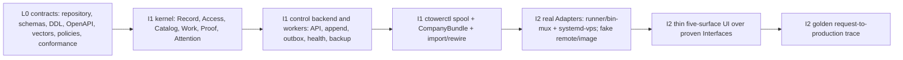

The order is normative: contracts/schema/kernel -> control-plane backend and workers -> CLI -> real
runner/effect Adapters -> thin five-surface UI -> golden trace. Increment 1 may ship the minimal Home/Needs
You and five-route shell required to cut over safely, but broad Ticket/Fleet/Analytics behavior does not
precede the Runtime/Effects Interfaces it renders. Increment 1 makes ctower trustworthy enough to become the
writable ticket source. Increment 2 proves one complete Workflow/release outcome. A second Workflow,
production remote provider, image factory, or general extension runtime waits until the golden retro and a
second real Adapter justify a Seam.

### Increment 1 — trust-spine wedge

#### I1 outcome

The operator can durably capture and inspect live tickets, criteria, evidence, protected gates, custody, and Needs You from the authenticated private ctower service; agents use a spool-backed `ctl`; health cannot look calm when incomplete; accepted state is backed up/restorable; and one reviewed freeze/import/rewire barrier makes ctower the only writable source of ticket truth.

#### I1 included scope

1. L0 greenfield repository ownership/DAG, Repository Policy Module, coding standards, strict Python/TypeScript configs, pre-commit/security/generated-drift gates, typed telemetry contract/collector fixture, `just check`/`just verify`, Python runtime compatibility evidence, universal `VersionedComponent`/CompanyBundle, event envelope, canonical hash vectors, closed authority/FK DDL, OpenAPI/RFC 9457, Workflow/Execution Policy, compositional runner, remote environment/image/placement, Extension Host denial, task-management recommendation, authorization, and conformance fixtures. Remote/general-extension runtime remains `not exercised`.
2. Accepted exact Python runtime after the L0 compatibility/decision gate, with FastAPI/Pydantic v2/psycopg3/plain-SQL service; TypeScript web; Postgres; separate checksum-locked migrator and least-privilege service role; and the one-use local/private first-tenant bootstrap ceremony with permanent disable receipt.
3. Principals, tickets, ticket events, lifecycle episode 1, exactly-one eligible gapless custody intervals, protected Commander transfer, separate executor/reviewer assignments, criteria/freeze, digest-addressed objects, evidence metadata, human gate request/verdict, server-validated resolution/close, command idempotency, per-ticket CAS/sequence/hash chain.
4. Transactional outbox plus `NOTIFY` hint, recipient router, pure SQL ticket/Needs You projections, command/event cursor queries, and explicit completeness health.
5. `ctowerctl` (`ctl` executable) capture/query/comment/assign/criteria/evidence/gate/resolve and CompanyBundle validate/plan/apply/export operations with checksummed ordered offline spool, 30-day maximum replay horizon, per-record acknowledgment, and visible poison/expired quarantine.
6. Home Needs You inside Control Tower with server-side API proxy, locked five-route navigation frame, positive healthy empty state, and loud `STATE UNKNOWN`.
7. Private authenticated VPS deployment units, TLS/private access, Postgres/object backup, external chain anchor, health/watchdog, daily synthetic lifecycle, monthly restore drill, and real reboot proof.
8. One freeze/dedupe/open-only import/alias map/same-barrier rewire for Mission Control and Paperclip sources. No dual write and no tailer.

Increment 1 has no general workflow engine, no stage-attempt runner dispatch, and no production effect capability. Its protected gate/resolution commands establish record trust only; external effects remain outside scope until Increment 2 brokers them.

Passing extension, remote Target, placement, or image contract tests does not imply those general runtimes
exist. Increment 1 exposes no arbitrary extension activation, third-party migration/code/UI, remote provider
credential, custom-image setup terminal, warm pool, or image-admin runtime.

#### I1 exit evidence

- All [Language and repository quality](#language-and-repository-quality), [Product](#product), [Durability](#durability), [Evidence](#evidence), [Security](#security), [UX and navigation](#ux-and-navigation), [Migration](#migration), and [Operations](#operations) criteria applicable to Increment 1 pass; workflow/release/runner criteria are explicitly marked not exercised in the evidence manifest rather than implied.
- Negative authorization matrix proves crews/importer cannot forge actor, criteria freeze, gate verdict, resolution, or tenant scope.
- Daily synthetic ticket completes create -> criteria -> freeze -> gate request -> operator verdict -> evidence -> resolve -> close for five consecutive scheduled runs.
- Chaos suite proves idempotency-before-CAS, prune-then-late and multi-aggregate exact replay, 100 concurrent append ordering, general-outbox recovery after lost `NOTIFY`, spool crash/replay/expiry/poison behavior, object corruption rejection, and service restart.
- Home usability/health evidence proves under-ten-second healthy morning glance and no false All clear under each injected degradation.
- One isolated restore and one real VPS reboot meet the recorded targets.
- Import comparison and alias map account for every selected open logical request; post-cutover mutation monitor shows zero legacy writes.

#### I1 designated validation commands

These commands are part of the L0 contract and must exist before the corresponding implementation item can close:

```bash
just check
just verify
uv run pytest tests/contracts/runtime/test_python_compatibility.py -q
uv run pytest tests/acceptance/increment-1 -q
uv run pytest tests/contracts -q
uv run python -m ctower_contracts verify --all
ctowerctl synthetic run --scenario trust-spine --wait --assert resolved,closed
ctowerctl ops restore-drill verify --latest
ctowerctl migration verify --freeze-manifest state/ctower-cutover/freeze-manifest.json
```

#### I1 rollback

- Before the cutover rewire, stop the incomplete service and unfreeze legacy tools; no ctower write is authoritative yet.
- After the rewire, never resume dual writing. Roll back service/config to the last compatible build, restore Postgres/objects when required, and let `ctl` spool new commands until health returns. If integrity is uncertain, enter explicit read-only emergency mode and open an incident.
- A failed import before rewire is discarded and rerun idempotently from the same freeze manifest. A discovered import omission after rewire is corrected through an authenticated import-correction command with provenance; it is not fixed in JSONL/Paperclip.

### Increment 2 — exactly one end-to-end software-factory golden path on `bin/mux`

#### I2 outcome

One permanent ticket moves through every default software-factory stage on the local `bin/mux` runner, survives a forced runner loss, passes independent review/QA, produces versioned docs and criterion-bound evidence, merges, deploys through effect-brokered staging and production, passes live verification, records a retro, resolves, and closes without operator status chasing.

#### The one golden ticket

`CT-I2-010` is the golden ticket and has the concrete outcome: **add an authenticated read-only `GET /v1/meta/build` endpoint and matching `ctl meta build` command that report service version, source digest, database schema version, runner-protocol version, deployed environment, and current release ID.**

This is a real, independently valuable operational feature with API/CLI parity, tests, documentation, staging/prod verification, and no UI taste or new architecture/security-boundary decision. It receives the **standard** policy floor: the strongest-healthy Commander records an initial two-round/two-repair `orchestration_plan`, mandatory independent Review, API/CLI QA, documentation verification, release preflight, staging QA, production smoke/live QA, and retro; it may raise rigor through 5 only if evidence warrants it. The deploy effects are brokered. Exactly one forced `bin/mux` runner-loss/recovery event occurs during implementation and must resume from a durable checkpoint, while Commander accountability survives its own forced reasoning-job failover.

#### I2 included scope

1. One published `engineering.software-factory@1` Workflow `VersionedComponent` plus separately pinned Execution/Gate/Evidence policies containing only the required default graph, stage contracts, typed failure routes, D9 Commander-selected limits with low=1, standard=2, elevated/critical=3 floors and ceiling 5, and fixed risk/overlay hooks. No Factory aggregate/service or visual/general policy editor.
2. Workflow runs, stage definitions/instances/attempts, separate accountable owner/executor/reviewer assignments, criteria/evidence dependency invalidation, immutable gate instances/verdict attempts, and fixed sealed-review support.
3. Minimal keyed document/artifact revisions for think, plan, design applicability, implementation summary, documentation, release manifest, and retro.
4. Versioned Commander capability resolution/orchestration plans plus content-bearing Persona/Skill/Profile materializations and per-attempt `HarnessSpec` + `SupervisorSpec` + `TargetSpec` + `WorkspaceSpec` + `TelemetrySpec`, local `EnvironmentRevision`/`ImageRevision`, and `PlacementDecision` pins sufficient for the golden roles.
5. Durable accepted/leased/running/terminal queue, leases/fencing, cursors, command ACKs, continuous log chunks/gaps, capability-aware `LIVE_INPUT`/`INTERRUPT_AND_RESUME`, checkpoint/reconciler, one real local Target with `bin/mux` tmux Supervisor, and deterministic fake remote/image provider fixtures. No real remote provider or image factory.
6. Thin built-in five-surface UI over proven Interfaces, with full Ticket journey: stage map, structured replay plus optional terminal compatibility, ACK/gap/placement/component facts, comments/steer, five assignment lanes, documents, criteria/evidence, gates, latest accepted/refused readiness evaluation, delivery/incidents, cost, timeline, and retro. Extensions cannot add routes or write views.
7. Deterministic standard risk bundle plus UI/architecture/security overlay hooks; author independence and sealed reveal mechanics needed by the golden path tests. No automatic risk classifier or generic rule editor.
8. Changes, release candidate, named `ctower-staging`/`ctower-production` environments, live `systemd-vps/v1` release-supervisor integration plus deterministic fake, deployment/verification, effect grant/receipt, provider cursor reconciliation across self-restart, incident/rollback path, and rollback verification.
9. Cost/usage capture and explicit allocation for the one ticket; attention, retry, wait, recovery, defect, effect, and retro KPI source events.
10. The golden ticket itself, including live staging and production evidence, forced runner loss, retro, resolution, closure, and a post-run trace audit.

General Extension Host execution, marketplace, arbitrary workers/migrations/UI, production remote Targets,
Crabbox, custom-image capture/admin, warm pools, and broad connectors remain `not exercised`; the golden
trace makes no claim otherwise. Only the real Seams required above have two justified Adapters/conformance.

#### I2 exit evidence

- Every [Workflow](#workflow), [Release](#release), and [Runtime recovery](#runtime-recovery) criterion passes for the fixed path, plus every cross-cutting criterion used by the ticket.
- Ticket detail reconstructs the complete journey without legacy ledgers, task/status files, raw terminal logs, or vendor session state.
- Forced runner death is detected within 60 seconds; replacement fencing rejects the stale result and resumes within five minutes from the checkpoint.
- Review/QA identities differ from the author; input digests match; a deliberate pre-gate artifact edit invalidates proof and blocks progression in a test run.
- Commander capability resolution selects the strongest healthy eligible profile, forced Commander-job loss continues the same accountable principal, and plan selection/amendment/counters survive restart without reset; under-floor, removed-gate, and over-ceiling plans are denied.
- Staging and production deploy each use the named environment/provider records and have grant, supervisor receipt/audit ID, observed digest, and independent environment verification. Fake crash fixtures pass; live evidence proves ctower self-restart receipt recovery. Injected smoke/live-QA failure creates an incident, verified rollback, and triage before the successful production attempt.
- The real production `GET /v1/meta/build` and `ctl meta build` outputs agree on all fields and report the release ID/digest that the ticket delivered.
- Retro records attention, cost, stage wait, retries, runner recovery, gate outcomes, release evidence, and one evidence-backed process-improvement or no-change decision.

#### I2 designated validation commands

```bash
uv run pytest tests/acceptance/increment-2 -q
uv run pytest tests/conformance/runner tests/conformance/effect-provider tests/conformance/remote-provider -q
uv run python -m ctower_contracts workflow validate packs/workflows/engineering.software-factory/v1.yaml
ctowerctl ticket verify CT-I2-010 --require workflow-complete,evidence-current,gates-valid,staging-verified,production-verified,retro,resolved,closed
ctowerctl run recovery-report --ticket CT-I2-010 --require loss-detected-under=60s,resumed-under=5m,orphans=0
ctowerctl release live-verify --ticket CT-I2-010 --endpoint /v1/meta/build
```

#### I2 rollback

- A server feature flag stops new workflow starts and runner offers while preserving all recorded tickets/runs. Active work is drained or cancelled through durable commands; no workflow history is deleted.
- A runner-adapter defect falls back to manual `bin/mux` operation **through ctower job/command records**, not through legacy ticket state. The operator sees degraded automation and explicit recovery ownership.
- A failed staging/production release follows effect-receipt reconciliation and the tested release rollback/incident path. Database/event records are forward-preserved even when application binaries roll back.
- If the fixed workflow contract is defective, publish a corrected version and explicitly migrate or restart the non-production run. The golden production ticket remains pinned to the version that actually executed.

### Explicit do-not-build-yet list

The following wait until both increments pass and the golden-path retro justifies them:

- A second workflow/domain template or general service catalog.
- Visual workflow, risk, gate, or policy editors.
- Automatic LLM risk classification as authority.
- General double-blind review marketplaces beyond the fixed engine mechanics.
- Registered multi-host placement pools, remote VPS runners, Kubernetes, Daytona, Modal, Sprites, or other sandbox catalogs.
- Production Crabbox/provider credentials, custom-image builder/browser terminal, warm pools/caches, and general environment/image Admin runtime; only L0 contracts and fake conformance are in scope.
- Rich structured livestream collaboration, transcript search, or browser IDE replacement.
- Full Fleet administration/editor UX, org-chart navigation, goals/projects top-level pages, or broad Analytics suite.
- General effect brokerage beyond the staging/production integration proven by the golden ticket.
- Broad inbound gateways/connectors, multi-domain routines, and night-watch automation.
- gbrain/knowledge-base automation beyond linking a retro artifact.
- Multi-tenant commercialization, public signup, HA control plane, arbitrary extension workers, executable third-party UI/migrations, plugin SDK/marketplace, advanced chargeback, or generalized legal-retention tooling.

No additional operator decision is required to begin the unconditional L0, Increment 1, or Increment 2
work as specified. CT-L0-008 and the task-management portion of CT-I2-009 remain explicitly conditional on
operator confirmation and must not become product behavior from this document alone. Operator taste remains
an ordinary gate for the Home implementation, and any newly discovered architecture/security boundary
follows the operator-only gate rule; those are execution gates, not missing specification choices.

## Temporary bootstrap backlog

### Contract and import rule

ctower has no ticket API yet. The 27 stable IDs below—9 L0 preconditions, 8 I1 items, and 10 I2
items—are therefore the temporary source of implementation work. They are **not claims that tickets already
exist**. Each item must be captured into the current durable request/crew process while building I1. Once
the ctower ticket API and cutover exist, import these IDs exactly once as external aliases, record each
item's current disposition, and move all live status/comments/assignments/evidence into ctower. After import,
this section retains dependency and increment definitions only; it is never updated as a competing board.
CT-L0-008 records the pending task-management recommendation and does not authorize product implementation
until operator confirmation; its contract fixtures may still prove the proposed axes do not corrupt core
authority.

Each validation command below is designated as part of the item’s deliverable. A missing test/module is a failing item, not a reason to substitute an ad hoc command.

### Contract Level 0 backlog

| Stable ID | Goal | Dependencies | Owning capability/persona | Files/components | Exit evidence | Designated validation command |
|---|---|---|---|---|---|---|
| CT-L0-001 | Freeze the closed DDL/authority/FK inventory for kernel record, component Catalog, tickets/task facts, Workflow/Proof, Runtime/effective manifests, remote environment/image/placement/provider observations, effects, imports, outbox, and projections. | None | Engineer + Engineering Manager + CSO review | `packages/ctower-kernel/migrations/`; `contracts/domain/`; `contracts/execution/` | FK/owner equality, privileges/immutability, future-pointer/reference-safe-GC, projection rebuild | `uv run pytest tests/contracts/repository tests/contracts/execution tests/modules/record -q` |
| CT-L0-002 | Freeze canonical event bytes/hash chain, `Idempotency-Key=client_command_id`, replay tombstones, CAS, and cross-process vectors. | CT-L0-001 | Engineer + Review | `contracts/domain/events/`; `tests/contracts/events/` | Mutation proof, day29/multi-aggregate exact replay and conflict vectors | `uv run pytest tests/contracts/events -q` |
| CT-L0-003 | Freeze canonical OpenAPI/RFC 9457, operation IDs, generated clients, CLI parity registry, and protected-command schemas. | CT-L0-001 | Engineer + Tech-writer | `contracts/http/`; `generated/`; `tests/conformance/http/` | Lint/examples, clean codegen, zero unmapped nonexempt operations | `just codegen-check && uv run pytest tests/conformance/http -q` |
| CT-L0-004 | Freeze generic Workflow/Execution/Gate/Evidence policies, D9 plan/counters/lineages, wake/reasoning-run/lease-heartbeat/scheduler-beat vocabulary, versioned Routine/cron/watchdog contracts, five-component runner protocol, `RemoteExecutionProviderAdapter`, placement/image/no-colocation, ACK/cursor/gap, and fail-closed composition. | CT-L0-001..003 | Engineering Manager + Engineer + CSO | `contracts/workflow/`; `contracts/runner/`; `contracts/execution/`; `contracts/runtime/`; `packs/workflows/`; `packs/policies/`; `packs/routines/` | Floors/ceiling/no-reset; clock/timezone/DST/catch-up/restart/watchdog vectors; component/remote fake vectors; exact-ID, stale epoch, image mismatch and no-colocation negatives | `uv run pytest tests/contracts/workflow tests/contracts/execution tests/contracts/runtime tests/conformance/runner -q` |
| CT-L0-005 | Build one canonical acceptance/chaos fixture corpus and evidence-manifest format for both increments, including provider/capture/image/terminal/host/log/finalize/GC failures. | CT-L0-001..004 | QA + Engineer | `tests/fixtures/`; `tests/chaos/`; `contracts/evidence/` | Deterministic tenant/principal/provider/clock corpus, seeded-secret and fault manifests | `uv run pytest tests/contracts/evidence tests/chaos/contracts -q` |
| CT-L0-006 | Publish all required Persona/Skill/Profile component revisions, migration provenance, fixtures, aliases, and harness materializations; reject unresolved content refs. | CT-L0-003, CT-L0-004 | Engineering Manager + owning personas + Review | `packs/personas/`; `packs/skills/`; `tests/contracts/components/` | Content for office-hours/plan/design/review/ui-qa; source digests; missing-content/alias/conformance denials | `uv run pytest tests/contracts/components/test_materialization.py -q` |
| CT-L0-007 | Establish the docs-first monorepo skeleton, Repository Policy Module, coding standards, strict lint/type/format/security/pre-commit/observability configs, manifest-scoped `just check`/`just verify`, Python compatibility gate, dependency/ownership rules, universal `VersionedComponent` Catalog, CompanyBundle and first-tenant bootstrap schemas/examples, generated-client path, and deployment homes. | None | Engineering Manager + Engineer + CSO | Root manifests/configs; `docs/contributing/CODING_STANDARDS.md`; `tools/checks/`; `tests/repository/`; `contracts/observability/`; `deploy/observability/`; `contracts/components/`; `contracts/company/`; `company/` | AC-ADM/COMP/ARCH/QUAL vectors, exact runtime report, expected-suite manifest, bootstrap authority/replay/disable matrix, bundle round trip/no-secret/no-runtime matrix, Interface/deletion/size/complexity/exception/telemetry/cycle/owner/codegen clean | `just check && just verify` |
| CT-L0-008 | Freeze the pending task-management recommendation: P0/P1/P2, typed blockers/intents, deterministic six-lane Board fold, delivery/stage orthogonality, five assignment lanes, and starvation-bound scheduling. Do not implement product behavior before operator confirmation. | CT-L0-001, CT-L0-003, CT-L0-004, CT-L0-007 | Engineer + Engineering Manager + QA | `contracts/domain/task-management/`; `packs/policies/scheduling/`; `tests/contracts/task-management/` | AC-TM truth tables, no-status-patch, rebuild, fairness/restart and DONE-vs-Done vectors | `uv run pytest tests/contracts/task-management -q` |
| CT-L0-009 | Freeze trusted Extension Host authority, data-only manifests, request/grant, isolation/lifecycle/rollback, contextual five-surface slots, and deletion/two-Adapter registry; no general runtime. | CT-L0-003..007 | CSO + Engineer + Designer/Review | `contracts/extensions/`; `tests/contracts/extensions/`; `packs/ui/contextual-slots-v1.yaml` | AC-EXT authority denial, no-code parse, revoke, five-route, deferred-evidence and Seam registry | `uv run pytest tests/contracts/extensions -q` |

### I1 implementation backlog

| Stable ID | Goal | Dependencies | Owning capability/persona | Files/components | Exit evidence | Designated validation command |
|---|---|---|---|---|---|---|
| CT-I1-001 | Deliver pinned control artifact and composition roots for `ctower-api`/control worker, Postgres migrator/service/projection roles, one-use local/private first-tenant trust-root ceremony, dev compose, and private VPS deploy units. | CT-L0-001, CT-L0-003, CT-L0-007 | Engineer + DevOps + CSO | `apps/ctower-api/`; `packages/ctower-kernel/`; `contracts/http/`; `deploy/`; `images/control/` | Clean atomic bootstrap/permanent disable, checksum/privilege/dependency tests, private TLS health | `uv run pytest tests/acceptance/increment-1/test_bootstrap.py tests/modules/record -q` |
| CT-I1-002 | Implement Access/Record/Work append, dedupe/tombstones-before-CAS, hash/outbox/cursors, ticket/lifecycle/custody/relations, and Catalog pins needed by I1. | CT-I1-001, CT-L0-002, CT-L0-007 | Engineer + independent Review | Kernel `access/`, `record/`, `work/`, `catalog/` | Concurrency, exact replay, authz/hash, outbox gap/rebuild, component pin proofs | `uv run pytest tests/modules/record tests/modules/work tests/modules/catalog -q` |
| CT-I1-003 | Implement Proof basics: criteria/freeze, digest objects/artifacts, evidence, human gates, invalidation, and server resolve/close. | CT-I1-002, CT-L0-005 | Engineer + QA + CSO | Kernel `proof/`; `contracts/evidence/`; object Adapter | No-proof-no-done, protected-event, corrupt-object, dependency invalidation suite | `uv run pytest tests/modules/proof tests/acceptance/increment-1/test_resolution.py -q` |
| CT-I1-004 | Implement `ctowerctl`/`ctl`, generated API client, ordered spool/ACK/quarantine, CompanyBundle validate/plan/apply/export, and API/CLI parity. | CT-L0-003, CT-L0-007, CT-I1-002 | Engineer + QA | `apps/ctowerctl/`; `generated/python/ctower-client/`; `contracts/company/` | Kill/replay/two-writer/disk/poison chaos plus AC-COMP-03 | `uv run pytest tests/acceptance/increment-1/test_ctl.py tests/contracts/company -q` |
| CT-I1-005 | Implement minimal Home omnibox/strict Needs You and locked exactly-five-route shell with trustworthy health/unknown; extension slots remain host-rendered and non-authoritative. | CT-I1-002, CT-I1-003, CT-L0-009 | Designer + UI QA; operator taste gate when material | `apps/ctower-web/src/surfaces/home/`; `routes.ts`; kernel `attention/`, `projections/` | Precision/recall, <=60 s coalesce/removal, route lock, every-control UI QA, <10 s and unknown screenshots | `uv run pytest tests/acceptance/increment-1/test_needs_you.py && pnpm exec playwright test tests/acceptance/increment-1` |
| CT-I1-006 | Implement scheduler/wake/outbox/projection/health loops, Routine occurrence and continuation transactions, lease/ticket/effect watchdog detectors, backups/anchors, synthetic lifecycle, restore and reboot drills. | CT-I1-001..005 | DevOps + Engineer + independent QA | `apps/ctower-api/src/ctower_api/worker.py`; kernel runtime/projections/attention; `deploy/`; `docs/runbooks/` | Duplicate/DST/catch-up/restart recovery; detector fingerprints/watermarks; five synthetic runs; restore/reboot targets and anchors | `uv run pytest tests/acceptance/increment-1/test_operations.py -q` |
| CT-I1-007 | Execute frozen-source export/cluster/alias/import/correction, atomically rewire clients, and detect split brain; import uses generated HTTP client only. | CT-I1-004..006 | Engineer + Commander verification + Review | `tools/migration/mission-control/`; generated client | Reviewed dispositions, two-run diff, correction provenance, zero legacy writes | `uv run pytest tests/acceptance/increment-1/test_cutover.py -q` |
| CT-I1-008 | Archive complete I1 contracts, security, extension-denial/deferred, chaos, UX, restore, migration, and operations evidence; issue go/no-go. | CT-L0-001..009, CT-I1-001..007 | Independent QA + Review + CSO | `tests/acceptance/increment-1/`; evidence objects | Applicable ACs pass/no red gate; remote/general extension runtime explicitly not exercised | `uv run pytest tests/acceptance/increment-1 tests/contracts -q` |

### I2 implementation backlog

| Stable ID | Goal | Dependencies | Owning capability/persona | Files/components | Exit evidence | Designated validation command |
|---|---|---|---|---|---|---|
| CT-I2-001 | Implement generic Workflow Module plus named `engineering.software-factory` Workflow/Execution/Gate/Evidence components, D9 limits/topology, append-only rounds/repairs, stable lineage, typed routes and readiness evaluations. | CT-I1-008, CT-L0-004, CT-L0-006, CT-L0-007 | Engineer + Engineering Manager | Kernel `workflow/`; `packs/workflows/`; `packs/policies/execution/` | AC-COMP-02, graph/lineage/no-reset/round/refusal/single-escalation proofs | `uv run pytest tests/modules/workflow tests/acceptance/increment-2/test_workflow.py -q` |
| CT-I2-002 | Implement keyed documents/artifacts, full evidence/attestations/dependencies/invalidation, gate instances and sealed verdict attempts. | CT-I2-001, CT-I1-003 | Engineer + Review + CSO | Kernel `proof/`; `contracts/evidence/` | Self-review denial, sealed reveal, selective invalidation, quarantine promotion | `uv run pytest tests/modules/proof tests/acceptance/increment-2/test_gates.py -q` |
| CT-I2-003 | Implement strongest-healthy Commander profile resolution and effective manifests pinning all five execution components, local environment/image/placement, secret refs, egress/resources, and provenance. | CT-I2-001, CT-L0-007 | Engineer + CSO | Kernel `catalog/`, `runtime/`; `packs/personas/`; `apps/ctower-runner/compose.py` | Selection/failover, support-only denial, immutable pins, actual image and no-plaintext scans | `uv run pytest tests/modules/catalog tests/modules/runtime/test_profiles.py -q` |
| CT-I2-004 | Implement Runtime jobs/leases/fencing/cursors/ACKs/log chunks/gaps/checkpoints/reconciler, local runner with process/tmux Supervisors and Codex/Claude Harnesses, plus deterministic fake remote/image provider faults. | CT-I2-001, CT-I2-003, CT-L0-009 | Engineer + DevOps + QA | Kernel `runtime/`; `packages/ctower-runner-sdk/`; `apps/ctower-runner/`; root conformance tests | AC-RUN-07..14; forced loss/resume, stale denial, zero orphans; real remote explicitly not exercised | `uv run pytest tests/conformance/runner tests/conformance/remote-provider tests/chaos -q` |
| CT-I2-005 | Implement thin five-surface built-in UI and Ticket journey with manifest/placement/ACK/gap facts, comments/steering, five ownership lanes, proof/delivery timeline, and readiness refusal. | CT-I2-002, CT-I2-004, CT-L0-009 | Designer + UI QA | `apps/ctower-web/src/surfaces/`; generated TS client | Exactly-five routes, every-control trace, replay/gap/steer modes, accepted/refused zero-diff screenshots | `pnpm exec playwright test tests/acceptance/increment-2` |
| CT-I2-006 | Implement risk/overlay and Execution Policy evaluation, mandatory stage gates versus review topology, Commander-selected limits, independence/conflict/diversity, ceiling/waiver, standard/elevated fixtures. | CT-I2-002, CT-I2-003 | Engineering Manager + Engineer + CSO | Kernel `workflow/`, `access/`; policy packs | Floor/ceiling/removal/client-count denials, 3/3 then max4 trace and dispatch counts | `uv run pytest tests/modules/workflow/test_risk_policy.py -q` |
| CT-I2-007 | Implement Effects releases/environments and `systemd-vps/v1` real + fake Adapters, scoped grants/receipts, self-restart journal recovery, and provider reconciliation. | CT-I2-006, CT-I2-004 | DevOps + Engineer + CSO | Kernel `effects/`; `packages/ctower-systemd-vps/`; `deploy/systemd/`; effect conformance | Wrong-target/expired/direct denials, fake crash matrix, real staging/prod digest and self-upgrade recovery | `uv run pytest tests/modules/effects tests/conformance/effect-provider -q` |
| CT-I2-008 | Implement production smoke/live-QA incident -> grant revoke -> safe containment/rollback -> exact verification -> triage-before-repair and retro linkage. | CT-I2-007 | DevOps + CSO + QA | Kernel `effects/`, `attention/`, `workflow/`; runbooks | Injected smoke/live-QA failures, rollback receipt/verification, direct-repair denial | `uv run pytest tests/acceptance/increment-2/test_incident_rollback.py -q` |
| CT-I2-009 | Implement Projections/Analytics for cost allocation, strict Needs You, WIP age, stage/recovery/release/stream/placement KPIs, retro/improvements; implement AC-TM Board/priority/blockers only after operator confirmation. | CT-I2-001..008 | Engineer + Commander/Tech-writer review | Kernel `projections/`, `work/`; `apps/ctower-web/src/surfaces/analytics/` and conditional `board/` | Allocation=1, precision, WIP provenance, KPI watermarks, retro; conditional AC-TM evidence or explicit pending label | `uv run pytest tests/modules/projections tests/acceptance/increment-2/test_metrics.py -q` |
| CT-I2-010 | Execute one golden ticket with Commander continuity, versioned budgets, forced Commander/runner loss, `/v1/meta/build` + `ctowerctl`, independent gates, live systemd staging/prod effects, smoke/live QA, failure/rollback/triage rehearsal, retro/resolve/close and full 53-step audit. | CT-I2-001..009 | Commander accountable to terminal; Engineer author; independent Review/QA/DevOps | Whole `ctower` deployment | All I2 evidence, component/placement pins, failover/receipts, permanent journey; no remote/general-extension runtime claim | `ctowerctl ticket verify CT-I2-010 --require workflow-complete,evidence-current,gates-valid,staging-verified,production-verified,retro,resolved,closed` |

### Bootstrap backlog import completion

The one-time import is complete only when every stable ID above has exactly one ctower ticket alias and an explicit imported state, the frozen source digest is recorded, and a report proves no duplicate ticket was created. From that moment, updates happen in ctower only. This specification may later revise increment definitions through reviewed versions, but it never mirrors current ticket status.
