# ctower — canonical system specification

| Field | Value |
|---|---|
| Status | Canonical target-system truth |
| Version | 1.10 |
| Date | 2026-07-23 |
| Owners | Operator/CEO (product and human gates), Commander (orchestration contract), Engineering Manager (architecture and risk contract) |
| Decision authority | [`DECISIONS.md`](DECISIONS.md) |

**Implementation reality:** The repository now contains a tested, pre-alpha development walking slice for
the API, protected CLI, Record/Work/Proof/Workflow/Catalog responsibilities, deterministic control loops,
and verifier-only recovery evidence. It is not a supported installation or deployment. Mission
Control/Control Tower remains the writable ctower-project source until the later I1.7B/C development
cutover work completes. I1.7A adds contracts and read-only visibility only; no migration stub response is
cutover evidence.

## Executive summary

ctower is the durable trust, task-management, and orchestration layer for teams of human operators and replaceable AI-agent runtimes. It turns an inbound conversation, command, or external event into a permanent, inspectable ticket; moves valuable work through any compatible versioned Workflow; binds completion claims to evidence; controls real external effects at the capability boundary; survives runner, process, and host loss; and asks for human attention only when policy says human judgment is necessary. The software factory is the first packaged Workflow, not a platform-wide process model.

The product contract is intentionally simple for the operator. There are five and only five primary surfaces:

1. **Home** — Commander omnibox, current conversation, and ranked Needs You actions.
2. **Board** — the only cross-ticket work index.
3. **Ticket detail** — the canonical journey, including conversation, workflow, live run, documents, evidence, gates, delivery, custody, and immutable timeline.
4. **Fleet** — agent profiles, runners, workspaces, routines, permissions, budgets, and health.
5. **Analytics** — attention, throughput, quality, recovery, cost, and improvement outcomes.

All other concepts are contextual views, not competing destinations. An inbound discussion may remain a durable conversation without becoming Board work. Once actionable work creates a ticket, that ticket keeps one permanent identity through planning, implementation, verification, release, incident handling, retro, resolution, closure, and any later reopen episode.

The architecture separates concerns that older documents sometimes collapsed:

- **Ticket lifecycle** says whether the promised outcome is open, active, waiting, resolved, closed, or cancelled.
- **Workflow state** says which pinned workflow stage and attempt is active.
- **Execution state** says whether a durable job is accepted, leased, running, or terminal.
- **Gate state** records immutable gate instances and verdict attempts.
- **Delivery state** is derived from linked changes, releases, deployments, environment verifications, and incidents.
- **Attention state** records an exact human action, owner, deadline, and resolution.
- **Custody state** records the one accountable ticket owner separately from stage executors and reviewers.

The Commander is the durable accountable reasoning seat for that journey. Capability policy resolves the
strongest available healthy general-reasoning profile for each fresh Commander job—currently an Opus-class
or Codex xhigh-class profile may qualify, but no vendor/model is permanently privileged. The same Commander
principal retains orchestration ownership across model, process, harness, and context-window replacement
until verified production, retro, and resolve/close. It delegates heavy implementation while recording a
versioned `orchestration_plan`: risk and context facts, the pinned policy choice, `required_perspectives`,
`max_nonpassing_rounds`, `max_repairs_per_lineage`, `max_candidate_generations`, and rationale. Every
consumed count, including `total_executions`, is an append-only server-owned fact; the plan and ReviewPlan
v1 never author, cap, or reset it. The workflow engine enforces the selected finite
policy bounds, evidence, independence, stable cross-digest failure lineage, and fail-closed anti-spin;
concrete values belong to the pinned Workflow/Execution Policy rather than one platform-wide tier table.

The trusted control plane runs on an authenticated private VPS. Python is the sole trusted implementation language for the control plane, runner, CLI, and release helper; TypeScript is used only for the browser UI. FastAPI, strict Pydantic v2 contracts, psycopg3, and plain SQL provide one server-side command model to both web and CLI clients. Standard CPython 3.14.6 is the recommended greenfield pin, subject to the L0 compatibility gate and append-only supersession of D6; 3.13.14 is the explicit fallback, while 3.12 remains the historical locked pin until that gate is accepted. Postgres is the transactional record tier. Every authoritative mutation passes through one authenticated, idempotent append path that serializes per aggregate, checks idempotency before compare-and-swap, extends a hash chain, and writes an outbox row in the same transaction. `NOTIFY` is a latency hint, never the durable queue. Content-addressed object storage holds bytes; Postgres holds immutable digests and provenance; a vault holds secrets while ctower stores only references.

The worker plane is replaceable. I2 wraps local `bin/mux`/tmux behind a durable runner protocol and pins each attempt's harness, supervisor, target, workspace, telemetry, and build digest. Tmux is optional same-host continuity, never ticket identity or proof. Jobs, fenced leases, structured cursors, replay, steer, cancel, and checkpoint are durable; vendor sessions are hints. Remote/image placement remains deferred until real Adapters earn its Seam.

Ctower begins in a brand-new `ctower` monorepo. Mission Control and the inspected Paperclip/Crabbox sources are migration or research provenance only, not runtime dependencies. The trusted control plane is a Python modular monolith: `ctower-api` and its control worker share one kernel artifact; `ctower-runner`, `ctower-web`, and `ctowerctl` are separately deployable clients of authored contracts. One deep Catalog Module applies a universal `VersionedComponent` envelope to workflows, policies, profiles, skills, tools, environments, images, placement, extensions, cadence, and integrations. A secret-free `CompanyBundle` is portable desired-state authoring over the same authenticated command API as the UI, never a file-watched control plane.

Ctower is extension-ready, not extension-led. The trusted kernel alone owns ticket, workflow, policy, proof, Attention, job, effect, and secret truth. I1/I2 allow host-rendered revision-pinned declarative slots and denial contracts only; executable workers, third-party UI, connectors, and a marketplace are deferred until real Adapters earn an Extension Host Seam.

Trust is earned, not inferred. Evidence binds criterion, artifact digest, source revision, command, environment, producer, verifier, and time; changed inputs invalidate dependent proof. Authors cannot approve their own work, and pinned policies may require sealed independent review. Promotion is autonomous only after required gates pass; no runner has standing production authority. The effect broker issues a scoped grant and records the external receipt. Production verification failure becomes incident/rollback/triage, never ordinary retry.

Rollout is intentionally narrow. **Increment 1** dogfoods the trust spine: authenticated durable tickets,
P0/P1/P2 and orthogonal Board/task facts, criteria/evidence/gates, protected spool-backed CLI, off-host-
acknowledged durability, isolated restore, and then one freeze/import/rewire cutover that makes the ctower
project itself use ctower as its only writable work source. A four-stage workflow fixture proves the same
generic engine contract that Increment 2 completes; it is not a temporary special-case engine. I1 provides
its Project Delivery evidence through a read-only CLI text projection with optional deterministic JSON;
browser implementation and evidence begin at I2.4.
**Increment 2** adds the production generic Workflow/Runtime/Commander/release path and executes one real
software-factory ticket end to end on `bin/mux`, including independent gates, effect-brokered staging and
production, live verification, runner-loss recovery, retro, and closure. General-purpose Catalog editors,
a marketplace, remote runner pools, sandbox fleets, visual workflow editors, broad analytics, and
multi-tenant commercialization wait.

The north star is **operator attention minutes per verified resolved ticket**, always paired with throughput, escaped defects, and time-to-detection so silence cannot game the result. ctower succeeds when the operator can trust Home in under ten seconds, ordinary transitions proceed autonomously, every side effect reconciles to authority, and process improvements measurably reduce future attention or defects.

## Table of contents

- [Document contract](#document-contract)
- [User stories](#user-stories)
- [Human information architecture](#human-information-architecture)
- [Domain model](#domain-model)
- [Workflow and verification architecture](#workflow-and-verification-architecture)
- [Technical architecture](#technical-architecture)
- [Security, trust, and operations](#security-trust-and-operations)
- [Paperclip and legacy boundary](#paperclip-and-legacy-boundary)
- [Acceptance criteria](#acceptance-criteria)
- [KPIs](#kpis)
- [Build increments](#build-increments)
- [Temporary bootstrap backlog](#temporary-bootstrap-backlog)

## Document contract

### Canonical status and source precedence

This file is the single current product, UX, domain, architecture, workflow, security, operations, acceptance, KPI, and build-increment specification for ctower. An unfamiliar principal engineer should be able to implement the first two increments from this file plus the append-only rationale ledger.

When sources differ, use this order:

1. A later operator-locked decision in `DECISIONS.md`.
2. This `SPEC.md`, version 1.9 or a later reviewed version, for human-visible semantics and invariants.
3. Reviewed executable artifacts referenced by this spec for exact mechanics: migrations, OpenAPI,
   schemas, packs, fixtures, and conformance tests. They may refine representation but may not contradict
   a requirement, acceptance criterion, or invariant.
4. `ARCHITECTURE.md` as a compact derived explanation of this specification; it never defines behavior or wins a conflict.
5. Historical architecture, design, engineering-plan, review, kickoff, vision, and research documents for provenance only.
6. Legacy implementation behavior, only where this specification explicitly adopts it as an Increment 1 or Increment 2 adapter.

No historical document is an alternate implementation spec. If executable code and this file disagree before the implementation has passed its acceptance criteria, the discrepancy is a defect or an explicitly reviewed spec change; it is not evidence that the code silently superseded the contract.

### What belongs where

| Home | Content | Mutation rule |
|---|---|---|
| `SPEC.md` | Current product and system truth; stable increment definitions; temporary bootstrap backlog until import | Reviewed revision; contradictions removed rather than accumulated |
| `DECISIONS.md` | Append-only operator decisions and rationale, including superseded reasoning | Append only; prior entries are never rewritten |
| `ARCHITECTURE.md` | One compact, terminal-safe ASCII atlas derived from this specification | Updated with `SPEC.md`; never creates requirements, execution authority, or a second architecture truth |
| Temporary bootstrap backlog in this file | Stable work IDs, dependency order, ownership, exit evidence, and designated validation commands before ctower has a ticket API | One-time imported into ctower; after import, ticket state lives only in ctower and this section retains definitions, not live status |
| Executable contracts and traceability index | Exact DDL, OpenAPI, schemas, packs, policy fixtures, protocol conformance tests, and generated SPEC/AC/INV links | Authored in their one declared home; reviewed against stable IDs; the sole generated index is never hand-edited |
| Historical documents | Provenance, discarded alternatives, research evidence, and review history | Read-only except for the standardized historical banner |

### Reality and evidence labels

- **Current/verified** means observed in the legacy local substrate or demonstrated by acceptance evidence.
- **Increment 1** and **Increment 2** mean committed build scope, not implemented behavior.
- **Target** means required architecture after those increments or a deliberately deferred extension.
- UI, API, runner, backup, release, or security behavior is never described as live until its acceptance evidence exists.

### North star

Durable and trackable completion of work, with feedback and an improvement loop, while minimizing operator attention per verified outcome. Visibility exists to remove status chasing, not to create another dashboard habit.

### Goals

1. Capture every accepted inbound message or event durably before reasoning begins.
2. Keep one permanent ticket identity for each independently valuable outcome.
3. Make the full work journey reconstructable without relying on chat memory, terminal scrollback, a vendor session, or a living process.
4. Execute arbitrary compatible versioned Workflows with typed attempts, deterministic gates, finite policy-declared anti-spin bounds, and explicit escalation; ship the software factory as the first package.
5. Prove completion with criterion-bound evidence and independent verdicts.
6. Enforce authorization at both record transitions and real-world effect boundaries.
7. Survive runner, model, process, network, and host loss through leases, checkpoints, replay, reconciliation, and restore.
8. Provide API/CLI parity and a five-surface human experience over one server-side policy model.
9. Make agent profiles, skills, tools, context, compute, costs, and outcomes versioned and attributable.
10. Measure and improve attention, throughput, quality, recovery, cost, and process effectiveness.
11. Make configuration portable and attributable through one component lifecycle and one authenticated CompanyBundle apply path.
12. Keep execution portable across local and future remote capacity without granting providers, images, or extensions authority over work truth.

### Non-goals and deferred scope

- Replacing GitHub, GitLab, cloud providers, email systems, or observability vendors as their native system of record.
- A generic ITSM suite or multi-domain catalog in the first two increments.
- Multi-tenant SaaS billing, public self-service signup, or enterprise organization-chart navigation.
- A visual workflow/policy editor, automatic risk classifier, general plugin marketplace, or broad sandbox catalog in Increment 2.
- A general extension worker, executable third-party UI, third-party migrations, production Crabbox integration, remote placement pools, warm pools, or custom-image management runtime in the first two increments.
- Treating raw terminal output, `.status.md`, Paperclip activity, JSONL, or vendor sessions as authoritative state.
- Giving agents standing production, IAM, payment, publish, send, or destructive credentials.
- Creating child tickets for routine stage handoffs; child tickets exist only for independently valuable outcomes.

### Product principles

1. **One durable join point:** the ticket is the operator-facing work record; related aggregates stay distinct underneath.
2. **No proof, no done:** resolution is a server command that validates criteria, evidence, gates, and required delivery facts.
3. **One history, two steering speeds:** asynchronous comments and direct live steering both become ordered ticket/run inputs.
4. **Unknown is loud:** loss of transport, projection completeness, runner health, or reconciliation health must not render as calm.
5. **Execution is composition:** every attempt pins independently replaceable Harness, Supervisor, Target, Workspace, and Telemetry components; unknown or incompatible components fail closed.
6. **Durability before continuity:** a fresh runner must reconstruct work without a vendor session; session resume is optional acceleration.
7. **Default autonomous, policy-gated:** routine recovery and transitions require no human; taste, new architecture/security boundaries, destructive/irreversible choices, business decisions, and incidents do.
8. **Effects are brokered:** a gate that does not constrain the real side effect is theater.
9. **Fewer complete paths:** one fully verified golden path is more valuable than a broad incomplete platform.
10. **No split brain:** one writable source of truth after cutover; adapters and projections never dual write.
11. **Placement before provision:** hard constraints, candidate exclusions, target/environment/image revisions, and fencing are committed before any provider mutation; mutable active pointers affect future attempts only.
12. **Extension requests are not grants:** extensions propose scoped inputs or effects through the kernel Interface and never acquire canonical mutation, standing-secret, or primary-navigation authority.

### Scope boundary

ctower owns durable inbound threads, tickets and relations, workflow execution, durable jobs, agent/run provenance, artifacts and evidence, gate policy, attention, delivery truth, effect grants/receipts, incidents, routines, costs, retros, projections, API/CLI/UI, and authorization. External SCM, cloud, messaging, IAM, payment, and observability systems remain authoritative for the effects they perform; ctower links and reconciles their audit IDs.

## User stories

Each story names observable user value and links to pass/fail acceptance criteria. “I can see” means the value is available from the API and the appropriate human surface, not inferred from a terminal.

| ID | Actor | Testable story and observable value | Acceptance criteria |
|---|---|---|---|
| US-OP-01 | Operator/CEO | I submit a message in Home and immediately receive a durable thread event ID; actionable input produces or links one permanent ticket while discussion remains off the Board. | [AC-PROD-01](#ac-prod-01), [AC-DUR-01](#ac-dur-01), [AC-UX-01](#ac-ux-01) |
| US-OP-02 | Operator/CEO | I open Home and identify every genuine current policy-qualified decision or incident requiring me in under ten seconds, without informational, Commander-owned, or service-recovery noise, while degraded completeness is visibly `STATE UNKNOWN`. | [AC-UX-02](#ac-ux-02), [AC-UX-03](#ac-ux-03), [AC-UX-08](#ac-ux-08), [AC-OPS-03](#ac-ops-03) |
| US-OP-03 | Operator/CEO | I watch the active run, see ordered structured progress and optional terminal output, steer by comment or direct input with one durable transcript, and see the last accepted or refused readiness/transition evaluation explaining why work did or did not move. | [AC-PROD-03](#ac-prod-03), [AC-RUN-03](#ac-run-03), [AC-UX-05](#ac-ux-05), [AC-UX-07](#ac-ux-07) |
| US-OP-04 | Operator/CEO | I interrupt or reassign work and see exactly who retained ticket accountability, who executed each attempt, and why custody changed. | [AC-PROD-04](#ac-prod-04), [AC-WF-05](#ac-wf-05), [AC-RUN-04](#ac-run-04) |
| US-OP-05 | Operator/CEO | I approve, revise, reject, defer, or explicitly waive a policy-declared human gate from Needs You and the workflow resumes idempotently from that protected decision without fabricating evidence. | [AC-WF-07](#ac-wf-07), [AC-WF-16](#ac-wf-16), [AC-EVD-04](#ac-evd-04), [AC-UX-04](#ac-ux-04) |
| US-OP-06 | Operator/CEO | I can distinguish merged, staging verified, production verified, rolled back, and incident states without relying on wording such as “shipped.” | [AC-REL-01](#ac-rel-01), [AC-REL-04](#ac-rel-04), [AC-UX-06](#ac-ux-06) |
| US-OP-07 | Operator/CEO | I use a familiar Board without losing process truth: priority, queue lane, arbitrary workflow stage/activity, blockers, accountable custody, active assignment, and typed delivery milestone remain separate and explainable. | [AC-TM-01](#ac-tm-01), [AC-TM-02](#ac-tm-02), [AC-TM-05](#ac-tm-05) |
| US-OP-08 | Operator/CEO | Before a harness dispatches a catastrophic or ambiguous command, I see the normalized target and policy reason, can authorize only that exact command and target once for a short time, and can audit the result without exposing secret command content. | [AC-RUN-15](#ac-run-15), [AC-SEC-03](#ac-sec-03), [AC-UX-10](#ac-ux-10) |
| US-OP-09 | Operator/CEO | Every actionable ticket traverses the declared stage groups of its own pinned Workflow — for engineering work that is the one `engineering.software-factory` delivery sprint — and I see each group's `filled / required` evidence coverage; a group that cannot complete names the exact missing slot, perspective, or gate instead of advancing or being quietly dropped. | [AC-WF-25](#ac-wf-25), [AC-WF-26](#ac-wf-26), [AC-WF-27](#ac-wf-27), [AC-EVD-08](#ac-evd-08) |
| US-PD-01 | Operator/CEO | I open a project and see whether its declared increments or milestones are actually being delivered, using compact checkpoint rows derived from current exit-criterion proof rather than manually entered status or ticket-count percentages. | [AC-PD-01](#ac-pd-01), [AC-PD-02](#ac-pd-02), [AC-PD-04](#ac-pd-04) |
| US-PD-02 | Accountable project owner | I drill into a checkpoint and see its owner, stage and Kanban facts, linked work and outcomes, passed and missing gates, blockers/dependencies, evidence, decisions, estimates versus actuals, and projection freshness; when proof changes, the row changes without erasing the underlying lifecycle history. | [AC-PD-02](#ac-pd-02), [AC-PD-03](#ac-pd-03), [AC-PD-05](#ac-pd-05) |
| US-PD-03 | Operator and cross-domain owner | I use the same Project Delivery projection for software, accounting, compliance, hiring, and other configured Workflows; restore/rebuild reproduces the same rows, while stale or incomplete source truth is visibly unknown instead of guessed. | [AC-PD-04](#ac-pd-04), [AC-PD-05](#ac-pd-05), [AC-PD-06](#ac-pd-06) |
| US-CMD-01 | Commander | Every accepted command is deduplicated, durably classified, and routed to a pinned workflow before I dispatch work, so process death cannot drop intent. | [AC-DUR-01](#ac-dur-01), [AC-WF-01](#ac-wf-01), [AC-RUN-01](#ac-run-01) |
| US-CMD-02 | Commander | I plan and decompose an outcome using relations; I create child tickets only for independently valuable work and preserve blocker and provenance graphs. | [AC-PROD-02](#ac-prod-02), [AC-WF-02](#ac-wf-02) |
| US-CMD-03 | Commander | I resolve the strongest healthy permitted reasoning profile, select and explain a pinned Workflow and versioned `orchestration_plan`, and choose a policy-permitted perspective/anti-spin plan while the server enforces its declared bounds. | [AC-WF-03](#ac-wf-03), [AC-WF-11](#ac-wf-11), [AC-WF-12](#ac-wf-12), [AC-WF-19](#ac-wf-19), [AC-WF-21](#ac-wf-21), [AC-WF-22](#ac-wf-22), [AC-WF-24](#ac-wf-24), [AC-SEC-03](#ac-sec-03), [AC-RUN-02](#ac-run-02) |
| US-CMD-04 | Commander | After my process/model/session dies or an executor changes, a fenced replacement reconstructs context from durable state and continues my accountable orchestration ownership through verified production and retro/close without duplicate dispatch. | [AC-DUR-04](#ac-dur-04), [AC-WF-20](#ac-wf-20), [AC-RUN-05](#ac-run-05), [AC-OPS-04](#ac-ops-04) |
| US-CMD-05 | Commander | I distinguish total review executions, nonpassing rounds, candidate generations, and per-lineage repairs; amend only policy-permitted limits with evidence; and receive one deduplicated escalation at any finite bound instead of spinning across changed digests. | [AC-WF-08](#ac-wf-08), [AC-WF-14](#ac-wf-14), [AC-WF-21](#ac-wf-21), [AC-WF-23](#ac-wf-23), [AC-UX-04](#ac-ux-04) |
| US-AGT-01 | Assignee agent | I claim one stage attempt with a fenced lease, receive a complete versioned stage contract and context manifest, and know the exact entry checklist, exit evidence, timeout, permissions, and validation command. | [AC-WF-04](#ac-wf-04), [AC-WF-13](#ac-wf-13), [AC-RUN-01](#ac-run-01), [AC-RUN-02](#ac-run-02) |
| US-AGT-02 | Assignee agent | I can checkpoint, reconnect, replay ordered commands, and continue after runner or vendor-session loss without pretending the old session is identity. | [AC-DUR-04](#ac-dur-04), [AC-RUN-03](#ac-run-03), [AC-RUN-05](#ac-run-05) |
| US-AGT-03 | Assignee agent | I fill the stage's declared typed evidence slots with re-checkable artifact references, link them to criteria and my attested run, and receive explicit invalidation if dependencies change. | [AC-EVD-01](#ac-evd-01), [AC-EVD-02](#ac-evd-02), [AC-EVD-03](#ac-evd-03), [AC-EVD-07](#ac-evd-07) |
| US-AGT-04 | Assignee agent | I cannot self-approve protected gates or perform a production effect with ordinary runner credentials. | [AC-EVD-04](#ac-evd-04), [AC-SEC-04](#ac-sec-04), [AC-REL-03](#ac-rel-03) |
| US-AGT-05 | Assignee agent | I receive the same stage/job contract on local, VPS, or sandbox capacity and can inspect the exact harness, supervisor, target, workspace, telemetry, environment, image, and placement revisions without changing ticket semantics. | [AC-RUN-07](#ac-run-07), [AC-RUN-10](#ac-run-10), [AC-RUN-11](#ac-run-11) |
| US-ENG-01 | Engineer/maintainer | From a clean clone I get one fast command and one full command that enforce strict types, formatting, lint, Module boundaries, source-size/complexity limits, generated drift, observability, secrets, Interface tests, and Adapter conformance identically in hooks and CI; any exception is exact, visible, independently approved, and expiring. | [AC-QUAL-02](#ac-qual-02), [AC-QUAL-03](#ac-qual-03), [AC-QUAL-04](#ac-qual-04), [AC-QUAL-05](#ac-qual-05), [AC-QUAL-06](#ac-qual-06), [AC-QUAL-07](#ac-qual-07), [AC-QUAL-08](#ac-qual-08) |
| US-REV-01 | Reviewer/QA/CSO/Engineering Manager | I receive an immutable review input digest and cannot be assigned to review my own authored output. | [AC-EVD-04](#ac-evd-04), [AC-WF-06](#ac-wf-06) |
| US-REV-02 | Reviewer/QA/CSO/Engineering Manager | When the pinned policy requires sealed review, I submit a verdict without seeing the other reviewer’s report; conflicts are revealed only after all required verdicts and resolved independently. | [AC-WF-06](#ac-wf-06), [AC-EVD-05](#ac-evd-05) |
| US-REV-03 | Reviewer/QA/CSO/Engineering Manager | I verify code, UI use, tenant isolation, architecture, security, or documentation against declared criteria, fill the declared evidence slot with a reproducible artifact reference rather than a prose assertion, and sign through my attributable assignment. | [AC-EVD-01](#ac-evd-01), [AC-EVD-05](#ac-evd-05), [AC-EVD-07](#ac-evd-07), [AC-WF-07](#ac-wf-07), [AC-WF-17](#ac-wf-17) |
| US-REV-04 | Reviewer/QA/CSO/Engineering Manager | When an artifact digest changes, every verdict that depended on it becomes invalid before the workflow can advance; an implementation repair after review must obtain fresh QA before re-review. | [AC-EVD-03](#ac-evd-03), [AC-WF-09](#ac-wf-09), [AC-WF-15](#ac-wf-15) |
| US-OPS-01 | DevOps/release runner | I perform staging or production promotion only through a short-lived effect grant bound to the release digest, target, policy, and idempotency key. | [AC-REL-02](#ac-rel-02), [AC-REL-03](#ac-rel-03), [AC-REL-08](#ac-rel-08), [AC-SEC-04](#ac-sec-04) |
| US-OPS-02 | DevOps/release runner | I record deployment and environment verification independently, so merge or deploy success cannot imply user-visible correctness. | [AC-REL-01](#ac-rel-01), [AC-REL-04](#ac-rel-04) |
| US-OPS-03 | DevOps/release runner | A failed production smoke or live QA opens an incident, revokes authority, rolls back or contains when safe through the effect broker, and routes triage before any fix attempt. | [AC-WF-18](#ac-wf-18), [AC-REL-05](#ac-rel-05), [AC-REL-06](#ac-rel-06) |
| US-OPS-04 | DevOps/release runner | I can prove backup, restore, reboot reconciliation, and rollback readiness with dated drill evidence. | [AC-DUR-05](#ac-dur-05), [AC-OPS-05](#ac-ops-05), [AC-REL-06](#ac-rel-06) |
| US-OPS-05 | Platform operator/DevOps | I create a revision-pinned routine with cron/timezone or event triggers, see every due occurrence including skipped/coalesced outcomes, and survive scheduler/worker restarts without losing, duplicating, or flooding work; agent wakes remain event-driven by default. | [AC-OPS-13](#ac-ops-13), [AC-OPS-14](#ac-ops-14), [AC-OPS-15](#ac-ops-15) |
| US-ADM-01 | Platform administrator | I create and revise agent profiles, souls, skills, tools, models, budgets, and placement policy without mutating prior run provenance. | [AC-RUN-02](#ac-run-02), [AC-SEC-03](#ac-sec-03), [AC-OPS-07](#ac-ops-07) |
| US-ADM-02 | Platform administrator | I register, rotate, quarantine, and revoke runners and scoped credentials without storing plaintext credentials in ctower records. | [AC-SEC-01](#ac-sec-01), [AC-SEC-02](#ac-sec-02), [AC-RUN-06](#ac-run-06) |
| US-ADM-03 | Platform administrator | I enforce tenant/project scope, capacity, concurrency, cost, storage, and egress quotas server-side and see budget stops as typed workflow events. | [AC-SEC-05](#ac-sec-05), [AC-OPS-06](#ac-ops-06), [AC-OPS-07](#ac-ops-07) |
| US-ADM-04 | Platform administrator | I reconcile external effects, detect bypasses, restore from PITR/object backups, and surface any incomplete state as degraded rather than healthy. | [AC-SEC-06](#ac-sec-06), [AC-OPS-03](#ac-ops-03), [AC-OPS-05](#ac-ops-05) |
| US-ADM-05 | Platform administrator | I upgrade schema, service, workflow, policy, and runner protocol revisions with compatibility checks and a rollback path that preserves accepted events. | [AC-DUR-06](#ac-dur-06), [AC-REL-08](#ac-rel-08), [AC-OPS-08](#ac-ops-08) |
| US-ADM-06 | Platform administrator | I validate, semantically plan, apply, and export a secret-free CompanyBundle through the same command API as the web UI; published resource revisions and exact run pins remain attributable after Git/YAML changes. | [AC-ADM-01](#ac-adm-01), [AC-COMP-01](#ac-comp-01), [AC-COMP-03](#ac-comp-03) |
| US-ADM-07 | Future platform administrator | When reusable-image administration is later introduced, I publish, supersede, revoke, roll back, and garbage-collect environment/image revisions while accepted/running attempts remain pinned to immutable digests. | [AC-RUN-12](#ac-run-12), [AC-SEC-09](#ac-sec-09), [AC-OPS-11](#ac-ops-11) |
| US-ADM-08 | First operator/platform administrator | From a genuinely empty installation, I use one short-lived local/private bootstrap capability exactly once to create the first tenant, my operator/admin identity, the durable Commander principal, and vault-binding references in one audited transaction; replay, remote origin, expiry, or a second bootstrap is refused. | [AC-ADM-02](#ac-adm-02), [AC-SEC-03](#ac-sec-03), [AC-DUR-02](#ac-dur-02) |
| US-SEC-01 | Security reviewer | Before any deferred reusable-image, warm-capacity, setup-terminal, or executable-extension runtime can ship, I can prove that it contains no standing credentials/login sessions and cannot cross tenant, kernel, or provider boundaries. | [AC-EXT-01](#ac-ext-01), [AC-EXT-03](#ac-ext-03), [AC-SEC-09](#ac-sec-09), [AC-SEC-10](#ac-sec-10), [AC-SEC-11](#ac-sec-11) |
| US-LEARN-01 | Operator and Commander | After release or incident, I receive a retro linked to measurable defects, retries, attention, and cost; accepted improvements version future workflows, skills, or policy and are later evaluated. | [AC-WF-10](#ac-wf-10), [AC-PROD-05](#ac-prod-05), [AC-OPS-08](#ac-ops-08) |

## Human information architecture

### Locked five-surface model

| Primary surface | Canonical question | Required content | Explicitly contextual, not a new primary route |
|---|---|---|---|
| **Home** | What do I want, and what genuinely needs me now? | Commander omnibox/thread, current ticket summary, ranked Needs You, health/completeness banner | Approvals, questions, escalations, incident decisions |
| **Board** | Where is every valuable outcome? | Searchable/filterable tickets, lifecycle, workflow stage, owner, risk, attention, delivery summary, relations, contextual Project Delivery projection summaries | Goals, projects, saved views, dependency maps |
| **Ticket detail** | What happened, what is happening, what proves it, and why did or did not it move? | Outcome, workflow map, live run, conversation, documents, criteria, evidence, gates, custody, delivery, costs, timeline, retro, and the last accepted/refused readiness or transition evaluation with its exact unmet checklist | Artifacts, annotations, changes, releases, incidents |
| **Fleet** | Who and what can execute, and is it healthy? | Agent profiles/revisions, runners/nodes, jobs/runs/sessions, workspaces, routines, tools, budgets, capacity, trust | Org chart, provider settings, gateways, secret references |
| **Analytics** | Is the system reducing attention while preserving outcomes? | KPI definitions and trends, stage/cost/quality/recovery analysis, bypass reconciliation, improvement effectiveness | Raw exports, audit queries, cost drill-down |

Global navigation exposes Home, Board, Fleet, and Analytics in that order; Ticket detail is the fifth
primary surface but opens contextually from a ticket or directly by permanent ticket ID rather than as an
empty global destination. Home combines the Commander and Needs You; they are not separate destinations.
Board is the only required cross-ticket index. Mobile may present a condensed layout, but it must preserve
Home decisions and health truth rather than introduce another information architecture.

#### Locked screenshot inventory and contextual placement

The product and UI-QA screenshot inventory contains exactly these five primary surfaces; a test, Adapter,
extension, or configuration cannot add a sixth. Paperclip screenshots are research provenance mapped into
this inventory, not a license to reproduce its page-per-noun navigation.

| Primary screenshot surface | Included concepts from the research inventory | Never a primary destination |
|---|---|---|
| **Home / Needs You** | Commander omnibox/thread, current ticket, exact operator actions, health | Separate Commander dashboard, approvals inbox, generic Activity |
| **Board** | Tasks, Goals, Projects as filters/groups; priority, lane, precise stage, blocker, owner, delivery, contextual Project Delivery projection | Separate Tasks, Goals, Projects, Issues, or dependency-board routes |
| **Ticket detail** | Artifacts, current workspace, runs/transcript, evidence, gates, changes, releases, incidents | Global Artifacts, Workspaces, Timeline, or Approvals routes |
| **Fleet** | Agents, org context, skills, workspaces, routines, Harness/Supervisor/Target/Workspace/Telemetry Adapters, budgets and health | Agent store, Skills Store, Routines, Environments, or Adapters as primary routes |
| **Analytics** | Timeline analysis, Costs, Activity, quality/recovery/attention trends | Writable status, raw event log as ordinary navigation |

Members, invites, identities/access, secret bindings, execution environments, image lifecycle, provider
targets, and extension installation are secondary **Admin** contexts reached from the five surfaces. Admin
does not count as a primary product surface. Extensions may contribute only host-rendered contextual schemas
such as `ticket.context_panel`, `ticket.timeline_annotation`, `ticket.artifact_renderer`,
`fleet.adapter_health`, `analytics.readonly_widget`, or `admin.extension_settings`; they cannot create routes,
write projections, mount inside Needs You, replace Ticket history, or hide `STATE UNKNOWN`.

#### Task-management foundation

Task management is a kernel capability, not a software-factory view. Four axes are independently authored,
queried, and audited:

| Axis | Canonical values or facts | Authority |
|---|---|---|
| Priority | `P0 | P1 | P2` | Append-only Work facts; P0 requires declared urgent evidence or authorization and never changes risk or permission |
| Board lane | `backlog | ready | in_progress | in_review | blocked | complete` | Deterministic rebuildable projection; UI labels may say Backlog, To Do, In Progress, In Review, Blocked, Done |
| Workflow stage | Arbitrary stage keys plus required stage activity metadata | The exact pinned Workflow run; no global engineering-stage enum |
| Delivery | Typed facts such as `change_merged`, `staging_verified`, `production_verified`, `rolled_back`, and `incident_open` | Linked SCM, release, environment-verification, effect-receipt, and incident records; never wording or capitalization |

Actionable ticket creation atomically appends its first priority fact. The default is P2; an authenticated
caller may request P1, while P0 needs policy evidence/authority. Reopen creates a new episode and appends
that episode's initial priority under explicit carry-forward policy. Priority, lifecycle, workflow stage,
Board lane, blocker, delivery, custody, assignment, and runner lease never imply or mutate one another.

Every Workflow stage declares `activity_class: work|verification` (or a future schema-compatible value with
an explicit Board mapping). The generic Board fold is versioned and does not inspect stage names:

1. A resolved or closed episode derives `complete`; cancellation is a separate terminal disposition and is
   excluded from the default six-lane Board.
2. Any effective Board-impacting blocker derives `blocked` while preserving resume stage and underlying lane.
3. An active stage whose pinned metadata says `activity_class=verification` derives `in_review`.
4. Any other active stage derives `in_progress`.
5. Admitted, logically ready work waiting for capacity derives `ready`.
6. Accepted work not yet admitted derives `backlog`.

This works unchanged for a legal-review, hiring, research, incident, or software workflow. Workflow
publication fails if a stage lacks recognized activity metadata or an explicit mapping. Queueing is not a
blocker. A blocker records type/reason, owner, source, affected stage, open time, resolution condition,
next check/SLA, dependency/reference, Board impact, and resolution evidence; all effective blockers clear
before resume, and only operator-action blockers qualify for Needs You.

Board drag/drop and CLI actions emit typed intents—`admit`, `defer`, `block`, `unblock`, or `reopen`—with
expected version and reason. There is no unrestricted status patch. The server either appends the typed
facts or returns an exact no-mutation unmet checklist. Scheduling first enforces capability, trust,
readiness, gates, environment, WIP, quota, and isolation, then applies P0/P1/P2 with bounded aging; priority
cannot bypass a gate or reset fairness.

Board cards show the UI lane label plus canonical enum, priority, stage label/activity, ticket custodian,
current assignee, blocker age/reason, risk, and typed delivery milestone. Ticket detail owns full histories.
A card can be in the complete lane without a production delivery requirement, or remain in progress after
`staging_verified` while a Workflow still requires production verification and retro. No semantic
distinction depends on writing “done” in upper- versus lower-case.

**Risk authority.** Risk is neither priority nor a writable ticket/projection field. The current episode
exposes a Workflow-owned append-only `RiskAssessment` derived by the pinned package policy from typed
immutable basis facts and evidence. The response includes assessment state, package-local label,
policy/rule/input digests, and assessed time. Clients cannot submit the label or patch risk. I1's
trust-spine package emits `standard|elevated|critical`; absent assessment is `UNASSESSED`, and unprovable
source/policy/projection state is `STATE_UNKNOWN`. Priority changes alter none of it.

#### Project Delivery projection

Tickets answer whether individual work moved. The **Project Delivery projection** answers whether a
project is actually being delivered. It is a contextual Board/project view inside the locked five-surface
model, not a sixth primary destination and not another writable project-status system.

```text
Company
  `-- Project
       |-- Increment / Milestone
       |    |-- exit criteria
       |    |-- tickets and workflow runs
       |    |-- evidence and artifacts
       |    `-- release/outcome facts, when applicable
       `-- Project Delivery projection (derived, read-only)
            `-- checkpoint progress rows
```

`Increment` and `Milestone` are configured project vocabulary for the same domain-neutral **checkpoint**
role. A checkpoint declares an outcome, accountable owner, ordering, exit criteria, and explicit links or
selection rules for qualifying tickets, Workflow runs, gates, evidence, artifacts, decisions, costs, and
release/outcome facts. Definitions and criteria change only through authenticated versioned commands under
the existing Catalog, Work, Proof, and authorization contracts. A Project Delivery projection row is
calculated only from accepted durable facts at a source watermark. It has no status mutation command,
generic patch operation, or manual override; deleting it and replaying the same facts must reproduce it.

The following hypothetical rows illustrate the compact view; they are not current implementation status:

```text
Project area                       Status         Outcome
I1.3 -- Disaster-safe durability   In progress    Off-host ACK implementation underway
I1.4 -- Protected CLI              Planned        Waiting on durable acceptance semantics
```

The canonical headline states are `planned`, `in_progress`, `ready_to_land`, `merged`, `verified`,
`released`, `blocked`, and `done`. Derivation first evaluates projection health and proof validity, then
applies this exact precedence:

```text
done > blocked > released > verified > merged > ready_to_land > in_progress > planned
```

| Headline state | Deterministic condition |
|---|---|
| `planned` | The checkpoint exists and has no qualifying active ticket/Workflow and no current valid proof of a later applicable lifecycle state. |
| `in_progress` | At least one qualifying ticket or Workflow is active, and no higher-precedence condition holds. |
| `ready_to_land` | For a checkpoint that declares a software-style landing boundary, implementation is complete and every required current-candidate pre-merge gate has current passing proof. |
| `merged` | The accepted candidate reached the checkpoint's configured main/default integration target. |
| `verified` | The required staging or other non-production deployment and QA proof passed for the current candidate, when the checkpoint declares that lifecycle step. |
| `released` | Required production or externally effective outcome verification passed for the current candidate, when the checkpoint declares that lifecycle step, but at least one other declared exit criterion remains unproven. |
| `blocked` | The checkpoint is not `done`, and at least one unresolved effective blocker prevents the next required exit criterion. The row also retains and exposes the highest underlying applicable lifecycle maturity, such as `merged`, so the blocker does not erase history. |
| `done` | The checkpoint declares at least one exit criterion and every declared criterion has current valid proof. An unresolved fact can coexist in drill-down only if it does not prevent or invalidate an exit criterion; otherwise `done` no longer applies and `blocked` wins over the retained underlying maturity. |

Lifecycle states that a checkpoint does not declare are inapplicable and skipped, not guessed. Accounting,
compliance, hiring, research, or other non-software checkpoints may therefore move directly from
`in_progress` to `done`, or use `blocked`, without merge, staging, or release facts. They still cannot be
`done` without current proof for every configured exit criterion. A proof expiry, revocation, dependency
digest change, rollback, incident, or superseding outcome immediately removes every derived condition that
depended on it and recomputes the row; a row may legitimately regress while its underlying immutable facts
remain available for explanation.

The I1.7 dogfood CLI projection exposes the smallest useful hierarchy and compact checkpoint rows: checkpoint key and
label, headline state, outcome, accountable owner, explicit `proven exit criteria / declared exit criteria`,
source watermark, freshness, authorized source IDs, and derivation reasons. It has deterministic text and
optional JSON forms; it never fabricates a completion percentage from ticket counts. Zero declared criteria
is visibly unconfigured, not 0% and not `done`. I2.4 adds the authorized Board/Ticket drill-through.

During the operator-authorized development phase, an unproven CP3-D criterion is an effective blocker.
The I1.7 row therefore remains `blocked` with degraded confidence and retains its underlying maturity; it
cannot become `done` merely because development cutover or API/CLI dogfood criteria pass.

The I2.4 interactive row detail additionally exposes:

- accountable owner;
- Workflow stage and independent Kanban/Board state;
- tickets, Workflow runs, changes/PRs, and releases or other outcomes as applicable;
- acceptance/exit criteria and current proof coverage;
- passed and missing gates;
- blockers and dependencies;
- evidence and artifacts;
- decision history;
- estimated versus actual cost/time; and
- last verified/reconciled timestamp plus projection confidence/freshness.

Broader visualizations, trends, cost/time analytics, and reusable cross-domain interaction belong to I2.4,
after I1.7 proves the hierarchy, authority links, rebuild, and compact projection for ctower itself.

Update semantics are exact:

```text
authoritative ticket/workflow/gate/outcome event --> reconcile immediately
no relevant change for one hour                 --> publish freshness heartbeat
```

Immediate reconciliation drains the transactional outbox and recomputes affected checkpoint rows from
authoritative facts. The hourly freshness heartbeat re-runs the same fold and may update only projection
watermark, reconciliation time, confidence/freshness, and health; it does not append a lifecycle fact,
advance work, or fabricate a state change. The existing Routine/scheduler contract may materialize the
hourly occurrence, but this freshness heartbeat is neither a reasoning heartbeat nor a lease heartbeat and
has no Workflow, Proof, or project command authority. A row is `stale` when no successful event-driven reconcile or
freshness heartbeat has completed for more than one hour. It is `STATE UNKNOWN`—with the missing source,
watermark, and recovery owner—when source completeness, integrity, linkage, authorization-safe aggregation,
or proof validity cannot be established. Stale/unknown health is an overlay, not a ninth headline state,
and suppresses any calm delivery claim.

Projection reads use the same tenant/project authorization as their source facts. A summary cannot reveal a
restricted ticket, artifact, decision, cost, or outcome through aggregation, and projection access grants no
authority to mutate the hierarchy, criteria, work, proof, or effects. Authorized drill-down retains the
source fact IDs and derivation reasons needed to explain every inclusion, exclusion, precedence choice, and
confidence assessment.

### Omnibox classification and promotion

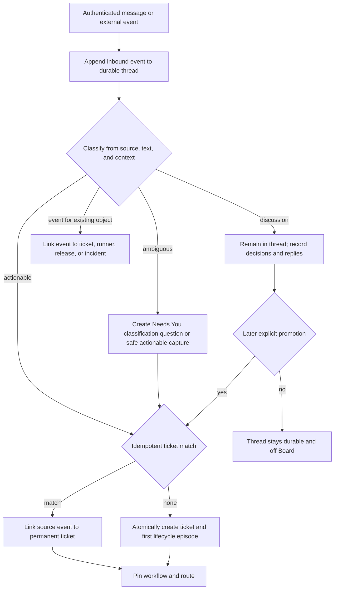

The inbound event is durable before classification. Discussion therefore cannot be lost and does not create Board noise. Promotion stores every source message ID, and ticket creation/linking is atomic with the provenance edge so a retry cannot create two tickets.

**I1 explicit-classification subset.** Because I1 has no autonomous Commander or accepted automatic
classifier, each authenticated API/CLI intake submit defaults to `discussion` and may explicitly select
`create_ticket` or `link_ticket`. The thread event is durable first. Create/link and provenance commit
atomically under one idempotency key; a discussion event may be promoted exactly once later. No inferred
Commander reply, keyword/model/semantic classification, fuzzy ticket match, or client-side thread ledger is
permitted in I1. Browser realization of this subset begins in I2.4; the target classification flow above
remains a later deepening, not fabricated I1 behavior.

### Autonomous software-factory happy path

```mermaid
flowchart LR
    I[Intake] --> T[Think]
    T --> P[Plan]
    P --> D[Design]
    D --> M[Implement]
    M --> L[Local verification and QA]
    L --> R[Risk-derived review]
    R --> X[Documentation]
    X --> F[Release preflight]
    F --> G[Merge]
    G --> S[Staging deploy]
    S --> Q[Staging QA]
    Q --> U[Production deploy]
    U --> V[Production smoke and live QA]
    V --> E[Retro]
    E --> C[Resolve and close]
```

Each arrow is a server-evaluated transition against a pinned workflow revision, not a prompt convention. Routine transitions are autonomous when entry and exit contracts are satisfied. The same permanent ticket links every stage attempt and delivery record.

### Human gate, Needs You, and resume

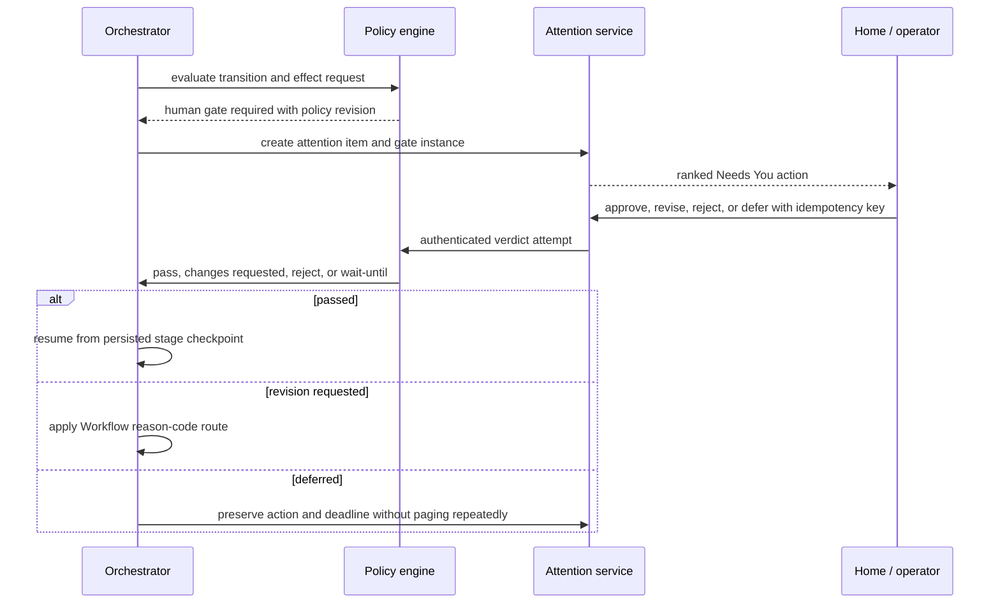

The attention item does not transfer ticket custody. The operator decision is authenticated, version-bound, and replay-safe. Resume uses durable workflow and checkpoint state rather than a surviving chat session.

Needs You is a strict server projection, not a synonym for notifications or open work. A row qualifies only
when its current Attention state is `open`, its effective owner is the operator, the pinned policy classifies
the requested action as human-owned, and the linked gate/incident/decision is still unresolved on the current
digest. Informational notices, Commander-owned plan/budget choices, ordinary service recovery, runner
restarts, projection repair, and actions already resolved/expired/superseded are excluded. An incident appears
only when policy names a current operator decision, not merely because an incident record exists. The
projection coalesces one dedupe key and removes or refreshes a row within the 60-second freshness SLO when
ownership, policy qualification, digest, or resolution changes.

### Live observation, steering, interruption, and reassignment

```mermaid
sequenceDiagram
    participant H as Operator
    participant API as ctower API
    participant J as Durable job
    participant R as Runner
    participant N as New executor
    R->>API: ordered structured events cursor 41..52
    API-->>H: live projection plus optional raw terminal
    H->>API: steer input with ticket, attempt, and client command ID
    API->>J: append durable input command
    J->>R: deliver command at cursor 53
    H->>API: interrupt and reassign with reason
    API->>J: cancel current lease; increment fencing token
    J-->>R: cancel token 8
    API->>N: offer job with token 9 and checkpoint digest
    N->>API: accept, replay after cursor 53, resume
    API-->>H: custody unchanged or explicitly transferred; executor history preserved
```

Structured events and durable commands are authoritative. The raw terminal is a compatibility view. A late result from the interrupted runner carries the old fencing token and is rejected without erasing its forensic log.

### Verification failure, proof invalidation, and bounded repair

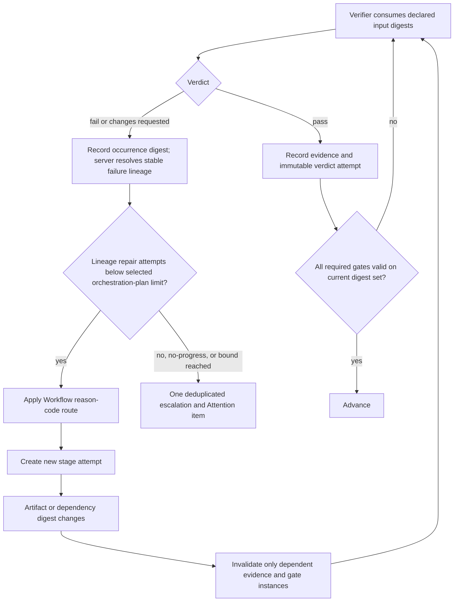

The repair-attempt budget is keyed by a server-controlled stable failure-lineage key, not by the changing
candidate digest and not by a global ticket counter. Each occurrence still records its exact input digest.
The server deterministically keeps the same lineage for the same stage, failure class, normalized subject,
verifier rule revision, and environment class across `d1 -> d2 -> d3`; only a policy-declared split rule or
an independent lineage adjudicator may create a child lineage linked to its predecessor. Verifier prose or
a new digest cannot mint capacity. Two genuinely unrelated lineages do not consume one another’s budget.
The Commander selects limits permitted by the pinned Execution Policy, while append-only server events own
consumption; reassignment, prose, or a new reasoning session cannot reset it. A repair never
overwrites old attempts; it creates new artifacts and invalidates the exact downstream proof graph that
depended on changed digests.

### Staging and production promotion, incident, and rollback

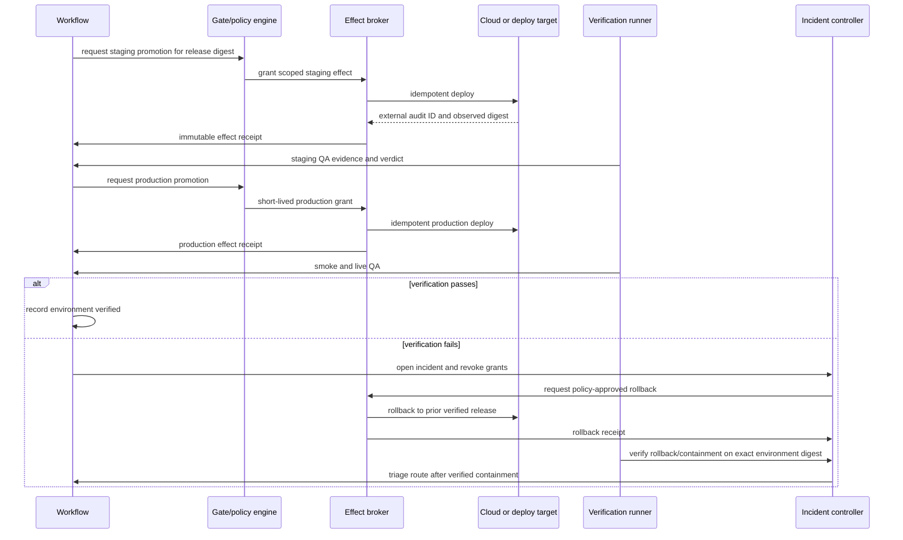

Merge, deployment, and verification are distinct facts. A production failure enters incident containment
first. Safe automatic rollback is a compensating effect; unsafe or ambiguous rollback becomes a Needs You
decision. Fix-forward work begins only after accepted typed triage selects the Workflow-declared
reason-code route.

### Runner loss, lease expiry, reconciliation, and resume

```mermaid
stateDiagram-v2
    state "accepted" as JAccepted
    state "leased" as JLeased
    state "running" as JRunning
    state "terminal" as JTerminal
    [*] --> JAccepted
    JAccepted --> JLeased: runner accepts offer; token increments
    JLeased --> JRunning: run.started with current token
    JRunning --> JRunning: heartbeat, event, checkpoint
    JLeased --> JLeased: heartbeat missed; health projection becomes suspect
    JRunning --> JRunning: heartbeat missed; health projection becomes suspect
    JLeased --> JAccepted: lease_expired event; close lease, token++, requeue
    JRunning --> JAccepted: lease_expired event; close lease, token++, requeue
    JAccepted --> JLeased: replacement runner claims
    JLeased --> JRunning: restore checkpoint and replay commands
    JLeased --> JTerminal: server cancellation or terminal lost by policy
    JRunning --> JTerminal: succeeded, failed, cancelled, or terminal lost
    JTerminal --> [*]
```

Suspect is an observed-health projection, not an authoritative job state. The durable state remains leased or running until expiry. Reconciliation is idempotent, increments the fencing token, and can resume on a different runner without changing ticket identity or silently treating a lost job as success.

### Cross-surface navigation rules

- Every Needs You item links to the exact ticket section, gate, incident, or runner recovery action.
- Board rows show a derived summary only; mutations occur through commands and canonical detail views.
- The Project Delivery projection is a contextual project grouping within Board; its checkpoint rows link to
  authorized source facts and never become a sixth route or a command surface.
- Ticket detail renders one chronological typed timeline while allowing anchored views for workflow, evidence, and delivery.
- Ticket detail shows the latest readiness/transition evaluation: requested edge, accepted/refused result,
  rule and policy revisions, current input digest, every unmet item and owner, evaluation time, linked
  evidence, and before/after aggregate versions. A refusal has equal visibility and proves no state mutation.
- Fleet links a current run back to its ticket and links an agent profile to every immutable revision used by historical runs.
- Analytics links every aggregate metric to query definitions and drill-down records; it cannot become a second source of status.
- Empty Home is positive only when health and completeness checks are green. Otherwise it is `STATE UNKNOWN`, never “All clear.”

## Domain model

### Aggregate boundaries and relationships

An aggregate owns only the invariants that must be transactional together. Cross-aggregate coordination uses authenticated commands, immutable event references, and the transactional outbox; it does not enlarge the ticket into a god object.

| Aggregate or entity | Boundary and owned truth | Key relationships |
|---|---|---|
| **Inbound thread / conversation** | Durable channel-neutral thread, participants, source scope, ordered inbound/outbound command events, classification, and promotion provenance | May link zero or more tickets; source event IDs are immutable aliases |
| **Inbound conversation/command event** | Original payload reference, authenticated or source-verified actor, taint level, idempotency key, classification result, and append position | Belongs to one thread; may promote/link a ticket or attach to another aggregate |
| **Ticket** | Permanent ID, tenant/project scope, promised outcome, lifecycle episode pointer, accountable owner, aggregate version, and ticket-event hash-chain head | Links relations, workflow runs, criteria, attention, changes, costs, and retros; does not own their internal state |
| **Project / delivery checkpoint definition** | Versioned Company -> Project -> Increment/Milestone hierarchy, checkpoint outcome/order, accountable owner, declared exit criteria, explicit qualifying-work links or rules, and the declared delivery surface — its landing boundary, its non-production environments, and its externally effective outcome, each either declared with identity or declared explicitly absent | References tickets, Workflow runs, Proof, decisions, costs, and applicable release/outcome facts; it never owns their lifecycle or verdicts. A delivery-surface field that is neither declared present nor declared absent is `STATE_UNKNOWN`, never an absence a skip predicate may rely on |
| **Project Delivery projection row** | Disposable checkpoint summary, derivation reasons, source watermark, proof coverage, confidence/freshness, and health | Rebuilds from authorized project/checkpoint definitions plus durable Work, Workflow, Proof, gate, cost, and outcome facts; accepts no mutation |
| **Priority fact / blocker** | Append-only P0/P1/P2 changes and durable typed unmet conditions with owner, source, affected stage, resolution contract, next check/SLA, and evidence | Work truth is orthogonal to risk, stage, Board lane, delivery, and Attention; multiple effective blockers coexist |
| **Ticket relation** | Typed edge with source, target, actor, rationale, and validity; `parent_of`, `depends_on`, `blocks`, `duplicates`, `relates_to`, `caused_by` | Parent graph and blocker graph are separately cycle-checked; child tickets require independent value |
| **Lifecycle episode** | One open-to-terminal interval with opening event, outcome, resolution/closure/cancellation facts, and optional next episode | `reopened` closes no history; it starts a new numbered episode on the same ticket |
| **Workflow component revision** | Immutable named stage graph, roles, capabilities, contracts, transitions, retry policy, failure routes, gate policy, and an optional ordered stage-group vocabulary inside the universal component envelope | One workflow run pins one revision/digest; revisions are never edited in place; a declared stage group labels stages and creates no edge, gate, or terminal condition |
| **Execution policy revision** | Participant/capability resolution, activated gates, `required_perspectives`, finite nonpassing-round/repair/candidate-generation/nonprogressing-candidate-mutation bounds, timeouts, placement, budgets, escalation, and waiver constraints | A run pins a compatible revision; values are workflow/domain specific, and policy may narrow/select within a Workflow but cannot invent a stage, edge, or terminal condition |
| **Workflow run** | Application of one workflow version to one lifecycle episode, desired/observed state, and terminal disposition | Owns stage instances; links ticket episode and policy snapshot |
| **Commander orchestration plan / revision** | Immutable per-run revision naming resolved Commander capability/profile, context/risk facts, pinned policy option, required perspectives, selected nonpassing-round/repair/candidate-generation bounds, rationale, evidence, and superseded revision | One active revision per workflow run; proposes only policy-permitted choices. It never accepts consumption; `total_executions` and all other counters are server-owned facts. |
| **Stage definition** | Immutable node within a workflow version, including entry/exit contracts, an ordered nonempty ordinary set of typed required evidence slots, the criterion/evidence contract and signing slot for that set, allowed parallelism, an optional declared stage-group membership, and an optional declared skip predicate with its own alternative skip slot set and signing slot | Copied by reference into stage instances; never derives from ticket status; the two slot sets are alternatives rather than a union; group membership, skip predicate, and both slot sets are authored package data, never agent assertions |
| **Stage instance** | One logical occurrence of a stage in a workflow run, dependency readiness, the resolved required-slot-set digest and which declared set it resolved, required gates, signing Evidence/assignment references, and terminal result | Owns ordered attempts; Proof decides current slot fulfillment, and a success-equivalent disposition requires every slot of the resolved set filled and current; parallel instances only where graph permits |
| **Stage attempt** | One execution/verification attempt, input digest manifest, executor, failure occurrence/lineage references, timeout, output digest manifest, and disposition | Links one or more durable jobs/runs and evidence; does not transfer ticket custody |
| **Failure lineage / occurrence / repair consumption** | Server-owned normalized defect identity plus immutable digest-specific occurrences and append-only repair-consumed events | A lineage remains stable across candidate mutations; deterministic policy or independent adjudication alone may split it. A monotonic projection supplies current consumption and exhaustion. |
| **Assignment / custody interval** | Exclusive accountable ticket owner or exclusive stage-attempt executor over a time interval, including from/to, actor, reason, and source command | Ticket ownership, stage execution, and reviewer assignment are different assignment kinds |
| **Durable job / lease** | Dispatch state, command payload digest, capability requirements, priority, attempt, lease deadline, fencing token, heartbeat, cancellation, and terminal result | Job may create execution runs on runners; a stage attempt may use several sequential jobs |
| **Agent-profile component revision** | Stable profile key plus immutable soul, operating instructions, skills, tool policy, harness/model policy, memory/context rules, budget, and placement constraints inside the universal component envelope | Execution run pins exactly one profile revision/digest and concrete resolved skill/tool revisions |
| **Runner / node** | Registered workload identity, protocol version, capabilities, trust class, capacity, allowed scopes, heartbeat, and quarantine/revocation state | Hosts execution runs and workspaces; never writes record tables directly |
| **Execution run / session** | One bounded adapter execution with runner, job token, profile revision, context manifest, timestamps, usage, outcome, and ordered event cursor; vendor session handle is optional metadata | Run can allocate cost across tickets/stages; session is never identity |
| **Effective run manifest / placement decision** | Immutable per-attempt pins for Harness, Supervisor, Target, Workspace, Telemetry, environment, image, target/allocation/incarnation, resources, egress, isolation, candidate exclusions, and rationale | Component or placement change creates a new attempt; mutable active pointers and provider handles cannot rewrite it |
| **CommandGuard decision / override grant / enforcement receipt** | Immutable pre-dispatch decision over one normalized execution plan, optional authenticated exact-scope one-use operator grant, and local or remote Adapter enforcement observation | Every artifact binds one normalized-execution-plan digest and decision/dispatch-attempt identity plus ticket/job/run, principal, Harness/Supervisor/provider/target identities, policy revision, and evaluation/enforcement time; it authorizes no other plan and proves neither sandbox containment nor Workflow success |
| **Execution environment / image revision** | Immutable desired toolchain, OS/architecture, image digest, network, resources, cache/reuse/scrub, attestation, provenance, lifecycle, and future active pointer | Distinct from staging/production release environments; reusable bytes never contain standing credentials/login sessions |
| **Target / allocation / incarnation** | Stable capacity registration, one fenced job reservation, and one observed host/VM/sandbox generation | Ctower allocation/fencing is authority; provider lease/run/resource IDs are scoped observations only |
| **Workspace / checkpoint** | Workspace provider, source revision, mutable work location, ownership lease, checkpoint manifests, cleanup state, and recovery preconditions | A checkpoint is content-addressed and linked to a run/stage attempt; cleanup cannot destroy sole uncommitted evidence |
| **Artifact / document / revision** | Artifact identity, kind, trust disposition, content digest, metadata, keyed document revisions, locks, annotations, and retention | Referenced as input or output; approved revisions are immutable and later edits create new revisions |
| **Acceptance criterion** | Stable criterion ID, exact pass condition, evidence contract, optional stage-slot membership, active/superseded state, author, and frozen version | Belongs to ticket episode or stage; one stage criterion may back one or more differently typed required slots; resolution evaluates all active criteria |
| **Evidence / attestation** | Verifier claim binding criterion and, when applicable, stage/slot key and evidence kind; artifact/input digest set; command; source revision; environment; producer run; verifier principal; verifier assignment interval; trust; timestamp; expiry; and signature/attestation | Evidence can fill a matching slot, satisfy criteria, or feed gates; `verifier_principal` remains signer authority and dependency edges drive invalidation |
| **Gate instance / verdict attempt** | Immutable required gate bound to policy revision and input digest set; ordered authenticated verdict attempts with rationale and evidence | New digest creates a new or invalidated instance; prior verdict is never overwritten |
| **Attention item** | Exact human action, policy qualification, reason code, owner, recommendation, alternatives, consequence/default, deadline, dedupe key, and resolution | Needs You includes only current open operator-owned policy-qualified decisions/incidents; informational, Commander-owned, and service-recovery items remain outside that projection. |
| **Transition/readiness evaluation** | Immutable requested edge, accepted/refused result, rule/policy revisions, current input digest, every unmet item and owner, evaluated time, linked evidence, and before/after versions | Ticket detail exposes the latest evaluation. A refusal records no state mutation and retains the exact command result. |
| **Change** | Source-control or configuration change identity, repository/component, commit/diff digest, merge request, authors, and merge fact | Many changes may serve one ticket; one change may serve multiple tickets through explicit allocation |
| **Release** | Immutable release candidate digest and included changes/artifacts, source revision, rollback predecessor, and promotion policy snapshot | Owns deployment attempts by environment; tickets derive delivery summaries from linked releases |
| **Deployment attempt** | One requested effect to one environment with grant, receipt, observed artifact digest, timestamps, and outcome | Never implies environment verification; rollback is another deployment attempt with a compensating relation |
| **Environment verification** | Smoke/live/QA result for exact environment and deployed digest with URL/probe/user-flow evidence | May pass, fail, or expire; production failure links an incident |
| **Effect grant / receipt** | Short-lived authorization and immutable result for deploy, send, publish, payment, IAM, or destructive action at the actual boundary | Grant binds ticket/stage/policy/digest/target/idempotency; receipt binds external audit ID |
| **Incident** | Detection, severity, affected environment/effect, containment, rollback, communications, root cause, and resolution | Production verification failures create or link incidents before repair routing |
| **Routine / trigger** | Versioned scheduled, webhook, event, or manual trigger; catch-up, concurrency, scope, and idempotency policy | Creates inbound events or durable jobs through ordinary command paths |
| **Extension revision / grant / future invocation** | Content-addressed data-only manifest, requested capabilities, separately approved scoped grant, lifecycle/active pointer, contextual contributions, and tombstone; invocation identity/health are reserved future facts | Any future Extension Host invokes through kernel commands/jobs only; no kernel-table, standing-secret, primary-route, or direct effect authority |
| **Cost allocation** | Usage/currency/source record and explicit fractional allocation to ticket, workflow, stage, run, and project | Allocation fractions sum to 1 per cost record; shared sessions never double count |
| **Retro / process improvement** | Evidence-backed comparison of expected and actual outcome; defect/retry/attention/cost findings; proposed workflow/skill/policy change; owner and effectiveness window | Accepted improvement creates a linked ticket/change and a new immutable configuration revision |

### Wake, reasoning-heartbeat, routine, cron, and watchdog contract

Ctower does not use `heartbeat` as one overloaded implementation noun. Five distinct facts have separate
owners, states, events, and health signals:

| Term | Normative meaning | Authority boundary |
|---|---|---|
| **Trigger** | Versioned reason work may become due: assignment, event, mention, gate resolution, schedule, webhook, manual command, retry, or reconciliation | Proposes an occurrence or wake; never invokes a model directly |
| **Wake intent** | Idempotent committed request to create or coalesce a bounded job with exact cause, scope, and revision pins | Durable before dispatch; receipt by a worker is a later fact |
| **Reasoning heartbeat** | Operator-facing name for one bounded execution run that claims a wake job, records progress/checkpoints, and terminates | The authoritative entity is `execution_run`; it is not agent identity or memory |
| **Lease heartbeat** | Runner liveness/progress frame that may renew only the current fenced job lease | Cannot instruct reasoning, advance Workflow, approve proof, or imply success |
| **Scheduler beat** | Deterministic due-trigger scan that materializes Routine occurrences | Does not create one operating-system cron process per agent or Routine |

The event and schema vocabulary uses `wake_intent`, `job`, `execution_run`, `lease.heartbeat`, and
`scheduler.scan`. A UI may label an execution run “heartbeat,” but may not collapse these states.

#### Event-driven default and Routine revisions

New profiles have periodic reasoning wakes disabled. Assignment, comment/mention, gate resolution,
steering, retry, and reconciliation append event-driven wake intents. Recurring business work is a
versioned **Routine** with one or more schedule, signed-webhook, event, or manual triggers. Polling is
allowed only when a source has no push interface and must be an explicit named Routine with an owner,
cost, staleness target, and disable switch.

A Routine revision immutably pins its instruction template and typed variables; tenant/project/goal and
optional parent ticket; default stage/capability; trigger definitions; IANA timezone and daylight-saving
policy; concurrency, catch-up, idempotency, backlog, timeout, cost, and escalation policies; and referenced
Profile, Skill, Workflow, Execution Policy, environment, and secret references. Every occurrence pins the
exact Routine and component revisions. Editing, pausing, disabling, or rolling back affects future
occurrences only. Pausing a schedule, pausing an agent, draining a runner, and stopping a project are
different commands with different server-enforced effects.

#### Durable scheduling and cron semantics

The logical scheduler runs inside the control worker. A service manager timer may kick a stalled or idle
worker, but is never Routine truth. For each due trigger revision, one database transaction:

1. inserts a unique occurrence keyed by `(trigger_revision_id, scheduled_for)`;
2. evaluates catch-up, concurrency, pause, quota, and idempotency policy;
3. appends a visible `queued`, `coalesced`, `skipped`, or refused outcome;
4. creates the ordinary inbound event, ticket command, or wake job when required;
5. writes the outbox record; and
6. advances `next_fire_at` under compare-and-swap.

Commit precedes dispatch. Duplicate scans, restarts, and outbox replay therefore converge on one logical
occurrence. Database time selects due work. Each schedule occurrence stores the UTC instant plus original
local civil time, timezone, and offset decision. The default DST policy is `wall_clock_once`: a nonexistent
civil time is visibly skipped; a repeated ambiguous time fires once at the earlier offset. Fixed elapsed
polling uses a UTC interval trigger.

The concurrency policy is exactly one of `coalesce_if_active`, `skip_if_active`,
`serialize_one_pending`, or `always_enqueue_bounded`. The catch-up policy is exactly one of
`skip_missed`, `coalesce_latest`, or `enqueue_missed_with_cap`. Defaults are `coalesce_if_active` and
`skip_missed`; the latter records the missed window. Every due occurrence remains inspectable even when no
job is created, and downtime cannot cause a silent unbounded flood.

#### Wake claim and reasoning-run protocol

A wake intent and outbox row commit atomically after dedupe/coalescing, current-state, policy, budget,
cooldown, and capability checks. The dispatcher creates or reveals an accepted job. A runner claims it
under a lease and monotonically increasing fencing token. The execution run then:

1. pins Profile, Persona, Skill, Workflow, policy, harness/model, environment, image, workspace, context
   manifest, and wake-cause revisions;
2. re-fetches ticket, job, cancellation, and authorization state before mutation;
3. reads the specific cause before a compact eligible inbox and claims work before acting;
4. emits ordered structured progress, log cursors, costs, and content-addressed checkpoints;
5. submits outputs, comments, evidence declarations, and requested transitions only through authenticated,
   idempotent commands;
6. records one explicit terminal, waiting, or blocked result and reconciles touched external effects; and
7. releases the current lease, after which a stale token has no state-changing or effect authority.

Process exit, terminal scrollback, tmux existence, and vendor session status prove neither success nor
failure. Session resume is an optional acceleration; committed state and pinned context reconstruct a fresh
run. A revision-pinned `HEARTBEAT.md` may define concise role procedure, but is never scheduler, Workflow,
gate, assignment, counter, or completion authority.

Resolving a human gate or structured question commits its result and optional continuation wake in the same
transaction. The wake identifies the exact interaction revision, result digest, intended
assignee/capability, and idempotency key. Direct steering is an ordered durable command with
`queued -> delivered -> acknowledged|rejected|expired|superseded`; writing text into a terminal is not
delivery proof. Cancellation immediately fences new state-changing commands and protected effects rather
than waiting for a later reasoning or lease heartbeat.

#### Deterministic watchdogs and health

Four independent detectors own separate watermarks:

| Detector | Reads | May do automatically |
|---|---|---|
| Scheduler completeness | due occurrences, scan watermark, clock skew, outbox lag | claim/replay due work; mark completeness degraded on gaps |
| Runner liveness | current fenced lease, heartbeat, cursor, checkpoint, incarnation | mark suspect, expire, fence, and requeue/resume |
| Ticket progress | stage age, blocker SLA, stopped subtree, stable no-progress lineage | re-evaluate or create one scoped watchdog-review job |
| Control/effect reconciliation | projections, receipts, provider inventory, backups, synthetics | replay, quarantine, open incident, or alert the accountable owner |

A watchdog agent reviews a **detected fingerprinted condition**; it is not the liveness clock. One unchanged
desired/observed-state fingerprint creates at most one review, so a quiet failure cannot generate endless
comments or model wakes. Changed evidence produces a new fingerprint. Custom watchdog instructions may
narrow review but cannot expand scope, mutate protected truth, bypass a gate, or leave the ticket subtree.
Unknown or stale scheduler, outbox, projection, lease, receipt, backup, or synthetic watermarks make health
and Fleet visibly degraded/`STATE UNKNOWN`, never calm.

### Universal VersionedComponent Catalog and company desired state

Every publishable configuration object uses one `VersionedComponent` envelope and one Catalog Interface.
Category payloads remain strict and deep; the common envelope prevents each category from reinventing
identity, lifecycle, compatibility, provenance, pinning, and revocation.

```yaml
schema: ctower.versioned-component/v1
kind: workflow
key: engineering.software-factory
scope: {tenant: example-company, project: null}
revision: 1
content_digest: sha256:<canonical-payload-digest>
schema_ref: ctower.workflow/v1
lifecycle: published              # draft | published | deprecated | revoked
compatibility:
  ctower: ">=1.0.0,<2.0.0"
  requires: []
provenance:
  - {kind: migration_source, source: paperclip-company/software-factory-process, digest: sha256:<source>}
supersedes: null
payload_ref: object:sha256:<canonical-payload-digest>
```

The server supplies component ID, tenant/scope validation, actor, timestamps, signature/approval facts,
schema version, and append metadata. Published payloads are immutable. Deprecation/revocation and
supersession append facts; an optional compare-and-swap active pointer affects future resolution only.
Every run/config evaluation pins `(kind, key, revision, content_digest)` and fails closed on ambiguity,
incompatibility, revocation, or digest mismatch. A mid-run policy/plan change is a new append-only revision
and cannot rewrite consumed work, evidence, verdicts, or already-resolved placement.

| Component kind | Payload authority class | What it may own; what it may not own |
|---|---|---|
| Company Bundle | Declarative authoring/export container | Desired references and assignments only; not runtime truth, a job, or a second Catalog |
| Project | Declarative scoped configuration | Repository/outcome/config references; not ticket lifecycle |
| Workflow and Stage | Executable kernel interpretation | Declared graph, legal transitions/failure routes, gate locations, terminal conditions; Stage is a payload child/revision reference, not a second engine |
| Execution Policy | Executable kernel interpretation | Participant/capability selection, optional gates, domain-specific perspectives and finite anti-spin bounds, timeouts, placement, budgets, escalation/waiver constraints; cannot invent Workflow nodes or edges |
| Gate/Evidence Policy | Executable kernel interpretation | Evidence contracts, verifier independence, invalidation, gate topology; never a verdict |
| Agent Profile, Persona | Declarative content resolved by Runtime | Soul/instructions/model/harness/tool/placement rules; never durable principal or assignment truth |
| Skill | Declarative content/materialization | Immutable instructions, schemas, fixtures, provenance; prose cannot advance Workflow state |
| Tool/Capability | Declarative request/compatibility contract | Named operation and constraints; a request is never a grant |
| Environment and Image | Declarative desired execution contract plus observed attestation refs | Future placement requirements and immutable digests; never provider/ticket authority or mutable `latest` identity |
| Placement Policy | Executable kernel interpretation | Hard constraints, no-colocation and ordered preferences; never provider-side scheduling authority |
| Extension | Declarative manifest/lifecycle | Requested capabilities and contextual contributions; executable invocation only through isolated Extension Host grants |
| Sprint/Cadence policy | Declarative scheduling policy | Admission/cadence bounds and goals; never ticket status or timer-only transition authority |
| Notification/Integration | Adapter configuration | Source/delivery/effect schema and scoped target refs; never Attention, effect, or receipt truth |
| Harness, Supervisor, Target, Workspace, Telemetry, Effect Provider | Adapter contract revisions | Replaceable implementation identity/capabilities at a real Seam; kernel retains job/effect truth |

Stable operational subject rows such as projects, routines, targets, and installations store only durable
identity, relationships, current command state, and observations. They reference their matching component
definition/revision and never repeat the authored payload or revision lifecycle. Conversely, a component
revision cannot contain a live ticket, lease, verdict, receipt, counter, health observation, or provider
handle. Category conformance tests compare these ownership allowlists so “configuration” cannot become a
shadow record tier.

The Catalog Module exposes a small Interface:

```text
stage | publish | resolve | supersede | deprecate | revoke(VersionedComponent)
    -> CatalogDecision
```

Removing it would spread lifecycle, digests, compatibility, provenance, active-pointer, and exact-pin logic
across Workflow, Runtime, Effects, skills, images, and Admin. It therefore passes the deletion test and earns
depth, leverage, and locality. Category validators remain private behind that Interface; there are no
parallel Factory, skill, extension, runner-component, or image catalogs.

#### Factory is one named Workflow package

`engineering.software-factory` is a named Workflow category/package evaluated by the generic Workflow
Module, not a `Factory` aggregate, table, service, Interface, or second state machine. It references a
separately pinned Execution Policy plus Gate/Evidence policies and content revisions. Workflow owns the
stage graph, legal edges/failure routes, gate locations, and terminal contract. Execution Policy owns who
may execute, activated optional gates, review/repair maxima, timeouts, budgets, model/harness/environment
placement, escalation, and waiver constraints; it can only select or narrow behavior declared by Workflow.
Another package may use completely different stages, perspective keys, participants, and bounds while the
same engine preserves independence, stable lineages, immutable consumption, fail-closed advancement, and
authenticated waiver semantics.

The current `paperclip-company/skills/company/JAK/software-factory-process/SKILL.md` is migration
provenance and human guidance. Its durable rules become machine-checkable payloads/checklists: every ticket
serves a goal; one ticket is one end-to-end outcome; work class selects the appropriate route; acceptance
criteria are frozen and evidence-bound; artifacts exist before approval; routine handoffs are stages;
autonomous gates proceed without operator status chasing; taste/business/architecture/new-security-boundary/
destructive forks remain operator gates. Its fixed `<=2` round prose and ambiguous “done only after prod”
wording are deliberately not imported: the package's versioned Execution Policy, server-owned
lineage/generation/round facts, and typed `change_merged`/`staging_verified`/`production_verified` delivery
facts govern. A generated SKILL may explain a pinned Workflow, but prose is never Workflow authority.

#### First-tenant trust-root ceremony

An empty installation has one deliberately narrower trust-root ceremony before any tenant-scoped
CompanyBundle command can exist. The root-owned installer creates one **instance bootstrap capability** as
a random token whose digest, allowed local/private origin, absolute expiry of at most 15 minutes, and unused
state are stored in Postgres; the plaintext is delivered once through a root-readable local channel and is
accepted only from the root-owned Unix socket or configured private-admin origin. The operator passes it by
stdin to `ctowerctl bootstrap first-tenant`, never by argv, URL, environment, task file, or log.

`POST /v1/bootstrap/first-tenant` requires `Idempotency-Key`, locks the singleton capability, proves the
instance has zero tenants, and in one serializable transaction creates the tenant, a disabled historical
`bootstrap_installer` principal `B0`, the initial human operator/platform-admin principal, the durable
Commander principal, and vault-binding references; writes the canonical command result/events/outbox and
an immutable receipt digest attributed to B0; marks the capability consumed; and disables B0. Exact replay
of the same token/key/hash returns the original receipt without re-execution. Different-body replay, wrong
origin, expiry, revoked capability, a consumed capability under any other key/body, or any existing tenant
returns a typed refusal with zero mutation. After success the bootstrap route is permanently closed to new
commands for that instance. Later tenants, members, principals, Commander transfers, and component revisions
use ordinary authenticated Admin/Catalog commands. The bootstrap creates no profile, skill, workflow,
credential value, session, ticket, verdict, or runtime fact.

#### CompanyBundle validate, plan, apply, and export

A `CompanyBundle` is a portable set of small YAML resources referencing stable component keys/revisions for
company identity, goals, projects, workflows, execution/gate/evidence policies, profiles, personas, skills,
tools/capabilities, environments/images, placement, extensions, cadence, notifications, and integrations.
It follows one path:

```text
validate schemas
    -> semantic plan/diff
    -> security + compatibility + conformance checks
    -> stage immutable VersionedComponent revisions
    -> atomically activate the CompanyBundle pointer
```

`ctowerctl company bundle validate|plan|apply|export` and the secondary Admin UI invoke the same generated
OpenAPI command operations. Validate/plan are read-only; apply is authenticated, authorized, idempotent, and
append-only; export is normalized and deterministic. Export -> validate -> plan must produce zero semantic
diff. YAML/Git are never watched for runtime changes and are not required for liveness. Ctower stores the
activated bundle/component revisions and digests. Bundles reject ticket/run/job/lease/cursor/receipt/
watermark/health/counter/verdict state, secret values, login sessions, runtime handles, mutable provider
references, and `latest`; secret-binding names or vault-reference classes are allowed, while authenticated
runtime commands create the actual bindings.

### Relationship map


The ticket is the human join point, not the transaction boundary for the entire graph. A ticket-detail query composes these linked records into one journey; mutation and concurrency remain local to each aggregate.

### Orthogonal state models

| Dimension | Authoritative states/facts | Meaning |
|---|---|---|
| Ticket lifecycle | `open`, `active`, `waiting`, `resolved`, `closed`, `cancelled` | Outcome state for the current lifecycle episode. `resolved` means criteria/gates/delivery contract passed; `closed` means administratively complete; `cancelled` means intentionally stopped without the promised outcome. |
| Priority | `P0`, `P1`, `P2` facts | Recommended operator/business ordering; never risk, stage, or permission. Every change is append-only and P0 is evidence/authority restricted. |
| Board lane | `backlog`, `ready`, `in_progress`, `in_review`, `blocked`, `complete` projection | Deterministic projection over admission/readiness, pinned stage activity metadata, blockers, and terminal lifecycle; never a writable generic status. UI labels may use familiar title case. |
| Blockers | Typed `opened`, `rechecked`, `resolved`, `expired`, `superseded` facts | Explicit unmet conditions; queueing is not blocking and multiple effective blockers may coexist. |
| Reopen | `reopened` event | Starts episode N+1 on the same permanent ticket, records reason and prior episode, and never rewrites prior resolution evidence. It is not a stable status. |
| Workflow run | `pending`, `running`, `waiting`, `succeeded`, `failed`, `cancelled` | Overall execution of a pinned workflow version for one episode. |
| Stage instance | `blocked`, `ready`, `active`, `waiting_gate`, `succeeded`, `failed`, `skipped`, `cancelled` | Process position; independent of ticket lifecycle. `succeeded` and evidence-backed `skipped` are success-equivalent and require every slot of the resolved required slot set current at transition time. The requested disposition resolves the set: `succeeded` resolves the stage's ordinary set, and evidence-backed `skipped` resolves its declared skip set **in place of** the ordinary set and is admissible only while the pinned skip predicate holds on accepted durable facts. Failed/cancelled history never projects as a pass. |
| Stage attempt | `created`, `executing`, `verifying`, `passed`, `failed`, `timed_out`, `cancelled`, `superseded` | Immutable attempt history and failure routing. |
| Durable job | `accepted`, `leased`, `running`, `terminal` plus terminal outcome `succeeded|failed|cancelled|lost` | Dispatch and runner protocol. Health projections such as suspect do not rewrite the job state. |
| Gate instance | `required`, `collecting`, `verdict_recorded`, `invalidated`, `superseded` | Requirement and validity for one policy/input snapshot. Verdict attempts are `pass|fail|changes_requested|error|abstain`. |
| Delivery | Immutable merge facts, release candidates, deployment attempts, environment verifications, rollbacks, and incidents | No single mutable delivery enum is authoritative. UI summaries are derived. |
| Project Delivery projection | `planned`, `in_progress`, `ready_to_land`, `merged`, `verified`, `released`, `blocked`, `done` plus separate fresh/stale/unknown health | Read-only checkpoint fold using the exact precedence and proof rules above. Inapplicable lifecycle steps are skipped; manual status and ticket-count completion are never authority. |
| Attention | `open`, `snoozed`, `resolved`, `expired`, `cancelled` | Exact human action record; expiration re-evaluates policy rather than silently clearing it. |
| Custody and assignment | Half-open intervals `[assigned_at, released_at)` | `ticket_custodian`, `current_assignee`, `stage_owner`, `reviewer_assignment`, and `runner_lease_owner` are distinct; routine owner changes do not create handoff tickets. |

### Non-negotiable invariants

1. **INV-01 — One append path.** Every authoritative mutation enters through the server’s authenticated command/append module; clients and runners never write record tables directly.
2. **INV-02 — Authenticated actor.** Actor, tenant, principal type, and scopes come from verified credentials or source authentication, never from payload text.
3. **INV-03 — Idempotency before CAS.** The append transaction checks `(principal_id, client_command_id)` and request hash before aggregate-version comparison, so an exact retry returns its original result even after the version advances.
4. **INV-04 — Serialized sequence.** Each aggregate stream has a server-assigned monotonic sequence and version updated under row lock or equivalent serializable claim.
5. **INV-05 — Hash chain.** Each event commits `prev_hash` and canonical `hash`; independently stored anchors make unauthorized history rewriting detectable.
6. **INV-06 — Permanent ticket identity.** Ticket IDs never mutate when type, department, owner, workflow, or lifecycle episode changes.
7. **INV-07 — Durable ingress first.** Reasoning begins only after the inbound event is committed or visibly quarantined; accepted input is never held only in model context.
8. **INV-08 — Discussion is not Board work.** A discussion thread remains durable without a ticket; promotion atomically records source event provenance.
9. **INV-09 — Continuous accountable custody.** Every actionable lifecycle episode that is not `closed` or `cancelled` has exactly one current `ticket_custodian` interval with no gap or overlap. It is normally a durable Commander principal; an operator may take custody only through an explicit protected suspension/transfer. A stage executor, collaborator, reviewer, runner, model session, or provider handle is never an eligible custodian. Transfer atomically closes and opens intervals, fences the old Commander reasoning lease, records context/checkpoint handoff, and starts no new work until the new custodian can rehydrate it. `resolved` retains custody through administrative close; only close/cancellation ends the interval.
10. **INV-10 — Child value.** A child ticket represents an independently valuable outcome; routine persona or stage handoffs remain within one workflow run.
11. **INV-11 — Reopen is an event.** Reopening starts a new lifecycle episode; prior closure, proof, and delivery facts stay immutable.
12. **INV-12 — Workflow pinning.** A workflow run pins an immutable workflow version and policy snapshot; later definitions do not silently alter in-flight work.
13. **INV-13 — Declared parallelism.** Stage instances execute in parallel only when the pinned graph explicitly permits it and their dependency sets are satisfied.
14. **INV-14 — Exclusive attempt lease.** One stage attempt has at most one current executor lease/fencing token; stale-token results cannot transition state.
15. **INV-15 — Session is never identity.** Vendor session IDs, process IDs, tmux names, and terminal panes are optional execution metadata; durable job/run/ticket IDs are identity.
16. **INV-16 — No proof, no done.** A ticket cannot resolve unless every active frozen criterion has current evidence, every required gate has a valid passing verdict, and the workflow’s delivery contract is satisfied.
17. **INV-17 — Frozen criteria.** Implementation cannot weaken or delete active criteria; an authorized revision creates a new criterion version and invalidates affected proof.
18. **INV-18 — Criterion-bound evidence.** Evidence binds a criterion, exact digest set, source revision, command, environment, producer, verifier, and time; a blob’s existence alone is not evidence truth.
19. **INV-19 — Author cannot review self.** No principal or effective agent identity that authored an input artifact may issue a satisfying independent verdict for it.
20. **INV-20 — Digest-based invalidation.** A dependency digest change invalidates every downstream evidence item and gate instance that declared that dependency before advancement can continue.
21. **INV-21 — Immutable gate history.** Gate verdicts are attempts on immutable instances; rework creates invalidation/new instances, never overwrites a prior verdict.
22. **INV-22 — Sealed review.** In sealed double-blind review, reviewers cannot read one another’s assignment, work product, or verdict until all required sealed verdicts are committed.
23. **INV-23 — Bounded by stable failure lineage.** Repair budgets apply to a server-controlled typed failure lineage that survives candidate-digest changes. Verifier prose or a new digest cannot split/reset it; exhaustion creates one deduplicated escalation and blocks automatic repeat.
24. **INV-24 — Production failure is an incident.** Failed production smoke/live QA creates or links an incident, revokes unused effect authority, and performs rollback/containment assessment before repair routing.
25. **INV-25 — No standing production authority.** General runners and agent profiles never hold reusable production, IAM, payment, publish, send, or destructive credentials.
26. **INV-26 — Effect at boundary.** A protected external effect requires a valid short-lived grant and produces an immutable receipt at the actual integration boundary; a ticket transition alone grants no authority.
27. **INV-27 — External reconciliation.** An externally observed protected effect without a matching valid receipt becomes a security/operations incident.
28. **INV-28 — Unknown health never calm.** Missing heartbeats, outbox lag, projection gaps, stale reconciliation, or failed synthetic checks render degraded or `STATE UNKNOWN`, never “All clear.”
29. **INV-29 — Ordered replay.** Runner commands and events have monotonic cursors; reconnect resumes from acknowledged cursors and safely deduplicates replay.
30. **INV-30 — Checkpoint before cleanup.** A workspace containing the sole copy of uncommitted work cannot be archived/destroyed without a durable checkpoint, artifact upload, or explicit destructive authorization.
31. **INV-31 — Tainted ingress.** External content is structurally marked data, scanned/quarantined as needed, and cannot become privileged instructions through string interpolation.
32. **INV-32 — No plaintext credentials.** Records, event payloads, logs, artifacts, and runner commands contain vault references or short-lived opaque handles, never long-lived plaintext secrets.
33. **INV-33 — Explicit cost allocation.** Each shared usage/cost record is fractionally allocated exactly once; ticket totals cannot double count a run spanning multiple tickets.
34. **INV-34 — Projections are disposable.** Board, Home, Fleet, Analytics, search, and activity views are rebuildable and never accepted as authoritative write targets.
35. **INV-35 — No dual write after cutover.** Mission Control JSONL, Paperclip, status files, and ctower cannot all accept ticket mutations; after the barrier every mutation goes through ctower.
36. **INV-36 — Acceptance includes disaster durability.** A command is authoritative/accepted only after its record transaction and required off-host durable acknowledgement satisfy the active durability policy. At source-of-truth cutover that policy is RPO 0 for record truth. Before off-host acknowledgement the API returns an explicit `durability_pending` non-accepted result that is safe to replay; an offline client record is acknowledged later or visibly quarantined, never silently dropped.
37. **INV-37 — Tenant/project scope.** Every scoped aggregate and object carries tenant identity; project scope is explicit where applicable; cross-scope access is server-authorized and audited.
38. **INV-38 — Retention separates bytes from audit.** Sensitive bytes can expire or be crypto-erased while non-sensitive digest/provenance/tombstone metadata remains auditable according to policy.
39. **INV-39 — Delivery is not inferred.** Merge, staging deployment, staging QA, production deployment, production verification, rollback, and incident are separate facts.
40. **INV-40 — Retro closes the loop.** A released feature or incident produces a retro; a process defect yields either a linked improvement with an evaluation window or an evidence-backed no-change decision.
41. **INV-41 — Strongest-capability Commander.** Each Commander reasoning job resolves the strongest available healthy general-reasoning profile permitted by the versioned capability policy and records candidates, exclusions, selection, and failover; token price cannot outrank capability for this seat.
42. **INV-42 — Commander accountable until terminal.** One durable Commander principal owns orchestration from accepted intent through verified production and retro/resolve/close or explicit cancellation; changing the model, harness, process, executor, or context window never silently transfers or ends that accountability.
43. **INV-43 — Versioned rigor plan; server-owned consumption.** The active `orchestration_plan` records the pinned policy option, `required_perspectives`, finite `max_nonpassing_rounds`, `max_repairs_per_lineage`, `max_candidate_generations`, independence, evidence, and rationale. Append-only execution, nonpassing-round, repair, and generation facts exclusively own consumed counts; a client, policy, ReviewPlan v1, or plan cannot author, cap, or reset them, and `total_executions` remains an observed audit/cost fact only.
44. **INV-44 — Configurable but finite anti-spin.** Every executable policy declares finite automatic bounds appropriate to its Workflow/domain. Advancement fails closed when a required perspective is missing/nonpassing or any applicable bound/no-progress rule is exhausted, producing one deduplicated escalation. No platform-wide low/standard/elevated/critical number exists; authenticated operator action may change only policy-declared waivable bounds and never fabricates proof, resets consumption, or waives independence/hard safety invariants.
45. **INV-45 — Universal component pinning.** Every published configuration category uses the same immutable `VersionedComponent` envelope; runtime pins exact revision/digest and no category invents a parallel lifecycle or active-pointer authority.
46. **INV-46 — Workflow/policy separation.** Workflow alone declares stages, legal edges, failure routes, gate locations, and terminal conditions. Execution Policy may select, constrain, budget, or activate declared options but cannot create a missing node or edge.
47. **INV-47 — CompanyBundle is transport.** YAML/Git validate, plan, apply, and export through authenticated commands; they contain no secrets/runtime state and are never watched or needed for liveness.
48. **INV-48 — Effective execution composition.** An attempt's Harness, Supervisor, Target, Workspace, Telemetry, environment, image, and placement pins are immutable. Unknown/unavailable/incompatible/digest-mismatched Adapters fail closed; no fallback-to-generic-process exists.
49. **INV-49 — Scoped supervisor handles.** PID, tmux name, socket, provider run, and harness session are scoped to runner incarnation, target incarnation, attempt, and fencing epoch. Name/process existence proves neither health nor success.
50. **INV-50 — Persist before broadcast.** Structured events, command state/ACKs, terminal results, and raw-log chunk metadata are durable before WebSocket notification. Reconnect replays after a durable cursor; a missing range creates a visible `log_gap` fact.
51. **INV-51 — Requested capability is not authority.** An Extension or component request is distinct from an effective scoped/expiring grant. Manifest parsing executes no code, and invocation identity cannot address kernel tables or canonical transitions.
52. **INV-52 — Five surfaces remain closed.** No extension, Adapter, provider, or Admin feature may create a sixth primary route, write canonical projections, replace Ticket history, or hide degraded health.
53. **INV-53 — Placement is resolved before provision.** Hard constraints, no-colocation, candidate exclusions, target/adapter/environment/image revisions, rationale, allocation, and fencing commit before provider mutation; soft cost/latency preference never relaxes a hard rule.
54. **INV-54 — Active pointers are future-only.** Moving a component/environment/image active pointer never mutates an accepted/running attempt, checkpoint, proof, or historical run. A material change creates a new attempt and invalidates declared dependent evidence.
55. **INV-55 — No secret-bearing reusable state.** Images, caches, warm entries, checkpoints, logs, and setup sessions cannot retain long-lived credentials, CLI/browser login state, private keys, tokens, or PII. Secrets are projected just in time after boot and revoked/scrubbed at end.
56. **INV-56 — Provider observations are not transitions.** Remote providers and Crabbox return scoped observations/receipts only. Ctower validates/appends them; provider success, disappearance, cleanup, or image capture cannot advance Workflow, satisfy evidence, or promote an image.
57. **INV-57 — Board/task axes remain orthogonal.** Priority, Board lane, blocker, arbitrary workflow stage/activity, lifecycle, typed delivery, custody, assignment, and runner lease remain independently attributable; Board controls emit typed intents rather than status patches, and lane semantics never depend on delivery wording or capitalization.
58. **INV-58 — Guard before harness dispatch.** Every registered local or remote Harness or Supervisor Adapter that can launch, invoke, or submit a harness command obtains and enforces a current versioned CommandGuard decision for the exact normalized execution plan at its final trusted pre-dispatch boundary. `block` and `needs_operator` dispatch nothing; changed plans or targets, unresolved protected targets, expired/replayed grants, missing required local or remote enforcement receipts, and direct guard bypass fail closed.
59. **INV-59 — Project Delivery projection is derived.** Every Project Delivery projection row is rebuilt only from versioned hierarchy/exit-criterion definitions and accepted durable Work, Workflow, Proof, gate, cost, and outcome facts. The exact precedence is deterministic; manual row status, projection writes, ticket-count percentages, and wording cannot establish delivery or completion.
60. **INV-60 — Project Delivery projection freshness is honest.** Relevant authoritative events reconcile affected rows immediately; one hour without a relevant change publishes a freshness heartbeat that cannot mutate lifecycle state. Missing or overdue reconciliation, unknown authorization-safe coverage, source gaps, or invalid proof renders the row stale or `STATE UNKNOWN`, and restore/replay at one watermark reproduces the same derivation.
61. **INV-61 — Typed stage evidence is complete or unfilled.** Every success-capable stage pins at least one required evidence slot with a stable key, recognized evidence kind, stage-scoped criterion, and immutable evidence contract. A stage that declares a skip predicate pins a second alternative slot set for the skip path; the two sets are alternatives, never a union. The requested disposition resolves exactly one of them: `succeeded` resolves the ordinary set and its signing slot, and evidence-backed `skipped` resolves the skip set and its signing slot in place of the ordinary set. A stage instance cannot reach either disposition while any slot of its resolved set lacks current matching Evidence; missing, invalidated, expired, revoked, mismatched, or `STATE UNKNOWN` evidence is unfilled and never pass-capable. A skip is earned, never assumed: `skipped` is admissible only while the stage's pinned skip predicate holds on accepted durable facts, and a `skipped` request with an unsatisfied, unevaluable, stale, or revoked predicate is refused with the predicate as its unmet item rather than defaulted in either direction. Later invalidation preserves the immutable transition history but removes current completion validity, invalidates declared dependents, blocks advancement/effects/resolution, and routes repair through a new declared attempt rather than rewriting the old success.
62. **INV-62 — Stage sign-off has one attributable seat.** Every success-equivalent stage transition references one satisfying Evidence item and its verifier assignment interval under the signing contract of the stage instance's resolved required slot set; the skip set carries its own declared signing slot, which is the signing contract for an evidence-backed skip. `Evidence.verifier_principal` is the canonical signing principal and must equal the principal of that interval at evidence time; the assignment supplies the seat/crew context, so no duplicate `signing_seat` or copied principal field may drift. Anonymous, unmatched, expired-assignment, or prose-only sign-off is refused.
63. **INV-63 — Declared stage groups are total, derived, and never omittable.** A Workflow revision may declare an ordered stage-group vocabulary. When it does, every stage names exactly one declared group, every declared group owns at least one stage, and every group rollup, projection, or readiness explanation derives only from that declaration; no engine, policy, projection, or test may branch on a stage key or a group key. A group is complete only when every stage it owns reached a success-equivalent disposition on the current digest set. A stage leaves a group only through its declared skip predicate and its filled, signed skip slot set, which is that stage instance's resolved required slot set; omission, silence, absent evidence, or an agent assertion of irrelevance never completes a group.
64. **INV-64 — Bounded no-progress.** Every Execution Policy declares one finite `max_nonprogressing_candidate_mutations`, at least `1` and never more than the number of governed candidate mutations `max_candidate_generations` permits, so the bound is always reachable; publication fails on a policy that declares it absent, zero, or above that ceiling. A candidate reaches its **verification disposition** at the first of these its pinned package records against that candidate's digest: the outcome of a terminal review round, or the failure of a mandatory stage gate that routes the candidate to repair. A candidate's **outstanding set** is the run's open server-owned failure lineages plus the required evidence slots unfilled on that candidate's digest, observed at that disposition. A governed candidate mutation is **progressing** only when the outstanding set of the candidate it produced is a strict subset of the outstanding set of the candidate it replaced; every mutation has such a predecessor, because the initial candidate is a generation and never a mutation, so no mutation is exempt from the test. An identical set, a larger set, and an exchanged set that resolves one lineage while opening another are each non-progressing and increment one append-only server-owned count keyed to the workflow run. The count moves at most once per mutation, in the transaction recording that candidate's verification disposition; a candidate superseded or cancelled before it reaches one moves no count, and repeated or later-invalidated verification of the same candidate neither re-tests nor un-counts it. Only a progressing mutation clears that count, and it clears it completely. Reaching the declared maximum creates exactly one deduplicated escalation and blocks further automatic dispatch even while repair, nonpassing-round, and candidate-generation capacity remain. This bound alone stops the run on *reaching* its maximum rather than on the next request beyond it; that is what a no-progress rule is for. Changed prose, a new candidate digest, reassignment, model or harness replacement, and restart reset nothing; a reopen starts a new lifecycle episode and therefore a new workflow run with its own count under [INV-11](#non-negotiable-invariants), which is an authenticated audited event rather than a reset path an executor can take.

## Workflow and verification architecture

### Versioned Workflow and Execution Policy contract

A Workflow revision is an immutable typed stage graph. A run pins exact Workflow, Execution, Gate/Evidence,
component, and resolved participant digests. An authorized migration must name source/destination revisions,
stage mapping, compatibility proof, invalidations, and rollback; otherwise in-flight work stays pinned.
Stage keys and order are domain-defined. The first package is `engineering.software-factory`; the engine has
no built-in engineering stages or review vocabulary.

Exact schemas live in `contracts/workflow/`; executable packages live in `packs/workflows/` and
`packs/policies/`. At minimum they express:

```yaml
workflow:
  key: engineering.software-factory
  revision: 1
  stages:
    - key: implement
      activity_class: work
      entry: [criteria_frozen, design_contract_satisfied]
      outputs: [candidate_manifest]
      required_evidence_slots:
        - key: candidate
          evidence_kind: artifact-digest
          criterion: implement.candidate-current
          contract: {requires: [artifact_digest, source_revision, producer_run, verifier_principal]}
      signing: {evidence_slot: candidate, assignment_kind: stage_owner}
      failures: {implementation_defect: implement, requirement_defect: plan}
    - key: review
      activity_class: verification
      depends_on: [local_qa]
  transitions:
    - {from: implement, to: local_qa, when: stage_passed}

execution_policy:
  key: software-factory.elevated-ui
  required_perspectives:
    - {key: code-review, capability: independent_review, independent_of: [candidate_authors]}
    - {key: rendered-design, capability: design_review, independent_of: [ui_authors]}
    - {key: security, capability: security_review, independent_of: [candidate_authors]}
  max_nonpassing_rounds: 2
  max_repairs_per_lineage: 2
  max_candidate_generations: 4
  max_nonprogressing_candidate_mutations: 2
```

The five required configurable controls and the separate observed execution count have precise meanings:

- `required_perspectives` is the complete set of independently attributable verdict perspectives required
  on one current candidate digest. A perspective may bind any domain capability; it is not assumed to mean
  code review.
- `max_nonpassing_rounds` caps terminal review rounds whose required perspective set does not all pass.
- `max_repairs_per_lineage` caps mutations for each server-normalized stable failure lineage.
- `max_candidate_generations` caps the initial candidate plus subsequent governed candidate mutations
  across all lineages, preventing lineage fan-out from creating an unbounded global loop.
- `max_nonprogressing_candidate_mutations` is the no-progress rule required by
  [INV-64](#non-negotiable-invariants). It caps consecutive governed candidate mutations that shrink
  nothing, so churn stops before generation capacity runs out. It is at least `1` and at most
  `max_candidate_generations - 1`, which is the number of governed mutations the policy permits;
  publication fails otherwise.
- `total_executions` is an immutable server-owned audit/cost count of every started perspective execution,
  whatever its outcome. It is never a client-authored field or a limit in ReviewPlan v1.

Every executable policy declares finite applicable bounds and a no-progress rule. Concrete values, tier
names, and perspective keys belong to that pinned package or to separately enforced tenant/system resource
quotas. The platform supplies no universal low/standard/elevated/critical pass count
or ceiling. A review round passes when all required perspectives have current passing verdicts with zero
blockers on the exact digest—not by accumulating repeated identical passes.

A future domain-specific aggregate execution cost/resource stop requires a real use case, a separately
versioned policy component, and an executable semantic validator before publication. It is not a
ReviewPlan v1 field, and this specification deliberately defines neither its fields nor arithmetic now.

A ReviewPlan is a named child revision owned by one pinned Gate Policy component, not an independent
`VersionedComponent`. Its canonical reference is `<gate-policy-key>@<gate-policy-revision>#review-plans.<name>`;
the parent revision and digest own the child bytes, and the enclosing `review_plans` map name supplies the
child identity. The child has no independent key, revision, status, or standalone reference form.

Before dispatch, the Commander appends an immutable `orchestration_plan` selecting one policy-permitted
option and recording context/risk facts, resolved participants, required perspectives, selected bounds,
evidence, and rationale. It contains no consumed values. Server events own candidate generation,
nonpassing-round, repair, and total-execution counts. Plan revision, reassignment, changed prose/digest,
model/harness replacement, restart, or reopen cannot erase them. A protected operator command may change a
waivable policy choice only within declared governance; it remains audited, never rewrites prior facts or a
failed gate as passed, and cannot waive independence, tenant isolation, receipt integrity, or another hard
invariant. Missing perspective, ambiguous lineage, stale evidence, an exhausted bound, or unknown policy
state fails closed and creates one deduplicated escalation.

### Workflow and stage state machine

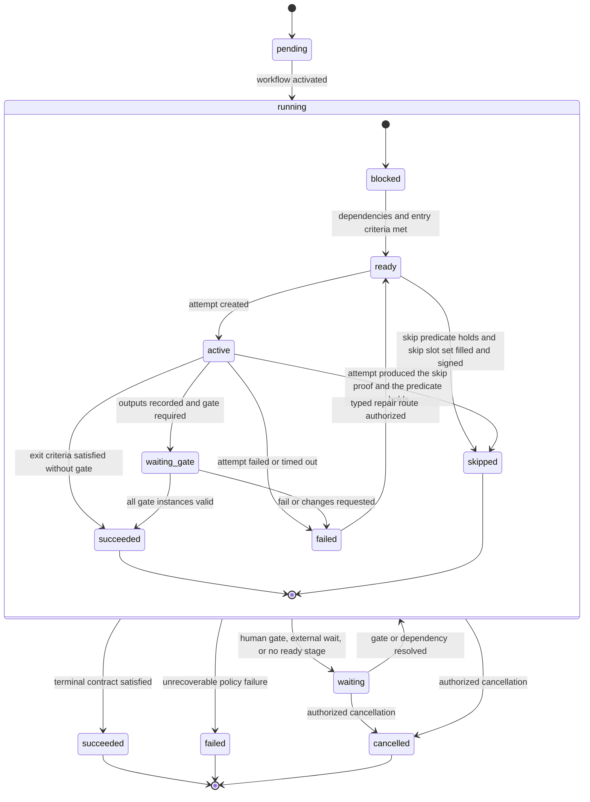

The workflow run and each stage instance have separate states. A stage failure does not imply ticket cancellation or workflow failure. The orchestrator derives readiness from dependencies and entry criteria, creates immutable attempts, and advances only through declared transitions. `skipped` is reachable only for a stage whose definition declares a skip predicate, and only on the evidence-backed terms below; it is success-equivalent to `succeeded` and is never an omission, a timeout, or a silent edge.

### Typed stage evidence slots and signing

A required evidence slot is a named child contract of a Stage definition, not a new aggregate, gate, or
narrative checklist. Every stage that can reach `succeeded` or an evidence-backed `skipped` disposition
declares an ordered nonempty `required_evidence_slots` set. Each slot pins:

- a stable stage-local `slot_key` and one recognized `evidence_kind`;
- one frozen stage-scoped Acceptance-criterion version whose exact pass condition the slot helps prove;
- the required artifact/external identity fields and digest bindings;
- source, command, environment, producer-run, verifier-capability/independence, trust, freshness/expiry, and
  dependency/invalidation requirements; and
- whether the slot may supply stage sign-off, together with the required assignment kind/capability.

A stage that declares a skip predicate declares a second named set, `skip_evidence_slots`, whose slots pin
the same fields and which names its own signing slot. **The two sets are alternatives, never a union.** The
requested disposition selects which one a transition resolves, and the resolved set is the complete pinned
slot set that every success-equivalent rule quantifies over:

- a `succeeded` transition resolves the **ordinary** set and its signing slot, always, and is available to
  every success-capable stage including one whose skip predicate happens to hold;
- an evidence-backed `skipped` transition resolves the **skip** set and its signing slot **in place of**
  the ordinary set, and is admissible only while the stage's pinned skip predicate holds on accepted
  durable facts.

A skip is therefore earned by its predicate and its proof, never assumed and never defaulted into. A
`skipped` request whose predicate does not hold, cannot be evaluated, or is stale or revoked is refused
outright, with the predicate itself as the unmet item; the stage then advances only by completing its
ordinary set. The skip set proves only that the stage does not apply — it names the predicate revision, the
exact accepted facts that satisfied it, and the signer — and never asserts that the stage's work happened.

The minimum v1 evidence-kind vocabulary is:

| Evidence kind | Minimum re-checkable reference; prose alone never fills it |
|---|---|
| `ci-job` | CI system/repository, immutable job or run ID, conclusion, source/candidate digest, command or workflow revision, and observed time |
| `image-digest` | Registry/repository identity, immutable image digest, applicable platform, and provenance/attestation reference |
| `screenshot` | Content-addressed image artifact, captured subject/route, environment, candidate/deployment digest, and capture time |
| `tag` | Repository/registry, exact tag, dereferenced immutable digest, and authoritative creation observation |
| `url+digest` | Exact URL/target plus observed response or artifact digest, environment identity, probe/command, and observed time |
| `artifact-digest` | Typed artifact identity, content digest, producer/source revision, and durable object reference |
| `transcript` | Content-addressed transcript or recording with command/scenario, bounded cursor/time range, environment, and subject digest |

Later vocabularies require a reviewed schema revision and compatible readers; an unknown kind fails Workflow
publication or evidence attachment. A narrative such as “E2E passed” may be rationale on Evidence but is
never the slot value.

Evidence fills a slot only when it names the pinned stage instance, slot key, criterion version, and exact
kind and satisfies the slot's full evidence contract. Slot state is derived, never patched:

```text
matching current Evidence exists and contract passes  -> filled
missing / type mismatch / invalid / expired / revoked -> unfilled
source or validity cannot be established              -> unfilled (STATE_UNKNOWN)
```

The transition transaction resolves the required slot set, then evaluates that complete resolved set under
the same current digest snapshot as the exit contract and gates. Any unfilled slot returns an exact
no-mutation unmet item naming the slot, kind, owning assignment/capability, and reason. `failed`,
`timed_out`, and `cancelled` attempts may terminate without completed slots because they make no success
claim; they cannot be projected as passed. An evidence-backed skip still fills every slot of its declared
skip set with an artifact and cannot erase the stage by omission.

Stage sign-off reuses Evidence and assignment truth. The success event references the complete satisfying
slot-manifest digest, one satisfying Evidence item selected by the pinned signing contract, and that
Evidence item's assignment interval. The selected Evidence signature/attestation must bind the same
slot-manifest digest. The canonical signer is `Evidence.verifier_principal`; it must equal the interval
principal at evidence time, and the interval supplies the durable seat/crew context. Evidence
signature/attestation, producer-run pins, criterion/slot claim, command/artifact reference, and assignment
together render the existing `SIGNED-OFF` accountability fields. There is no copied stage-level principal
or free-text seat field. Other slot contributors keep their own verifier attribution, while the selected
signer is the seat accountable for the stage completion manifest.

Slots and gates remain distinct. Filling every slot does not pass a required gate, and a passing verdict
does not fill a slot. A gate may consume the same Evidence items, but both slot completeness and valid gate
instances are independently required on the ordinary path. A stage's declared mandatory gates belong to
that ordinary path: when a transition resolves the skip set, they are never activated, because the
predicate holding is exactly the statement that the gate has no subject to verify. No gate instance is
created, so none has to be closed and no gate state or disposition is added to the model. A stage that has
already reached `waiting_gate` has an activated gate and a live instance; it completes or fails on its
ordinary path and cannot be skipped from there, which is why `skipped` is reachable only from `ready` or
`active`. Otherwise gate independence is unchanged. If a dependency later changes, Proof marks exactly affected slots
unfilled and invalidates dependent gates. The prior stage-success event remains immutable history; current
readiness, effects, resolution, and all projections treat that stage's completion proof as invalid until a
declared repair route creates fresh Evidence on a new attempt.

Every Board, Ticket, and Project Delivery projection that displays a stage or completion claim includes
`filled / required` slot coverage over the stage instance's resolved set and never removes a declared slot
of that set from the denominator. A stage instance that resolved its skip set reads its coverage over the
skip set and renders the ordinary set's slots as `not applicable (skipped)` with the predicate reference,
never as filled and never as silently absent, so a skip can never be read as coverage of work that did not
happen. Board summaries show the unfilled/unknown count and expose slot keys in their API/CLI detail;
Ticket detail shows every slot, contract, current Evidence, signer, invalidation, and history; Project
Delivery proof coverage excludes unfilled slots and names them in derivation reasons. `STATE_UNKNOWN` is
rendered as `unfilled (STATE_UNKNOWN)`, never as pass, hidden, zero-required, or absent-so-fine.

### Delivery-sprint stage groups and the enforced software-factory package

The delivery sprint — think, plan, build, review, test, ship, reflect — is package data that the generic
evaluator refuses to violate. It is the shape of the existing `engineering.software-factory` package, not a
second production workflow package, a second engine, a second state machine, a prose convention that humans
and agents are asked to remember, or the separate `Sprint/Cadence policy` component category that owns
admission and cadence bounds. The seven sprint words name declared groups over the sixteen pinned stages;
they never replace a stage key, because merge, deployment, and environment verification must stay separate
typed facts.

#### Stage groups are declared package vocabulary

A Workflow revision may declare an ordered `stage_groups` list of stable keys; that list order is the
group order. When a Workflow declares groups, every stage names exactly one declared group, and every
declared group owns at least one stage. Publication fails on a duplicate group key, a stage naming an
undeclared group, a stage naming no group, or a declared group that owns no stage. A group labels the pinned
graph and declares no edge, gate, terminal condition, parallelism, or ordering authority of its own; the
pinned transitions remain the only movement authority. Board, Ticket, and Project Delivery derive per-group
`filled / required` slot coverage from this declaration alone, exactly as the six-lane fold derives
`in_review` from `activity_class` rather than from a stage name. A Workflow that declares no groups is
ungrouped and renders no rollup; the `ctower.trust-spine-four-stage@1` fixture stays ungrouped.

#### The `engineering.software-factory` groups

| Delivery-sprint group | Stages, in pinned graph order | Group contract |
|---|---|---|
| `think` | `intake`, `think` | The accepted intent is durable, classified, and stated as an outcome with constraints, non-goals, and an operator-attention budget before planning consumes it. |
| `plan` | `plan`, `design` | One approved plan revision and one frozen acceptance/verification criterion set exist before any candidate; design is evaluated and either contracted or refused as not applicable with proof. |
| `build` | `implement` | Exactly one current candidate manifest exists, and it passes the repository's own warm quality gate before it is offered to verification. |
| `review` | `risk-derived-review` | One terminal round on the current candidate digest carries every required and applicable independent perspective, with zero open blockers. |
| `test` | `local-verification-qa`, `staging-qa`, `production-smoke-live-qa` | Each declared environment is proven by a re-checkable use-proof against the exact deployed or candidate digest, never by a checklist assertion. |
| `ship` | `documentation`, `release-preflight`, `merge`, `staging-deploy`, `production-deploy` | Docs truth, preflight, merge, and each brokered deployment are separate typed facts with separate receipts. |
| `reflect` | `retro`, `resolve-close` | A retro exists with either a linked improvement and evaluation window or an evidence-backed no-change record, and the server, not a claimant, validates resolution. |

Group order is the human summary of the package. Two groups are deliberately non-contiguous in graph order,
and this is the resolution of the only real conflict between the mnemonic order and ctower's locked
contract:

- `test` precedes `review` for the local candidate, because a repaired candidate must obtain fresh QA
  before a new review round ([AC-WF-15](#ac-wf-15)); `test` then recurs after `ship` because staging and
  production verification are separate typed delivery facts ([INV-39](#non-negotiable-invariants)).
- `ship` owns merge and both deploys, because merge, deployment, and environment verification never imply
  one another.

Reading the seven words as an edge order would either delete the pre-review QA requirement or collapse the
delivery facts. The mnemonic is a rollup; the pinned graph is authority.

#### Required typed evidence slots per stage

Each slot's frozen stage-scoped criterion version is `<stage-key>.<slot-key>-current`. Every kind below is
already in the recognized v1 vocabulary; the delivery sprint needs no new evidence kind. Two of the seven
recognized kinds are declared by no slot in this package: `image-digest`, which stays reserved for packages
that install container images, and `screenshot`, because the content-addressed rendered capture that the
user-interface predicate requires is bound inside its `transcript` slot's contract rather than as a
separate slot. The remaining five are exercised.

The last column is the stage's alternative skip slot set. On an evidence-backed `skipped` transition it
**replaces** the ordinary required slots and the ordinary signing slot; it never adds to them, and that
transition is admissible only while the stage's skip predicate holds.

| Stage | Group | Ordinary required slots (`slot_key`: `evidence_kind`) | Ordinary signing slot and assignment kind | Mandatory stage gate | Skip slot set: slot / signing assignment kind |
|---|---|---|---|---|---|
| `intake` | think | `record`: `artifact-digest` | `record` / `stage_owner` | — | none |
| `think` | think | `brief`: `artifact-digest` | `brief` / `stage_owner` | — | none |
| `plan` | plan | `spec`: `artifact-digest`; `criteria`: `artifact-digest` | `spec` / `stage_owner` | plan review when `engineering.change.sizeable@1` holds | none |
| `design` | plan | `contract`: `artifact-digest` | `contract` / `stage_owner` | pre-build design QA when `engineering.change.user-interface@1` holds | `not-applicable`: `artifact-digest` / `stage_owner` |
| `implement` | build | `candidate`: `artifact-digest`; `warm-gate`: `ci-job` | `candidate` / `stage_owner` | — | none |
| `local-verification-qa` | test | `suite`: `ci-job`; `use-proof`: `transcript` | `use-proof` / `reviewer_assignment` | local QA | none |
| `risk-derived-review` | review | `code-review`: `artifact-digest`; `round-manifest`: `artifact-digest` | `round-manifest` / `reviewer_assignment` | review round | none |
| `documentation` | ship | `revision`: `artifact-digest`; `truth-check`: `ci-job` | `truth-check` / `reviewer_assignment` | documentation truth | none |
| `release-preflight` | ship | `manifest`: `artifact-digest` | `manifest` / `stage_owner` | release preflight | none |
| `merge` | ship | `fact`: `url+digest` | `fact` / `stage_owner` | — | `not-applicable`: `artifact-digest` / `stage_owner` |
| `staging-deploy` | ship | `receipt`: `artifact-digest`; `deployed`: `tag` | `receipt` / `stage_owner` | — | `not-applicable`: `artifact-digest` / `stage_owner` |
| `staging-qa` | test | `verification`: `url+digest`; `use-proof`: `transcript` | `verification` / `reviewer_assignment` | staging QA | `not-applicable`: `artifact-digest` / `stage_owner` |
| `production-deploy` | ship | `receipt`: `artifact-digest`; `deployed`: `tag` | `receipt` / `stage_owner` | — | `not-applicable`: `artifact-digest` / `stage_owner` |
| `production-smoke-live-qa` | test | `smoke`: `url+digest`; `live-use-proof`: `transcript` | `live-use-proof` / `reviewer_assignment` | production smoke and live QA | `not-applicable`: `artifact-digest` / `stage_owner` |
| `retro` | reflect | `record`: `artifact-digest` | `record` / `stage_owner` | retro | none |
| `resolve-close` | reflect | `criteria-manifest`: `artifact-digest` | `criteria-manifest` / `ticket_custodian` | — | none |

Four slot contracts carry extra bound requirements because they are the ones prose most often replaces:

- `plan.criteria` must bind, per frozen acceptance criterion, both its exact pass condition and its
  evidence contract, which is the criterion's named verification method. A criterion frozen with a pass
  condition but no evidence contract fails the slot contract, and the `plan` stage does not complete. This is the machine form of the rule that
  work does not start without acceptance criteria and the verification that proves each one.
- `implement.warm-gate` must bind the repository's own declared warm quality-gate command, its exit
  status, its environment/image digest, and the current candidate digest.
- every `use-proof`, `live-use-proof`, and `verification` slot must bind the exact scenario or probe, the
  bounded cursor or time range, the environment identity, and the subject digest, and must additionally
  bind a content-addressed rendered capture whenever the user-interface predicate applies. A transcript
  that only asserts an outcome fails its contract.
- `risk-derived-review.round-manifest` must enumerate the complete required and applicable perspective set
  for the current candidate digest, each perspective's verdict identity and effective-identity family, and
  a zero-open-blocker assertion. A manifest that omits an applicable perspective, names a candidate author
  as a verdict holder, or references a verdict on a superseded digest fails its contract and leaves the
  slot unfilled. Conditional perspectives are therefore enforced through gate applicability plus this one
  always-required manifest slot, so the required slot set stays total as [INV-61](#non-negotiable-invariants)
  demands.

#### Execution Policy: gates, perspectives, independence, and finite bounds

Mandatory stage gates are the ones named in the table above. They are stage gates, not review perspectives,
and a review round never repeats them. Each belongs to its stage's ordinary path: on an evidence-backed
`skipped` transition the stage's gate is never activated and no gate instance is created, since the skip
predicate holding is the statement that the gate has no subject. A skipped `staging-qa` therefore owes no staging-QA gate verdict and a
skipped `production-smoke-live-qa` owes no production smoke gate verdict, exactly as neither owes its
ordinary slots.

Independence is a property of perspectives, never a vendor list. Each declared perspective carries an
independence contract: the `independent_of` identity sets, at minimum the candidate authors. That contract
is identity truth. It is never waivable, and no operator command reaches it
([INV-19](#non-negotiable-invariants), [INV-44](#non-negotiable-invariants)).

Family diversity is a separate, weaker control and is modelled outside the independence contract, as a
declared **placement eligibility rule** on the Gate Policy. It does not answer "did someone other than the
author verify this" — `independent_of` and INV-19 already answer that, at every tier, unwaivably. It
answers a different question: whether the verifying identity is likely to share the *author's* blind spots.
Because it is a policy-declared bound rather than an independence property, a tier may declare it waivable
and a protected operator command may waive it exactly where the pinned policy says so, which is the only
waiver [INV-44](#non-negotiable-invariants) permits. Waiving it never permits self-review, never lowers
`independent_of`, and never fabricates a verdict. The software-factory Gate Policy declares:

- `family_diversity: candidate_producer` on `code-review` at every tier — the satisfying verdict's
  effective identity must resolve to a declared eligible family other than the family that produced the
  current candidate. Waivable by protected operator command at Low and Standard; not waivable at Elevated
  or Critical. Each waiver is one audited, run-scoped, single-use act that names the unavailable families
  and appends an attention fact; it is never a standing policy state.
- `family_diversity: across_required_set` at Elevated and Critical — the required perspective set of one
  terminal round may not resolve entirely to one eligible family. This rule applies only to a terminal
  round whose required perspective set has two or more members. When Elevated's set resolves to
  `{code-review}` alone because neither the `security` nor the `rendered-design` trigger applies, a
  one-member set cannot be diverse across itself, so only `candidate_producer` applies to that round;
  declaring `across_required_set` never makes a single-perspective round unsatisfiable.

An eligible family is a named eligibility class declared by the pinned capability policy revision and
referenced from the Gate Policy by `<capability-policy-key>@<revision>#families.<name>`, exactly like any
other exact component pin. The capability policy alone maps concrete profiles into a family; publication
fails when a referenced family does not resolve or declares no member profile. No vendor, product, or model
name appears in a Workflow, Execution Policy, or Gate Policy payload. A placement that would violate either
diversity rule is refused before dispatch and records no verdict or execution fact; when no compliant
eligible identity is currently healthy, the run waits and reports the unmet placement rather than falling
back to a same-family reviewer.

The finite bounds are the package tier values already declared under
[software-factory risk and review policy](#software-factory-risk-and-review-policy); this section adds no
platform ceiling and no new number for them. It adds the missing fourth control that every executable
policy is already required to declare:

**No-progress rule.** The Execution Policy declares one finite `max_nonprogressing_candidate_mutations`,
evaluated by the server under [INV-64](#non-negotiable-invariants). It is a separate dimension from
`max_nonpassing_rounds`, `max_repairs_per_lineage`, and `max_candidate_generations`, it is not a ReviewPlan
v1 field, and it never becomes a cap on the observed `total_executions` audit fact. Its exact mechanics
are:

- **Boundary.** The unit is one governed candidate mutation, the same event that consumes
  `max_candidate_generations`. Its progress is decided later, because a mutation's effect is an intention
  until it has been verified. A candidate reaches its **verification disposition** at the first of these
  the run records against that candidate's digest: the outcome of a terminal review round, or the failure
  of a mandatory stage gate that routes the candidate to repair. Both are already-defined events, and
  either one makes the candidate's outstanding set a durable fact. The count is appended in that
  transaction, at most once per mutation, under the workflow-run lock. A candidate superseded or cancelled
  before it reaches a verification disposition is never progress-tested and moves no count; a repeated or
  later-invalidated verification of the same candidate does not re-test, re-count, or un-count that
  mutation, because consumption facts are append-only and reset nothing.
- **Observation.** A candidate's **outstanding set** is the run's open server-owned failure lineages plus
  the required evidence slots unfilled on that candidate's digest, taken when that candidate's verification
  completes. Nothing is measured before it has been verified.
- **Progress test.** A mutation is *progressing* when the outstanding set of the candidate it produced is a
  strict subset of the outstanding set of the candidate it replaced. Every governed mutation has such a
  predecessor — the initial candidate is a generation, never a mutation — so the first mutation of a run is
  tested like any other and no mutation is exempt. Everything else is non-progressing: an identical set, a
  larger set, and — the case the bound exists for — an exchanged set that resolves one lineage while
  opening another. A repair loop trading defect A for B for C and back to A therefore trips this bound
  instead of running to generation exhaustion.
- **Key.** The *count* is keyed to the `workflow_run` alone. Per-lineage attribution is what
  `max_repairs_per_lineage` already provides; this bound measures whole-run churn, so a single count makes
  "consecutive" literally true and leaves no stale key to escape through. Its *escalation* keys as every
  other bound's does, to the run and the bound, which for this bound yields exactly one per run.
- **Reset.** Only a progressing mutation clears the count, and it clears it completely. Restart,
  reassignment, model or harness replacement, plan revision, changed prose, and a new digest reset nothing.
  A reopen is not a reset: it starts a new lifecycle episode and therefore a new workflow run with its own
  count ([INV-11](#non-negotiable-invariants)), through an authenticated audited command no executor can
  issue for itself.

**Bound coherence.** `max_candidate_generations` caps the initial candidate plus subsequent governed
mutations, so a tier permits `max_candidate_generations - 1` governed mutations, and every one of them is
progress-tested. A policy's `max_nonprogressing_candidate_mutations` must be at least `1` and at most that
number, or publication fails; this is what makes the bound reachable rather than decorative. Worked
against the tier table: Low permits one mutation and sets `1`, so a single non-progressing repair
escalates; Critical permits two and sets `1`, so it escalates with a mutation still unspent; Standard and
Elevated permit three and set `2`, so they escalate at the second consecutive stall with a mutation still
unspent. At a tier that permits exactly one governed mutation, that mutation consumes the last generation
and then, at its candidate's verification disposition, decides the no-progress bound. Full consumption is
not exhaustion, so the no-progress escalation is the one that fires, and generation exhaustion never
follows it, because exhausting the generation bound would require a further mutation request that this
escalation already blocks. The escalation keys to the run and the bound exactly as every other bound's
does, so this bound yields at most one escalation per run.

#### What the evaluator refuses

Each row refuses the requested transition, returns an exact unmet checklist, and records one transition
evaluation. **Zero-mutation means zero authoritative transition mutation:** no stage instance, gate
instance, Evidence, candidate, or typed delivery fact changes state, and the refusal is visible as a
refusal rather than as progress. The server-owned audit and consumption facts a refusal itself produces are
not transition mutations and are required, not optional — the recorded transition evaluation, a nonpassing-
round consumption fact when a terminal round did not pass, and the single deduplicated escalation on bound
exhaustion. A refusal that appended none of those would be an unaudited refusal, which is the failure this
table exists to prevent. The no-progress count is not one of them: it is appended when a candidate's
verification completes, not by a refusal.

| Refusal | Trigger | Result |
|---|---|---|
| Unfilled required slot | Success-equivalent disposition requested while any slot of the stage instance's resolved required slot set is missing, type-mismatched, invalidated, expired, revoked, or `STATE_UNKNOWN` | No mutation; the unmet item names the slot key, kind, owning assignment/capability, reason, and which set resolved ([INV-61](#non-negotiable-invariants), [AC-EVD-07](#ac-evd-07)) |
| Missing perspective | A terminal review round whose manifest omits an applicable required perspective, or whose named verdict is not current on the candidate digest | The round is nonpassing rather than passing, the `round-manifest` slot stays unfilled, and the stage does not advance |
| Self-review | A verdict holder or stage signer shares an effective identity with a producer of the input being verified | The verdict is refused before recording ([INV-19](#non-negotiable-invariants)); the signing binding is refused ([INV-62](#non-negotiable-invariants)) |
| Family collapse | A declared family-diversity rule would be violated by the resolved placement | Placement refused before dispatch; no verdict, no execution fact |
| Stale evidence | A success-equivalent disposition requested on proof the candidate digest has already superseded | The digest change itself, not this refusal, unfilled every declared candidate-dependent slot and invalidated every dependent gate instance ([INV-20](#non-negotiable-invariants), [AC-WF-09](#ac-wf-09), [AC-WF-15](#ac-wf-15)); the transition is then refused naming those slots and gates, and fresh QA precedes any new review round ([AC-WF-15](#ac-wf-15)) |
| Silent skip | A `skipped` disposition requested for a stage that declares no skip predicate, or whose predicate does not currently hold or cannot be evaluated on accepted durable facts, or which holds but leaves a slot of the skip set unfilled or unsigned | Refused with the predicate or the skip-set slot as the unmet item; the request is never converted into a success and never defaulted, and the stage advances only by completing its ordinary set, so a stage leaves the sprint only with proof ([INV-61](#non-negotiable-invariants), [INV-63](#non-negotiable-invariants)) |
| Bound exhaustion | A consuming event requested beyond `max_nonpassing_rounds`, `max_repairs_per_lineage`, or `max_candidate_generations`; an elapsed declared deadline or quota; a hard-safety stop; or `max_nonprogressing_candidate_mutations` reached, that one bound stopping the run on reaching its maximum rather than on the next request | Every request that would consume an exhausted bound is refused with zero mutation and names the bound as its unmet item; consuming a bound up to its maximum is not yet exhaustion, so a run at full generation capacity still completes the QA and review its current candidate already requires. The escalation is created once where the bound is decided — at the refused transition for every bound except no-progress, at the deciding verification disposition for no-progress — keyed to the run and the bound or lineage, exactly as every other exhausted bound is. Blocks further automatic dispatch; later duplicate evidence attaches to that escalation |

#### Skips and non-software runs

Six stages declare a skip predicate and a skip slot set: `design`, `merge`, `staging-deploy`,
`staging-qa`, `production-deploy`, and `production-smoke-live-qa`. The other ten declare none and therefore
cannot be omitted at any risk tier: `intake`, `think`, `plan`, `implement`, `local-verification-qa`,
`risk-derived-review`, `documentation`, `release-preflight`, `retro`, and `resolve-close` are the enforced
spine. A skip predicate is a pinned predicate reference over declared checkpoint and change facts, never an
agent judgement:

| Stage | Skip predicate reference | Holds when |
|---|---|---|
| `design` | `engineering.change.user-interface@1` and `engineering.change.material-architecture@1` both false | The change presents no user-visible surface and introduces no new Module boundary, persistent model, protocol, or topology |
| `merge` | `engineering.checkpoint.no-landing-boundary@1` | The checkpoint declares no configured main or default integration target |
| `staging-deploy` | `engineering.checkpoint.no-non-production-environment@1` | The checkpoint declares no non-production deployment environment |
| `staging-qa` | `engineering.checkpoint.no-non-production-environment@1` | The checkpoint declares no non-production environment, so its deploy stage has none to produce and none to verify |
| `production-deploy` | `engineering.checkpoint.no-effective-outcome@1` | The checkpoint declares no production or externally effective outcome |
| `production-smoke-live-qa` | `engineering.checkpoint.no-effective-outcome@1` | The checkpoint declares no externally effective outcome, so its deploy stage has none to produce and none to verify |

Each QA stage shares its deploy stage's predicate rather than reading whether that deploy stage was
skipped. The two are equivalent — a deploy stage's only skip predicate is exactly the checkpoint fact its
QA stage reads — and sharing the predicate keeps every predicate a function of durable checkpoint and
change facts alone, with no run state in it.

`engineering.change.material-architecture@1` reads *new* architecture, not any change to an existing one.
An operation added inside an already-published protocol surface, under that surface's existing
compatibility contract, introduces no new protocol; a new surface, a new external boundary, or a breaking
revision does. The `no-landing-boundary`, `no-non-production-environment`, and `no-effective-outcome`
predicates each read one field of the checkpoint definition's declared delivery surface. Absence must be
**declared**: a field that is neither declared present nor declared absent is `STATE_UNKNOWN` and its
predicate does not hold, so a misconfigured checkpoint refuses its stages rather than skipping them.

A predicate evaluates only accepted durable facts: the pinned checkpoint definition's declared delivery
surface, and the accepted classification facts of the current change. It reads no prose, no agent claim,
and no ticket wording. Publication fails when a declared skip predicate reference does not resolve, and a
run refuses a skip whose predicate does not currently hold.

`design` is the one skippable stage that runs before any candidate exists, so its two change predicates
evaluate the change classification accepted at `plan`, not a candidate digest. That classification is
itself a declared dependency of the skip proof: when a later candidate changes it — the change turns out to
present a user surface, or to introduce a new Module boundary, persistent model, protocol, or topology —
[INV-20](#non-negotiable-invariants) invalidates the skip proof exactly as it invalidates any other
dependent evidence, `design` loses its completion validity, and the run cannot advance until `design`
completes on its ordinary set. A skip is a claim about accepted facts, and it expires with them.

**Entry contracts follow the same rule as slots and gates, in both directions.** A stage's own ordinary
entry contract belongs to its ordinary path: when its skip predicate holds, that predicate is its
readiness, so `staging-qa` does not wait for the staging report its skipped deploy never produced. And an
entry item that names an artifact of an *upstream* stage is satisfied by whichever success-equivalent
disposition that stage reached — by its skip proof when it was skipped, not by the artifact that proof
says could not exist. Concretely, in a run with no landing boundary, `staging-deploy` is entered on the
`merge` skip proof rather than a merge fact; with no non-production environment, `production-deploy` is
entered on the `staging-qa` skip proof rather than a staging QA pass; with no externally effective
outcome, the non-skippable `retro` is entered on the `production-smoke-live-qa` skip proof rather than a
production verification. Graph dependencies still hold in full — each predecessor must reach a
success-equivalent disposition, and `skipped` is one — so this releases the successor without loosening
the graph. It invents no evidence: a skip proof is a signed statement on accepted durable facts that the
named artifact could not exist. An entry item whose predecessor actually ran still owes that predecessor's
ordinary artifact, unchanged.

One narrow companion rule covers the non-skippable stages whose entry names a delivery target rather than a
predecessor's artifact — `release-preflight`'s "release target known" is the only such item in this package.
An entry item naming a delivery-surface fact that the pinned checkpoint definition declares **absent** is
satisfied by that declared absence, on the same accepted durable facts the skip predicates read, so a
run with no landing boundary and no effective outcome enters preflight rather than waiting forever for a
target its checkpoint says does not exist. The rule is deliberately narrow: it satisfies entry items only.
`release-preflight` still runs, still fills its `manifest` slot, and still passes its release-preflight
gate, because a change set is preflighted whether or not it will be released. An undeclared field is
`STATE_UNKNOWN`, not an absence, and satisfies nothing.

**A skipped stage's skip slot set replaces its ordinary required slots and its ordinary signing slot; it
never adds to them.** On an evidence-backed `skipped` transition that set — one `not-applicable` artifact
naming the predicate revision, the exact accepted facts that satisfied it, and the signer, signed under the
`stage_owner` assignment — is the complete required slot set and signing contract that
[INV-61](#non-negotiable-invariants), [INV-62](#non-negotiable-invariants), and [AC-EVD-07](#ac-evd-07)
quantify over for that transition. A skipped `staging-deploy` owes no `receipt` and no `deployed`; a
skipped `merge` owes no `fact`; a skipped `design` owes no `contract`. This keeps success-equivalence
honest in both directions: a skipped stage carries proof of why it does not apply, never proof of work it
never did, and the skip is refused unless the predicate holds and the proof is filled and signed. The stage's mandatory gate is
never activated on that path, so no gate instance exists and no gate verdict is owed for verification that
had no subject. The six-lane Board fold treats it
exactly like `succeeded`, and the Project Delivery precedence already skips lifecycle states a checkpoint
does not declare, so an accounting, compliance, hiring, or research checkpoint moves from `in_progress` to
`done` with no merge, staging, or release fact and still cannot reach `done` without current proof for
every declared exit criterion. Nothing in the engine, the group mechanism, the slot vocabulary, or the fold
assumes that a `ship` group exists; a non-engineering package declares its own groups, stages, slots,
perspectives, and bounds on the same evaluator.

### Software-factory transition and failure-route contract

The published `engineering.software-factory@1` Workflow revision must contain exactly the edges and route
rules in this section. The later human-readable stage table is a projection of this contract and cannot
add an edge, parallel start, or alternative route. In particular, `documentation` starts only after the
current candidate has completed `risk-derived-review`; there is no policy option that starts documentation
before review and no later-recheck substitute for that edge.

Every predicate below is evaluated transactionally against one accepted durable snapshot. A client or
agent may request an edge or report Evidence, but cannot author a predicate result, route destination, or
reason code. These terms are exact:

- `complete(stage)` reads the accepted stage instance, its success-equivalent disposition, resolved
  ordinary-or-skip slot-manifest digest, current matching Evidence and signer assignment, mandatory-gate
  instances on the ordinary path, dependency digests, and invalidation state. It is true only when all are
  current on the edge's subject digest. Historical success with invalid current proof is false.
- `declared(field)` reads the pinned checkpoint definition and is true only when the named delivery-surface
  field is either present with an immutable identity or explicitly absent. An omitted/unknown field is
  `STATE_UNKNOWN` and false.
- `present(field)` and `absent(field)` read that same field and are mutually exclusive children of
  `declared(field)`.
- `path(stage)` is the destination's authored path selector. Its ordinary branch reads the exact entry facts
  named in the edge table. Its skip branch reads the stage's pinned skip-predicate revision and accepted
  inputs. When both ordinary and skip branches are admissible, the requested disposition selects one; when
  neither is, the edge is refused with the false/unknown input named. A skip never bypasses the predecessor's
  `complete` predicate.

The complete edge set is:

| Edge | Predicate: every item must be true | Accepted inputs read |
|---|---|---|
| `sf.e00.activate-intake@1` | Workflow activation accepted; input contract valid | Pinned ticket episode, Workflow revision/digest, input-contract result, current Commander custody |
| `sf.e01.intake-think@1` | `complete(intake)`; classification is `actionable` | `intake.record` slot manifest, durable source/provenance and create-or-link result, ticket/custody facts |
| `sf.e02.think-plan@1` | `complete(think)`; brief names one observable outcome and accountable owner | `think.brief` slot manifest and its criterion-bound outcome/owner fields |
| `sf.e03.plan-design@1` | `complete(plan)`; acceptance and verification criteria frozen; change-classification facts accepted | `plan.spec`, `plan.criteria`, any activated plan-review verdict, frozen-criteria revision/digest, accepted classification facts |
| `sf.e04.design-implement@1` | `complete(design)` through its ordinary or skip path; frozen criteria remain current | Design ordinary/skip slot manifest, any activated pre-build design verdict, frozen-criteria revision/digest and invalidation facts |
| `sf.e05.implement-local-qa@1` | `complete(implement)`; candidate and warm-gate digests are identical | `implement.candidate`, `implement.warm-gate`, candidate/environment/image digests |
| `sf.e06.local-qa-review@1` | `complete(local-verification-qa)` on the current candidate digest | Local-QA slot manifest and gate verdict, candidate digest, dependency/invalidation facts |
| `sf.e07.review-documentation@1` | `complete(risk-derived-review)` on the current candidate digest; round manifest has zero open blockers | Review slot manifest, complete applicable-perspective verdict set, candidate digest and open-blocker facts |
| `sf.e08.documentation-preflight@1` | `complete(documentation)` on that digest; landing, non-production, and effective-outcome fields are each `declared` | Documentation slot manifest and gate verdict, candidate digest, pinned checkpoint delivery-surface fields |
| `sf.e09.preflight-merge@1` | `complete(release-preflight)`; `declared(landing_boundary)`; `path(merge)` | Preflight manifest/verdict, checkpoint landing-boundary identity-or-absence, merge skip-predicate inputs |
| `sf.e10.merge-staging-deploy@1` | `complete(merge)`; `declared(non_production_environment)`; `path(staging-deploy)` | Merge ordinary/skip manifest, release digest, checkpoint non-production identity-or-absence |
| `sf.e11.staging-deploy-staging-qa@1` | `complete(staging-deploy)`; `declared(non_production_environment)`; `path(staging-qa)` | Deploy ordinary/skip manifest; when present, receipt and observed release digest; checkpoint non-production identity-or-absence |
| `sf.e12.staging-qa-production-deploy@1` | `complete(staging-qa)`; `declared(effective_outcome)`; `path(production-deploy)`; rollback predecessor/plan current when the outcome is present | Staging-QA ordinary/skip manifest, exact release digest, checkpoint effective-outcome identity-or-absence, preflight rollback facts |
| `sf.e13.production-deploy-production-qa@1` | `complete(production-deploy)`; `declared(effective_outcome)`; `path(production-smoke-live-qa)` | Production-deploy ordinary/skip manifest; when present, effect receipt and observed digest; checkpoint effective-outcome identity-or-absence |
| `sf.e14.production-qa-retro@1` | `complete(production-smoke-live-qa)`; no open incident blocks the subject digest | Production-QA ordinary/skip manifest, exact deployed-or-absent subject, incident containment/verification/triage facts |
| `sf.e15.retro-resolve-close@1` | `complete(retro)` | Retro slot manifest/verdict, current criterion/gate/delivery dependency digests |

The source stage cannot complete merely because its outgoing edge inputs exist: its own resolved slot set,
signing contract, exit contract, and ordinary-path gates still decide `complete(stage)`. Runtime
executor/workspace/lease availability decides whether a ready destination attempt can dispatch, not
whether an undeclared graph edge exists. A false or unknown edge predicate records the exact input and
leaves the destination blocked; it never selects a different edge.

Failures use one closed `failure_reason_code` vocabulary. Each authored slot, predicate, gate, Runtime
dispatch contract, and effect contract enumerates which codes it can emit; the server derives the code
from the failing typed contract and records its contract key, subject digest, occurrence fingerprint,
stable lineage, and Evidence. Reviewer prose may explain a failure but cannot select its code. A report
that matches zero or more than one allowed code normalizes to `classification_unknown`, which waits on one
deduplicated classification Attention item and authorizes no automatic repair. Route actions mean:
`retry(X)` creates a fresh attempt at `X`; `return(X)` invalidates declared downstream proof and creates a
fresh attempt at `X`; `wait(X, fact)` keeps `X` nonterminal until the named accepted fact exists; and
`incident(X)` commits the incident/containment path before any triaged repair from `X`.

| Failing stage | Allowed reason code -> deterministic route |
|---|---|
| `intake` | `intent_ambiguous -> wait(intake, classification_decision)`; `source_auth_failed -> wait(intake, source_auth_resolution)`; `content_poisoned -> wait(intake, quarantine_disposition)` |
| `think` | `outcome_ambiguous -> wait(think, business_intent_decision)`; `scope_contract_invalid -> retry(think)` |
| `plan` | `dependency_missing -> wait(plan, dependency_resolution)`; `requirements_or_acceptance_defect -> retry(plan)`; `new_architecture_or_security_boundary -> wait(plan, protected_operator_decision)` |
| `design` | `design_or_taste_defect -> retry(design)`; `requirements_or_architecture_defect -> return(plan)`; `new_security_boundary -> wait(design, protected_operator_decision)` |
| `implement` | `implementation_defect -> retry(implement)`; `design_contract_defect -> return(design)`; `requirements_or_acceptance_defect -> return(plan)`; `lease_or_workspace_lost -> wait(implement, runtime_reconciled)` |
| `local-verification-qa` | `implementation_defect -> return(implement)`; `design_contract_defect -> return(design)`; `requirements_or_acceptance_defect -> return(plan)`; `verification_environment_failed -> retry(local-verification-qa)` |
| `risk-derived-review` | `implementation_finding -> return(implement)`; `design_finding -> return(design)`; `requirements_finding -> return(plan)`; `reviewer_conflict -> wait(risk-derived-review, independent_adjudication)`; `candidate_digest_changed -> return(local-verification-qa)` |
| `documentation` | `documentation_defect -> retry(documentation)`; `implementation_truth_mismatch -> return(implement)`; `design_truth_mismatch -> return(design)`; `requirements_truth_mismatch -> return(plan)`; `candidate_changed -> return(local-verification-qa)` |
| `release-preflight` | `owned_requirement_missing -> return(owner_stage)` where the unmet slot/gate/delivery contract supplies its authored `owner_stage`; `release_manifest_defect -> retry(release-preflight)`; `migration_implementation_defect -> return(implement)`; `migration_or_rollback_plan_defect -> return(plan)`; `capacity_or_secret_unavailable -> wait(release-preflight, operations_recovered)` |
| `merge` | `scm_conflict_or_rebase -> return(implement)`; `merge_policy_decision -> wait(merge, protected_operator_decision)`; `effect_unknown_or_receipt_mismatch -> incident(merge)` |
| `staging-deploy` | `transient_infrastructure_failure -> retry(staging-deploy)`; `release_artifact_defect -> return(implement)`; `configuration_or_manifest_defect -> return(release-preflight)`; `effect_unknown_or_receipt_mismatch -> incident(staging-deploy)` |
| `staging-qa` | `implementation_defect -> return(implement)`; `design_contract_defect -> return(design)`; `requirements_or_acceptance_defect -> return(plan)`; `deployment_runtime_defect -> return(staging-deploy)`; `configuration_or_manifest_defect -> return(release-preflight)`; `verification_environment_failed -> retry(staging-qa)` |
| `production-deploy` | `policy_or_grant_denied -> wait(production-deploy, policy_or_grant_resolution)`; `effect_failed_or_unknown -> incident(production-deploy)`; `receipt_mismatch -> incident(production-deploy)` |
| `production-smoke-live-qa` | `verification_failed -> incident(production-smoke-live-qa)`; `deployed_digest_mismatch -> incident(production-smoke-live-qa)`; `verification_environment_failed -> incident(production-smoke-live-qa)` |
| `retro` | `telemetry_missing -> wait(retro, telemetry_manifest_current)`; `retro_contract_invalid -> retry(retro)`; `incident_open -> wait(retro, incident_contained_verified_and_triaged)` |
| `resolve-close` | `owned_requirement_missing -> return(owner_stage)` from the unmet criterion/gate/delivery contract; `resolution_policy_decision -> wait(resolve-close, protected_operator_decision)`; `administrative_close_precondition -> retry(resolve-close)` |

Incident triage is typed rather than a free routing field. After containment/rollback and exact-environment
verification, `implementation_defect`, `design_contract_defect`, `requirements_or_acceptance_defect`,
`configuration_or_manifest_defect`, `staging_infrastructure_defect`, `production_infrastructure_defect`,
and `verification_contract_defect` route respectively to `implement`, `design`, `plan`,
`release-preflight`, `staging-deploy`, `production-deploy`, and the failing QA stage. An absent or
ambiguous triage code is `classification_unknown` and dispatches nothing.

When one disposition contains multiple failures, incident/hard-safety holds win first, then any
`classification_unknown` hold, then the earliest destination in the edge order above. All occurrences and
lineages remain attached to that one route; later destinations do not dispatch in parallel unless a future
Workflow revision declares such parallelism. Bounds are evaluated before the selected retry/return
dispatch. Exhaustion replaces dispatch with the already-defined single escalation and cannot select a
different destination.

The resulting required path is:

`intake -> think -> plan -> design -> implement -> local verification/QA -> risk-derived review -> documentation -> release preflight -> merge -> staging deploy -> staging QA -> production deploy -> production smoke/live QA -> retro -> resolve/close`

“Design” is always evaluated but may produce a reasoned `not_applicable` artifact for a non-UI,
non-architecture change. “Production deploy” remains a distinct stage even for an internal service. A
stage may be skipped only when the pinned definition names the skip predicate and evidence; an agent cannot
declare a stage irrelevant ad hoc.

### ASCII enforcement model: autonomous movement and bounded verification

These terminal-safe views explain the same generic Workflow, policy, Proof, Runtime, and Effects contracts.
Only committed facts trigger reconciliation; prompts, terminal lines, timers, callbacks, and client-side
state never advance authoritative work.

#### Generic engine law

~~~text
+--------------------+       +-------------------------+
| committed command  |------>| reconcile pinned graph  |
| or verifier fact   |       | + policy + evidence     |
+--------------------+       +------------+------------+
                                          |
                         +----------------+----------------+
                         |                                 |
                    NOT READY                           READY
                         |                                 |
              +----------v-----------+          +----------v---------+
              | record exact unmet   |          | create durable job |
              | checklist; no change |          | accepted -> lease  |
              +----------------------+          +----------+---------+
                                                           |
                                                +----------v---------+
                                                | attempt artifacts, |
                                                | evidence, digests   |
                                                +----------+---------+
                                                           |
                                   +-----------------------+---------------------+
                                   |                       |                     |
                                 PASS               REPAIRABLE FAIL       HUMAN DECISION
                                   |                       |                     |
                         +---------v---------+     +-------v----------+   +------v------+
                         | commit transition |     | stable lineage + |   | Needs You + |
                         | and next readiness|     | bounded route    |   | protected cmd|
                         +-------------------+     +-------+----------+   +-------------+
                                                           |
                                      +--------------------+-------------------+
                                      | finite capacity remains                 | exhausted
                                      v                                         v
                               [new candidate]                       [one escalation; stop]
~~~

The engine is domain-neutral. A hiring Workflow may use source, interview, reference-check, and offer stages;
a research Workflow may use frame, collect, synthesize, and challenge. Their stage keys, perspectives,
participants, and finite limits differ, while the transaction, independence, lineage, counter, evidence,
and fail-closed laws stay unchanged.

#### Software-factory package

The first package declares this path; it is not compiled into the engine:

~~~text
[INTAKE/THINK] -> [PLAN] -> [DESIGN + PRE-BUILD QA] -> [IMPLEMENT]
                                                          |
                                                          v
 [RETRO/CLOSE] <- [PRODUCTION VERIFY] <- [RELEASE] <- [DOCS + REVIEW]
                         |
                         +-- failure -> [INCIDENT -> REVOKE/CONTAIN
                                         -> ROLLBACK VERIFY -> TRIAGE]
~~~

A fuller package stage order is intake, think, plan, design, implement, local QA, risk-selected review,
documentation, release preflight, merge, staging deploy, staging QA, production deploy, production
smoke/live QA, retro, and resolve/close. Design may emit a reasoned not-applicable artifact only when its
pinned predicate and evidence allow it. Every stage declares activity metadata for the generic Board fold.

The software-factory skill bindings are versioned package data:

| Package capability | Default binding | Hard rule |
|---|---|---|
| office-hours and plan CEO packet | Durable Commander on strongest healthy eligible profile | Shapes intent; never impersonates the human CEO |
| engineering plan review | Engineering Manager / high-judgment profile | New architecture direction remains an operator gate |
| design options and HTML mockup | Designer / visual-capable profile | Material taste selection belongs to operator |
| pre-build and rendered design review | Independent visual reviewer | Not the design/UI author; Fable may scout/summarize only, never issue the satisfying verdict |
| implementation | Eligible Engineer or UI-author persona per package | Exact source scopes and skills are policy data |
| functional UI QA | Independent QA with browser capability | Uses every control and proves outcome/tenant isolation |
| code review and conditional security review | Independent Review owns `code-review`; CSO owns `security` when triggered | `code-review` covers correctness plus maintainability; authors cannot satisfy their own perspective; sealed access when declared |
| documentation | Writer or code-truth-capable verifier | Binds the current candidate behavior |
| release/operations | Effect-brokered release runner | No standing production authority |

Publication and dispatch fail if referenced skill content, provenance, fixtures, materialization, capability,
or independence cannot resolve. Personas define responsibility/authorization, skills define versioned
procedure, profiles select models/harnesses, and assignments bind them to an attempt; none substitutes for
another.

#### Verification and repair accounting

~~~text
candidate d1 (generation 1)
        |
        v
[mandatory stage QA] --fail L1--> [consume repair L1] --> candidate d2 (generation 2)
        | pass
        v
+---------------- REVIEW ROUND ----------------+
| dispatch each required perspective on digest |
| each start: total_executions += 1             |
+----------------------+------------------------+
             pass all  |  any nonpass/error
                       |             |
                       v             v
                    advance   nonpassing_rounds += 1
                                      |
                           [stable lineage + repair?]
                              | yes              | exhausted/no progress
                              v                  v
                       candidate dN       one escalation; stop

Every started perspective execution contributes immutable total_executions audit/cost.
Only nonpassing terminal rounds consume max_nonpassing_rounds.
Every candidate, including d1, consumes max_candidate_generations.
Every mutation consumes the affected lineage's max_repairs_per_lineage first.
ReviewPlan v1 never turns total_executions into plan-authored capacity.
~~~

A candidate mutation invalidates declared candidate-dependent QA and review proof. In the software-factory
package a repaired candidate therefore returns through fresh QA before a new review round. Unrelated
evidence remains valid. The server derives a stable lineage from stage, typed failure class, normalized
subject, verifier-rule revision, environment class, and policy split discriminator; candidate digest,
prose, model, executor, session, and time cannot mint a new budget. Only a deterministic pinned split rule
or independent adjudicator may create a linked child lineage.

#### Commander, operator, and engine

~~~text
OPERATOR                         COMMANDER                         ENGINE
business/taste decisions         strongest healthy profile        validates pinned graph/policy
new architecture/security        accountable until terminal       checks proof/independence
destructive/irreversible         decomposes/routes/reassigns       owns counters/lineages
protected waivers                proposes plan revisions           fences jobs/brokers effects
          \                         |                                 /
           +---- authenticated, idempotent commands ----------------+
                                      |
                       accepted -> committed facts
                       refused  -> exact unmet checklist, zero change
~~~

The Commander may select among policy-permitted perspectives and bounds, add rigor, reassign executors,
pause/resume, or request a declared edge with evidence and rationale. It cannot author consumed counts,
remove a required perspective, self-issue an independent verdict, reset lineage/generation/round history,
mint evidence/receipts, or force a transition. There is no advance-force command. A protected operator
waiver binds the exact ticket, run, requirement, policy/input digests, reason, scope, expiry/use, alternatives,
and accepted risk; it is displayed through retro and never renders the waived gate as passed.

Ticket custody, stage execution, review, and runner leases are distinct:

~~~text
ticket custodian:   Commander C0 =====================================> close
reasoning jobs:       profile A ---- profile B ---- profile C
stage executors:     planner -> designer -> author -> QA -> reviewer -> release
review assignments:                         Q1    R1/S1
runner leases:         lease7 -> fenced -> lease9 -> ...

ordinary reassign: close executor interval + fence old lease + open eligible interval
custody transfer:  protected atomic C0 -> C1 with checkpoint/context and no owner gap
~~~

Changing an assignee does not change custody, priority, Board lane by fiat, stage truth, delivery, or
counters. Every interval records from/to, actor, reason, command, scope, and fence result.

#### Worked UI example with exact execution accounting

Target trace CT-EXAMPLE-UI-001 adds a tenant-scoped date filter. The pinned software-factory
elevated-UI policy requires perspectives `code-review`, `rendered-design`, and `security`; mandatory stage
gates include pre-build Design QA, functional UI QA, docs truth, preflight, staging QA, and production live
QA. The selected finite bounds are max_nonpassing_rounds=2, max_repairs_per_lineage=2,
and max_candidate_generations=4. ReviewPlan v1 defines no aggregate execution limit;
`total_executions` remains an immutable observed audit/cost fact only. These are package values, not platform defaults. The
plan contains no consumption.

| Step | Committed facts and automatic result |
|---|---|
| 1. Intent/plan/design | C0 records outcome and policy choice; Engineering Manager passes plan; operator decides only material filter placement; independent Design QA passes the mockup. |
| 2. Candidate d1 | UI author produces generation 1. Functional QA finds dead control occurrence o1 under lineage L1. Server consumes repair 1/2, produces d2 generation 2, and invalidates candidate-dependent proof. |
| 3. QA d2 | Fresh functional QA uses the filter, checks totals/table/empty/error states and Alpha/Beta isolation, then passes. |
| 4. Review round 1 | All three perspectives inspect d2. Their three started jobs make `total_executions=3`. Rendered-design finds a bytes-versus-MB mismatch L2, so the server records `nonpassing_rounds=1/2` and repair L2=1/2. |
| 5. Candidate d3 | Author fixes units, producing generation 3/4. Fresh functional QA passes; old QA/review remains immutable but invalid. |
| 6. Review round 2 | All three required perspectives pass on d3. Their three jobs make `total_executions=6`; `nonpassing_rounds` remains 1/2. One current all-perspective pass advances; no ceremonial repeat is scheduled. |
| 7. Delivery | Docs and preflight pass; typed facts progress through change_merged, staging_verified, and production_verified. A live failure would enter incident/containment before any repair. |
| 8. Terminal | C0 records retro and requests server-validated resolve/close against current criteria, proof, delivery, and workflow facts. |

At this early success the immutable audit reports six started perspective executions, while one
nonpassing round, one candidate generation, and one repair on each used lineage remain available. If
review round 2 had repeated L2 instead, the server would record `nonpassing_rounds=2/2`, consume repair
L2=2/2, create d4 generation 4/4, require fresh QA, and allow a current-digest review to pass. Conversely,
a later policy-permitted d4 created after the d3 pass would invalidate that passing proof and require fresh
QA and review; its executions would continue increasing the observed total, which is never ReviewPlan capacity.
No repeated pass is required. Automation still terminates through nonpassing-round, per-lineage repair,
candidate-generation, no-progress, deadline, quota, and hard-safety bounds. Exhausting any applicable
bound yields one escalation. A protected amendment may change only a policy-declared waivable value and
never erases consumed facts.

#### Compact end-to-end operating simulation

~~~text
+---------------- COMPANY SETUP ----------------+
| first-tenant bootstrap -> CompanyBundle       |
| goals/projects + principals + profiles/skills |
| Workflow + Execution/Gate/Evidence policies   |
| conformance -> atomic future pointer           |
+-------------------------+----------------------+
                          v
+---------------- DURABLE INTAKE ----------------+
| request commit -> classify/dedupe -> ticket    |
| episode=1, priority=P2, custodian=C0            |
+-------------------------+----------------------+
                          v
+---------------- WORKFLOW ----------------------+
| plan -> design -> implement -> QA/review       |
| owner intervals and every refused edge visible |
| comment/direct steering -> durable command ACK  |
+-------------------------+----------------------+
                          v
+---------------- DELIVERY ----------------------+
| docs -> preflight -> change_merged              |
| staging receipt + QA -> staging_verified        |
| production receipt + live QA -> production_verified |
+-------------------------+----------------------+
                          v
+---------------- RETRO + CLOSE -----------------+
| outcome/attention/cost/defects -> improvement  |
| criteria + proof + terminal contract -> resolve |
| administrative close releases C0 custody       |
+------------------------------------------------+
~~~

The operator tracks the same permanent ticket across Board and Ticket detail. An executor change appends a
new assignment interval; a Commander model/job change preserves C0; only a protected custody transfer can
replace C0. Live views may stream structured events and optional terminal bytes, but cursor replay is truth
and tmux/send-keys is neither ACK nor proof. At every edge, a refusal records requested edge, policy/rule
revisions, input digest, unmet items/owners, and identical before/after versions. Production verification
failure records incident, revocation, containment/rollback receipt, exact-environment verification, and
accepted typed triage before the Workflow-declared reason-code destination may mutate work.

### Stage contracts

The table below is a human-readable projection of the software-factory contract above; it is not a second
edge or failure-route authority. Non-engineering Workflows publish their own stage contracts. Exact stage
schemas and package values live in `contracts/workflow/` and
`packs/workflows/engineering.software-factory/`. A timeout requests reconciliation and never authorizes
duplicate execution. Review/repair/generation bounds come only from the pinned Execution Policy. Each
row's “Entry criteria” summarizes the corresponding `sf.e*` predicate, each failure phrase resolves only
through the closed reason-code table above, and “Required artifacts and exit evidence” is implemented as
one or more stable typed evidence slots with criterion-bound contracts and one declared signing slot; none
of these prose cells may be interpreted as an additional edge, predicate, or route.

| Stage | Entry criteria | Required artifacts and exit evidence | Executor / capability | Timeout | Typed failure route, invalidation, and escalation |
|---|---|---|---|---|---|
| **Intake** | `sf.e00.activate-intake@1`: activation, input contract, pin, and custody are accepted | Classification record; provenance; ticket create/link result; initial lifecycle episode; workflow candidate | Commander/service with `inbound.classify`, `ticket.create` | 60 s p95, 5 min hard | `intent_ambiguous`, `source_auth_failed`, or `content_poisoned` follows the closed route row; identical failures stop at the active lineage limit and escalate once. |
| **Think** | `sf.e01.intake-think@1`: intake is current and classified actionable | Problem statement, observable value, constraints, non-goals, assumptions, initial risks, operator-attention budget | Commander; operator supplies business intent | 4 h soft | `outcome_ambiguous` or `scope_contract_invalid` follows the closed route row; a new brief invalidates downstream planning evidence. |
| **Plan** | `sf.e02.think-plan@1`: current completed brief names one observable outcome and accountable owner | Versioned plan, decomposition/relations, frozen draft criteria, validation plan, placement, rollback, preliminary risk inputs | Commander + Engineering Manager capability when sizeable | 1 business day | `dependency_missing`, `requirements_or_acceptance_defect`, or `new_architecture_or_security_boundary` follows the closed route row; plan revision invalidates design and downstream. |
| **Design** | `sf.e03.plan-design@1`: plan, frozen criteria, classification, and any activated plan-review verdict are current | Product/UX mockup and design contract, architecture/security design as applicable, or evidence-backed not-applicable record | Designer for UI; Engineering Manager for architecture; CSO for threat boundary; operator for taste/new direction | 1 business day | `design_or_taste_defect`, `requirements_or_architecture_defect`, or `new_security_boundary` follows the closed route row. Any design digest change invalidates implementation and downstream. |
| **Implement** | `sf.e04.design-implement@1`: design ordinary/skip completion and frozen criteria are current; Runtime separately requires a ready workspace and executor lease before dispatch | Change manifest, source revision/diff digest, implementation summary, migrations/config changes, checkpoint | Engineer or Designer with scoped source/test capabilities | 48 h without accepted checkpoint | `implementation_defect`, `design_contract_defect`, `requirements_or_acceptance_defect`, or `lease_or_workspace_lost` follows the closed route row. Changed candidate digest invalidates all downstream proof. |
| **Local verification/QA** | `sf.e05.implement-local-qa@1`: completed candidate and warm-gate digests match | Unit/integration/contract results; browser use evidence where applicable; screenshots/video/logs; tenant-isolation proof for scoped UI/data; verifier attestation | Independent QA or deterministic trusted runner, never author-only | 4 h | The exact typed code selects `implement`, `design`, `plan`, or a verification retry; an ambiguous report becomes `classification_unknown`, never a judgement-based route. |
| **Risk-derived review** | `sf.e06.local-qa-review@1`: local verification is current on the candidate digest | Independent review verdicts, coding-standard/architecture findings, CSO/design/QA overlays, sealed-review reveal record if required | Review plus matrix-selected independent roles | 8 h | The exact typed finding code selects `implement`, `design`, `plan`, independent adjudication, or fresh QA; input digest change invalidates the gate instance. |
| **Documentation** | `sf.e07.review-documentation@1`: the current candidate completed required review with zero open blockers | User/operator docs, architecture/current-truth docs, runbook, change/release notes; code-truth verification | Tech-writer or author plus independent doc verifier | 4 h | The exact typed truth code selects documentation, implement, design, plan, or fresh QA; any candidate change invalidates code-dependent gates. |
| **Release preflight** | `sf.e08.documentation-preflight@1`: documentation is current and every delivery-surface field is declared present or absent | Release manifest/digest, included changes/tickets, migration and rollback plan, environment/config diff, all gate snapshot, quota/capacity check | Release runner with read/preflight capabilities | 2 h | `owned_requirement_missing`, `release_manifest_defect`, `migration_implementation_defect`, `migration_or_rollback_plan_defect`, or `capacity_or_secret_unavailable` follows the closed route row; no promotion grant is issued on failure. |
| **Merge** | `sf.e09.preflight-merge@1`: preflight is current and landing-boundary facts select the ordinary or skip path | SCM merge fact with external audit ID, main revision, release candidate mapping | Effect broker or scoped SCM integration | 30 min | `scm_conflict_or_rebase`, `merge_policy_decision`, or `effect_unknown_or_receipt_mismatch` follows the closed route row. |
| **Staging deploy** | `sf.e10.merge-staging-deploy@1`: merge is current and the checkpoint field selects the ordinary or skip path | Scoped effect grant, deploy receipt, target, observed digest, deployment logs, rollback candidate | Effect broker + DevOps runner | 30 min | The exact typed code selects same-stage infrastructure retry, `implement`, `release-preflight`, or incident; no free “responsible stage” choice exists. |
| **Staging QA** | `sf.e11.staging-deploy-staging-qa@1`: the ordinary deploy receipt observes the exact release digest, or declared absence selects the skip path | Browser-driven user flow, sees data and uses controls, API probes, tenant isolation where relevant, screenshots, environment-verification verdict | Independent QA on staging | 2 h | The exact typed code selects `implement`, `design`, `plan`, `staging-deploy`, `release-preflight`, or same-stage environment retry. |
| **Production deploy** | `sf.e12.staging-qa-production-deploy@1`: staging QA ordinary/skip completion and rollback facts are current, and effective-outcome facts select the ordinary or skip path | Short-lived production effect grant, immutable receipt, deployed digest, external audit ID, rollout observations | Effect broker + DevOps runner; no standing authority | 30 min | `policy_or_grant_denied`, `effect_failed_or_unknown`, or `receipt_mismatch` follows the closed route row; no ordinary direct retry bypasses incident handling. |
| **Production smoke/live QA** | `sf.e13.production-deploy-production-qa@1`: the ordinary effect receipt observes the exact digest, or declared absence selects the skip path | Real URL/probe, smoke results, critical user flow, screenshots or machine evidence, data/tenant checks, live verification verdict | Independent QA/verification runner | 15 min smoke, 2 h live QA | Every declared failure code enters incident, revocation, rollback safety evaluation, containment, exact-environment verification, and typed triage; never direct ordinary retry. |
| **Retro** | `sf.e14.production-qa-retro@1`: production verification/skip is current and no incident blocks the subject digest | Expected-vs-actual report including the current typed telemetry manifest, attention/retry/defect/cost analysis, causes, improvement or no-change decision, evaluation window | Commander + relevant leads; operator only for business judgment | 24 h | `telemetry_missing`, `retro_contract_invalid`, and `incident_open` follow the closed route row; process defects become the signed improvement/no-change output rather than an implicit edge. |
| **Resolve/close** | `sf.e15.retro-resolve-close@1`: retro completion is current | Server-generated resolution event, criterion/evidence manifest, final delivery summary; later administrative close event | Server-validated command; accountable owner may request | 5 min | Each unmet contract supplies its authored `owner_stage`; unknown ownership is `classification_unknown`; close remains denied until resolution or authorized cancellation. |

### Software-factory risk and review policy

Risk tiers are local vocabulary of the versioned software-factory policy package. They are not platform
enums and do not constrain other Workflows. Classification derives from observed change/capability facts,
records rule IDs, and chooses the highest matching package tier. The package's initial defaults are:

| Package tier | Deterministic software-change classification | Base required perspectives | max nonpassing / repairs per lineage / candidate generations / nonprogressing mutations |
|---|---|---|---|
| Low | Docs, tests, or mechanical refactor only; no runtime, schema, UI, security, data, infra, or effect change | One scoped `code-review` perspective | 1 / 1 / 2 / 1 |
| Standard | Bounded reversible runtime behavior with no elevated/critical trigger | One `code-review` perspective covering correctness plus maintainability | 2 / 2 / 4 / 2 |
| Elevated | Auth/PII/schema/concurrency/durability/tenant-sensitive UI/shared infra/material architecture or high blast radius | `code-review`, plus `security` and/or `rendered-design` when their triggers apply | 2 / 2 / 4 / 2 |
| Critical | New trust boundary, destructive/irreversible action, production IAM/network/key/payment/publish/send, public surface, or materially uncertain incident recovery | `code-review` plus `security`, with `rendered-design` when UI/design applies; human decisions remain stage gates | 1 / 1 / 3 / 1 |

These numbers are defaults inside this package's revision. A later package revision or another Workflow may
use different values, names, or no risk tiers at all. ReviewPlan v1 defines no aggregate execution stop;
automation remains finite through the tabled bounds plus no-progress, deadline, quota, and hard-safety
enforcement. A future aggregate cost/resource stop requires a separately versioned policy component, a
real use case, and an executable semantic validator before publication. A plan can select only a policy-declared option or protected
operator-authorized waiver; it cannot lower a hard requirement, fall below consumption, or reset facts.
Higher risk may add perspectives while deliberately reducing repair latitude.

The fourth number is `max_nonprogressing_candidate_mutations`. Each value satisfies the coherence rule in
[delivery-sprint stage groups](#delivery-sprint-stage-groups-and-the-enforced-software-factory-package): at
least `1`, and at most the `max_candidate_generations - 1` governed mutations the tier permits, so the
bound is reachable at every tier. Low and Critical permit one and two governed mutations respectively, so
their value is `1`; Standard and Elevated permit three, so `2` bites strictly before generation capacity
runs out. Each tier also declares the perspective independence contracts and the family-diversity
placement rules described in that same section. Tier selection changes which perspectives are required and
how much latitude remains; it never changes which stage gates are mandatory, which evidence slots a stage
requires, or whether a stage may be omitted.

#### Package overlays

| Overlay | Trigger | Additional contract |
|---|---|---|
| UI | User-visible layout, control, navigation, data presentation, or browser behavior | Independent pre-build Design QA, functional browser/tenant QA, rendered-design perspective, and operator taste only when material |
| Architecture | New Module boundary, persistent model, protocol, topology, or deep refactor | Engineering Manager plan gate; a genuinely new direction is operator-owned |
| Security | Auth/scopes/secrets/PII/ingress/egress/tool/runner/effect capability | CSO perspective; a new security boundary is operator-owned |
| Data/migration | Schema/data transform or retention/erasure change | Backup/restore, compatibility, dry-run counts, rollback/compensation, reconciliation |
| Release/effect | Merge, deploy, send, publish, payment, IAM, destructive action | Scoped grant/receipt, audit reconciliation, target/digest binding, rollback/compensation |
| Incident | Production verification failure or unmatched protected effect | Immediate incident, revoke/contain/rollback assessment, triage, and retro; no ordinary direct repair |

Overlays add mandatory stage gates and/or named review perspectives as the package declares. A stage gate
such as functional QA, documentation truth, preflight, or environment QA is not repeated merely because a
review round executes.

#### Sealed independent review

1. The engine selects eligible reviewers; an author cannot nominate or become a satisfying reviewer.
2. Each reviewer receives the same exact digest and only its perspective contract; sealed peers' identities,
   work products, and verdicts remain hidden until all required submissions or deadlines.
3. Reveal is atomic. A conflict creates an independent adjudication assignment held by neither author nor
   original reviewer.
4. Verdicts bind effective identity, applicable model/harness family, inputs, evidence, and policy revision.
   Family diversity applies only when the pinned policy explicitly requires it.
5. A changed input invalidates the instance; a prior report cannot be rubber-stamped by reference.

### Operator-only gates

Operator authority is reserved for product/business taste, new architecture direction, new security
boundary, destructive/irreversible action, policy-selected external commitments, ambiguous incidents,
explicit priority/scope choices, and protected waivers. Routine review and rollback-ready staging/production
promotion proceed when machine-enforced gates pass. A waiver is exact-scope, idempotent, auditable, and
invalidated by bound digest changes; it never fabricates evidence or a passing verdict.

### Review rounds, lineages, generations, and budgets

A review round evaluates all required_perspectives on one immutable candidate/evidence digest. It passes
only when every perspective has a current passing verdict and no blocker. Mandatory stage gates remain
separate and must also be current. One all-perspective current-digest pass is sufficient; repeated identical
passes are never a gate requirement.

The server appends immutable facts for every started/terminal perspective execution. `total_executions` is
the audit/cost observation across those jobs, including passes, failures, errors, and later invalidations;
it is not a ReviewPlan v1 limit and cannot be authored, capped, or reset by a client or plan. A nonpassing
terminal round additionally increments nonpassing_rounds. A policy caps that dimension with
max_nonpassing_rounds. Any future aggregate cost/resource stop must be a separately versioned policy
component with a real use case, executable semantic validator, and actual enforcement before publication;
ReviewPlan v1 defines no such field or arithmetic.

Every initial or mutated candidate increments candidate_generations; generation one is the initial
candidate. The global max_candidate_generations stops multiple lineages from each consuming apparently
valid repair capacity forever. Before a mutation, the server also appends one repair-consumed event for its
stable failure lineage and enforces max_repairs_per_lineage.

A failure occurrence fingerprint binds exact input digest and is immutable evidence. Its budget key excludes
candidate digest:

~~~text
lineage = hash(stage + typed_failure + normalized_subject
               + verifier_rule + environment_class + split_rule)
~~~

Clients cannot submit the lineage key or split discriminator. The same unresolved defect on d1, d2, and d3
therefore spends one lineage. A new lineage requires a true deterministic pinned split predicate or a linked
independent adjudication; prose, time, model, session, executor, or digest is insufficient.

Plan revisions own selected bounds/perspectives/rationale only and may not accept counter values. A
policy-permitted evidence-backed amendment preserves prior selections and consumption. Reassignment,
Commander/model restart, candidate mutation, or context restart resets nothing. Exhausting any applicable
round, lineage, generation, no-progress, deadline, quota, or hard-safety bound creates
exactly one escalation keyed to the run and bound/lineage, blocks further automatic dispatch, and attaches
later duplicate evidence to that escalation. Production incidents, credential compromise, hash failure,
cross-tenant access, and unmatched effects bypass ordinary repair and enter incident/security handling.

### Verification loops at every layer

Each verification loop below produces committed evidence or a typed, bounded failure route; no loop may
convert process completion into outcome truth by inference.

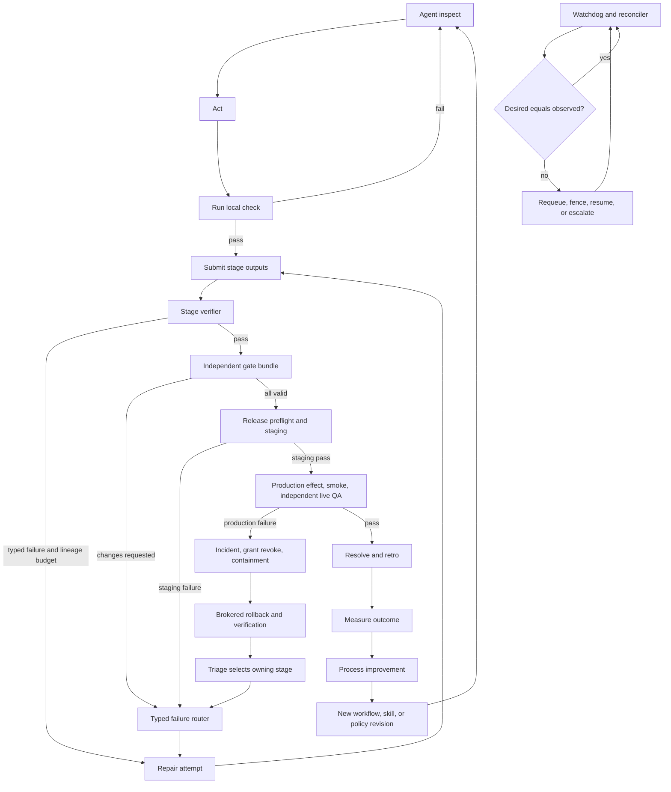

The six loops have different authorities: the agent may repair within its attempt; the stage verifier controls the exit contract; independent gates control review truth; the release loop controls environments and effects; the watchdog controls liveness/reconciliation; and retro changes only future versioned process definitions.

#### Loop contracts

| Loop | Trigger | State read | Permitted action | Stop/escalation |
|---|---|---|---|---|
| Within an agent run | Agent has not met its declared goal/check | Current stage context, workspace, command results | Inspect, edit, run checks, checkpoint | Turn/time/tool budget or cancellation; never self-declare protected pass |
| Stage verification and repair | Attempt submits output or times out | Entry/exit contract, output digests, verifier results, stable lineage, generation and repair facts, plan/policy revision | Pass attempt or atomically consume lineage/generation capacity and create the typed repair route | Any applicable lineage/generation/no-progress bound, then one escalation |
| Independent review/gate | Review becomes ready | Current input digest, policy, evidence, required perspectives, mandatory stage gates, execution/nonpassing facts | Execute each required perspective once; pass/fail/changes/abstain; Commander may propose a policy-permitted evidence-backed amendment | One current all-perspective pass plus current stage gates, or any declared exhaustion/deadline/conflict/operator-only gate |
| Release/staging/production | Release candidate ready | Gate snapshot, release digest, environment state | Grant effect, deploy, verify, rollback/contain | Production failure always incident; no quiet retry |
| Watchdog/reconciler | Timer, heartbeat loss, outbox lag, state mismatch | Desired jobs/runs, leases, cursors, runners, receipts | Fence, requeue, replay, alert, reconcile | Bounded recovery; unknown state is loud |
| Retro/process improvement | Release verified or incident resolved | Expected/actual telemetry, evidence, attention, defects, costs | Create improvement/no-change record; publish new revisions | Effectiveness window closes only with measured subsequent outcomes |

### Test and evidence matrix

Evidence is current only while its declared inputs, environment class, verifier authority, and expiry remain valid.

Each row states a stage's **ordinary** path, entry contract included. A stage whose pinned definition
declares a skip predicate may instead become ready on that predicate and complete on its skip slot set,
owing none of the evidence in its row; and any row whose entry names an artifact of a stage that was
skipped is entered on that stage's skip proof instead. Both rules are in
[skips and non-software runs](#skips-and-non-software-runs).

| Major stage/fact | Verifier | Required evidence | Invalidation trigger | Failure route |
|---|---|---|---|---|
| Intake durability | API integration test + synthetic source | Accepted command ID, committed inbound event, outbox row, create/link result | Hash-chain failure, missing outbox, source dedupe conflict | Quarantine and operations incident if accepted response was returned |
| Think/plan | Commander plus policy-selected Engineering Manager/operator | Versioned documents, decision references, criteria draft, dependency/risk record | Plan/decision digest change | Repeat plan or operator decision; downstream invalidation |
| Design | Designer/Engineering Manager/CSO and operator where required | Approved mockup/design/architecture/threat-model revision and verdicts | Design digest or scope change | Design/plan route |
| Implementation | Agent inner loop + trusted build runner | Candidate digest, source revision, build output, checkpoint, change manifest | Any source/dependency/config digest change | New implementation attempt |
| Local tests | Deterministic trusted runner | Command, exit status, test report, environment/image digest, source digest, attestation | Source/test/config/image change or expiry | Implementation or environment repair |
| UI QA | Independent QA | Real user-flow steps, visible data, every control outcome, screenshots/video, tenant-isolation identity | UI/API/data fixture/deployment digest change | Design or implementation |
| Code review | Independent Review | Review report against coding standards, input diff digest, resolved findings | Diff or relevant policy change | Implementation/plan |
| Security review | Independent CSO | Threat model, authz tests, secret/taint/egress findings, input digest | Security-relevant change or policy update | Design/implementation; new boundary -> operator |
| Documentation | Independent doc/code-truth check | Doc revision, referenced API/code digests, link/check command results | Referenced behavior changes | Documentation or implementation |
| Release preflight | Release controller | Release manifest, gate snapshot, migration/rollback tests, capacity and secret-ref health | Included change/gate/environment policy change | Owning stage; no grant |
| Merge | SCM integration/effect broker | External merge audit ID, main revision, included digest | Revert/new merge | New release candidate |
| Staging deployment | Effect broker + environment observer | Grant, receipt, external deploy ID, observed digest, logs | New deployment or config drift | Deploy repair or incident on mismatch |
| Staging QA | Independent QA/e2e runner | Live staging URL, user flow, screenshots, API/e2e results, deployed digest | Deployment/config/data change | Implement/design/deploy route |
| Production deployment | Effect broker + external reconciliation | Short-lived grant, receipt, target, release digest, external audit ID | New deployment, receipt mismatch, policy revocation | Incident |
| Production smoke/live QA | Independent live verifier | Real URL/probes, critical user flow, screenshot/telemetry, exact production digest | New deployment, drift, expiry | Incident, rollback/containment, triage |
| Resolution | Server command | Active criteria-to-evidence map, valid gate set, terminal workflow and delivery facts, retro link | Any dependency invalidation before close | 422 unmet list and exact stage route |
| Runner recovery | Reconciler/conformance test | Lease expiry, new fencing token, replay cursor, checkpoint restore, rejected stale result | Missing cursor/checkpoint or conflicting live lease | Quarantine runner and escalate recovery |
| Retro improvement | Commander/owner plus analytics query | Baseline, subsequent comparison window, defect/attention/cost data, linked change | Metric definition or cohort change | Recompute or evidence-backed no-change |

### Transition transaction

For a stage transition, the server:

1. Authenticates the command and tenant scope.
2. Returns an exact idempotent replay if `(principal, client_command_id, request_hash)` already exists.
3. Locks the workflow run and relevant stage instance, compares expected versions, and re-evaluates dependencies.
4. Loads the pinned workflow/risk/gate policy and current digest/evidence graph.
5. Resolves the required slot set from the requested disposition — the ordinary set for `succeeded`, the
   declared skip set for an evidence-backed `skipped`, the latter only while the stage's pinned skip
   predicate holds on accepted durable facts — then verifies every slot of that resolved set is filled by
   current type-matching Evidence, verifies the signing Evidence/principal/assignment binding under that
   set's signing slot, then verifies the remaining stage exit contract and, on the ordinary path, valid
   required gate instances. On the skip path the exit contract is the skip predicate plus that filled,
   signed skip set and nothing else, and no stage gate is activated, so there is no gate instance to
   verify.
6. Appends the stage/workflow events, invalidations, new ready-stage facts, attention/outbox entries, and command result atomically.
7. Emits `NOTIFY` only after commit as a hint; consumers drain the durable outbox by cursor.

The transition never shells out to a runner inside the database transaction. External execution is represented by a committed durable job and occurs afterward under a lease.

## Technical architecture

### System context

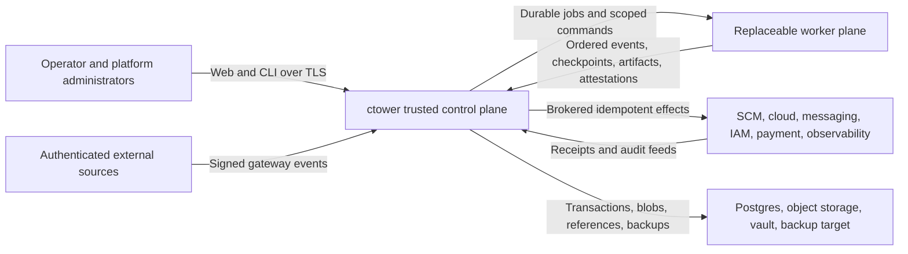

ctower is the sole writable orchestration source of truth. Humans and gateways submit commands; workers execute leased jobs; external systems remain authoritative for their own effects but must return audit identifiers. The record tier is inside the trusted boundary and is reconstructable without any worker.

### Logical containers and modules

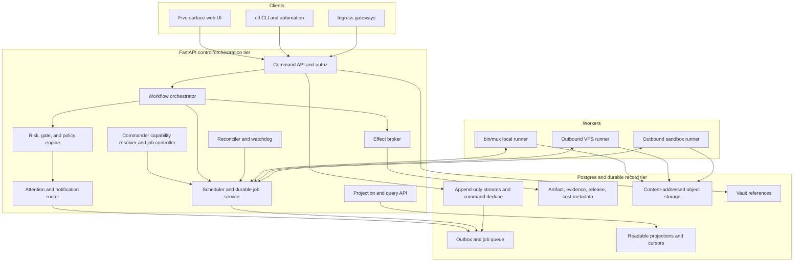

The first deployment may run these modules in one FastAPI process plus supervised background workers, but
their interfaces remain explicit. The Commander is one durable accountable principal expressed as a
sequence of fresh leased reasoning jobs, not an immortal context window. At each wake, the controller
filters published profiles by Commander capability, trust, tool/context fit, health, and policy, selects the
highest operator-approved reasoning-capability rank, and records the candidate set, exclusions, winner,
policy revision, and rationale. Current Opus-class or Codex xhigh-class profiles may qualify; price breaks a
tie only after capability/health/reliability. If the selected profile fails, the next strongest healthy
eligible profile continues the same orchestration lease and plan. Fable is eligible only for
non-authoritative scout/summarizer/polling jobs and cannot acquire the Commander principal or a final gate.
The scheduler and reconciler are deterministic services; model calls do not own liveness truth.

### Trusted control plane, record tier, and replaceable worker plane

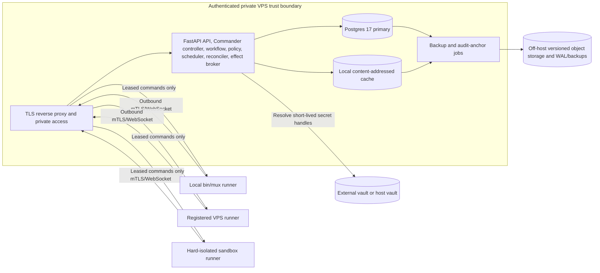

The VPS is private and authenticated; no runner needs an inbound public port. The record tier is trusted but separately privileged: the service role cannot run migrations or update/delete append-only records. Local `bin/mux` is the first runner implementation. Remote and sandbox runners wait until the same protocol passes conformance and placement policy requires them.

### Durable job, run, evidence, gate, and effect sequence

```mermaid
sequenceDiagram
    participant W as Workflow orchestrator
    participant A as Authenticated runner API / job service
    participant D as Postgres record tier
    participant R as Runner
    participant O as Object storage
    participant P as Gate/policy engine
    participant B as Effect broker
    participant X as External target

    W->>A: create accepted job command
    A->>D: append job event and outbox transaction
    R->>A: authenticated claim request under workload identity
    A->>D: atomic lease and fencing transaction
    A-->>R: lease ID, deadline, fencing token, command cursor
    R->>A: authenticated run.started and ordered event frames
    A->>D: validate token/cursor; append events
    R->>A: declare artifact digest and request upload
    A-->>R: scoped digest-bound upload URL
    R->>O: upload artifact bytes by digest
    O-->>R: durable object confirmation
    R->>A: authenticated terminal result, artifact manifest, attestation
    A->>D: validate token; append terminal/object metadata
    D->>P: evaluate evidence and required gate instances
    P->>D: append immutable verdict attempt
    W->>D: request protected effect for exact release digest
    D->>B: issue short-lived grant after policy pass
    B->>X: idempotent effect with scoped credential
    X-->>B: external audit ID and observed result
    B->>D: immutable effect receipt
    D-->>W: transition may continue
```

Every durable boundary is visible. Runners call only authenticated control-plane APIs; only control-plane
modules hold record-tier credentials and write Postgres. A scoped presigned object upload stores bytes but
cannot create object metadata, evidence, or workflow truth. A runner finishing does not advance the workflow
by itself; evidence and gates do. The effect broker obtains authority only after the policy snapshot passes
and records the external result before delivery state can advance.

### Required stack and deployment posture

- **Runtime:** The two-language decision and exact compatibility gate are specified below. I1 uses one application worker; database leases/advisory locks still prevent duplicate ownership.
- **Database:** Postgres 17; psycopg3 with explicit pools; plain SQL migrations, folds, and commands. No ORM is required. No generic event-sourcing framework is introduced in the first two increments.
- **Migrations:** a one-shot `ctower_admin` migrator under a global advisory lock with immutable migration checksums. The long-running `ctower_svc` role has no migration credentials.
- **Messaging:** transactional outbox and job tables are durable. Postgres `NOTIFY` is a hint that prompts a drain; startup and periodic cursor-based drains guarantee recovery.
- **Objects:** S3-compatible content-addressed storage in target topology; a verified local digest-addressed store is acceptable for Increment 1 only if it is backed up off-host. Object keys are `sha256/<first-two>/<full-digest>` and writes verify digest before commit.
- **Secrets:** vault or OS credential-store references. The server resolves a short-lived handle only for an authorized execution/effect boundary. Database fields never accept raw credentials.
- **Networking:** TLS; authenticated private access such as Tailscale/VPN or an equivalent private reverse proxy. I2.4 adds the server-side browser session, CSRF protection, and no API token in browser JavaScript boundary.
- **Browser:** I2.4 uses a React 19 client-only SPA, React Router 7 Declarative Mode, and Vite static output.
  Node 24/pnpm are build/test tools only; production has no Node/SSR server. The private TLS edge serves
  immutable assets and proxies browser-session/API paths on one HTTPS origin. The web imports only the
  generated TypeScript client and owns no authorization, policy, projection, or domain cache.
- **Interfaces:** OpenAPI is the command/query contract. The web UI and `ctl` CLI invoke the same server endpoints. Authorization, state validation, risk, gates, and transition logic are always server-side.
- **Observability:** OpenTelemetry-compatible structured logs, traces, and metrics with correlation/causation IDs. Raw execution logs live in object storage, not in the application log stream.

### Language, Module depth, and repository-quality architecture

#### Language allocation and runtime acceptance

ctower deliberately uses two implementation languages, not a language per subsystem:

| Surface | Language | Architectural reason |
|---|---|---|
| `ctower-kernel`, API, control worker | Python | Strict runtime contracts and explicit transactions suit policy-heavy authority. |
| Runner, `ctowerctl`, release helper | Python | Shared generated contracts and failure semantics; the privileged helper stays a tiny typed Unix-socket process. |
| Browser web application | TypeScript | Strict browser models, accessibility tooling, and generated client; no authority. |
| Future narrow helper | Go or Rust only after a new decision | Requires measured need and an already justified Seam; neither is in I1/I2. |

L0 imports the full FastAPI/Pydantic-mypy/psycopg3/uv/Ruff/mypy/OpenTelemetry/codegen/release lock, builds
Linux artifacts, and runs contracts on standard CPython 3.14.6. An incompatibility record selects 3.13.14;
there is no silent or free-threaded fallback. D6's old 3.12 pin remains historical authority until that
evidence and an append-only supersession are accepted.

#### Deep Module rule

A **Module** owns a substantial cohesive decision or authority and hides it behind one small, explicit
**Interface**. Its private implementation is replaceable without teaching callers its internals. A public
**Seam** exists only where two independently valuable real Adapters need the same contract; a fake alone
does not earn a Seam. Every new top-level Module must pass the deletion test: removing it would otherwise
redistribute real complexity across multiple callers. `utils`, `common`, `helpers`, `manager`,
package-per-noun, pass-through re-export, and service-per-table Modules are forbidden by default.

The highest-risk Modules use these shapes:

| Module | Public Interface shape | Hidden implementation and boundary |
|---|---|---|
| Workflow | `evaluate(WorkflowContextSnapshot, WorkflowCommand) -> WorkflowDecision` | Graph legality, readiness, risk/budget/lineage evaluation, typed routes, and invalidations. It receives immutable facts and returns append/effect/job/Attention intents; it does not import Work, Proof, Runtime, or Effects persistence. |
| Proof | `decide(ProofCommand) -> ProofDecision` | Criteria, object/artifact digest validity, evidence DAG, attestations, gate independence, freshness, and invalidation. Storage/scanner/signer observations cannot directly pass a gate. |
| Runtime | Command-oriented offer/claim/renew/frame/reconcile and CommandGuard decisions | Durable jobs, leases, fencing, manifests, cursors, checkpoints, placement, final pre-dispatch command authorization, and terminal acceptance. Runner SDK owns framing/composition and Adapter enforcement but has no ticket or database authority. |
| Effects | Grant/apply/inspect/reconcile/rollback decisions over a narrow provider port | Desired/observed state, receipts, releases, incidents, ambiguity, rollback. Provider mechanics never decide authorization or delivery truth. |
| Repository Policy | `verify(repository_root, profile) -> PolicyReport` | One parsed repository model, ownership graph, private-import rules, source budgets, generated drift, telemetry rules, and expiring exceptions. Hooks, `just`, and CI are thin callers. |

Catalog, Work, Attention, and Projections remain separate deep Modules because each passes a different
deletion test. There is no `Factory`, `TaskManager`, `NotificationCenter`, second scheduler, generic
provider manager, or package-per-Adapter authority.

#### Typed boundary and source-design rules

- Every authored Python function and method is typed. Strict mypy with the Pydantic plugin is the
  authoritative static gate. `Any` is forbidden at public Interfaces; arbitrary external JSON is a
  recursive tainted value until a named validator returns a typed model.
- Every untrusted or cross-process contract—HTTP, event, CompanyBundle, Catalog payload, spool item,
  runner frame, checkpoint/evidence manifest, provider observation, effect grant/receipt, and telemetry
  context—is a strict immutable Pydantic v2 model with extra fields forbidden. Internal immutable values
  may use frozen typed dataclasses; serialization inheritance does not invade pure domain decisions.
- TypeScript uses `strict`, unchecked-index safety, exact optional properties, implicit-override/return and
  switch checks, unknown catch variables, exhaustive unions, no explicit `any`, no floating promises, and
  no console/debug output. Generated clients are the only web/API contract path.
- Ruff is the only Python linter and formatter; Prettier is the only TypeScript formatter. Formatting is
  never a review debate. Mypy, Ruff, TypeScript, ESLint, generated-code, secret, architecture, test, and
  coverage failures are merge-blocking.

The Repository Policy Module counts authored logical lines with language-aware parsing rather than raw
`wc -l` and applies the following default budgets:

| Rule | Warning | Hard failure |
|---|---:|---:|
| Authored executable source or test file | >500 logical lines | >600 logical lines |
| Function or method | >40 logical lines | >60 logical lines |
| Cyclomatic complexity | >8 | >10 |
| Control-flow nesting | >2 | >3 |
| Public exports from one Module | >15 | >25 |
| Public methods on one class | >10 | >15 |
| Direct Module dependency fan-out | >8 | >12 |

Generated/vendor code, lockfiles, binary assets, machine-emitted reports, captured protocol fixtures, and
golden snapshots use digest/drift/compile/size gates rather than LOC. Declarative schemas/workflow packs use
schema-specific validation. Hand-authored migrations and tests are not blanket-exempt. Splitting one
oversized file into forwarding/re-export files still fails the pass-through, fan-out, deletion-test, and
Interface-locality rules.

There is one exception store, `tools/checks/exceptions.yaml`. An exception binds an ID, exact rule, exact
path, explicit temporary limit, owner, reason, ctower ticket, independent approver, creation date, and an
expiry no later than 30 days. CI fails expired or unmatched exceptions and reports all active ones. Inline
`noqa`, type/ESLint/coverage disables, and secret-ignore entries must cite an exact rule/error code and
exception ID. Cross-tenant/auth/fencing invariants, fake proof, direct record-tier access from an untrusted
plane, secret findings, and generated drift are non-waivable.

#### Deterministic generation and one dependency law

Authored schemas live only under `contracts/`. Every generator records input, tool/version, command, and
output digests in `generated/.generated-manifest.json`; generated files carry a do-not-edit header. The
read-only codegen gate regenerates into a temporary directory, compares normalized bytes/manifests,
validates schema references and operation IDs, and compiles/typechecks both language clients. Hand edits,
duplicate authored schemas, missing outputs, or nondeterminism fail.

Imports follow one acyclic ownership policy: authored contracts generate clients/models; kernel Modules
may depend only on allowlisted public Module Interfaces and generated Python models; applications depend on
Interfaces/generated clients; runner SDK depends on generated runner contracts; web depends on the
generated TypeScript client; provider Adapters depend only on their port and generated contracts. No
runner, web, CLI, YAML pack, provider, extension, or generated client may import/connect to record-tier
persistence. A new cross-Module edge changes executable policy in the same reviewed change.

#### Observability from day one

Observability explains system behavior; it is never Record authority or Proof. Every process boundary
carries a strict, frozen `TelemetryContext` generated from an authored contract, with trace/span flags,
correlation and causation IDs, tenant/actor/command identity, and applicable ticket/workflow/stage/job/
runner/fence/effect/component/deployment IDs. Missing required context is a validation failure. Prompts,
secrets, user content, artifact bytes, and high-cardinality IDs never become metric labels.

Public Module Interfaces and real Adapter Seams are instrumented at their wrappers. Durable asynchronous
work uses span links rather than a days-long parent span. Kernel implementations may depend on the
OpenTelemetry API or typed context only; SDKs/exporters live in application composition roots. Structured
JSON logs carry event/outcome/reason and trace/correlation context, while raw execution streams remain
content-addressed artifacts. Traces/metrics export through an owned collector; export failure cannot roll
back a Record transaction, but it makes completeness visibly unhealthy. Because the Python OTel logging
surface is less stable than traces/metrics, domain code uses a stable typed log record and does not couple
to exporter SDKs.

Conformance drives one golden command from API/CLI ingress through Record/outbox, worker, runner, Proof,
Effects, and Projections; proves context continuity and required low-cardinality metrics; asserts no secret
or content in telemetry; and stops/restarts the collector to prove bounded buffering and a visible
`telemetry_export_failed` health state. Protected effects, auth denials, gate decisions, CommandGuard
blocks/operator grants/enforcement failures, incidents, rollbacks, stale-fence rejections, proof denials,
and reconciliation failures are retained/sampled at 100% without raw command or secret content.

#### One local and CI verification contract

The repository exposes two non-mutating commands:

```text
just check   = warm <2 minute gate: Ruff format/lint, strict mypy, Repository Policy fast profile,
               TypeScript format/lint/typecheck, worktree secret scan, repository/contracts/Module tests

just verify  = just check + deterministic codegen + full Repository Policy + all Interface/conformance/
               acceptance/chaos tests + branch coverage + Playwright + history secret scan + clean diff
```

“All” is evaluated against the committed, versioned `tools/checks/expected-suites.toml` for the current
contract/increment scope. Each entry names the stable backlog owner, test path/command, applicable phase,
and required/deferred status. `just verify` fails when any suite declared required for the active manifest
is missing, empty, skipped without an exact exception, or failing; it reports later-phase suites as
`not yet required`, never as passing. CT-L0-007 creates the command and closes against the L0-007 manifest;
each later backlog item expands the same manifest in the change that makes its suite current. Thus one
non-mutating verification contract grows monotonically without no-op placeholder tests or a dependency
cycle that requires I1/I2 suites before their owning contracts exist.

Pre-commit runs syntax/hygiene, Ruff, Prettier/ESLint on staged web files, Gitleaks/private-key detection,
and the staged Repository Policy profile. Pre-push invokes `just check`. Required CI executes frozen uv and
pnpm installs, `just check`, `just verify`, and security/release jobs from pinned action/tool revisions;
release consumes the exact verified commit/artifacts and does not rebuild from mutable inputs. `SKIP` or a
local hook bypass never waives required CI.

Tests use the **Interface as the test surface**. Module tests import only the public Interface and cover
success, denial, idempotency, stale state, restart/rebuild, authorization, and applicable state/property
cases. Adapter conformance is shared by every real implementation of a Seam. Acceptance tests use generated
clients and real process boundaries, not database/private imports. Authored Python starts at 90% branch
coverage and TypeScript at 90% lines/85% branches, while Record, Access, Workflow, Proof, Runtime fencing,
and Effects grant decisions target complete decision-branch coverage. Coverage supports these behavioral
gates; it never substitutes for them.

#### Pinned Increment 2 staging, production, and self-upgrade boundary

Increment 2 pins one named live adapter alongside its deterministic fake:

| Record | Pinned identity and isolation | Provider action / audit |
|---|---|---|
| Project | `project_key=ctower`; repository record pins the source provider/repository ID | Release identity is `release_id + source_digest + bundle_digest + schema_revision + config_digest`; every candidate names a verified rollback predecessor. |
| Provider target | `provider_target_key=vps-primary-systemd`; adapter `systemd-vps/v1` | Allowlisted actions are `release.install`, `service.switch`, `service.restart`, `service.observe`, and `service.rollback`; provider audit is the release supervisor’s hash-chained receipt journal. |
| Staging environment | `environment_key=ctower-staging`; separate `ctower-staging` Linux user, service unit, release symlink/root, database/schema, object prefix, secret refs, port, and private endpoint record | Deploy action targets only `ctower-staging.service`; independent QA loads the endpoint from the environment record and proves exact release digest. |
| Production environment | `environment_key=ctower-production`; separate `ctower` Linux user, `ctower.service`, release symlink/root, production database/object prefix/secret refs, and private live endpoint record | Deploy/rollback targets only `ctower.service`; smoke plus an independent live-QA job must prove the exact digest and real URL. |

`ctower-release-supervisor.service` is a root-owned, separately supervised helper outside the FastAPI
process being upgraded. It exposes an allowlisted root-owned Unix socket to the effect broker identity; the
application and general runners hold neither root nor `systemctl`/release-directory credentials. A
short-lived grant binds environment, action, release/bundle/config/schema digests, predecessor, maximum use,
and idempotency key. That application-authored digest authorizes intent only; it does not establish artifact
provenance. Before installation, the supervisor independently verifies bytes/digest, signature and
attestation envelope, SBOM/provenance subjects, and trusted builder/workflow identity against the root-owned
policy installed at `/etc/ctower/release-trust-policy.yaml`. The application/effect broker cannot write that
file or its trust keys. Exact schemas live in `contracts/effects/release-attestation.schema.json`; the
deployable policy source lives in `deploy/systemd/release-trust-policy.yaml` and is installed root-owned.
Unknown key/builder, missing or mismatched subject, untrusted builder workflow, expired/revoked signature,
or grant/attestation digest mismatch appends a refusal to the root journal and performs no install/switch.
Only after verification does the supervisor fsync a `started` receipt, install into a digest-addressed
directory, atomically switch the environment symlink, restart only the allowlisted unit, probe the observed
release ID, and write a terminal receipt. The external audit ID is the journal sequence/hash.

For ctower self-upgrade, the supervisor remains alive while FastAPI drains and restarts. If the new service
does not report the expected release/health before deadline, the supervisor switches to the recorded
predecessor, restarts, verifies rollback on the environment endpoint, and appends the rollback receipt before
the incident controller may triage. On restart, ctower resumes from `provider_audit_cursors`, imports any
supervisor receipts written while it was down, and reconciles the original effect grant/idempotency key;
missing, duplicated, or mismatched journal entries fail closed. Updating the supervisor itself is not part
of the golden ticket and requires its own operator-reviewed infrastructure release.

The adapter contract ships both a deterministic fake `systemd-vps/fake` (crash points before/after each
receipt/symlink/restart step) and live `systemd-vps/v1` evidence from the named staging and production
records. Increment 2 cannot exit on fake-provider evidence alone.

### Logical responsibilities inside deep Modules and composition roots

These are logical responsibilities and process adapters, not additional public Modules or
microservices. The owning-Module column is normative; implementation stays behind that Module's small
Interface or in the named application composition root.

| Logical responsibility | Owning deep Module / composition root | Owns | Must not own |
|---|---|---|---|
| Ingress adapter | `ctower-api` composition -> Access/Work Interfaces | Source auth, normalization, dedupe keys, taint/quarantine, attachment upload, inbound command | Ticket classification truth outside the command response; direct runner prompts |
| Command API | `ctower-api` composition -> Access/Record Interfaces | Authentication, authorization, request validation, idempotency, CAS, append transaction, stable error model | Long-running execution inside transactions |
| Commander capability resolver/controller | Workflow with Catalog/Runtime Interfaces | Strongest-healthy profile resolution, durable per-ticket orchestration accountability/lease, fresh reasoning jobs, context manifests, versioned plan/perspective/bound/rationale proposals, response to stage outcomes through terminal verification | Heavy implementation, canonical state in model memory, consumed-count authorship, direct database writes, gate verdict forgery, reset, or bypass of pinned policy bounds |
| Workflow orchestration | Workflow | Pinned graph, readiness, immutable accepted/refused transition evaluations, stage/attempt transitions, typed owning-stage routes, invalidation, terminal contract | Runner process lifecycle internals or human UI state |
| Policy evaluation | Workflow | Arbitrary package facts, perspectives, finite anti-spin bounds, stage-gate requirements, stable lineage normalization/split policy, human-only rules, policy version | Platform-hardcoded engineering tiers or self-reported lineage/counters as authority |
| Gate evaluation | Proof; Workflow owns only round/route accounting | Gate instances, reviewer assignment, sealed access, verdict attempts, conflicts, expiry/invalidation; Workflow consumes immutable Proof decisions into round facts | Artifact mutation, plan-authored consumed counts, or external effects |
| Scheduling/job control | Runtime | Durable accepted jobs, priorities, capability matching, leases, fencing, command cursors, cancellation, and versioned CommandGuard decisions over normalized execution plans | Ticket ownership, gate verdicts, or claims that command filtering is sandbox containment |
| Reconciliation/watchdog | Runtime for jobs/cursors; Effects for receipts; Projections for view watermarks | Desired-vs-observed state, lease expiry, cursor/receipt/projection reconciliation, Project Delivery projection event folds/hourly freshness, synthetic checks behind the owning Interfaces | Guessing success from process absence, advancing work from a heartbeat, or creating a cross-Module manager |
| Effect brokerage | Effects | Short-lived grants, just-in-time credential resolution, idempotent external action, immutable receipt | Standing credentials on runners; approving its own policy |
| Attention/notification | Attention | Durable action items, ranking, dedupe, recipient routing, delivery retries, acknowledgment | Inferring separate competing Needs You truth per client |
| Artifact/evidence handling | Proof | Digest verification, object metadata, document revisions, evidence dependencies, trust/quarantine | Treating any uploaded byte as valid evidence |
| Projection/query handling | Projections | Home, Board, Ticket, Fleet, Analytics, contextual Project Delivery projection, search, activity, health/completeness | Authoritative mutations, manual delivery status, or ticket-count completion claims |
| Audit/analytics | Projections for KPI/cost/retro reads; Effects for external reconciliation | KPI query versions, external reconciliation, cost allocation, retro comparison | Rewriting source events to improve metrics or becoming a second audit authority |

### Greenfield monorepo and deep-Module boundaries

Implementation starts in a new repository named ctower. Mission Control, Paperclip, and Crabbox source are
provenance only and are not copied into the trusted kernel. The control plane is a Python modular monolith:
API and control-worker entry points share one kernel artifact; runner, browser, CLI, and root release
supervisor are separately deployable contract clients/Adapters.

The repository has these durable homes; subtrees evolve behind their owned Interfaces rather than being
frozen by a mechanical file listing in this document:

| Root | Normative owner and contents |
|---|---|
| apps/ | API/control-worker composition, runner daemon, five-surface web, and ctowerctl entry points |
| packages/ctower-kernel/ | Access, Record, Catalog, Work, Proof, Attention, Workflow, Runtime, Effects, declarative extension registry, Projections; exact SQL migrations |
| packages/ctower-runner-sdk/ | Earned local runner component Interfaces and shared conformance helpers |
| packages/ctower-systemd-vps/ | Root-supervisor Effect Provider Adapter and fault-injection test Adapter |
| contracts/ | Sole authored cross-process/schema authority, partitioned by domain/http/workflow/evidence/runner/effects/company/observability |
| packs/ | Reviewed Workflow, Execution/Gate/Evidence policy, persona, profile, skill, capability, and UI-slot resources |
| generated/ | Manifested Python/TypeScript clients/models plus the generated traceability index; never hand-edited |
| tests/ | Repository, contract, Module-Interface, earned-Adapter conformance, acceptance, chaos, fixture, and E2E evidence |
| deploy/, images/ | Private-VPS/systemd/Postgres/observability manifests and reproducible control/runner/web artifacts |
| tools/ | One Repository Policy implementation, code generation, migration, release, and verification entry points |
| docs/ | Runbooks, operations, security, contributing/coding standards; never a competing product/system spec |

Dependency direction is acyclic:

~~~text
contracts -> generated models/clients -> apps
packs -----^                         -> API composition -> kernel Interfaces
runner app -> runner SDK -> generated runner contracts
effect Adapter -> Effects port + generated effect contracts

FORBIDDEN: kernel -> app/web/CLI/runner/provider implementation
FORBIDDEN: web/CLI/runner/provider/import/extension -> record-tier connection
FORBIDDEN: generated output -> policy/server implementation
~~~

Work owns ticket/lifecycle/custody/priority/blocker commands; Workflow owns generic graph/readiness/routes
and policy counters; Proof owns criteria/artifacts/evidence/gates; Runtime owns jobs/leases/fencing/cursors
and only the local execution Seams earned by two real Adapters; Effects owns grants/receipts/releases/
incidents; Projections owns all five rebuildable surfaces and contextual Project Delivery projection rows. There is no Factory, TaskManager, generic provider
manager, status service, or service-per-table authority.

### Executable authority and requirement traceability

This specification owns semantics; executable artifacts own exact representations:

| Exact detail | Sole authored location | Accountable owner |
|---|---|---|
| Tables, columns, constraints, privileges, indexes | packages/ctower-kernel/migrations/ | Record/owning Module + independent database/security review |
| Domain/event/object schemas and canonical vectors | contracts/domain/ and contracts/evidence/ | Record/Work/Proof |
| Workflow, stage, plan, counter, lineage schemas | contracts/workflow/ | Workflow |
| Concrete Workflow and policy values | packs/workflows/ and packs/policies/ | Package owner + Workflow/Proof review |
| HTTP operations, problem types, pagination | contracts/http/openapi.yaml | API composition + owning Module |
| Runner frames and earned component contracts | contracts/runner/ | Runtime |
| Effect grants/receipts/provider operations | contracts/effects/ | Effects + CSO |
| CompanyBundle/component resources | contracts/company/ and contracts/components/ | Catalog |
| Generated clients/models | generated/ with generated/.generated-manifest.json | Codegen; byte-for-byte drift gate |
| Acceptance/conformance behavior | tests/acceptance/, tests/conformance/, tests/chaos/ | QA plus owning Module/Adapter |
| Deployment/runtime units | deploy/ and images/ | DevOps + CSO |

`contracts/traceability/sources.json` is the one authored traceability link map. It links the current
normative contract schemas and packages to stable SPEC section, AC-*, and INV-* IDs; individual artifacts
do not embed or compete as authoritative link maps. `tools/checks` requires every current normative contract
schema and package exactly once, resolves every ID, verifies every declared artifact exists, and fails
omissions, unknown IDs, duplicate authored homes, missing artifacts, generated drift, or manifest drift. It
generates the sole derived index at `generated/traceability-index.json` and owns its input/output digest in
`generated/.generated-manifest.json`.

OpenAPI operations, migrations, deployment manifests, and other future artifact classes enter the same
authored map and generator coverage in the change that introduces them. Until then, the index does not claim
those absent classes are covered or that every AC already has executable evidence. An AC gains executable
evidence ownership only when its real test/evidence artifact is introduced and mapped. The generated index
is navigation, not authority. Git history retains the removed v1.6 endpoint, payload, column, and
repository-tree illustrations.

### Persistence authority

Exact physical DDL lives only in kernel migrations and its generated catalog index. The human contract is:

| Ownership class | Rule |
|---|---|
| Authoritative current/configuration | Stable identities and current pointers mutate only through authenticated idempotent commands/CAS |
| Immutable revision/fact | Published components/plans, events, occurrences, counters, verdicts, receipts, aliases, and evaluations are insert-only; corrections append successors/tombstones |
| Rebuildable projection | Home/Board/Ticket/Fleet/Analytics, Project Delivery projection rows, delivery summaries, counters, and watermarks rebuild from facts and are never command input |
| External bytes/effects | Object/provider systems own bytes/effects; ctower retains immutable digest/provenance/receipt metadata and reconciles rather than infers |

All public IDs are UUIDv7 or permanent human ticket IDs; time is server UTC. Every tenant-scoped table has
non-null tenant identity and tenant-consistent references. Every actual FK target, polymorphic subject
registry, uniqueness/partial constraint, immutability privilege, and projection owner must appear in the
migration-generated catalog and match the ownership manifest. Required authority cannot hide in anonymous
JSON. Component kinds share component_definitions/component_revisions rather than parallel revision tables.
Service roles cannot update/delete immutable records; web, CLI, runners, providers, extensions, and importers
have no direct database credential.

The minimum record families are identity/bootstrap/scope; inbound/command/ticket/lifecycle/assignment/
priority/blocker; Catalog/component/bundle; Workflow/stage/plan/lineage/counter; Runtime/job/lease/run/
cursor/checkpoint; Proof/object/artifact/evidence/gate; Attention; change/release/deployment/verification/
grant/receipt/incident; Routine/cost/retro; outbox/projection/provider-audit/anchor/reconciliation. The
generated DDL catalog, not this list, is exhaustive.

### Canonical event and command contract

Exact event JSON Schema and cross-language vectors live under contracts/domain/events/. Every event binds
event/tenant/stream/aggregate identity, server sequence/time, schema kind/version, authenticated actor,
client command/request digest, causation/correlation, origin, typed links/payload, previous hash, and hash.
Canonical bytes use RFC 8785 over all fields except hash; timestamps are server UTC RFC 3339 with six
fractional digits, digests are lowercase sha256, and hash-critical schemas use integers/decimal strings
rather than floats. Sensitive payload bytes are object-referenced while the non-sensitive envelope remains
hashable.

All mutations require Idempotency-Key (canonical client_command_id); state-dependent commands require
expected_version. Success returns the command ID, affected versions, event IDs, acceptance/durability state,
and projection watermark. Failure is RFC 9457 with stable type/code and zero partial mutation. Exact replay
checks idempotency before CAS and returns the original outcome; a same-key different request is conflict.
Lossless command-result tombstones outlive the maximum 30-day offline replay horizon.

Exact operations live only in contracts/http/openapi.yaml. The required operation families cover bootstrap,
ingress, tickets/priority/typed intents/custody/criteria, Workflow/plans/stages, objects/evidence/gates,
Attention, jobs/steer/cancel, releases/effects/incidents, runners, components/CompanyBundle, reconciliation,
streams, and health. The OpenAPI registry includes CLI mapping metadata; parity CI fails any non-exempt
mutating operation without a ctowerctl mapping. Web and CLI use generated clients and never reimplement
authorization, readiness, policy, or transition logic.

### Client acknowledgement and offline behavior

A future browser command is never shown as accepted merely because Fetch was invoked or optimistic UI changed.
Before send it receives a stable local idempotency key and renders visibly as unsent/sending. It becomes
accepted only on the server's authoritative accepted response; durability_pending, disconnect, timeout, or
reload remains visibly unsent/pending retry and uses the same key. The browser preserves the draft/key in
origin-scoped storage until accepted or explicitly discarded, shows stale cached reads as stale, and never
projects an unaccepted command into canonical Board/Ticket truth. If safe local persistence fails, submit is
blocked and the draft remains visible.

ctowerctl's offline spool is a local durability boundary, not a plaintext convenience file. It uses an
OS-keyring-bound AEAD key, owner-only directory/files, single-writer locking, monotonic sequence/hash and
checksums, write-fsync-atomic-rename-directory-fsync, bounded size/retention, and redacted diagnostics.
Bootstrap tokens, resolved secrets, and reusable credentials are never spooled. A record is removed only
after an exact authoritative accepted response is durably recorded; ambiguous responses replay the same
key. Expired, corrupt, schema-unknown, unauthorized, or permanently rejected records move to a visible
quarantine with reason/evidence and require explicit disposition—never deletion or silent skip.

Outbox consumers follow the same fail-closed law. A malformed, schema-unknown, unauthorized, or repeatedly
failing message is durably marked outbox_poisoned with source row/digest, consumer, attempts, and reason;
the partition cursor does not advance past it, dependent projection/notification completeness becomes
STATE UNKNOWN, and no consumer invents success. An authenticated repair/replay or policy-authorized
tombstone decision is append-only and independently audited.

### Runner protocol

Exact frame schemas, command/event enums, compatibility vectors, and generated models live under
`contracts/runner/`; `tests/conformance/runner/` is the interface test surface. The human contract is:

- A runner initiates outbound mutually authenticated TLS. Duplex ordered transport is primary and HTTPS
  cursor polling is recovery; registration, protocol version, scope, capacity, rotation, drain, quarantine,
  and revoke are server-authorized.
- Every frame binds protocol/message/connection identity, direction cursor, job/lease, fencing token, time,
  type, and typed payload. Each side persists before broadcast, acknowledges a contiguous cursor, replays
  after reconnect, and deduplicates message identity.
- Offer is not lease; lease is not running; process existence is not completion. Only an atomic current-token
  claim creates a lease, acknowledged start creates running state, and a current-token terminal event or
  server reconciliation creates an explicit terminal outcome.
- Commands cover offer/lease, start/resume, steer, cancel, checkpoint, revoke/drain, and supervisor lifecycle.
  Steer is delivered only after harness ACK; injection success is not ACK. Every mutation carries one stable
  command ID and current epoch.
- Events cover acceptance/refusal, start, lease heartbeat, structured output, input ACK, log chunk/gap,
  artifact/checkpoint, terminal result, capacity/health, and typed reconciliation findings. Missing bytes are
  visible `log_gap`, never silently omitted proof.
- Lease expiry closes the old lease and increments fencing before requeue/loss policy. A stale runner may
  upload quarantined forensic bytes but cannot ACK commands, attach satisfying evidence, transition work, or
  perform effects.
- Every exercised start echoes the immutable local harness/supervisor/target/workspace/telemetry manifest and
  observed build/target incarnation before tools or secrets enable. Future remote/image fields extend the
  same envelope only after their Seams are earned.

#### CommandGuard at the harness dispatch boundary

Before I2 Runtime activation—or any resequenced checkpoint that first permits arbitrary harness command
execution—Runtime owns a versioned **CommandGuard** decision. Every registered local or remote Harness or
Supervisor Adapter that can launch, invoke, or submit a harness command enforces it at the last trusted
boundary before dispatch. No such Adapter may launch a process, invoke a shell, or submit a provider
command through another path. A direct path around the guard is an architecture and conformance failure,
not an implementation convenience.

The guard evaluates structured execution intent rather than raw text. Before policy evaluation it
normalizes the executable identity; argv or the explicit shell plan; normalized working directory; each
non-secret environment-resolution identity as its reference plus pinned version/digest, never the secret
value; parent traversal; glob expansion; symlink resolution; and every candidate target in the actual
dispatch namespace. These fields produce one canonical **normalized-execution-plan digest** covering the
executable identity, argv or explicit shell plan, normalized cwd, every non-secret environment-resolution
identity, and the exact resolved target set in that dispatch namespace. An unresolved, ambiguous, or broad
protected target yields `block` or `needs_operator`, never `allow`. Quoted examples, issue text, and other
non-executing data do not become commands merely because they contain a dangerous token. Conversely,
supported shell, privilege, build, task-runner, and provider wrappers cannot hide their resolved execution
intent; an opaque indirection with protected reach fails closed.

The versioned policy covers at least these accidental catastrophic-action classes and their supported
wrappers or indirection:

- recursive or broad destruction of filesystem root, a user home, a repository/workspace, or a target
  escaped through an empty expansion, parent traversal, glob, mount, or symlink;
- disk, filesystem, partition, or volume format/wipe operations;
- destructive database operations against protected instances, databases, schemas, or broad data sets;
- protected source-history or reference rewrite, including force/reset/clean operations outside an exact
  disposable scope; and
- cluster, container-host, cloud, or infrastructure destruction.

Safe cleanup is authorized by capability plus proven containment inside an exact disposable root. A
basename, command name, familiar cleanup script, or claimed temporary directory is never sufficient by
itself. The decision authorizes only the captured normalized resolution. At the final boundary the Adapter
must dispatch from that captured/pinned resolution or re-resolve it and atomically compare the resulting
normalized-execution-plan digest immediately before dispatch. Any mismatch, uncertainty, or inability to
compare performs zero dispatch and requires a new decision.

Each evaluation returns exactly `allow`, `block`, or `needs_operator` and appends an immutable decision
receipt. Runtime assigns one decision/dispatch-attempt identity for that proposed boundary use. Every
decision receipt, operator grant, and local or remote enforcement receipt binds that identity and the same
normalized-execution-plan digest plus the ticket, job, run, principal, exact Harness, Supervisor, provider,
and target identities, policy revision, and its evaluation or enforcement time. A typed not-applicable
provider identity is allowed only for a composition with no provider. The decision receipt also records the
decision and rule/reason; the enforcement receipt records whether zero dispatch or dispatch occurred and
the observed outcome. Raw secrets, expanded credential values, and sensitive command content are excluded
from application logs and telemetry; protected receipt fields remain access-controlled while observability
uses the digest, rule, reason class, outcome, and low-cardinality component identities.

`block` and `needs_operator` both execute zero commands. A `block` is a policy refusal. A
`needs_operator` decision creates one exact Attention action and can proceed only with a policy-authorized
operator grant produced after strong authentication. The grant binds the original receipt and exact
normalized-execution-plan digest and decision/dispatch-attempt identity, has a nonce and short absolute
expiry, is consumed atomically once at dispatch, and cannot alter policy globally. Expiry, replay, plan or
target mismatch, changed resolution, or concurrent second use executes nothing and appends a refusal.
Authorization and enforcement/result receipts remain linked.

Every local or remote Adapter must durably append or return its bound enforcement receipt. A remote
executor receives a signed decision or scoped operator grant and returns an authenticated receipt under
the same contract. If the required receipt cannot be durably recorded before dispatch, the Adapter performs
zero dispatch. If receipt loss or uncertainty is discovered after dispatch may have begun, ctower never
accepts terminal completion: Runtime fences/quarantines the result and exposes incomplete enforcement as
degraded or `STATE UNKNOWN`. An absent, invalid, stale, replayed, mismatched, or context-incomplete receipt
cannot be repaired by process or provider success.

This control is a high-value defense against accidental destruction by commands ctower dispatches. It is
not containment against malicious arbitrary code: an allowed interpreter, script, compiler, or binary can
issue effects the structured dispatch plan cannot observe. Sandbox/VM/OS isolation, short-lived
credentials, workspace and tenant scoping, egress limits, least privilege, and Effects brokerage remain
separate required controls.

This revision freezes human semantics and evidence obligations only. The exact policy grammar, schema,
storage shape, signature format, and local or remote provider transport are deliberately deferred until
the first real Harness consumer in CT-I2-004 earns and implements the Seam; later remote mechanics must be
earned independently. [Issue #17](https://github.com/simjak/ctower/issues/17) tracks implementation.

#### Local runner with tmux Supervisor Adapter

Increment 2 implements this protocol with `ctower-runner` wrapping `bin/mux` through the tmux Supervisor
Adapter. The immutable effective manifest is independently replaceable:

```text
HarnessSpec
  key, revision, artifact/config digests, input/output protocol, capabilities
SupervisorSpec
  key, revision, artifact digest, target scope, lifecycle/steering capabilities
TargetSpec
  Adapter/provider, stable target, runner/target incarnation, image/trust/resources/policy
WorkspaceSpec
  transport revision, source, materialization, checkpoint/restore/collect/cleanup policy
TelemetrySpec
  codec revision, event schema, redaction, durable chunk sink, ACK/gap/retention policy
```

The Supervisor Interface is `probe`, `launch`, `observe(after_cursor)`, `deliver_input`, `interrupt`,
`terminate`, `snapshot`, and `adopt`; every mutation carries attempt ID, idempotent command ID, and fencing
epoch. The public Seam is earned only when the direct-process and tmux real Adapters plus the deterministic
fault-injection fake pass the same conformance suite. Tmux
survives client detach and normally an SSH disconnect on the same live host. It does not survive tmux-server
loss, host reboot/replacement, disk loss, or necessarily wrapper/control-plane loss. `capture-pane`,
`pipe-pane`, pane existence, and `send-keys` are visibility/injection conveniences, never audit, health,
delivery, or success proof.

The local mapping is:

- `job.offer/lease.granted` maps to a prepared task file and a stable tmux crew name.
- `run.start` performs `bin/mux spawn`, readiness detection, `send`, and `submit` as separate acknowledged steps.
- `output.event` comes from structured Adapter events; active raw output is continuously chunked/hashed, while `bin/mux read` and `pipe-pane` remain compatibility sources.
- `input.steer` maps to `bin/mux send` plus `submit` only after the durable command exists and counts as `acknowledged` only when the harness returns that command ID; otherwise use `INTERRUPT_AND_RESUME` or show unsupported.
- `checkpoint.saved` records worktree source state, uncommitted patch/object manifest, task/status artifacts, and optional provider-session handle.
- `run.cancel` sends graceful interrupt, then bounded escalation, and never treats pane disappearance as success.
- Runner/control restart probes the scoped handle under a new valid epoch, resumes `observe(after_cursor)`, and reconciles terminal state before adoption is called successful.
- Killing tmux or rebooting/replacing the host fences/requeues from durable checkpoint/state; old incarnations cannot ACK or submit accepted results. Recovery must pass with the tmux session destroyed.
- Runner restart reconstructs active jobs from ctower, not `crew-log` memory; legacy logs remain provenance only.

#### Deferred remote execution and reusable-image boundary

Increment 1 freezes only durable data/invariant schemas for EnvironmentRevision, ImageRevision,
PlacementDecision, provider observation, and exact external-resource binding under contracts/execution/.
Increment 2 exercises the local process/tmux Targets. It does **not** publish a wide remote-provider or image
administration Interface, implement a fake as if that earned a Seam, hold provider credentials, or expose a
setup terminal. A public remote/image Seam requires at least two independently valuable real Adapters, an
unchanged shared conformance suite, and an append-only scope decision. Crabbox commit
cf5081fcc116f8d28983b265652b8abf9ed24f5e remains optional provenance for that future review.

The deferred implementation must preserve these already-locked invariants:

- Every attempt pins exact environment, image, target/allocation/incarnation, Adapter, placement inputs,
  exclusions, isolation domain, resource/egress, and fencing facts before provision; active pointers affect
  future attempts only.
- Ctower's outer job lease/fence and operation ID remain authority. Provider IDs, status, disappearance,
  capture, cleanup, and success are observations and cannot advance Workflow, satisfy Proof, or imply
  terminal execution.
- Every provider mutation is idempotent and exact-identity scoped. Reconciliation uses bounded cursors and
  quarantines unknown resources; deletion by prefix or inference from absence is forbidden.
- Missing capability/attestation, stale inventory, mutable image reference, unknown isolation, digest
  mismatch, ambiguous cancellation/finalization/capture, or log gap fails closed as STATE UNKNOWN or a typed
  incident/escalation.
- Workspace finalization/checkpoint preserves sole work before cleanup. A stale generation may upload only
  quarantined forensic material and cannot ACK, attach satisfying evidence, or perform effects.
- Reusable images are immutable digest-addressed supply-chain artifacts. Capture is only an unverified
  candidate; scrub, secret/PII scan, SBOM, vulnerability policy, fresh-boot conformance, independent
  attestation, and protected future-pointer promotion are required before use.
- Images, caches, warm entries, checkpoints, setup sessions, and browser/CLI profiles contain no credentials,
  cookies, OAuth/device tokens, SSH material, login state, production sessions, PII, or sole work. Secrets
  arrive just in time after verified boot and are revoked/scrubbed at finalization.
- Revoke/rollback/GC never rewrites accepted run pins. GC requires zero live evidence/checkpoint/release/
  rollback/investigation/retention references and an exact delete receipt/tombstone.

These are platform trust constraints, not a promise that remote allocation, custom-image capture, warm
pools, or browser terminal UX exists in either increment.

### Authorization matrix

Authorization is default deny and evaluates principal, tenant/project, command, aggregate state, relationship/assignment, risk/policy, capability, and effect target. “Allowed” below still requires all state and scope predicates.

| Operation | Operator | Commander | Assignee agent | Reviewer/QA/CSO/EM | Runner | DevOps release runner | Gateway | Platform admin | Effect broker service |
|---|---:|---:|---:|---:|---:|---:|---:|---:|---:|
| Bootstrap first tenant | One-use local capability establishes initial operator | No | No | No | No | No | No | Capability establishes initial admin | No |
| Append inbound event | Yes | Yes | No | No | No | No | Scoped source | Admin import only | No |
| Create/link ticket | Yes | Yes | Scoped proposal | No | No | No | Via ingest policy | Yes | No |
| Transfer accountable custody | Protected operator transfer/suspension | Handoff request only; target must be eligible Commander | No | No | No | No | No | Break-glass with same protected transfer | No |
| Assign stage executor/collaborator | Yes | Yes within plan/policy | Hand back only | Assigned-gate scope only | No | No | No | Yes | No |
| Add criterion before freeze | Yes | Yes | Scoped | Reviewer comment only | No | No | No | Yes | No |
| Freeze/revise criteria | Yes | Policy-authorized | No | Gate recommendation | No | No | No | Governance scope | No |
| Publish/amend orchestration plan | Outside-bound decision/waiver only | Yes within pinned policy options/bounds | No | Evidence/recommendation only | No | No | No | Emergency governance | No |
| Create stage attempt/job | No direct runner choice | Yes via workflow | No | No | No | No | No | Emergency admin command | No |
| Submit execution events/result | No | No | Through runner | Through runner | Current leased job only | Through runner | No | No | No |
| Attach artifact/evidence | Yes | Yes | Assigned scope | Assigned gate scope | Upload for current job | Assigned scope | Quarantine input only | Yes | Receipt evidence only |
| Issue independent verdict | Human-gate types only | No self-review | No | Assigned gate only | No | Assigned gate if independent | No | Emergency invalidate, not pass | No |
| Resolve ticket | Request server validation | Request server validation | Request if accountable | No | No | No | No | Yes | No |
| Decide operator-only gate | Yes | No | No | No | No | No | No | Only if also operator role | No |
| Request release promotion | Yes | Workflow | No | No | No | Assigned | No | Emergency | No |
| Execute protected effect | No direct credential | No | No | No | No | Invoke broker only | No | Break-glass audited | Grant-scoped only |
| Register/revoke runner/profile/policy | No unless admin | Proposal | No | Review only | Self health only | No | No | Yes | No |
| View raw secrets | No | No | No | No | No | No | No | Vault policy only, not ctower | Short-lived resolution only |

Break-glass is a separate short-lived platform-admin action with strong authentication, reason, incident link, external notification, and automatic reconciliation. It never edits historical verdicts or receipts.

### Consistency, concurrency, and deduplication

#### Authoritative append transaction

The first-tenant bootstrap is the sole pre-tenant exception: it authenticates the locked singleton
capability, creates disabled B0 plus the tenant-scoped identities, and then writes the same canonical
command result/events/outbox under B0 inside one serializable transaction before consuming the capability.
It exposes no general append Interface. For every ordinary command:

1. Begin transaction and authenticate/authorize against current server policy.
2. Query `command_results` by principal/client command ID. Exact request-hash replay returns stored status/body; different body returns 409.
3. Lock the target aggregate row (`FOR UPDATE`) or acquire the defined advisory/lease lock.
4. Compare required `expected_version`; return current version on conflict.
5. Validate state transition, schemas, frozen criteria, policy, digests, and cross-reference invariants.
6. Assign sequence/time/prev-hash/hash and insert the immutable event.
7. Update only the aggregate head/version and transactional current pointer fields.
8. Insert outbox, attention, job, invalidation, and stored command-result rows required by the command.
9. Commit; emit `NOTIFY` as a post-commit hint.

The service role has no `UPDATE`/`DELETE` grant on event, verdict, receipt, attestation, or audit-anchor rows. Constraint triggers protect same-ticket gate references, tenant consistency, first-wins legacy human-gate semantics where applicable, and current assignment uniqueness.

#### Concurrency rules

- Ticket, workflow run, gate, job, release, and effect grant each have independent versions/locks; unrelated aggregates proceed concurrently.
- Commands spanning aggregates use a deterministic lock order and append a causally linked event/outbox set in one transaction when atomicity is essential. Otherwise a saga/reconciler completes the cross-aggregate intent.
- Runner leasing uses `FOR UPDATE SKIP LOCKED` or an equivalent atomic claim, unique current lease, and fencing token.
- Gate completion re-evaluates all required current instances in one workflow transition transaction; a late invalidation wins before advancement.
- Effect idempotency is enforced both in ctower (`provider, action, target, idempotency_key`) and at the provider API where supported. Ambiguous external timeout is reconciled before retry.
- Inbox, notification, and webhook deliveries are at least once; consumer idempotency and stable source IDs make the resulting state effectively once.
- Clock time does not order authority. Server sequence/cursor and fencing tokens do.

### Event streams, projections, and raw execution logs

| Layer | Purpose | Authority and retention |
|---|---|---|
| **Domain event streams** | Immutable business/control facts: ticket mutation, stage transition, verdict, job result, effect receipt, incident | Authoritative; cursor-paginated; hash/anchor protected; retained per audit policy |
| **Readable projections** | Home, Board, Ticket journey, Fleet, Analytics, contextual Project Delivery projection, search, friendly activity | Rebuildable; carry source watermark and health; never accept writes; stale/partial is loud |
| **Raw execution logs** | stdout/stderr, terminal transcript, browser video, verbose tool logs | Object-store forensic material; content-addressed, access-scoped, and retention-limited; not sufficient proof without evidence record |

Structured execution events are the control protocol. A terminal transcript may help a human understand a run but cannot establish assignment, success, or completion on its own.

### Failure recovery

| Failure | Detection | Automatic recovery | Escalation boundary |
|---|---|---|---|
| API process crash | Supervisor, health check | Restart; committed commands remain; clients replay idempotency keys; outbox drains | Repeated crash budget -> operations incident |
| Postgres unavailable | Health, connection errors | Reject/spool new client writes; no false success; reconnect and drain | RPO/RTO threshold breach -> incident |
| `NOTIFY` loss | Outbox cursor lag | Startup and periodic durable drain | Outbox age SLO breach |
| Projection consumer crash | Cursor/lag health | Restart from last committed cursor; rebuild if needed | Unknown/partial UI until caught up |
| Object upload interruption | Multipart/digest status | Resume/retry by digest; evidence command waits | Visible quarantine if permanently invalid |
| Runner/process loss | Heartbeat/lease expiry | Fence, requeue, restore checkpoint, replay commands | Recovery budget or no safe checkpoint -> Attention |
| Commander/model loss | Durable per-ticket orchestration lease, profile health, and desired/observed mismatch | Resolve next strongest healthy eligible profile; start a fresh Commander job from plan/context/events; preserve principal, custody, and consumed counts | No eligible strong profile, policy ambiguity, or repeated controller failure -> operator |
| Network partition with runner | Missed heartbeat and cursor gap | Do not dual lease before expiry; reconnect/replay or fence/requeue | Conflicting effects/unknown state -> incident |
| Ambiguous external effect | Timeout without receipt | Query provider by idempotency/audit key before any retry | Unreconcilable state -> incident and grant revocation |
| Effect broker failure | Missing receipt, grant expiry | No delivery transition; safe idempotent re-execution only after reconciliation | Protected effect uncertainty -> incident |
| Hash/anchor mismatch | Chain verification job | Freeze affected stream writes/read as untrusted; restore/forensic compare | Immediate security incident |
| VPS reboot | Systemd, startup reconciler | Restore services, drain queues, re-evaluate leases, resume jobs | Five-minute recovery SLO breach |
| Remote provider/control API loss | Adapter health/inventory cursor stale; allocation/job remains ctower authority | Stop new placement; bounded inspect/retry; fence/reallocate only by lease policy | `STATE UNKNOWN`; SLO or protected-effect uncertainty -> incident |
| Missing/revoked image or boot-digest mismatch | Preflight/`run.started` observation differs from immutable pin | Release no tools/secrets; reject start; new placement requires new attempt/resolution | Security revoke may fence affected active attempts and invalidate environment proof |
| Target/host/incarnation loss | Heartbeat/boot ID/provider inventory and lease expiry | Drain isolation domain; fence old generation; restore checkpoint/workspace on a new attempt | Reconcile all allocations; no success from disappearance |
| Workspace finalization ambiguity | Expected checkpoint/artifact/finalize receipt missing or digest mismatch | Keep nonterminal `finalize_pending`; retain incarnation/sole-copy work; bounded retry | Attention after budget; never destroy or call success |
| Active log gap | Durable cursor discontinuity or missing acknowledged range | Replay after cursor; otherwise append exact `log_gap` bounds/reason | Evidence requiring complete stream remains unmet; gap visible in Ticket |
| Stale provider lease/result | Wrong allocation generation/fencing token/exact identity | Reject ACK/result/evidence; accept forensic upload only to quarantine; reconcile/destroy exact object | Typed finding; no stage advancement |
| Ambiguous/incomplete image capture | Capture timeout without terminal receipt or scans/conformance incomplete | Inspect exact operation labels; adopt one exact object or quarantine candidates; never blind retry/promote | Operator only when exact reconciliation is impossible |
| Provider inventory orphan/mismatch | Cursor reconcile finds missing/duplicate/unknown external object | Exact known binding gets bounded cleanup; unknown remains report-only/quarantined; never delete by prefix | Cross-scope/protected mismatch -> incident |

### Retention, erasure, backup, and restore

- Immutable non-sensitive event envelopes, gate verdict metadata, effect receipts, incident chronology, and audit anchors default to seven years after closure; tenant policy may require a stricter lawful period.
- Command dedupe keys and lossless exact-replay tombstones inherit the event audit period and therefore
  outlive the 30-day maximum permitted offline-spool horizon; compacting auxiliary/full response storage
  cannot remove the canonical replay outcome.
- Raw execution logs default to 30 days. Logs linked as incident/evidence inputs inherit that record’s retention or are reduced to a sanitized derivative.
- General artifacts default to 365 days after ticket closure; release artifacts and rollback manifests remain while their release is deployed plus the defined rollback window.
- Sensitive payloads and object bytes are encrypted with per-tenant or per-object data keys. Erasure deletes the object/key and leaves a tombstone containing digest, reason, authority, and time, not recoverable plaintext.
- Backups contain encrypted Postgres state, object bytes/manifests, configuration, migration checksums, audit anchors, and the references needed to recover vault/KMS keys. Vault/key backup or escrow is a separate access-controlled system; database dumps never contain raw long-lived secrets, and a restore without verified key recovery is unusable rather than partially healthy.
- At source-of-truth cutover, `durability_policy=cutover-rpo0` requires the commit LSN/record root to receive an off-host durable acknowledgement (synchronous standby or equivalently proven off-host WAL sink) before the command becomes authoritative `accepted`. Until then it is `durability_pending`, excluded from effects and accepted projections, and safely replayable under the same key. No timeout promotes it optimistically.
- Continuous WAL plus daily verified base/dump/object backups go to off-host versioned storage. Record-truth RPO is zero for accepted commands; larger artifact/raw-log classes may declare RPO at most five minutes. Whole-host RTO is at most four hours and reboot reconciliation target is five minutes.
- Every restore carries a signed expected-source inventory revision naming each authoritative external journal,
  its trust root, activation state, and expected cursor or explicit zero-source declaration. I1 lists the
  root-supervisor, effect, and provider sources as `not_exercised` with zero-source declarations; omitting a
  source is never evidence of success. A missing, unreadable, or gapped activated source fails closed. Before
  I2 activates any root/effect source, the activation transaction commits a signed expected-source inventory
  revision that marks it active, before any grant or effect can execute.
- A monthly drill restores into an effect-disabled isolated network, recovers/validates vault keys, reapplies erasure tombstones, verifies chains/anchors/objects, then validates every signed expected-source inventory entry and reconciles each activated external effect-provider or root release-supervisor journal from its trusted cursor. Ordinary reads and all effects remain disabled while any activated source is missing, unreadable, gapped, or unreconciled. Quarantine preserves evidence and a degraded state but cannot turn absence into restore success; explicit `not_exercised`/zero-source entries remain auditable rather than disappearing.
- Only after journal reconciliation does the drill run the synthetic lifecycle and runner recovery tests, record actual RPO/RTO, and destroy the environment through an authorized cleanup command. Erasure and backup expiration remain auditable routines.

## Security, trust, and operations

### Deferred Extension Host boundary

The kernel alone interprets and writes ticket, Workflow, policy, Proof, Attention, Runtime, effect, and
secret truth. L0 freezes only a data-only manifest/lifecycle/grant denial schema under
contracts/extensions/ and the following invariants; neither increment publishes a general invocation
Interface, worker, storage API, migration API, marketplace, connector SDK, or executable UI. A public Seam
waits for two independently valuable real Adapters and one unchanged conformance suite.

- Manifests are canonical content-addressed data parsed in quarantine without importing/executing package
  code. Requested capabilities are distinct from independently approved, exact-revision, scoped, expiring,
  revocable grants.
- No extension capability can directly transition a ticket/Workflow, pass a gate, verify evidence, resolve
  Attention, write policy/projections/kernel tables, read raw secrets, access host/Docker/tmux/database
  sockets, or execute an unscoped effect. It may submit a typed observation or intent for kernel decision.
- Any future invocation uses isolated identity, default-deny egress, explicit mounts/resources/quota/time,
  core lease/fencing/cursor protocol, and no ambient DB credential, host home, standing secret, or scheduler.
  Disable/revoke fences new authority while retaining immutable manifest/grant/job/receipt/audit facts.
- Both increments permit only host-rendered, schema-validated content in the named contextual slots
  ticket.context_panel, ticket.timeline_annotation, ticket.artifact_renderer, fleet.adapter_health,
  analytics.readonly_widget, and admin.extension_settings. No sixth primary route, same-origin third-party
  script, Needs You replacement, or canonical projection write is possible.
- Capability increase, unknown compatibility/signature/provenance, migration request, or isolation failure
  leaves the old pointer unchanged and fails closed. Purge remains a separate destructive operator action.

These constraints reserve a safe future boundary without pretending an extension platform has been earned.

### Security objectives

1. Preserve tenant/project confidentiality and prevent cross-scope reads or effects.
2. Make actor, runner, reviewer, and effect provenance authentic and independently auditable.
3. Treat all external text, attachments, agent output, and low-trust runner artifacts as potentially hostile.
4. Restrict credentials and capabilities to the minimum action, target, digest, time, and workload identity.
5. Prevent a compromised runner or agent from changing record truth, approving itself, or acquiring standing effect authority.
6. Detect and reconcile out-of-band effects, record tampering, stale projections, and unknown execution state.
7. Recover accepted work and required audit history after process, host, or storage failure.
8. Support lawful retention and erasure without pretending an immutable log can safely contain arbitrary plaintext forever.

### Threat and trust boundaries

| Boundary | Threats | Required controls | Failure posture |
|---|---|---|---|
| Browser/operator -> private edge | Stolen session, CSRF, replay, overbroad admin | TLS/private access, strong login, secure HTTP-only session, CSRF token, re-auth for high-risk action, device/session audit, rate limit | Revoke session; no token in browser JS; suspicious high-risk action becomes incident |
| Gateway/external source -> ingress | Forged sender, replay, prompt injection, malware, attachment bomb | DKIM/allowlist or HMAC/OIDC, timestamp/nonce replay window, size/type limits, malware/injection scan, structural taint, source-scoped principal | Reject or visible quarantine; never silently execute content |
| API -> Postgres/object/vault | Service compromise, SQL injection, event rewrite, secret leakage | Parameterized plain SQL, least-privilege roles, separate migrator, insert-only event grants, encryption, vault refs, audit, hash anchors | Freeze affected stream on integrity doubt; security incident |
| Control plane -> runner | Rogue runner, job theft, protocol replay, stale result | Registered workload identity, mTLS/OIDC, job-scoped lease, fencing, cursor/message dedupe, capability manifest, trust class | Quarantine runner, fence lease, replay on replacement |
| Runtime/runner -> harness command boundary | Accidental catastrophic command, unresolved expansion, wrapper indirection, symlink/target escape, direct bypass, grant replay | Structured execution-plan and target normalization; versioned CommandGuard at every final pre-dispatch boundary; exact one-use operator grant; registered-Adapter conformance; signed remote decision and enforcement receipt; redacted observability | `block`/`needs_operator` dispatch nothing; mismatch, replay, bypass, or missing receipt fences/quarantines and makes enforcement incomplete. Sandbox/VM/OS isolation remains the malicious-code boundary. |
| Runner -> tools/workspace/network | Prompt-injected destructive command, secret exfiltration, cross-project access | Scoped workspace, short-lived tool grants, egress allowlist, resource quota, secrets just in time, sandbox for high blast radius | Cancel/fence job; revoke handles; incident on attempted protected effect |
| Evidence/artifact -> trusted context | Fabricated test, wrong commit/environment, malicious artifact, stale evidence | Digest/provenance/attestation, independent verifier, quarantine/promotion, dependency invalidation, expiry | Evidence cannot satisfy criterion/gate |
| Gate/policy -> effect broker | Forged approval, policy downgrade, confused deputy | Immutable policy/gate snapshot, authenticated verdict, actor separation, exact target/action/digest grant, nonce/idempotency | No grant; suspicious request audited/incidentalized |
| Effect broker -> external system | Ambiguous timeout, wrong target, provider replay, direct bypass | Provider-native idempotency, short-lived credential, receipt with external audit ID, read-after-effect verification, external feed reconciliation | Reconcile before retry; unknown protected effect is incident |
| Backup/restore boundary | Stolen backup, stale secrets, resurrection of erased data, unverifiable restore | Encrypted off-host backups, access separation, restore drills, erasure ledger replay, chain/object verification | Restored system stays isolated/read-only until checks pass |

### Principals and authentication

- Before the first tenant only, the instance bootstrap capability is the authenticated trust root described above. It materializes disabled historical principal B0 inside the same transaction solely so the canonical command/events have an actor. It cannot authenticate again, create a second tenant, or invoke any ordinary command.
- Stable principal kinds are operator, platform administrator, Commander, agent/assignee, reviewer specialties, runner, gateway, effect broker, scheduler/reconciler, projection consumer, synthetic monitor, and migration importer.
- Humans use strong interactive authentication. Machine principals use workload identity, mTLS certificates, or scoped OAuth client credentials with rotation and expiry.
- One person or model may hold several roles, but authorization evaluates the **effective identity** and separation rules. Switching a model or harness under the same author assignment does not create reviewer independence.
- Disabled/tombstoned principals retain historical attribution. Deleting an agent or runner never cascades to runs, costs, evidence, verdicts, or events.
- Tokens/certificates are hashed or referenced, versioned, rotated, and revocable. Authentication material is not accepted in ordinary JSON payloads, task files, logs, or artifact metadata.
- Every security-sensitive response records the authenticated principal, effective role, scopes, source network/device/workload identity, policy version, and correlation ID.

For the I2.4 browser realization, Access owns this session boundary:

1. `GET /login` renders a no-script same-origin login and sets a short-lived one-use pre-auth nonce; `POST /login` accepts the existing opaque operator credential only as a form exchange, validates exact configured HTTPS Origin and nonce, authenticates, discards the raw credential, rotates identifiers, and returns a 303 without user enumeration.
2. The server generates a 256-bit session secret and stores only its keyed digest with session, tenant, principal, source-credential, CSRF, expiry, revocation, reauthentication, and safe audit facts. It sets only `__Host-ctower_session=<secret>; Secure; HttpOnly; SameSite=Strict; Path=/`, with no `Domain`.
3. `GET /v1/browser-session` returns the effective principal/tenant/roles, idle and absolute expiry, reauthentication freshness, and a random session-bound synchronizer CSRF token. The token may live only in JS memory and is not browser delivery-ledger authority.
4. Browser requests use cookie authentication while CLI/automation retain bearer authentication; both resolve the same Actor. Every unsafe cookie-auth request needs an allowlisted exact `Origin`, `Sec-Fetch-Site: same-origin`, and constant-time matching `X-Ctower-CSRF`; credentialed CORS is disabled.
5. Idle expiry is 30 minutes and absolute expiry is 12 hours. On every authenticated request the server evaluates expiry, disabled principal, credential revocation/version, and explicit session revocation.
6. CSRF-protected `DELETE /v1/browser-session` revokes the row, appends a safe audit fact, expires the cookie, and invalidates CSRF. Credential rotation/revocation, principal disable, suspicious-session action, and administrator revoke invalidate sessions on the next request.
7. Access policy marks protected commands, including P0 elevation and protected proof verdicts. They require `reauthenticated_at` within 10 minutes; stale freshness returns typed `reauthentication-required` with zero reservation or mutation, and reauthentication rotates the no-script session before explicit reconfirmation of the immutable envelope.
8. Expiry or revocation pauses and quarantines unsent/pending envelopes. Only a new session for the same tenant and principal may release one after explicit confirmation; another principal or tenant cannot inherit or rebind it.

### Scoped credentials and secret injection

ctower stores `vault_ref`, secret version, intended capability, and scope metadata only. At run start or effect execution, the server exchanges that reference for an opaque, short-lived handle bound to the runner workload identity, job/effect grant, target, and expiry. The runner receives the value only through the provider’s secret-injection mechanism or an in-memory channel excluded from command line, environment dumps, terminal echo, checkpoints, and logs. Rotation invalidates future resolution; revocation cancels active grants when supported.

Provider APIs that require plaintext configuration fields are not eligible until wrapped so the plaintext lives only at the boundary. A schema/lint test rejects fields matching credential-value patterns in config, events, artifacts, task briefs, and OpenAPI models.

### Tainted ingress and low-trust artifacts

External content receives a trust label such as `external_untrusted`, `runner_untrusted`, `reviewed`, or `trusted_derivative`. The label follows every derived artifact unless an authorized promotion explicitly cites the source, sanitization transform, reviewer, and new digest. Agents receive tainted content in a structured data section distinct from authoritative instructions. URLs and attachments are fetched/scanned by constrained services, not interpolated into system prompts.

Low-trust runner output uploads into quarantine. It may be inspected by a trusted verifier but cannot enter a high-trust context bundle, satisfy a gate, become release input, or be executed until promoted. Promotion creates a new artifact revision; it never relabels the original bytes in place.

### Tenant, project, and runner scope

- Except for the one-use first-tenant bootstrap envelope, tenant ID is mandatory on every command, aggregate, credential, runner, object prefix, audit query, and metric. Bootstrap derives the newly created tenant inside its serializable transaction and then emits ordinary tenant-scoped facts under disabled B0. Every later server path obtains tenant from the principal/session and rejects payload attempts to override it.
- Project scope is optional at intake but mandatory before repository, environment, secret, or effect access. Cross-project work uses explicit grants and auditable relations.
- SQL policies/queries include tenant predicates, and tests fuzz every read/write endpoint for cross-tenant leakage. Object presigned URLs are tenant/key scoped and short-lived.
- Runner registration declares allowed tenants/projects, capability classes, resource limits, protocol version, trust class, and image/build attestation. Registration requires a one-time bootstrap approved by an administrator.
- A runner with changed identity, image, protocol, unexpected clock skew, failed attestation, or anomalous behavior is quarantined and receives no new lease. Existing leases are fenced or drained according to incident policy.

### Effect brokerage and external audit reconciliation

The policy engine may authorize a grant only after current gates pass. The grant states one principal/service, action, provider, target, ticket/stage, artifact/release digest, allowed parameter digest or schema, maximum uses, not-before/expiry, policy/gate snapshot, and nonce. The broker resolves credentials and performs the action; general runners do not receive them.

The receipt records the exact request digest, provider, target, observed result/digest, start/end time, external audit ID, credential version reference, grant, outcome, and reconciliation status. Provider audit feeds are pulled at least every five minutes for protected systems and daily for lower-risk integrations. An unmatched, mismatched, duplicate, or scope-violating effect creates a reconciliation finding; protected findings automatically create an incident and Needs You item.

### Operational health and degraded behavior

Health has three independently reported dimensions:

1. **Availability:** can the service accept/query commands and reach required stores.
2. **Completeness:** are outbox consumers, projections, runner cursors, effect reconciliation, backups, and synthetic tests current to their watermarks.
3. **Correctness/integrity:** do chain anchors, schema versions, object digests, tenant checks, and external receipts reconcile.

The UI may say “All clear” only when all three are green for the relevant scope. If availability is lost, `ctl` spools and labels cached reads stale. If completeness is behind, Home/Board/Fleet show `STATE UNKNOWN` with the missing watermark and recovery owner. If integrity is doubtful, affected streams and effects fail closed while unaffected tenant scopes may remain available.

### Observability and SLOs

Performance claims use the committed `tests/fixtures/performance/design-load-v1.yaml`: one tenant, 25
projects, 100,000 tickets (10,000 nonterminal), 5,000,000 domain events, 50 registered runners, 100
concurrent jobs, 50 simple commands/s sustained for 15 minutes with a 200/s one-minute burst, 500 runner
frames/s, and a 100-row filtered Board page. The fixture pins hardware class, dataset seed, query mix,
warm/cold rules, and measurement method; changing it creates v2 rather than silently moving the target.

| SLO/indicator | Target | Alert and evidence |
|---|---|---|
| Command API availability | 99.9% monthly after Increment 2 | Synthetic authenticated create/read plus service metrics |
| Accepted command durability | 100% record truth RPO 0 after off-host durable ACK; otherwise explicit non-accepted `durability_pending` or quarantine | Command/event/outbox/LSN off-host-ack reconciliation |
| Command latency | At design-load-v1, p95 reads <300 ms; p95 simple local commit <500 ms; acceptance latency separately reports off-host ACK | Server traces and Postgres/off-host durability metrics |
| Needs You freshness | qualifying item visible within 60 s; transport/completeness health within 30 s | Source event to projection latency histogram and synthetic gate |
| Outbox/projection lag | p95 <10 s; page becomes unknown at 60 s | Cursor/watermark metrics |
| Runner-loss detection | <60 s | Lease/heartbeat timeline |
| Runner recovery | p95 <5 min for checkpointable golden-path jobs | Recovery event sequence and conformance test |
| Protected effect reconciliation | 100% receipts/audit feed matched; alert within 5 min | Provider audit cursor and reconciliation finding |
| Production incident detection | p95 <60 s after failing smoke/health signal | Verification/incident timestamps |
| Reboot recovery | control/record healthy and active work reconciled within 5 min | Quarterly real reboot drill evidence |
| Backup | synchronous accepted-record off-host ACK healthy; continuous WAL; daily base/dump/object manifest; no missed backup >26 h | LSN acknowledgements, backup receipts, vault/key escrow and off-host object checks |
| Restore | monthly isolated restore; accepted-record RPO 0, declared artifact RPO <=5 min, RTO <=4 h | Signed drill report, vault/key recovery, chain/object/tombstone and provider/effect-journal reconciliation before read-enable |

Alerts route to the appropriate operations/Commander principal and only to the operator when policy classifies an incident, exhausted recovery, or human judgment. Logs redact secret and sensitive fields before export. Trace sampling must retain all protected effects, authorization denials, gate decisions, incidents, and reconciliation failures.

### Resource quotas and scheduling

Versioned quotas cover tenant/project/profile/job concurrency, CPU, memory, disk, object bytes, egress, tool/model use, currency, wall time, and effects. Reservation precedes lease; actual usage is recorded. A hard breach deterministically pauses or cancels and emits a typed fact. Emergency reserve is incident-only and audited.

The implemented local scheduler first applies capability, trust, independence/no-colocation, egress, resource, quota, health-freshness, and fencing constraints, then a priority-aware fair queue with bounded aging. P0 changes order but never bypasses a gate or safety rule; sustained P0 cannot starve eligible P1/P2, and restart/reassignment cannot reset age or fairness credit. Preemption requires a durable checkpoint.

Future remote placement must preserve the same interface outcomes and additionally record every candidate, exclusion, exact provider/allocation/isolation identity, winner rationale, and cleanup fence. Unprovable physical separation is ineligible where policy requires it. These are deferred invariants, not an I1/I2 provider Seam or warm-capacity product.

### Upgrade and rollback

- Database migrations declare minimum/maximum compatible service versions, checksum, forward test, rollback/compensation, and backup checkpoint. Destructive schema changes use expand/migrate/contract across releases.
- API and runner protocol changes are additive within a major version. Server and runner negotiate a version; unsupported runners drain rather than receiving incompatible jobs.
- Workflow, risk, gate/evidence, profile, skill, environment/image, placement, extension, and other
  configuration updates publish immutable `VersionedComponent` revisions through the Catalog Interface.
  In-flight work remains pinned unless an explicit migration command passes validation.
- Service deployment is rolling or stop-and-verify on the single VPS: drain background ownership, apply migration, start new service, run health/synthetic checks, then resume. A failure restores the prior binary/config and compatible schema without discarding accepted events.
- Object schema or evidence changes preserve old verification readers for their retention window or provide a deterministic migration with before/after digests.
- Every upgrade produces a release record and live verification. Failed live verification is an incident and rollback, including upgrades of ctower itself.

### Backup, restore, and reboot drills

Monthly restore and quarterly real reboot drills are workflow tickets with frozen criteria and evidence. The
restore must recover Postgres, objects, and vault/KMS access into an isolated network; replay erasure
tombstones; verify chains/anchors; load and verify the signed expected-source inventory; prove every inactive
I1 root/effect/provider journal as explicit `not_exercised`/zero-source; reconcile every activated effect-provider
and root-supervisor journal before enabling ordinary reads; fail closed when an expected activated source is
absent or incomplete; validate tenant/principal isolation; run a synthetic ticket and runner-loss scenario;
measure RPO/RTO; and prove protected effects remain disabled. A backup-job success flag cannot resolve it.

## Paperclip and legacy boundary

Paperclip and Crabbox are pinned research provenance, not dependencies or alternate control planes. The inspected commits are Paperclip `5d42382df4c5724085967027485fcd39b91b01ae` and Crabbox `cf5081fcc116f8d28983b265652b8abf9ed24f5e`. Mechanics may be ported only behind ctower-owned module interfaces and conformance tests; upstream tables, issue states, coordinators, activity, sessions, or provider history never become ticket, Workflow, proof, or audit authority.

| Disposition | Scope |
|---|---|
| **Build ctower-native** | Permanent tickets/events, orthogonal task facts, Workflow/Execution Policy, proof/gates, Attention, jobs/fencing, delivery/effects/incidents, KPIs/retro, and five-surface UX. |
| **Wrap for cutover** | `bin/mux` becomes the first local runner Adapter. Legacy commands become generated ctower clients; task/status files and terminal output become artifacts/provenance. |
| **Study after I2** | Paperclip extension/image ideas and Crabbox remote execution inform deferred invariants only. A real use case plus two justified real Adapters must earn each public Seam. |
| **Reject** | Legacy ticket SSOT or dual write; generic issue status as Workflow; process-local authority; executable manifest import; ambient extension authority; plaintext/standing secrets; unpinned revisions; provider capture-to-active; session/comment/process disappearance as completion; any hidden legacy fallback. |

For the I1 ctower-project cutover, relevant Mission Control JSONL/boards, Paperclip IDs, task/status files, terminal logs, tmux/cmux names, and vendor session IDs are frozen import inputs. Exact source IDs and digests survive as aliases. Files and issue records may remain searchable read-only, but they cannot accept new ticket/workflow/proof state; task/status files and terminal logs cannot establish assignment, command ordering, or completion.

### One ctower-project source-of-truth barrier

The barrier has two explicit authority milestones. A future
`development_single_writer` epoch may cover only reviewed public, low-value, reconstructible ctower
engineering work and must remain visibly `CP3_D_NOT_PROVEN`. Disaster-safe authority remains blocked until
CP3-D proves the required external acknowledgement and restore boundary. Credentials, accounting,
production approvals/effects, incidents, client data, and irreplaceable artifacts are excluded from the
development cohort.

Before that epoch, the E2 persistent shadow runtime may use
`durability_policy=development_offhost_ack` for dogfood mechanics on one private VPS. It consists of one
persistent PostgreSQL 17 primary, one named physical ACK standby, a loopback-only API, and the same-artifact
ordinary control worker/finalizer. Acceptance may be reported for this shadow runtime only; health is always
degraded with `development_offhost_ack_cp3_d_not_proven`. Its ACK copy is not an independent failure domain,
does not satisfy CP3-D, and authorizes neither the `development_single_writer` epoch nor any production,
effect, incident, credential, client-data, irreplaceable, or sole-copy record.

The E2 installation is unprivileged and reboot-persistent through user systemd plus persistent container
volumes. Secret values reside only in an allowlisted operating-system keyring; files and unit definitions
contain references. On an unattended linger host, the login collection of the dedicated development account
may be passwordless and owner-only so an exact pre-service unit can unlock it; this is never a production
secret-at-rest claim. A network-isolated one-time PostgreSQL initializer reads its referenced secret through
stdin and leaves only the initialized volume; the steady-state published container carries no password
environment entry, and host authentication is SCRAM from initial loopback publication. Standby cloning also
reads the referenced password through stdin, never an argument, environment value, config file, or status
payload.

The forced-degraded durability-policy health above is distinct from ordinary-finalizer liveness. Finalizer
health is `HEALTHY` only when its worker is active and a typed completed scan advances within ten seconds.
Missing, malformed, future, or stale progress, an inactive/crash-looping worker, a failed scan, or any
refused command is `DEGRADED`; unknown is fail-closed. The worker persists monotonic scan progress before
continuing and persists a typed failure before allowing an exception to terminate it.

Each runtime manifest binds and installation re-verifies the source commit/tree, exact approved
standard-GIL CPython patch, wheel digest, generated/migration manifests, and pack digest. Part A installs
once directly into its fixed permanent runtime path and executes an installed console entry point before
the service units may select it; it has no staging rename, release pointer, upgrade, release-triggered
restart, or rollback path. First-tenant bootstrap checkpoints one command ID and one Secret Service
reference until credential binding, state persistence, and service activation finish; retry replays those
exact identities rather than minting replacements. Automated release staging, atomic pointer exchange,
service cutover/restart, and rollback are deferred to the separately reviewed release-lifecycle follow-up.
TLS/external exposure, full telemetry, backup/restore drills, and production claims remain deferred.

```text
inventory -> freeze relevant legacy writers -> hash/export -> reviewed dedupe/alias map
          -> idempotent restricted import -> reconcile -> atomic client rewire -> seal read-only
```

The barrier is one maintenance event, never multi-day dual write:

1. Freeze only mutation paths that can write ctower-project work; clients visibly spool or refuse.
2. Export source watermarks/digests, open records, owners, relations, live attempts, and outstanding effects.
3. Cluster by exact aliases/links/digests first. Human review resolves ambiguity; fuzzy matching never merges automatically.
4. Import with a restricted principal that may create tickets, aliases, custody, relations, and provenance but cannot forge evidence, gates, effects, delivery, or resolution. Exact replay creates nothing new.
5. Reconcile every selected item, disposition, owner, relation, alias, and active claim; then atomically rewire web, CLI, Commander, and runner clients to the generated ctower interface.
6. Seal exports read-only and monitor for post-barrier legacy writes. Any write is a split-brain incident.

Before rewire, rollback discards the incomplete import and unfreezes scoped legacy tools. After rewire, rollback means a compatible ctower build/restore or explicit read-only mode while clients spool; it never resumes dual writing. An omission is corrected by an authenticated provenance-bearing ctower command.

Implementation is review-staged: I1.7A freezes the authority/health/read contracts, append-only storage
shape, read-only Project Delivery fold, and online-only refusing migration stubs. I1.7B owns reviewed
selection/export/import/reconciliation and the permanent legacy fence. I1.7C owns epoch commit and the
issue-#1 API/CLI dogfood run. Until I1.7C, Mission Control remains the writable ctower-project source and no
stub may claim otherwise.

## Acceptance criteria

Each criterion is pass/fail. Evidence must be attached to the ctower build ticket or, before Increment 1 exists, to the corresponding stable bootstrap item and durable status artifact. A test pass without the specified captured evidence does not pass the criterion.

### Administration, components, repository, and company configuration

| ID | Pass condition | Evidence capture |
|---|---|---|
| <a id="ac-adm-01"></a>AC-ADM-01 | From an empty tenant, publish company/goal/project identities, profiles/personas/skills/tools, all five execution-component classes, local targets/environments/image pins, policies, and the named software-factory Workflow; activation succeeds atomically only when references, digests/signatures, compatibility, grants, independence, recovery, and no-effect conformance pass. Any unknown/mismatch leaves the previous pointer active with no partial use. | CompanyBundle command/event trace, activation manifest, unknown-component refusal, no-effect dry-run and attribution query |
| <a id="ac-adm-02"></a>AC-ADM-02 | From an instance with zero tenants, one unexpired one-use capability accepted only over the root-owned local/private bootstrap channel creates exactly one tenant, disabled historical B0 actor, initial operator/admin, durable Commander, vault-binding refs, command result/events/outbox, and receipt in one serializable transaction, then permanently closes the route. Exact replay returns the same receipt; wrong origin, expiry, changed-body replay, second use, existing tenant, crash, and concurrent attempts create no duplicate/partial authority, and the plaintext token appears in no argv/URL/env/log/event/artifact. | Install/bootstrap transcript with redaction, concurrent/crash/replay negative matrix, database/command/event/receipt query, permanent-disable and secret-scan proof |
| <a id="ac-comp-01"></a>AC-COMP-01 | Every declared category validates through one `VersionedComponent` envelope and Catalog Interface; exact pins resolve identically; no parallel category revision/active-pointer primitive or table exists. | Parameterized category lifecycle suite, DDL/type/import inventory, exact-pin vectors |
| <a id="ac-comp-02"></a>AC-COMP-02 | `engineering.software-factory` is one Workflow component with compatible Execution/Gate/Evidence policies; no Factory aggregate/table/Interface/worker exists. A non-engineering fixture uses different stages, perspectives, and finite bounds on the same engine, and migrated skill prose cannot override the pinned package. | Both workflow traces, forbidden-schema/import checks, source-provenance snapshot |
| <a id="ac-comp-03"></a>AC-COMP-03 | A docs-first CompanyBundle validates, plans, applies through normal authenticated commands, exports canonically, and replans with zero semantic diff; all secret forms, mutable `latest`, and runtime/record facts are rejected. | Generated-client/API trace, canonical round-trip diff, malicious YAML matrix, no-direct-state-change proof for validate/plan |
| <a id="ac-arch-01"></a>AC-ARCH-01 | Repository imports match the allowed DAG: no app imported by a package, no kernel dependency on runner/web/CLI/provider implementations, no record-tier DB client outside kernel, no cross-Module private import, and no cycle. | Machine dependency graph, forbidden-import fixtures, ownership check |
| <a id="ac-arch-02"></a>AC-ARCH-02 | Every migration, authored schema, generated client, pack, fixture, conformance suite, deploy manifest, doc, example, and import adapter resolves to exactly one declared path; hand-edited generated or duplicate truth fails CI. | Ownership manifest, clean deterministic codegen, duplicate-schema fixture |
| <a id="ac-arch-03"></a>AC-ARCH-03 | A clean checkout with pinned uv/pnpm locks produces reproducible control/runner/web/CLI/provider artifacts and one release manifest binding source, schema, config, protocol, image/package, predecessor, SBOM, and provenance digests; API and control worker use one control artifact. | Two-build digest comparison, release manifest and artifact inventory |
| <a id="ac-adm-03"></a>AC-ADM-03 | On a clean supported private VPS, a first operator can install, bootstrap, apply the minimal CompanyBundle, capture one ticket, and complete the four-stage I1 fixture through the protected CLI in at most 60 minutes of operator elapsed time, with no direct database/legacy write or hidden recovery step. This is an Increment-1 acceptance target, not a claim of current implementation. | Timed clean-room CLI recording, command/event/evidence trace, environment manifest and operator-action log |

### Language and repository quality

| ID | Pass condition | Evidence capture |
|---|---|---|
| <a id="ac-qual-01"></a>AC-QUAL-01 | The L0 compatibility fixture selects one exact standard-GIL Python patch for all trusted/backend/runner/CLI/release-helper artifacts and records the evidence/fallback; the web uses TypeScript. No third production implementation language appears without an append-only decision and a measured real Seam. | Runtime/import/build matrix, `.python-version`, lock/image/release manifests, ownership inventory |
| <a id="ac-qual-02"></a>AC-QUAL-02 | Every cross-process or untrusted payload is strict, extra-forbid, immutable Pydantic v2 or generated TypeScript; all authored Python is strict-mypy typed, TypeScript uses the full strict baseline, and public Interfaces expose no unbounded `Any`/`any`. | Mypy/Pydantic negative fixtures, schema parity, TypeScript typecheck, Interface signature report |
| <a id="ac-qual-03"></a>AC-QUAL-03 | Every Module has one explicit small Interface, private implementation, declared owner, allowed acyclic dependencies, and behavior tests through the Interface; forbidden private/cross-Module/persistence imports and shallow pass-through Modules fail Repository Policy. | `PolicyReport`, dependency graph, deletion-test inventory, positive/negative fixture repositories |
| <a id="ac-qual-04"></a>AC-QUAL-04 | Authored logical source warns above 500 and fails above 600 lines; function length, nesting, cyclomatic complexity, public surface, class surface, and Module fan-out meet executable policy or one exact unexpired independently approved exception. Splitting into forwarding/re-export files does not evade the gate. | Fast/full Repository Policy reports, exception audit, oversized/god-object/pass-through fixtures |
| <a id="ac-qual-05"></a>AC-QUAL-05 | Authored schemas regenerate committed Python/TypeScript clients byte-identically from one manifest; outputs compile/typecheck and no hand edit, duplicate schema home, missing operation mapping, or nondeterministic output exists. | Read-only codegen check, input/tool/output digest manifest, compile/type/parity reports |
| <a id="ac-qual-06"></a>AC-QUAL-06 | One golden command preserves typed trace/correlation/causation context across API/CLI, Record/outbox, worker, runner, Proof, Effects, and Projections; required metrics/logs/spans exist, contain no secret/content, and collector loss causes visible telemetry degradation without corrupting Record truth. | In-memory/collector capture, telemetry manifest, redaction/failure/recovery matrix, dashboard/alert validation |
| <a id="ac-qual-07"></a>AC-QUAL-07 | A clean checkout with frozen installs passes non-mutating `just check` and `just verify`; a versioned expected-suite manifest makes every current-scope suite present/nonempty/required while later suites are explicitly not-yet-required, and each backlog item expands it monotonically. Pre-commit, pre-push, and required CI invoke the same Repository Policy/lint/type/codegen/test/security implementations, use pinned tools/actions, and leave tracked files clean. | Hook and CI logs, expected-suite manifest/current-scope missing-suite negative fixture, clean diff, exact tool/action inventory, bypass-negative fixture |
| <a id="ac-qual-08"></a>AC-QUAL-08 | Every public Interface command has success, denial, idempotency, stale-state, authorization, and applicable recovery/rebuild tests; every real Seam runs one shared conformance suite across justified Adapters; critical decision Modules meet their stricter branch target. | Interface-to-test inventory, branch coverage, property/state-machine reports, Adapter conformance matrix |

### Task management

| ID | Pass condition | Evidence capture |
|---|---|---|
| <a id="ac-tm-01"></a>AC-TM-01 | Every actionable episode has exactly one current `P0|P1|P2`; every change records from/to, actor, reason/evidence, command, policy, and version. P0 authorization is enforced and priority changes alter no risk, lifecycle, Workflow stage, gate, delivery, or counter. | Work Interface properties, authorization negatives, timeline/state diff |
| <a id="ac-tm-02"></a>AC-TM-02 | Exhaustive admission/readiness/stage-activity/blocker/lifecycle fixtures derive exactly six canonical Board lanes; any active stage declared `activity_class=verification` maps to `in_review` regardless of stage key, a blocker overrides while preserving resume facts, cancellation is not `complete`, and rebuild at one watermark is identical. | Cross-domain fold truth table, rebuild comparison, deterministic CLI text/JSON snapshot |
| <a id="ac-tm-03"></a>AC-TM-03 | Each blocker has type/reason class, owner, source, affected stage, open time, resolution condition, next check/SLA, dependency/reference, Board impact, and resolution evidence; multiple coexist and all effective blockers clear before resume. Queueing alone creates none; only operator-action blockers qualify for Attention. | Multi-blocker API/CLI trace, watchdog/aging trace, Attention inclusion/exclusion query |
| <a id="ac-tm-04"></a>AC-TM-04 | API/CLI actions issue only `admit|defer|block|unblock|reopen` typed intents; invalid intents return exact unmet conditions with no mutation; no `PATCH status` or projection write exists. | OpenAPI/CLI registry, refusal snapshots, DB privilege/state diff |
| <a id="ac-tm-05"></a>AC-TM-05 | API/CLI queries expose priority, precise stage/activity, custodian, assignee, blocker, risk, typed delivery facts, required evidence-slot `filled / required` coverage with every unfilled/unknown slot key, and lane derivation with project/goal/stage/priority/owner/risk filters. Fixtures prove `complete` without a delivery requirement, `staging_verified` while lane remains `in_progress`, and `production_verified` before retro/close without false closure; capitalization changes no semantics. | API snapshots, deterministic CLI transcript/copy assertions, and missing/unknown slot fixtures |
| <a id="ac-tm-06"></a>AC-TM-06 | Scheduler dispatches only hard-eligible work, improves service order for higher priority, gives eligible P1/P2 service within the published bound under sustained P0 load, preserves age/fairness across restart/reassignment, and preempts only from a verified checkpoint. | Deterministic-clock queue properties, P0 flood/restart/preemption trace and selection explanations |

### Project Delivery projection

| ID | Pass condition | Evidence capture |
|---|---|---|
| <a id="ac-pd-01"></a>AC-PD-01 | At I1.7, the ctower company/project hierarchy declares its increments or milestones as ordered checkpoints with outcomes, accountable owners, at least one exit criterion, and explicit qualifying-work links/rules. The read-only compact Project Delivery CLI text projection, with optional deterministic JSON, shows checkpoint key/label, one derived headline state, outcome, `proven / declared` exit-criterion coverage, qualifying current-stage evidence-slot `filled / required` coverage and every unfilled/unknown slot key, source watermark, freshness, authorized source IDs, and derivation reasons. No status patch, projection write, ticket-count percentage, or second status source exists. | Versioned hierarchy/definition snapshot, CLI text/JSON projection including missing/unknown slots, command/privilege inventory, and ticket-count anti-fixture |
| <a id="ac-pd-02"></a>AC-PD-02 | An exhaustive current-fact truth table derives exactly `done > blocked > released > verified > merged > ready_to_land > in_progress > planned`. `done` requires at least one declared criterion and current proof for every declared criterion; otherwise an effective blocker wins while retaining the highest underlying maturity. Non-software checkpoints skip inapplicable landing/merge/staging/release states without weakening their exit criteria. | Cross-domain fold truth table, blocked-at-maturity snapshots, zero-criterion denial, and derivation-reason report |
| <a id="ac-pd-03"></a>AC-PD-03 | At I2.4, an authorized interactive row exposes accountable owner; Workflow stage and independent Kanban/Board state; linked tickets, Workflow runs, changes/PRs, and applicable releases/outcomes; exit criteria/current proof coverage; typed required evidence slots with unfilled/unknown reasons and signing seats; passed/missing gates; blockers/dependencies; evidence/artifacts; decision history; estimated/actual cost and time; and last verified/reconciled time with confidence/freshness. Restricted source facts do not leak through summary or drill-down. | Generated API snapshots, every-control cross-role recording, slot/signing and authorization/redaction matrices, and source-ID derivation trace |
| <a id="ac-pd-04"></a>AC-PD-04 | Every relevant accepted ticket, Workflow, gate, proof, blocker, change, or outcome event triggers one idempotent affected-row reconcile immediately through the outbox. If no relevant change occurs for one hour, one freshness heartbeat recomputes the same fold and changes no headline/source lifecycle fact. An overdue heartbeat is stale; missing/gapped/integrity-unknown or authorization-incomplete sources render `STATE UNKNOWN` with watermark and recovery owner. | Fake-clock event/heartbeat trace, no-source-event state diff, outbox replay dedupe, watermark fault matrix, and stale/unknown CLI text/JSON snapshots |
| <a id="ac-pd-05"></a>AC-PD-05 | Expiry, revocation, dependency-digest change, rollback, incident, or superseding outcome removes exactly the Project Delivery projection conditions that depended on invalidated proof and renders each affected evidence slot unfilled before the row can remain `done` or at a later lifecycle state. Deleting/rebuilding projections after restart or isolated restore at one source watermark reproduces byte-equivalent semantic rows and derivation reasons. | Proof/slot-invalidation dependency matrix, before/after row trace, projection deletion/replay comparison, and isolated-restore rebuild report |
| <a id="ac-pd-06"></a>AC-PD-06 | Software, accounting, compliance, and hiring fixtures use the same Project Delivery projection Interface and eight-state fold. Their configured checkpoint labels, applicable lifecycle states, exit criteria, owners, and qualifying facts differ, while manual status remains ineffective and every `done` row has complete current proof. | Cross-domain fixture matrix, forbidden domain/stage-name branch check, manual-mutation denial, and complete-proof query |

### Product

| ID | Pass condition | Evidence capture |
|---|---|---|
| <a id="ac-prod-01"></a>AC-PROD-01 | 100% of accepted API/CLI/gateway messages in the test corpus receive one durable inbound event ID; discussions remain off the work projection; actionable promotions create/link exactly one ticket. | Synthetic classification suite, database/event query, CLI transcript, source-to-ticket alias report |
| <a id="ac-prod-02"></a>AC-PROD-02 | Parent/child and dependency relations reject cycles; every child in the golden path has an independently valuable stated outcome; routine handoffs create no child. | Relation property tests, rejected-cycle API response, ticket graph review |
| <a id="ac-prod-03"></a>AC-PROD-03 | 99% of accepted steer inputs reach a live runner within 5 s or enter a visible retry state; every direct/comment input appears once in ordered ticket/run history. | Protocol latency histogram, reconnect replay test, Ticket detail recording |
| <a id="ac-prod-04"></a>AC-PROD-04 | Every nonterminal actionable episode has exactly one eligible current ticket custodian. Custody transfer is an atomic protected close/open with no gap/overlap, stale `from`, reviewer/executor target, or unsafe active-job transfer; it records actor/reason/version, old Commander checkpoint/fence, new context handoff, and preserves continuity across crash/restart. Every separate stage executor/reviewer change records its own from/to, actor, reason, stage/run context, and non-overlapping interval. | Zero-owner/reviewer-target/stale/transactional-gap/crash negative matrix, SQL invariant query, Commander transfer and ordinary reassignment E2E timelines |
| <a id="ac-prod-05"></a>AC-PROD-05 | Every verified production ticket and incident has a retro within 24 h and either a linked improvement/evaluation window or evidence-backed no-change record. | Retro due query, sample retro artifact, improvement linkage report |
| <a id="ac-prod-06"></a>AC-PROD-06 | A principal engineer unfamiliar with the history can trace one golden-path request from inbound event through closure using ctower IDs without reading JSONL, Paperclip, terminal logs, or vendor chat. | Recorded trace exercise and completeness checklist |

### Durability

| ID | Pass condition | Evidence capture |
|---|---|---|
| <a id="ac-dur-01"></a>AC-DUR-01 | Every authoritative accepted response maps to committed command/event/outbox plus the policy-required off-host durable ACK. At cutover the accepted-record RPO is zero; loss/delay returns explicit non-accepted `durability_pending`, safely replayable by the same key. Offline writes are accepted later or visibly quarantined with zero silent loss. | Database/LSN/off-host reconciliation plus host-loss, spool kill/disk/full/poison traces |
| <a id="ac-dur-02"></a>AC-DUR-02 | HTTP `Idempotency-Key` maps exactly to canonical `client_command_id`; every emitted event references it. Exact retries return the original result, same key with different body returns 409, and 100 concurrent appends preserve sequence/CAS. After full-result compaction, a late replay within the 30-day spool horizon and a multi-aggregate replay return the original status/body/event IDs with zero new events. | Concurrency/idempotency report, prune-then-late-replay fixture, multi-aggregate event query |
| <a id="ac-dur-03"></a>AC-DUR-03 | Event chains verify from genesis through current heads, external anchors cover every scheduled watermark, and deliberate event mutation is detected. | Cross-process hash vectors, anchor job receipt, tamper test |
| <a id="ac-dur-04"></a>AC-DUR-04 | Killing API, Commander, runner, and vendor session at declared points loses no ticket/job/command state; a fresh process reconstructs the same desired work without duplicate dispatch. | Chaos timeline with command/job IDs and rejected stale-token result |
| <a id="ac-dur-05"></a>AC-DUR-05 | Monthly isolated restore proves accepted-record RPO 0, declared artifact RPO <=5 min, and RTO <=4 h; recovers vault/KMS access, verifies chains/objects/tombstones, verifies the signed expected-source inventory, records I1 root/effect/provider sources explicitly as `not_exercised`/zero-source, and reconciles every activated journal before ordinary reads or effects can enable. Absence never passes; a missing or incomplete activated source fails closed. | Restore drill, signed inventory revision, key-recovery evidence, journal cursor/zero-source findings report, enablement denial and timestamps |
| <a id="ac-dur-06"></a>AC-DUR-06 | One backward/forward service+schema upgrade and rollback preserves all accepted events, supports negotiated runner versions, and leaves in-flight workflows pinned. | Upgrade matrix test, migration checksum report, before/after event counts |
| <a id="ac-dur-07"></a>AC-DUR-07 | Physical DDL declares every FK target and authority class, including objects, policy/skill revisions, projects, environments/provider targets, import runs/source aliases, and general outbox delivery; immutable/current/projection writes obey their declared owner. | Generated FK-to-inventory diff, privilege/immutability tests, projection rebuild comparison |
| <a id="ac-dur-08"></a>AC-DUR-08 | Protected CLI commands preserve one stable key across retry and display `durability_pending`, refusal, and quarantine distinctly until authoritative acceptance; the encrypted owner-only CLI spool survives crash/torn-write/concurrent-writer/disk-full tests, removes nothing before accepted ACK, and quarantines corrupt/expired/permanent records without leaking bootstrap tokens or secrets. | CLI retry/pending transcript, spool filesystem/crypto/chaos report, secret scan and quarantine inventory |

### Workflow

| ID | Pass condition | Evidence capture |
|---|---|---|
| <a id="ac-wf-01"></a>AC-WF-01 | Every active ticket episode has exactly one pinned primary workflow version/policy snapshot; definition edits do not alter it. | SQL constraint query and version-change test |
| <a id="ac-wf-02"></a>AC-WF-02 | The software-factory package contains exactly the sixteen stages and sixteen activation/ordinary edges `sf.e00..e15` declared by this specification, with each edge pinning its source, destination, predicate revision, complete accepted-input contract, and false/unknown refusal; `sf.e07.review-documentation@1` is the only route into documentation and no Execution Policy option adds an edge or parallel start. Every edge is exercised once true and once false or `STATE_UNKNOWN`, and the committed evaluation names every input it read. A different four-stage fixture uses the same final generic evaluator; only the pinned graph's edges/parallel groups activate and every stage carries valid Board activity metadata. | Both published digests; graph/activity validation; generated edge-set equality; per-edge true/refused state-diff matrix with predicate/input snapshots; explicit review-to-documentation trace and pre-review-documentation denial; generative no-name proof from AC-WF-25 |
| <a id="ac-wf-03"></a>AC-WF-03 | Every run records its package-specific classification facts/rules, required perspectives, mandatory stage gates, and finite anti-spin selections. A non-engineering fixture has no forced engineering tier vocabulary. | Cross-package policy fixture matrix and run explanations |
| <a id="ac-wf-04"></a>AC-WF-04 | Every stage attempt exposes entry, exit, role/capability, timeout, the complete pinned typed required-evidence-slot set and contract per slot, signing slot/assignment contract, closed allowed `failure_reason_code` set, deterministic retry/return/wait/incident route per code, and exact input/output manifests before execution. Unknown or multiply matched classification normalizes to `classification_unknown` and dispatches no repair. | Stage API snapshot, schema validation suite, complete stage-by-reason route matrix, and ambiguous/unknown no-dispatch negatives |
| <a id="ac-wf-05"></a>AC-WF-05 | Ticket owner, active stage executor, and reviewer assignments remain separate; parallel attempts exist only where declared. | Constraint query and reassignment/parallelism tests |
| <a id="ac-wf-06"></a>AC-WF-06 | Author/self-review is rejected. Whenever a pinned policy requires sealed review, reviewers use independent effective identities and cannot see sealed peers before reveal; conflict resolution uses a third identity. Same model family is allowed unless that policy explicitly selects distinct eligible families, in which case same-family placement is rejected. | Negative auth tests, sealed-access audit, forced disagreement E2E, optional diversity-policy placement fixture |
| <a id="ac-wf-07"></a>AC-WF-07 | Each required human/automated gate binds policy/input digests, accepts idempotent verdicts, and resumes or failure-routes exactly once. | Gate API integration and Needs You decision recording |
| <a id="ac-wf-08"></a>AC-WF-08 | Server normalization maps the same defect on `d1`, `d2`, and `d3` to one stable lineage despite distinct occurrences; only deterministic policy or independent linked adjudication may split it. Every pinned policy has finite applicable bounds, and exhaustion/no-progress creates exactly one escalation. | Cross-digest failure trace, rejected client/split requests, lineage/generation/counter history, open Attention count |
| <a id="ac-wf-09"></a>AC-WF-09 | Changing an artifact/dependency digest invalidates all and only declared dependent evidence/slots/gates before any transition; prior success history remains immutable while current completion validity becomes unfilled and the declared repair route creates a new attempt. | Dependency graph property tests, slot/projection regression, and invalidation timeline |
| <a id="ac-wf-10"></a>AC-WF-10 | Retro-approved process change creates a new immutable workflow/skill/policy revision; historical runs retain old revisions; effectiveness is evaluated on the declared later cohort. | Revision linkage and KPI cohort report |
| <a id="ac-wf-11"></a>AC-WF-11 | A committed event causes the reconciler to evaluate readiness and dispatch the next eligible durable job exactly once; an agent comment, terminal output, timer tick, or uncommitted callback alone causes zero authoritative transitions. | Transaction/outbox trace plus negative comment, terminal, timer, and rollback-before-commit tests |
| <a id="ac-wf-12"></a>AC-WF-12 | Every exercised stage resolves its required skill revisions, eligible persona, concrete profile, harness/model policy, and independence rules into an immutable run manifest; fixtures reject Fable as accountable Commander or authoritative Design QA, Codex as `apps/ctower-web` author, and an author as its own reviewer. | Policy fixture matrix, rejected-placement responses, and effective run manifests |
| <a id="ac-wf-13"></a>AC-WF-13 | Published stage-contract schema requires stage ID, eligible capability/persona, skill revisions, model/harness policy, independence, inputs, entry checklist, artifacts, an ordered nonempty typed required-evidence-slot set with stable keys/criterion refs/contracts, one signing slot and assignment contract, gate policy, transitions, invalidations, server-owned lineage/repair budget, timeout, escalation owner, and effect permissions; omission, unknown evidence kind, or duplicate slot key prevents publication. | Schema conformance suite with one negative fixture per required field/kind/key rule and a golden resolved contract snapshot |
| <a id="ac-wf-14"></a>AC-WF-14 | Every slot, predicate, gate, Runtime-dispatch, or effect failure emits a contract-allowed reason code, occurrence, server-resolved stable lineage, and the exact deterministic retry/return/wait/incident route declared for its source stage. Local/staging product failures route to `plan`, `design`, or `implement` only through their distinct typed codes; unmet terminal/preflight contracts read their authored `owner_stage`; production failures commit incident/containment/verification/typed triage before repair. Multiple failures apply the specified incident, unknown-classification, then earliest-destination precedence. Unknown or ambiguous classification dispatches nothing. Each lineage obeys its selected repair limit, exhaustion creates one deduplicated escalation, and digest/prose/reassignment/model restart cannot reset the counter. | Generated stage-by-reason route-set equality; one trace per route action; local/staging `plan|design|implement` matrix; multiple-failure precedence; unknown/multiple-match no-dispatch fixtures; production incident-before-repair E2E; variable-limit cross-digest failure E2E, lineage split-negative fixtures, restart/reassignment, and Attention dedupe query |
| <a id="ac-wf-15"></a>AC-WF-15 | In the default factory, a candidate mutation after QA or Review invalidates current candidate-dependent QA and Review proof; the repaired digest cannot enter Review until fresh QA passes, while unrelated declared-independent evidence remains valid. | Digest dependency property test and recorded `d1 -> QA -> Review fail -> d2 -> fresh QA -> fresh Review` trace |
| <a id="ac-wf-16"></a>AC-WF-16 | `advance`, `return`, `reassign`, `pause`, and `resume` reject invalid requests without state mutation and return an exact unmet checklist; lowering/waiving a waivable required gate succeeds only through an authenticated operator protected command bound to reason, scope, policy/input digests, and audit, and never represents the gate as passed. | Command authorization/state-diff suite, refusal payload snapshots, waiver audit E2E, and non-waivable-requirement negatives |
| <a id="ac-wf-17"></a>AC-WF-17 | A UI fixture resolves and executes content-bearing immutable revisions for `office-hours`, `plan-ceo-review`, `plan-eng-review`, `plan-design-review`, `design-shotgun`, `design-html`, `design-review`, and `ui-qa`; provenance/materialization/conformance are present, author independence holds, and an operator taste verdict appears only when the material-taste predicate is true. | Skill publication/materialization fixtures, full UI trace, missing-content denial, negative independence assignment, material/no-material taste cases |
| <a id="ac-wf-18"></a>AC-WF-18 | Forced production smoke or independent live-QA failure commits an incident before any repair route, revokes unused grants, completes brokered containment/rollback and exact-environment verification, then records triage before an owning-stage repair can dispatch. | Production smoke/live-QA failure E2E with incident, grant, broker, rollback verification, provider audit, triage, and denied direct-repair records |
| <a id="ac-wf-19"></a>AC-WF-19 | Given ranked eligible Commander profiles and injected health changes, each reasoning wake selects the strongest healthy policy-permitted profile, records candidates/exclusions/rationale, and fails over to the next strongest while preserving the same Commander principal; a support-only profile cannot claim the seat. | Capability-policy fixture matrix and Commander profile-resolution/failover event trace |
| <a id="ac-wf-20"></a>AC-WF-20 | One eligible Commander principal remains the exactly-one ticket custodian from actionable episode creation through verified production and retro/resolve/close across session/model restarts and all executor/reviewer reassignments. An operator-authorized Commander transfer atomically fences/checkpoints the old reasoning job and rehydrates the new principal with no committed custody gap, unsafe active job, duplicate dispatch, or counter reset; operator emergency custody visibly pauses autonomous progress. | End-to-end custody/orchestration timeline with zero-owner/reviewer-target negatives, forced process/profile/executor replacement, protected Commander transfer, and crash-at-every-transaction-boundary matrix |
| <a id="ac-wf-21"></a>AC-WF-21 | Every plan revision contains context/risk facts, policy option, separate mandatory stage gates and `required_perspectives`, selected `max_nonpassing_rounds`, `max_repairs_per_lineage`, `max_candidate_generations`, evidence, and rationale—but no consumed field. Prior revisions remain queryable. | Schema rejection of consumption, immutable revision history, and software/non-engineering plan fixtures |
| <a id="ac-wf-22"></a>AC-WF-22 | The engine rejects a missing perspective/gate, non-finite applicable ReviewPlan v1 bound, client-authored or reset `total_executions`, any field outside the exact ReviewPlan v1 vocabulary, a limit below consumption, an undeclared policy choice, or a non-independent reviewer. A future aggregate stop remains outside ReviewPlan v1 until a separate versioned policy component has a real use case, executable semantic validator, and actual enforcement. A protected operator waiver changes only declared waivable scope and never fabricates a pass; no universal tier number or cap is assumed. | Removal/count/below-consumed and unknown-field denials, future-component publication guard, and protected decision audit |
| <a id="ac-wf-23"></a>AC-WF-23 | `total_executions`, nonpassing rounds, candidate generations, and per-lineage repairs are distinct append-only facts. Only nonpassing terminal rounds consume their bound; every candidate consumes generation; restart/reassignment/digest change resets none. Any applicable ReviewPlan, no-progress, deadline, quota, or hard-safety exhaustion yields one escalation and zero further dispatch. | Counter properties plus `d1 QA fail -> d2 review fail -> d3 all-perspective pass` and multi-lineage chaos traces |
| <a id="ac-wf-24"></a>AC-WF-24 | Software-factory and non-engineering fixtures publish distinct mandatory stage gates, required perspectives, stages, and finite limits. Stage QA/docs/environment gates execute at their stage/digest; one all-perspective current-digest pass advances without repeated ceremonial passes. | Cross-package snapshots, dispatch counts, invalidation matrix, coherent elevated-UI trace |
| <a id="ac-wf-25"></a>AC-WF-25 | A Workflow that declares stage groups publishes only when group keys are unique, every stage names exactly one declared group, and every declared group owns at least one stage; duplicate-key, undeclared-group, no-group, and empty-group fixtures are each refused with the offending key named. The declared list order is the group order. API/CLI Board, Ticket, and Project Delivery reads expose per-group `filled / required` slot coverage derived only from that declaration, and an ungrouped Workflow renders no rollup. The no-name proof must generatively discover its denominator: recursively parse every schema-valid Workflow document under the sole authored `packs/workflows/` root and enumerate every `stages[*].key` and `stage_groups[*].key` from the parsed payload, with no curated key or package list; independently enumerate every published Catalog revision of `kind=workflow` and do the same. For each discovered revision, generate injective valid arbitrary renamings of the complete stage-key and group-key sets, rewrite references by parsed identity rather than text substitution, and prove graph decisions, policy applicability, readiness/refusal explanations, and Board/Ticket/Project Delivery folds are behaviorally identical after inverse renaming. The test must assert exact identity-set equality between discovered and exercised revisions and keys, and an omission sentinel that adds an otherwise unlisted valid stage/group to a temporary authored payload must increase the discovered set and receive a rename case automatically. Any omitted document, stage, or group therefore appears in the set difference or leaves the sentinel unexercised and fails the gate. This is complete for the claimed key space because the authored side has one recursively walked schema-selected root, the runtime side uses an unfiltered Catalog kind enumeration, and both walkers traverse every key-bearing field covered by the claim. | Publication negative fixture per rule with the named key in each refusal; grouped and ungrouped package snapshots; per-group coverage API/CLI transcripts; authored source-set and Catalog-revision manifests with exact discovered=exercised identity equality; per-revision arbitrary-rename metamorphic traces; omission-sentinel failure proof; static branch scan only as supplemental evidence, never as the denominator |
| <a id="ac-wf-26"></a>AC-WF-26 | Each delivery-sprint refusal produces zero authoritative transition mutation — no stage instance, gate instance, Evidence, candidate, or typed delivery fact changes state — plus an exact unmet checklist and one recorded transition evaluation: a slot of the resolved required slot set unfilled; a terminal review round whose manifest omits an applicable required perspective or cites a superseded-digest verdict; a verdict holder or stage signer sharing an effective identity with a producer of its input; a placement violating a declared family-diversity placement rule; candidate-dependent proof after a candidate digest change; a `skipped` disposition whose predicate does not hold or cannot be evaluated, or which leaves a skip-set slot unfilled or unsigned; and a transition or automatic dispatch requested while any nonpassing-round, per-lineage repair, candidate-generation, nonprogressing-candidate-mutation, deadline, quota, or hard-safety bound is exhausted. The server-owned audit and consumption facts a refusal itself appends — the transition evaluation, a nonpassing-round consumption fact, the escalation — are required and are not transition mutations; the no-progress count is appended at the candidate's verification disposition instead, never by a refusal. Consuming a bound up to its maximum is not exhaustion — a run at full generation capacity still completes the QA and review its current candidate already requires — and exhaustion is a request beyond the maximum, except for the no-progress bound, which stops the run on reaching its maximum. Each bound's escalation is created where that bound is decided: at the refused transition for every bound except no-progress, and at the deciding verification disposition for no-progress. Exhaustion creates exactly one deduplicated escalation keyed to the run and that bound or lineage, which for the no-progress bound is exactly one per run, blocks further automatic dispatch, and attaches later duplicate evidence to it. Restart, reassignment, model or harness replacement, changed prose, and a new digest reset no consumed count. When no family-compliant eligible identity is healthy, the run waits with an unmet placement item and never falls back to a same-family reviewer; a protected waiver is available only where the pinned tier declares that rule waivable, is single-use and run-scoped, and never reaches `independent_of` or self-review denial. Every governed mutation including a run's first is progress-tested at the verification disposition of the candidate it produced; only a progressing mutation clears the run's no-progress count and it clears it completely; an exchanged outstanding set that resolves one lineage while opening another does not clear it. | Refusal payload and state-diff snapshot per row, family-diversity placement denial, no-healthy-family wait trace and waiver-scope negative, `d1 -> QA -> review fail -> d2` invalidation trace, no-progress counter properties including same-lineage-different-digest and A-to-B-to-A exchange fixtures, simultaneous-exhaustion single-escalation case, escalation dedupe query, and a restart/reassignment no-reset matrix |
| <a id="ac-wf-27"></a>AC-WF-27 | A run whose checkpoint declares no landing boundary, no non-production environment, or no externally effective outcome completes through evidence-backed skips: each skipped stage resolves its skip slot set **in place of** its ordinary slots, reaches `skipped` with that set filled and signed and with none of its ordinary slots filled, and is never refused for owing a `receipt`, `deployed`, `fact`, `verification`, `smoke`, `use-proof`, `live-use-proof`, or `contract` it could not have produced. Its mandatory stage gate is never activated on that path and no gate instance is created, so a skipped `staging-qa` and `production-smoke-live-qa` complete with no staging-QA or production-smoke gate verdict and add no gate state to the model; a stage already at `waiting_gate` cannot be skipped and completes or fails on its ordinary path. Its Board lane folds skipped exactly as `succeeded`, its per-group coverage reports the skip set as the denominator with the ordinary slots marked `not applicable (skipped)`, and its Project Delivery row reaches `done` from `in_progress` without merge, staging, or release facts while still requiring current proof for every declared exit criterion. The one non-skippable stage whose entry names a delivery target, `release-preflight`, is entered on the checkpoint's declared absence of that target, still fills its `manifest` slot, and still passes its gate. A skipped stage's ordinary entry contract does not gate its readiness — `staging-qa` becomes ready behind a skipped `staging-deploy` with no staging report in existence, and `production-smoke-live-qa` behind a skipped `production-deploy` with no production receipt — while every pinned graph dependency still holds, `skipped` counting as the predecessor's success-equivalent disposition. A stage that declares no skip predicate cannot be skipped at any risk tier; an unsatisfied predicate refuses the `skipped` request outright rather than converting or defaulting it, leaving the ordinary set as the stage's only path; a checkpoint whose delivery-surface field is undeclared rather than declared-absent is `STATE_UNKNOWN`, refuses the skip, and is not treated as absence; and a zero-exit-criterion checkpoint remains visibly unconfigured rather than `done`. | Non-software run trace with filled skip sets and an assertion that no ordinary slot and no stage gate of a skipped stage is filled, demanded, or passed, plus a `waiting_gate`-cannot-be-skipped negative, per-stage skippability matrix, a readiness trace showing no stage waits on an entry artifact its skipped predecessor never produced, unsatisfied-predicate and undeclared-surface denials, per-group coverage snapshot, Board fold and Project Delivery row snapshots, and a zero-criterion anti-fixture |

### Evidence

| ID | Pass condition | Evidence capture |
|---|---|---|
| <a id="ac-evd-01"></a>AC-EVD-01 | 100% of active criteria at resolution link at least one valid evidence item containing criterion, artifact/input digests, source revision, command, environment, producer, verifier, and timestamp. | Resolution manifest query and sampled evidence JSON |
| <a id="ac-evd-02"></a>AC-EVD-02 | Trusted-runner evidence has a verified attestation bound to workload identity/image/tool manifest; low-trust output cannot satisfy a criterion before promotion. | Signature test, quarantine/promotion E2E |
| <a id="ac-evd-03"></a>AC-EVD-03 | Stale/expired/revoked evidence is excluded immediately and cannot support resolution or effect grant. | Clock/expiry/revocation tests and unmet response |
| <a id="ac-evd-04"></a>AC-EVD-04 | Crew/runner cannot append protected verdict/resolution/freeze events or satisfy an independent gate on authored content. | Complete negative authorization matrix |
| <a id="ac-evd-05"></a>AC-EVD-05 | Every major stage verifier in the matrix emits reproducible evidence; when the I2.4 browser surface is active, UI QA uses every visible control and proves outcome/tenant isolation, not page load. | Stage evidence report; I2.4 browser recording/screenshots and tenant identities where applicable |
| <a id="ac-evd-06"></a>AC-EVD-06 | Evidence/object bytes verify by digest after upload and after restore; corruption is rejected/detected and never linked as durable evidence. | Corrupt upload/restore object tests |
| <a id="ac-evd-07"></a>AC-EVD-07 | Each success-capable stage declares at least one stable required slot using the recognized `ci-job`, `image-digest`, `screenshot`, `tag`, `url+digest`, `artifact-digest`, or `transcript` vocabulary and a criterion-bound evidence contract, and a skip-declaring stage declares a second alternative skip slot set with its own signing slot. The requested disposition resolves exactly one set — `succeeded` the ordinary set, evidence-backed `skipped` the skip set, the latter admissible only while the pinned predicate holds on accepted durable facts — and both dispositions are rejected with an exact zero-mutation unmet list while any slot **of the resolved set** is missing, mismatched, invalidated, expired, revoked, or unknown. A run proves both directions: a stage whose predicate holds completes on its skip set alone with no ordinary slot filled, and the same stage with an unsatisfied or `STATE_UNKNOWN` predicate has its `skipped` request refused with the predicate as the unmet item and advances only by completing its ordinary set. Board, Ticket, and Project Delivery render an unfilled slot as unfilled, with `STATE_UNKNOWN` when applicable, and never as pass or omission, and render a skipped stage's ordinary slots as `not applicable (skipped)` with the predicate reference rather than as filled. The successful stage references the resolved set's complete slot-manifest digest plus one satisfying signing Evidence and assignment interval whose principal matches `Evidence.verifier_principal`; no duplicate seat/principal field exists. | Publication negatives for empty/duplicate/unknown slot contracts; resolved-set transition state-diff matrix for every unfilled reason plus a skip-completes/skip-refused pair on the same stage; Board/Ticket/Project Delivery API/CLI snapshots and I2.4 browser captures; signer-principal/assignment/manifest mismatch and invalidation-after-success trace |
| <a id="ac-evd-08"></a>AC-EVD-08 | Every slot of the published `engineering.software-factory` package, ordinary and skip alike, resolves to a recognized v1 evidence kind and a re-checkable reference, and no new evidence kind is introduced; the inventory diff names each recognized kind the package declares no slot for and why. Each of the six skip slot sets binds the predicate revision, the exact accepted durable facts that satisfied it, and the signer, and binds no claim that the stage's work occurred. `plan.criteria` binds each frozen acceptance criterion's pass condition and its evidence contract, the named verification method; `implement.warm-gate` binds the declared warm-gate command, exit status, environment/image digest, and candidate digest; every `use-proof`, `live-use-proof`, and `verification` slot binds scenario or probe, bounded cursor or time range, environment identity, and subject digest, plus a content-addressed rendered capture when the user-interface predicate applies; `risk-derived-review.round-manifest` binds the complete required and applicable perspective set with each verdict identity and effective-identity family. A prose claim that work was reviewed, tested, documented, or shipped fills no slot, and a criterion with no verification method fails publication. | Per-slot contract conformance suite, evidence-kind inventory diff against the v1 vocabulary, prose-only rejection corpus, missing-verification-method publication negative, and a golden filled-slot manifest snapshot |

### Release

| ID | Pass condition | Evidence capture |
|---|---|---|
| <a id="ac-rel-01"></a>AC-REL-01 | Merge, each deployment attempt, each environment verification, rollback, and incident are separately queryable; no test infers one from another. | Release API snapshot and state-separation tests |
| <a id="ac-rel-02"></a>AC-REL-02 | Staging and production actions receive grants bound to ticket/stage/policy/release digest/target/action/expiry/idempotency and produce receipts. | Grant/receipt records and provider audit IDs |
| <a id="ac-rel-03"></a>AC-REL-03 | General runner/profile secret scopes contain no standing production credentials; expired/reused/wrong-target grants are denied. | Secret-scope audit and negative effect tests |
| <a id="ac-rel-04"></a>AC-REL-04 | Staging and production verification both prove exact deployed digest through live URL/probe and user-flow evidence; production requires smoke plus an independent live-QA verdict, and status never derives from main branch. | Independent browser/probe evidence, verifier identity, and digest comparison |
| <a id="ac-rel-05"></a>AC-REL-05 | Forced production smoke or live-QA failure opens an incident, revokes unused grants, executes safe containment/rollback, verifies the resulting environment, and blocks ordinary repair until triage names an owning stage. | Incident/rollback/verification/triage E2E timeline |
| <a id="ac-rel-06"></a>AC-REL-06 | Every production promotion has a tested rollback predecessor/plan; rollback receipt and post-rollback verification are recorded in the drill. | Rollback drill evidence |
| <a id="ac-rel-07"></a>AC-REL-07 | 100% of protected provider audit records reconcile to a valid receipt; injected unmatched effect creates an incident within 5 min. | Reconciliation report and injected bypass test |
| <a id="ac-rel-08"></a>AC-REL-08 | The golden path deploys named staging/production records through live `systemd-vps/v1`. Before install, the root supervisor independently verifies artifact bytes, signature/attestation, subjects, and trusted builder/workflow identity against its root-owned trust policy; an application digest is intent only. Wrong/missing/untrusted/revoked provenance performs no install. Receipts survive ctower restart, reconcile by cursor, and prove rollback. | Root trust policy/keys, signed and negative artifact matrix, supervisor journal/receipts, restart reconciliation, real staging/production verification |

### Runtime recovery

| ID | Pass condition | Evidence capture |
|---|---|---|
| <a id="ac-run-01"></a>AC-RUN-01 | Jobs use only accepted/leased/running/terminal authoritative states; claims are atomic; one current lease/fencing token exists. | State-machine/constraint tests under concurrent runners |
| <a id="ac-run-02"></a>AC-RUN-02 | Every run pins profile revision, soul/instructions, skills/tools, harness/model, context, image, workspace, secret/egress policy, and resource limits by digest. | Effective run-manifest query |
| <a id="ac-run-03"></a>AC-RUN-03 | Bidirectional cursor replay deduplicates frames; steer/cancel/checkpoint commands survive disconnect and preserve order. | Protocol conformance test with forced partition |
| <a id="ac-run-04"></a>AC-RUN-04 | Interrupt/reassign increments fencing; stale terminal result is rejected; forensic upload remains quarantined; replacement starts from current checkpoint. | Reassignment chaos timeline |
| <a id="ac-run-05"></a>AC-RUN-05 | Runner loss is detected within 60 s and p95 checkpointable golden-path work resumes within 5 min with zero orphaned nonterminal jobs. | Recovery benchmark and orphan invariant query |
| <a id="ac-run-06"></a>AC-RUN-06 | Unregistered/revoked/quarantined/wrong-scope runners cannot claim; rotation and protocol drain complete without lost jobs. | Registration/rotation/quarantine conformance suite |
| <a id="ac-run-07"></a>AC-RUN-07 | Every attempt exposes immutable pinned `HarnessSpec`, `SupervisorSpec`, `TargetSpec`, `WorkspaceSpec`, and `TelemetrySpec` revisions/digests/capabilities. I2 exercises the local Codex/Claude harness and process/tmux supervisor compositions required by the golden path; substitutions preserve kernel job/ticket semantics, and unknown/incompatible/mismatched revisions fail closed. | Effective manifests, deletion test, justified-Adapter registry, and local composition conformance matrix |
| <a id="ac-run-08"></a>AC-RUN-08 | Client detach/SSH loss preserves a same-host run; wrapper restart adopts only after probe+cursor/terminal reconciliation under a new epoch; tmux loss and host reboot/replacement fence/requeue from durable checkpoint; old incarnations cannot ACK or return an accepted result. | Tmux/host fault matrix with epochs, checkpoint and stale-result denial |
| <a id="ac-run-09"></a>AC-RUN-09 | Structured events, command ACK state, terminal result, and raw-log chunk metadata persist before broadcast; socket/control/uploader restart replays without duplicates; missing bytes create a visible bounded `log_gap`; live input requires harness ACK or uses `INTERRUPT_AND_RESUME`. | WebSocket/control/uploader chaos, cursor audit, gap and steer UI recording |
| <a id="ac-run-10"></a>AC-RUN-10 | Every exercised attempt exposes the exact local environment, target, workspace, image/base digest when applicable, incarnation, telemetry, and fence. Any future remote placement package must additionally pin provider/allocation, candidate/exclusion rationale, and isolation proof; changing an effective revision creates a new attempt and stale or unverifiable facts block tools/secrets. | Local effective-manifest snapshots plus deferred remote/image invariant fixtures |
| <a id="ac-run-11"></a>AC-RUN-11 | I1/I2 publish no general remote-execution-provider Seam. A later proposal must justify the Seam with at least two real Adapters and prove idempotent provision/observe/cancel/destroy/reconcile, exact-identity deletion, durable operation replay, and preserved Workflow/ticket semantics; a fake Adapter alone never earns the Seam. | Deferred-capability manifest, interface-deletion review, and future conformance entry criteria |
| <a id="ac-run-12"></a>AC-RUN-12 | If reusable images are introduced, Run A pinned to image `d1` remains on `d1` when the future pointer moves to `d2`; actual-boot mismatch blocks tools/secrets, and revoke/rollback/GC never rewrites history. I1/I2 exercise only pinned control/local-runner build digests, not a custom-image product. | Current local-build pin test plus deferred image pointer/revoke fixtures |
| <a id="ac-run-13"></a>AC-RUN-13 | Warm pools and shared caches are absent in I1/I2. A future implementation must atomically borrow, finalize/revoke/scrub/conformance-check before return, quarantine any uncertainty, and prove cache deletion loses no source/work/proof/audit or criterion evidence. | Absence assertion and deferred pool/cache safety fixture |
| <a id="ac-run-14"></a>AC-RUN-14 | Exercised control/runner/network/host loss, stale result, stream gap, and finalize failure converge fail closed with no inferred success or destroyed sole-copy work. Future provider/image failure classes inherit the same invariant before their runtime can be published. | Local deterministic recovery matrix plus deferred provider/image invariant catalog |
| <a id="ac-run-15"></a>AC-RUN-15 | Before arbitrary harness execution activates, every registered local or remote Harness or Supervisor Adapter capable of launching, invoking, or submitting a harness command passes one shared CommandGuard conformance contract at its final pre-dispatch boundary. Fixtures prove structured intent classification without raw-substring false positives; canonical normalized-execution-plan digesting over executable identity, argv or explicit shell plan, normalized cwd, every non-secret environment-resolution identity as reference plus pinned version/digest and never secret value, and the exact resolved target set in the actual dispatch namespace; empty-expansion, parent-traversal, glob, symlink, wrapper/indirection, every catastrophic class, capability-and-containment-based safe cleanup, and architecture rejection of direct bypass. Every decision, grant, and local or remote enforcement receipt binds that digest plus one decision/dispatch-attempt identity, ticket/job/run, principal, exact Harness/Supervisor/provider/target identities, policy revision, and evaluation/enforcement time. The final Adapter dispatches only from captured/pinned resolution or re-resolves and atomically compares the digest. `block`, `needs_operator`, mismatch, uncertainty, pre-dispatch receipt failure, expiry, replay, concurrent reuse, changed resolution, or scope mismatch executes nothing; post-dispatch receipt loss or uncertainty leaves completion incomplete/unknown and never accepted. An authenticated exact-plan override succeeds exactly once, and remote completion additionally requires a valid matching signed decision/grant and authenticated enforcement receipt. Logs/telemetry expose no raw secret or sensitive command content. | Registered dispatch-capable Adapter conformance matrix, process/shell/provider dispatch interceptor and zero-side-effect proof, canonical plan-digest vectors, normalization and catastrophic-class corpus, captured-resolution and atomic re-resolution TOCTOU matrix, complete-context receipt assertions, one-use/replay/expiry race trace, local/remote receipt-loss and mismatch fixtures as applicable, architecture dependency/path report, and redaction capture |

### Security

| ID | Pass condition | Evidence capture |
|---|---|---|
| <a id="ac-sec-01"></a>AC-SEC-01 | Secret scanner and schema inspection find zero plaintext long-lived credentials in database fields, events, logs, task files, checkpoints, artifacts, browser payloads, or process arguments. | Automated scan report and manual sample |
| <a id="ac-sec-02"></a>AC-SEC-02 | Machine credentials are scoped, expiring, rotatable, and revocable; revoked handle fails and active workload transitions safely. | Credential rotation/revocation test |
| <a id="ac-sec-03"></a>AC-SEC-03 | Default-deny authorization tests cover every principal x protected command x state/scope cell, including effective-identity self-review. | Generated authorization matrix report |
| <a id="ac-sec-04"></a>AC-SEC-04 | Deploy/send/publish/payment/IAM/destructive operations cannot reach test provider without broker grant; direct attempt is blocked/audited. | Boundary interception test and receipt absence/presence |
| <a id="ac-sec-05"></a>AC-SEC-05 | Cross-tenant/project fuzz suite produces zero leaked/mutated rows, objects, streams, search results, metrics, or runner jobs. | Fuzz report with tenant fixtures |
| <a id="ac-sec-06"></a>AC-SEC-06 | External protected effects reconcile within 5 min; mismatches and hash-anchor failures create incidents and fail closed. | Reconciliation/integrity injection tests |
| <a id="ac-sec-07"></a>AC-SEC-07 | Forged/replayed gateway events fail source auth; prompt-injection/malware samples stay tainted/quarantined and cannot alter authoritative instructions. | Ingress adversarial corpus report |
| <a id="ac-sec-08"></a>AC-SEC-08 | Erasure removes sensitive bytes/keys, leaves authorized tombstone/digest metadata, and restored backups reapply erasure before serving. | Erasure-and-restore drill |
| <a id="ac-sec-09"></a>AC-SEC-09 | Any future reusable-image revision must bind observed/base digests, scrub report, SBOM, vulnerability policy, conformance, provenance, builder/verifier identities, and signature. Seeded tokens, CLI/browser login state, keys, `.env`, cookies, PII, or credential fixtures block promotion and trigger containment/rotation policy. I1/I2 make no custom-image-runtime claim. | Deferred seeded-secret corpus, attestation verification, promotion-denial contract, and explicit not-exercised manifest |
| <a id="ac-sec-10"></a>AC-SEC-10 | A future browser image-setup terminal must use one-use <=5-minute scoped tokens; replay/wrong-scope/origin fails, session end revokes handles, egress blocks metadata/production/auth targets, and no credential enters URL, argv, ordinary event/log, image, or checkpoint. No such terminal is exposed in I1/I2. | Deferred terminal adversarial/egress contract and current route-absence assertion |
| <a id="ac-sec-11"></a>AC-SEC-11 | Every exercised scheduler rejects author/reviewer and protected-effect/general no-colocation conflicts. Any future multi-tenant or remote placement package must also reject prohibited tenant/trust/provider-host pairings, treat unprovable separation as ineligible, and require exact identity before destruction. | Local independence matrix plus deferred isolation/deletion negatives |
| <a id="ac-sec-12"></a>AC-SEC-12 | At I2.4, browser login/session/logout, CSRF, expiry, revocation, and protected-command reauthentication derive tenant/principal server-side; missing/wrong/replayed origin, CSRF, session, credential, freshness, or scope performs zero mutation; no API bearer/session value enters browser JavaScript, DOM, URL, storage, trace, screenshot, log, or telemetry. | I2.4 Access/HTTP fake-clock matrix, cross-tenant Playwright contexts, secret/redaction scan, CSO verdict |

### Extension contract (design now; general runtime deferred)

| ID | Pass condition | Evidence capture |
|---|---|---|
| <a id="ac-ext-01"></a>AC-EXT-01 | 100% of extension attempts to mutate ticket/Workflow/policy/Attention, mint evidence/gates, access kernel tables, execute unscoped effects, or read standing secrets are denied before mutation with actor/revision/scope/reason audit and empty authoritative diff. | Capability/DB privilege/effect/no-plaintext negative matrix |
| <a id="ac-ext-02"></a>AC-EXT-02 | Canonical manifest parsing executes no package code; accepted host-rendered declarative revisions are content-addressed and provenance verified. Future executable revisions must separate requested capabilities from immutable grants and bind invocation revision/grant/scope/job/expiry/epoch; no general executable-extension token/runtime is exposed in I1/I2. | Executable-manifest trap, declarative revision vectors, route absence, and deferred capability schema |
| <a id="ac-ext-03"></a>AC-EXT-03 | The future-worker contract forbids host home/env/DB/Docker/tmux sockets, undeclared egress, and ambient browser-origin authority. I1/I2 exercise schema and denial fixtures only; they do not claim a hostile-worker sandbox. | Static capability/host-schema negatives and explicit not-exercised evidence |
| <a id="ac-ext-04"></a>AC-EXT-04 | No future package code may execute before verified/granted; capability-increasing or conformance-failing upgrade must leave the old revision active, and disable/uninstall/purge remain separately authorized lifecycle actions. General executable extension lifecycle is deferred in I1/I2. | Deferred lifecycle state model, atomic-pointer contract, and current absence assertion |
| <a id="ac-ext-05"></a>AC-EXT-05 | Route inventory remains exactly Home, Board, contextual Ticket detail, Fleet, Analytics; contributions cannot write Needs You/Board/Ticket authority, replace history, or hide unknown health; I1/I2 accept host-rendered declarative schemas only. | Route inventory, malicious slot fixtures, screenshots and projection-source query |
| <a id="ac-ext-06"></a>AC-EXT-06 | Every public Seam has at least two justified real Adapters or is labeled internal/deferred. I1/I2 expose the local process/tmux Supervisor Seam earned by two real Adapters. The golden path's one live `systemd-vps/v1` integration plus fault-injection test implementation remains an internal Effects boundary, not a generalized public provider Seam. Remote execution, custom-image, and executable-extension variation stays deferred; every unknown Adapter key fails closed. | Seam registry, deletion tests, rationale, and conformance results |
| <a id="ac-ext-07"></a>AC-EXT-07 | Implemented extension-class work uses core jobs/leases/fencing/cursors; webhook authentication/idempotency precedes dispatch; acknowledged observations/log chunks survive restart or expose a gap; no process-local bus is the only copy. | Duplicate webhook/restart/stale-lease/gap fixtures; unbuilt classes marked deferred |

### UX and navigation

| ID | Pass condition | Evidence capture |
|---|---|---|
| <a id="ac-ux-01"></a>AC-UX-01 | At I2.4, the primary-surface inventory contains exactly Home, Board, contextual/direct-ID Ticket detail, Fleet, and Analytics; global navigation contains only the four non-contextual destinations, and Home combines omnibox with Needs You. | I2.4 route/surface inventory test and five screenshots |
| <a id="ac-ux-02"></a>AC-UX-02 | At I2.4, in timed usability trials, p95 from opening healthy Home to correctly naming all open operator actions is <=10 s. | I2.4 trial recording, answer key, timing data |
| <a id="ac-ux-03"></a>AC-UX-03 | At I2.4, outbox/projection/runner/reconciliation/synthetic degradation flips relevant views to `STATE UNKNOWN`; no test case displays “All clear.” I1 exposes the same state through API/CLI. | I2.4 fault-injection screenshots and state assertions; I1 API/CLI state traces |
| <a id="ac-ux-04"></a>AC-UX-04 | At I2.4, every Needs You row names exact action, recommendation, alternatives, consequence/default, owner, deadline, ticket/stage/run, and evidence; one current dedupe key coalesces and stale/resolved rows leave within 60 s. | I2.4 UI/API schema, dedupe/freshness clock tests, and screenshots |
| <a id="ac-ux-05"></a>AC-UX-05 | At I2.4, Ticket detail shows one ordered typed timeline plus live structured run, comments/direct steering, workflow, custody, every typed required evidence slot and its filled/unfilled/unknown state, stage signing seat, evidence/gates, delivery, cost, retro, and latest readiness/transition evaluation without another primary route. | I2.4 end-to-end screen recording with filled, unfilled, invalidated, and `STATE_UNKNOWN` slots |
| <a id="ac-ux-06"></a>AC-UX-06 | At I2.4, UI labels use exact `merged`, `staging verified`, `production verified`, `rolled back`, and `incident` facts; no merge-only state is called done/released/live. | I2.4 copy/assertion test and screenshots |
| <a id="ac-ux-07"></a>AC-UX-07 | At I2.4, Ticket detail renders the latest accepted and refused transition/readiness evaluations with requested edge, result, rule/policy revisions, input digest, every unmet item/owner, evaluation time, linked evidence, and before/after versions; a refused fixture changes no authoritative state. | I2.4 accepted/refused API snapshots, state-diff assertion, and E2E screenshots |
| <a id="ac-ux-08"></a>AC-UX-08 | At I2.4, Needs You contains 100% only current open policy-qualified operator-owned decisions/incidents and excludes informational, Commander-owned, service-recovery, resolved, expired, and superseded fixtures; ownership/qualification changes remove or coalesce rows within 60 s. | I2.4 positive/negative projection fixtures for every class, precision query, freshness clock test, and Home screenshots |
| <a id="ac-ux-09"></a>AC-UX-09 | At I2.4, a browser command remains visibly `unsent` or `durability pending` until authoritative acceptance, preserves one stable command ID across disconnect/reload, and never paints optimistic state as accepted. Retry, refusal, and quarantine are distinguishable without inspecting developer tools. | I2.4 offline/reconnect/reload recording, accessibility assertions, and authoritative state diff |
| <a id="ac-ux-10"></a>AC-UX-10 | The generated API/CLI and, at I2.4, appropriate Home/Ticket Attention surface expose a `needs_operator` CommandGuard decision's normalized cwd/targets, rule/reason, normalized-execution-plan digest, grant scope, absolute expiry, unused/consumed/refused state, and linked decision/authorization/enforcement receipts. Strong re-authentication and explicit exact-scope confirmation are required; expiry, replay, mismatch, or concurrent reuse is shown as refused with zero execution. Secret values and grant credentials appear in none of these views, URLs, process arguments, logs, or telemetry; sensitive raw command content appears in none of the views, URLs, logs, or telemetry. | Generated-client/API snapshots, CLI transcript, I2.4 every-control Home/Ticket recording, strong-reauth and concurrent-use matrix, linked receipt query, accessibility assertions, and redaction capture |

### Migration

| ID | Pass condition | Evidence capture |
|---|---|---|
| <a id="ac-mig-01"></a>AC-MIG-01 | Every legacy path able to mutate ctower-project work is frozen at one timestamp with verified snapshot digests/watermarks. | Freeze manifest and attempted-write denial |
| <a id="ac-mig-02"></a>AC-MIG-02 | Every candidate open record has a reviewed logical cluster and stable alias disposition; no fuzzy auto-merge remains unreviewed. | Alias map and reviewer sign-off |
| <a id="ac-mig-03"></a>AC-MIG-03 | One restricted, idempotent import creates every selected open ticket/custody/relation/provenance exactly once and creates no forged gate/evidence/resolution. | Two-run import diff and negative privilege tests |
| <a id="ac-mig-04"></a>AC-MIG-04 | All ctower-project web, CLI, Commander, and runner clients rewire in one barrier; legacy writes are rejected and ctower is the sole writer. | Cutover checklist, endpoint logs, split-brain monitor |
| <a id="ac-mig-05"></a>AC-MIG-05 | Imported open items, owners, relations, aliases, and active work match the reviewed freeze manifest; frozen sources remain readable. | Human-readable reconciliation report |

### Operations

| ID | Pass condition | Evidence capture |
|---|---|---|
| <a id="ac-ops-01"></a>AC-OPS-01 | `/health` reports availability, completeness, integrity, migrations, Postgres, objects, outbox, projection, jobs, runners, reconciliation, backups, and synthetic state. | Health schema test and fault matrix |
| <a id="ac-ops-02"></a>AC-OPS-02 | Outbox/projection p95 lag <10 s and Needs You qualifying items appear within 60 s under load; cursor rebuild produces identical views. | Load test, lag histogram, rebuild comparison |
| <a id="ac-ops-03"></a>AC-OPS-03 | Any missing completeness/integrity signal within thresholds renders degraded/unknown and pages the right service owner without false operator calm. | Fault-injection routing and API/CLI state snapshots |
| <a id="ac-ops-04"></a>AC-OPS-04 | Killing Commander mid-decision releases/expires its job lease, resolves the next strongest healthy eligible profile, and starts one fresh job under the same accountable Commander principal/plan without duplicate command/dispatch or reset counters. | Commander capability-resolution and failover trace |
| <a id="ac-ops-05"></a>AC-OPS-05 | Backup, restore, real reboot, and rollback drills meet recorded targets. Restore recovers vault/KMS material, verifies chains/objects/tombstones and the signed expected-source inventory, proves inactive journals through explicit `not_exercised`/zero-source entries, reconciles activated journals to known cursors, and keeps ordinary reads/effects disabled while any authoritative finding remains unresolved. Quarantine remains degraded and cannot turn a missing activated source into a successful empty result. | Monthly/quarterly drill tickets, signed inventory revision, key-recovery record, zero-source/journal reconciliation report, and enablement denial |
| <a id="ac-ops-06"></a>AC-OPS-06 | Concurrency/resource/cost/egress quotas stop or pause jobs deterministically and emit typed events/Attention only per policy. | Quota stress test and event records |
| <a id="ac-ops-07"></a>AC-OPS-07 | Agent/profile/runner/routine revisions are immutable, attributable, and reflected in Fleet; deleting/disabling config preserves historical runs/costs. | Revision/tombstone tests and Fleet capture |
| <a id="ac-ops-08"></a>AC-OPS-08 | Service/schema/protocol/policy upgrade and retro improvement both have versioned rollout, compatibility check, live verification, and rollback/effectiveness evidence. | Upgrade and improvement evaluation artifacts |
| <a id="ac-ops-09"></a>AC-OPS-09 | Unresolved-WIP-age reporting includes every nonterminal actionable episode, count/p50/p90/oldest by risk/type, initial policy thresholds, source watermark, and drill-down to permanent ticket/source provenance; injected old work cannot disappear through reassignment or stage change. | Versioned KPI query test, aged fixtures, watermark, and ticket drill-down report |
| <a id="ac-ops-10"></a>AC-OPS-10 | A future remote provider must expose durable inventory cursors: replay is idempotent, gaps/rewinds make scope unknown, exact known orphans clean only under retained binding, and unknown resources remain report-only/quarantined. I1/I2 publish no such provider Seam and make no cleanup claim. | Deferred provider invariant suite and current capability-absence manifest |
| <a id="ac-ops-11"></a>AC-OPS-11 | A future custom-image runtime must verify prior object/digest/current policy before pointer rollback; GC must refuse every live evidence/checkpoint/release/rollback/investigation/retention reference and preserve delete receipts/tombstones. I1/I2 exercise only ordinary referenced-object GC. | Current object-GC tests plus deferred image rollback/reference-graph contract |
| <a id="ac-ops-12"></a>AC-OPS-12 | Ticket run view reconstructs every exercised normalized event, command ACK, chunk/gap, local target/incarnation, checkpoint, and terminal reconciliation after WebSocket/control/runner restart. Future remote/image fields must join this same durable timeline and cannot rely on provider-only history. | Local restart/replay recording and cursor audit; deferred field-presence contract |
| <a id="ac-ops-13"></a>AC-OPS-13 | A revision-pinned Routine with cron/timezone materializes each logical due occurrence once across duplicate scans and scheduler/outbox restart; UTC and local civil time, DST gap/repeat result, concurrency/catch-up decision, component pins, and every queued/coalesced/skipped/refused outcome remain inspectable. Long downtime obeys its explicit cap and cannot silently flood jobs. | Fake-clock timezone/DST matrix, duplicate/crash/replay test, revision-edit isolation, occurrence ledger and Fleet capture |
| <a id="ac-ops-14"></a>AC-OPS-14 | Assignment, mention, gate resolution, steering, retry, reconciliation, and Routine occurrence create durable idempotent wake intents before dispatch; wake intent, bounded execution run, lease heartbeat, and scheduler scan remain distinct. A stale/cancelled run or fencing token cannot mutate work/proof/effects, while a fresh runner reconstructs without tmux or vendor-session state. | Wake dedupe/coalesce and continuation transaction tests; cancellation/fencing negatives; process/session/runner-loss replay trace |
| <a id="ac-ops-15"></a>AC-OPS-15 | Scheduler completeness, runner liveness, ticket progress, and control/effect reconciliation expose independent watermarks and fail health/Fleet to degraded or `STATE UNKNOWN` when stale. The same stopped-state fingerprint creates at most one watchdog review; changed state creates a new fingerprint; custom instructions cannot expand authority or ticket scope. | Detector fault matrix, watermark/unknown API/CLI snapshots, stable-fingerprint suppression and changed-fingerprint/authority-denial tests |
| <a id="ac-ops-16"></a>AC-OPS-16 | A permanently invalid or repeatedly failing outbox record becomes a typed, visible poison item after its declared attempts; the cursor does not silently skip it, dependent completeness remains degraded, replay is idempotent, and only an authenticated repair/quarantine disposition can unblock the stream. | Poison-before/after-cursor crash matrix, health/Attention API/CLI snapshots, and zero-silent-drop query |

## KPIs

Metric definitions are versioned SQL/query artifacts with explicit cohorts, exclusions, time zones, and source watermarks. Reports show median and p90/p95 where useful; averages alone are insufficient. The approved priority, lifecycle, Board-lane, blocker, workflow-stage, and delivery axes are measured independently.

Before ctower becomes the writable source for its own project, the operator captures ten working days of legacy work—or every available day with a hard minimum of five—using explicit `sweep_open`/`sweep_close`, `status_chase`, gate-decision, steering, and incident-interaction events. The versioned query, event schema, cohort, source watermarks, exclusions, and input digest are frozen in `evidence/baselines/operator-attention-v1.json`. Until 30 comparable post-cutover tickets exist, ctower reports the sample as provisional and must meet the absolute targets below: median attention <=15 minutes per verified resolved ticket, p90 <=45 minutes, status chasing <=1 interruption per working week, and healthy Home sweep p95 <=10 seconds. After 30 comparable tickets, the relative target also applies: median attention <=70% of the frozen baseline without regressing throughput or quality. If the baseline artifact is missing, no relative-improvement claim is allowed; the absolute targets still apply.

| KPI | Formula | Authoritative data sources | Target / guardrail | Cadence |
|---|---|---|---|---|
| **Operator attention minutes per verified resolved ticket** | Sum of duration from paired, classified operator interaction open/close events for a cohort / count of tickets resolved with current proof | `operator_attention_events`, gate/attention interactions, resolved episodes, frozen baseline artifact | Before 30 tickets: median <=15 min and p90 <=45 min. At/after 30: also median <=70% of frozen baseline. Only verified resolutions count. | Weekly, monthly cohort |
| **Interruptions/day** | Count of unplanned operator interruptions by reason / operator-days | Attention/notification delivery and explicit classification | Status-chasing interruptions <=1 per working week; genuine gates/incidents/steering shown separately | Daily/weekly |
| **Status-chasing count** | Operator interactions classified `status_chase` with no policy-declared action | Attention events and ticket timeline | Trend to zero; any recurrence links the missing projection/notification cause | Weekly |
| **Morning sweep time** | Time from healthy Home open to sweep close/correct action identification | sweep events + usability check | p95 <=10 s; invalid when completeness is unknown rather than counted as fast | Daily and weekly p95 |
| **Autonomous transition rate** | Non-human-gated stage transitions completed without operator nudge / eligible non-human-gated transitions | Workflow events, operator commands | >=95%; 100% of operator interventions attributable to gate, explicit steering, incident, or escalation | Weekly |
| **Actionable notification precision** | Notifications still requiring the named action at delivery / delivered actionable notifications | Outbox delivery plus actionability recheck | >=95%; informational notices excluded by schema, not reviewer judgment | Weekly |
| **Needs You recall** | Qualifying human gates/questions/incidents/exhausted escalations visible within 60 s / all qualifying events | Source events, Attention, projection cursors | 100%; zero false All clear during degraded completeness | Continuous/daily |
| **Needs You precision** | Current open policy-qualified operator-owned rows / all rows displayed in Needs You | Attention policy qualification/ownership/state events, incident/gate links, projection cursor | 100%; zero informational, Commander-owned, service-recovery, resolved, expired, or superseded rows; stale removal/coalescing <=60 s | Continuous/daily with weekly negative-fixture report |
| **Cycle time** | Resolved time - actionable ticket creation time, by risk/type | Ticket/lifecycle/workflow events | p50/p90 non-regression while quality guardrails pass; improve after stable baseline | Weekly/monthly |
| **Unresolved WIP age** | For every nonterminal actionable lifecycle episode, `now - actionable_ticket_created_at` (or `now - current_episode_opened_at` after reopen); report count, p50, p90, and oldest by priority/type | Ticket creation/promotion, lifecycle episode, workflow/attention/custody events and source-alias provenance with query watermark | Initial review thresholds: P0 24 h, P1 7 d, P2 14 d; zero over-threshold item without current owner plus recovery/escalation action; every aggregate drills to permanent ticket and source provenance | Daily; weekly cohort and monthly trend |
| **Stage wait time** | Sum or percentile of ready-to-active duration by stage/role | Stage state events and assignments | p90 reviewed per bottleneck; >2x baseline opens capacity/process analysis | Weekly |
| **Bounded-loop compliance** | Stable failure lineages stopped/escalated within configured budget / lineages reaching budget | Failure lineages/occurrences, append-only repair events, round events, Attention | 100%; zero cross-digest reset or unbounded automatic loop | Continuous/weekly |
| **Rigor-plan validity and yield** | Valid orchestration-plan selections/amendments within pinned policy-declared bounds and with cited evidence / all plan revisions; correlate added rounds with blocking findings/escaped defects | Plan revisions, append-only review-round/repair events, counter projections, findings, incidents | 100% policy-valid; zero client-authored/reset consumption or required-gate removal; added rigor without new findings is reviewed in retro | Per ticket/weekly |
| **Escalation rate** | Unique exhausted failure lineages or round budgets / workflow runs | Lineage/round events and Attention | Observe by stage; sustained >10% in a stage triggers retro, not hidden retries | Weekly |
| **Escaped defect rate** | Verified post-stage or post-release defects attributable to earlier passed gate / verified releases | Incidents, QA findings, gate/evidence lineage | No worse than baseline; severity-weighted critical escapes target zero | Weekly/monthly |
| **Rollback/incident rate** | Production rollbacks or release incidents / production deployments | Deployments, receipts, environment verification, incidents | Report by cause/risk; any critical repeat lineage requires process improvement | Per release/monthly |
| **Evidence completeness** | Active criteria with current full-contract evidence / active criteria at resolution | Criteria, evidence, attestations | 100% at resolution; any breach is a correctness incident | Continuous |
| **Evidence staleness** | Valid evidence past expiry or with changed dependency still counted / evidence evaluated | Evidence dependencies/invalidation | Zero; invalidation latency p95 <10 s | Continuous/daily |
| **Runner recovery time** | Replacement `run.started` - loss detection for recoverable jobs | Lease, heartbeat, reconciliation, run events | p95 <=5 min; detection <60 s | Continuous/weekly |
| **CommandGuard enforcement integrity** | Harness command attempts with one matching current pre-dispatch decision and required local or remote enforcement receipt / all Harness command attempts; blocked, operator-granted, replayed, and incomplete outcomes reported separately | Runtime decision receipts, operator grants, registered-Adapter enforcement receipts, dispatch interception, enforcement watermark | 100% guarded; zero execution on `block`/`needs_operator`; zero expired/replayed/mismatched grant use; any missing required receipt makes completeness unknown | Continuous with weekly conformance/reconciliation report |
| **Orphan count** | Nonterminal jobs without valid lease/recovery action after grace window | Jobs, leases, recovery actions | Zero | Continuous |
| **Cost per verified outcome** | Fully allocated cost records / verified resolved tickets, by risk/type | Cost records/allocations, resolved episodes | Trend after baseline; attention/quality cannot regress merely to reduce cost | Weekly/monthly |
| **Allocation completeness** | Cost amount with allocation fractions summing to 1 / all captured cost amount | Cost records/allocations | 100%; unallocated cost shown separately and blocks trustworthy unit economics | Daily/weekly |
| **Throughput** | Count of verified resolved outcomes per comparable time/cohort | Resolved episodes and evidence manifests | At least baseline while attention improves; WIP inflation excluded | Weekly/monthly |
| **Time-to-detection** | Detection/incident time - first externally observable defect/effect time | External telemetry/audit, verifications, incidents | p95 production detection <60 s for covered signals; no regression vs baseline | Per incident/monthly |
| **Bypass reconciliation** | Protected external effects with valid matching effect receipt / protected external effects observed | Provider audit feeds, receipts, reconciliation | 100%; unmatched count zero; any unmatched effect is incident | Every 5 min/daily |
| **Retro closure** | Required retros completed within 24 h / releases and incidents requiring retro | Retros, releases, incidents | 100% | Daily/weekly |
| **Process-improvement effectiveness** | Improvements meeting their declared attention/defect/time/cost outcome in later cohort / evaluated improvements | Process improvements, version lineage, KPI cohorts | Every improvement evaluated; target >=70% beneficial or neutral with lessons, never self-scored without data | Monthly/quarterly |
| **Backlog age by priority** | `now - accepted_at` for non-admitted actionable episodes, p50/p90/oldest by P0/P1/P2/project/goal | Inbound/ticket/admission/priority facts and watermark | Every over-threshold item has custodian and next admission/defer review; no priority hides age | Daily/weekly |
| **To Do queue wait by priority** | ready-to-first-active duration for admitted eligible work | Admission/readiness/stage/job/scheduling decisions | Report p50/p90 and exclusions; P0 improves order without P1/P2 starvation | Daily/weekly |
| **WIP and cycle by priority** | Count of active episodes and actionable-to-resolved duration by priority/risk/type | Lifecycle, stage, priority histories and evidence-valid resolution | Published WIP limits; p50/p90 non-regression with quality guardrails | Daily/weekly |
| **Blocked time and reason** | Sum/percent of episode time under one or more effective blockers, deduplicated across overlaps | Blocker open/recheck/resolve facts | Every stale blocker has owner/next check; operator blockers measured separately | Daily/weekly |
| **Flow efficiency** | Active execution+verification time / nonterminal elapsed time, by priority/risk/type | Stage/attempt/job/blocker/admission events | Trend only after stable cohort; never improved by hiding queue/blocker state | Weekly/monthly |
| **Priority fairness** | Eligible P1/P2 jobs served within policy bound under sustained higher-priority load / eligible cohort | Scheduling candidate/selection facts, age/fairness credits | 100%; zero restart/reassignment age reset; zero undocumented priority bypass | Continuous/weekly |
| **Placement explainability / violations** | Complete input/candidate/exclusion/winner records / exercised allocations; accepted runs violating a hard rule | Placement decisions, effective manifests, target observations | 100% explainable for implemented local placement; zero hard-rule violations. Future remote/image metrics are added only with their real Adapters. | Per allocation/daily |
| **Stream completeness** | Acknowledged chunks replayed plus explicit represented gaps / expected ranges | Execution cursors/chunks/gaps | 100% acknowledged replay; every missing range visible and proof-aware | Continuous/weekly |
| **Extension boundary integrity** | Denied forbidden extension operations / attempted declarative operations; future invocation ratio only when a runtime exists | Extension grants/denials and kernel state diffs; future invocations only after scope is earned | 100% forbidden attempts denied with zero diff; unbuilt runtime classes reported not exercised | Continuous/monthly |

### Anti-gaming rules

Operator attention metrics are never reported alone. The primary scorecard always includes verified throughput, escaped defects, production time-to-detection, unresolved WIP age, bypass reconciliation, and evidence completeness. A period with unknown completeness, missing external audit data, or low sample size is labeled insufficient rather than “improved.” Closing/cancelling tickets, suppressing notifications, weakening criteria, delaying incident creation, or grouping unrelated outcomes cannot improve the metric because cohorts are based on permanent inbound/ticket provenance and verified outcomes.

## Build increments

### Scope law and sequencing

There are exactly two product increments. **Contract Level 0 (L0)** is a precondition inside Increment 1, not a third product increment. It freezes the smallest authoritative contracts, repository policy, and test vectors needed for independent work. L0 records durable invariants for future remote execution, custom images, and executable extensions but creates no public Seam for them; a later Seam must be earned by at least two justified real Adapters.

No checkpoint may activate arbitrary local or remote harness command execution until the CommandGuard
semantics in [INV-58](#non-negotiable-invariants) and [AC-RUN-15](#ac-run-15) are implemented at the final
pre-dispatch boundary for every registered Harness or Supervisor Adapter capable of command dispatch. In the approved sequence this is a hard
prerequisite inside CT-I2-004/I2.2; if execution moves earlier, the prerequisite moves with the first
dispatch rather than being waived.

```mermaid
flowchart LR
    L0[L0: authority, events, task axes, workflow/policy schemas, repository gates]
    R[I1: Record + Work + Proof]
    D[I1: off-host acceptance + restore]
    C[I1: spool-backed CLI]
    U[I1: API + protected CLI trust-spine operation]
    F[I1: four-stage trust-spine fixture on the final generic evaluator]
    X[I1: ctower-project cutover and dogfood]
    W[I2: complete generic Workflow + Commander + Runtime]
    A[I2: local harness/supervisor and root-owned release Adapter]
    S[I2: software-factory package + verified production golden path]

    L0 --> R --> D --> C --> U --> F --> X --> W --> A --> S
```

The order is normative. ctower first proves that it can durably accept, restore, expose, and operate its own tickets. Only then does the ctower project freeze its legacy writers and use ctower as its sole writable source. Increment 2 adds autonomous orchestration behind the same generic evaluator and ticket authority. A production remote provider, custom-image runtime, warm pool, or executable-extension host waits until a real use case and a second real Adapter earn its Seam.

### Increment 1 — durable task-management dogfood

#### I1 outcome

The operator can create, prioritize, assign, block, inspect, prove, and close ctower-project tickets through an authenticated private service and protected spool-backed CLI. An accepted write already has its policy-required off-host durable acknowledgement; backup/restore and key recovery are proven before cutover. A reviewed one-time barrier then makes ctower the only writable task source for the ctower project while legacy records remain read-only provenance. At that barrier, the smallest Company -> Project -> Increment/Milestone hierarchy and compact read-only Project Delivery CLI text projection, with optional deterministic JSON, let ctower track its own declared checkpoints without creating another status source. Browser implementation and browser evidence begin in I2.4.

#### I1 four-stage fixture

Increment 1 publishes `ctower.trust-spine-four-stage@1` at `packs/workflows/ctower.trust-spine-four-stage/v1.yaml`:

```text
capture [work]
   │ ticket accepted off-host; priority, custodian, and source recorded
   ▼
frame [work]
   │ criteria frozen; typed required evidence slots, contracts, signer, and gate declared
   ▼
verify [verification]
   │ every slot filled by current-digest artifacts; signing seat and protected verdict recorded
   ▼
close [work]
     server proves criteria + gate, then resolves and closes
```

The fixture is interpreted by the final generic Workflow Module interface—not a temporary hard-coded state machine. I1 implements only the evaluator capabilities this graph needs: pinned graph/version, legal transition evaluation, `activity_class`, entry/exit checks, current proof, protected verdict, and append-only transition facts. I2 deepens the same module with stage jobs, Commander planning, typed failure routing, independent review topologies, bounded repair, and effects. A test rejects any implementation that branches on these four stage names.

#### I1 included scope

1. L0 repository ownership and dependency law; Python/TypeScript coding standards; strict Ruff/format/mypy/Pydantic/pre-commit/file-size/complexity/security/observability gates; canonical event/hash/idempotency vectors; DDL authority; OpenAPI and generated clients; approved P0/P1/P2 plus orthogonal lifecycle, Board lane, workflow stage, blocker, assignment, and delivery contracts; domain-neutral Workflow/Execution Policy and revision-pinned Routine/trigger schemas; and explicit deferred-capability manifests.
2. FastAPI/Pydantic v2/psycopg3/plain-SQL control application, Postgres, digest-addressed object storage, checksum-locked least-privilege migrator, authenticated private VPS deployment, and one-use first-tenant trust-root bootstrap with permanent-disable receipt.
3. Deep Access, Record, Work, Proof, Catalog, and Attention modules: tickets, lifecycle episodes, custody,
   executor/reviewer assignments, relations, criteria/freeze, typed stage evidence-slot declarations and
   fulfillment, artifact/evidence/signing-assignment bindings, human gates, typed blockers/intents,
   priorities, Board projection, server resolution/close, transactional outbox, cursors, and completeness
   health.
4. Policy-required off-host acknowledgement before an accepted authoritative response; explicit `durability_pending` otherwise; deterministic Routine occurrences for synthetic/backup work; encrypted object/database backup; external hash anchor; vault/KMS recovery; isolated restore; signed expected-source inventory with root/effect/provider sources explicitly `not_exercised`/zero-source in I1; fail-closed journal reconciliation; real reboot proof; and poison-outbox fail-closed recovery.
5. `ctowerctl`/`ctl` capture, query, comment, assign, prioritize, block/unblock, criteria, evidence, gate, transition, resolve, and CompanyBundle validate/plan/apply/export operations through the generated client. Its encrypted owner-only ordered spool preserves one command ID through crash, concurrent-writer, torn-write, disk-full, retry, and quarantine paths.
6. API and protected CLI operations for durable intake with explicit `discussion|create_ticket|link_ticket`
intent/provenance; ticket query/detail, priority/assignment/blocker typed intents, criteria/evidence/gate,
required evidence-slot coverage and unfilled/unknown reasons, stage signing seat, transition, resolve/close,
six-lane/task-axis state, Workflow-owned risk, health/Attention, and pending, refusal, quarantine, degraded,
and `STATE UNKNOWN` reporting. Browser realization of Home, Board,
contextual/direct-ID Ticket, Fleet, and Analytics is deferred to I2.4; I1 introduces no browser route,
session, placeholder, or UI evidence.
7. The four-stage fixture above, a daily synthetic run, health/watchdog, backup/restore evidence, and operator-attention baseline instrumentation.
8. At I1.7, the smallest ctower Company -> Project -> Increment/Milestone hierarchy, checkpoint
   outcomes/owners/exit criteria and qualifying-work links, plus compact read-only Project Delivery CLI text
   projection rows with optional deterministic JSON, deterministic state, proof and qualifying-stage
   evidence-slot coverage including unfilled/unknown slot keys, watermark, freshness, authorized source IDs,
   and derivation reasons. There is no browser drill-through, interactive row-detail product, broader
   visualization, trend/cost/time analytics, manual status, or ticket-count percentage in I1.
9. A reviewed freeze/export/alias/import/rewire barrier for **ctower-project records only**. The import uses the generated HTTP client, writes no forged proof, records source digests/dispositions, rejects post-barrier legacy mutation, and establishes ctower as the project source of truth. No dual write and no tailer.

Increment 1 has no agent stage dispatch or harness command execution and therefore neither activates nor
claims CommandGuard implementation. It also has no autonomous Commander loop, production effect grant,
remote provider, custom-image product, warm pool, or executable-extension runtime.

**Typed-evidence-slot increment placement.** L0/I1 own the authored slot vocabulary/schema, stage and
Acceptance-criterion contracts, Evidence/assignment binding, four-stage transition enforcement,
invalidation behavior, and honest slot state through the already-scoped generated API, protected CLI,
Board/Ticket queries, and compact Project Delivery CLI projection. This is a stricter representation and
acceptance rule inside I1's existing criteria/evidence/gate/evaluator/projection scope; it adds no agent
dispatch, browser, or sixth surface. I2.1/I2.2 apply the same invariant to arbitrary stage jobs and richer
attestations, while I2.4 owns Board, Ticket, and Project Delivery **browser** rendering and interaction.
Thus R2134 changes the I1 contract and evidence fixtures explicitly but does not move a checkpoint or pull
the deferred browser into I1.

**Delivery-sprint increment placement.** The enforced delivery sprint is Increment 2 work with exactly one
declared L0 precursor, named here rather than absorbed silently. L0/I1 add only the optional stage-group
field and its two publication rules to the same Stage/Workflow schema that CT-L0-004 is already deepening
for typed evidence slots, plus their negative fixtures; this is schema surface with zero I1 behavior. I1
publishes no grouped package, renders no group rollup, and keeps `ctower.trust-spine-four-stage@1`
ungrouped, so no I1 acceptance criterion, projection, evidence fixture, or checkpoint moves. Everything
else — the seven declared groups, the per-stage required slot sets, the mandatory stage gates, the
perspective independence contracts and family-diversity placement rules, the finite bounds including
`max_nonprogressing_candidate_mutations`, the skip predicates, the refusal semantics, and the non-engineering
counterpart fixture — belongs to I2.1, and executing the whole sprint once on a real ticket belongs to
I2.6.

#### I1 exit evidence

- Repository, product, task-management, durability, evidence, security, UX, migration, and operations criteria applicable to I1 pass; every deferred capability is explicitly `not exercised`.
- A host-loss test proves an accepted authoritative write survives because off-host acknowledgement preceded acceptance; injected acknowledgement loss returns only replayable `durability_pending`.
- An isolated restore meets RPO 0 for accepted records, recovers vault/KMS access, verifies objects/chains/tombstones and the signed expected-source inventory, proves every inactive I1 root/effect/provider source through an explicit `not_exercised`/zero-source entry, and refuses normal reads/effects if any activated source is missing, incomplete, or unreconciled.
- API and protected-CLI chaos prove stable command IDs, no false acceptance, no silent spool/outbox loss, and visible pending, refusal, quarantine, and degradation.
- The final generic evaluator runs the four-stage fixture end to end; each stage refuses success with an
  exact unmet list until every typed required slot is filled and the signing Evidence matches its assignment,
  the API/CLI six-lane and Project Delivery projections render unfilled/unknown slots honestly, and forbidden
  stage-name branching fails.
- Timed API/CLI evidence proves the operator can find, reprioritize, reassign, block/unblock, inspect proof, and close a ticket without another ledger.
- The frozen baseline artifact contains at least five legacy working days. The clean-install first-success trial meets [AC-ADM-03](#ac-adm-03).
- Import reconciliation accounts for every selected ctower-project item, creates each stable alias once, and records zero legacy writes after cutover.
- The ctower project hierarchy and compact Project Delivery projection satisfy [AC-PD-01](#ac-pd-01), the eight-state/blocked-proof truth table satisfies [AC-PD-02](#ac-pd-02), and event reconciliation plus the hourly no-change heartbeat satisfy the I1 portion of [AC-PD-04](#ac-pd-04).

#### I1 designated validation commands

```bash
just check
just verify
uv run pytest tests/contracts tests/acceptance/increment-1 -q
uv run python -m ctower_contracts verify --all
ctowerctl synthetic run --workflow ctower.trust-spine-four-stage@1 --wait --assert resolved,closed
ctowerctl ops restore-drill verify --latest --require accepted-rpo=0,keys-recovered,journals-reconciled
ctowerctl migration verify --scope ctower-project --freeze-manifest state/ctower-cutover/freeze-manifest.json
```

#### I1 rollback

Before the source-of-truth barrier, stop ctower and unfreeze the legacy ctower-project tools; no ctower write is yet authoritative for that project. After the barrier, never resume dual writing. Roll back to the last compatible ctower build, keep clients in explicit spool/read-only mode, restore accepted records if required, reconcile journals, and re-enable writes only after integrity is known. An import omission after cutover is repaired through an authenticated provenance-bearing correction command, never by editing the legacy source.

### Increment 2 — autonomous generic workflow and one software-factory golden path

#### I2 outcome

The same generic Workflow Module now drives arbitrary versioned graphs and policies. A capability-resolved Commander retains ticket custody, dispatches local durable agent jobs, evaluates current proof, applies package-specific bounded verification/repair, brokers release effects, and continues through production verification and retro. One permanent software-factory ticket proves the whole path without operator status chasing.

#### The one golden ticket

`CT-I2-010` adds an authenticated read-only `GET /v1/meta/build` operation and matching `ctl meta build` command reporting service version, source digest, database schema version, runner-protocol version, deployed environment, and current release ID.

The pinned `engineering.software-factory@1` policy selects, for this ticket only, one required `code-review` perspective covering correctness plus maintainability, `max_nonpassing_rounds: 2`, `max_repairs_per_lineage: 2`, and `max_candidate_generations: 4`. Every started review job increments the immutable observed `total_executions`; it is never plan-authored capacity. These are software-package values, not platform tiers, and automation is additionally bounded by no-progress, deadline, quota, and hard-safety rules. One current-digest `code-review` pass advances the review bundle immediately; only a terminal nonpassing round consumes `max_nonpassing_rounds`. API/CLI QA, documentation verification, release preflight, staging QA, production smoke/live QA, and retro remain mandatory stage gates rather than extra review perspectives; the ticket also forces one local runner loss and one Commander reasoning-job failover.

The golden ticket traverses all seven declared delivery-sprint groups and omits none. `design` is the only
stage it may reach through an evidence-backed skip, because a read-only build-metadata endpoint satisfies
neither the user-interface nor the material-architecture predicate: it presents no user-visible surface,
and it adds one operation inside the already-published `/v1` HTTP surface and one command inside the
already-published `ctowerctl` surface, under their existing compatibility contracts, so it introduces no
new Module boundary, persistent model, protocol, or topology. That stage completes on its skip slot set
alone, with no `contract` slot filled; every other stage completes with its ordinary required slots filled
and signed. Its Standard-tier selection keeps the single required `code-review` perspective, and that
perspective's satisfying verdict must resolve to a declared eligible family other than the family that
produced the candidate. The compact traceability report shows per-group `filled / required` coverage plus
the one skip proof.

#### I2 included scope

1. Complete the deep generic Workflow Module behind the I1 interface: arbitrary pinned graphs, declared stage groups and their derived coverage rollup, stage attempts/jobs, package-defined classification, required perspectives and gates, perspective independence contracts and the separate declared family-diversity placement rules, configurable finite bounds including the no-progress rule, declared skip predicates with their replacing skip slot sets, stable failure lineages, candidate/nonpassing/repair/execution facts, selective proof invalidation, typed routes, operator waivers, and readiness explanations.
2. Versioned Commander capability resolution, durable accountable custody, orchestration-plan revisions, strongest-healthy profile selection, wake/reasoning jobs, checkpoints, escalation, and recovery without counter or ownership reset.
3. Content-bearing Persona/Skill/Profile materialization; full evidence attestations and dependency graph; independent/sealed review where the pinned package requires it.
4. Durable accepted/leased/running/terminal jobs, leases/fencing, cursors, ACKs, continuous structured chunks and explicit gaps, checkpoint/reconciliation, a versioned CommandGuard enforced at every final pre-dispatch boundary, and the local Codex/Claude harness plus process/tmux supervisor compositions required by the golden ticket. No general remote-provider or image Seam.
5. Realize the D22 browser experience over proven module interfaces: Home, Board, contextual Ticket, Fleet,
   and Analytics, including browser sessions/CSRF, navigation, live structured run, steering, readiness
   refusal, typed required evidence-slot coverage and signing seats, current proof, CommandGuard
   Attention/grant/receipt state, delivery/incidents, cost, and retro. I2.4 also adds interactive Project
   Delivery projection row detail with filled/unfilled/unknown slot rendering, broader visualizations,
   trend/cost/time analytics, and reusable cross-domain views over the I1.7 CLI hierarchy and projection
   contract; it remains contextual, not a sixth surface.
6. Changes/release candidate, named staging and production environments, scoped effect grants/receipts, one live `systemd-vps/v1` integration, and its fault-injection test implementation. This remains an internal Effects boundary rather than a generalized provider Seam. The root release supervisor independently verifies bytes, signature/attestation, subject, and trusted builder/workflow against root-owned policy before install; the application digest is intent only.
7. Production smoke/live-QA incident, grant revoke, safe containment/rollback, exact-environment verification, triage-before-repair, and append-only retro/improvement evaluation.
8. The golden ticket itself, including current-digest review/QA, forced losses, docs, signed release, staging/production proof, rollback rehearsal, retro, resolution, closure, and one compact traceability report.

#### I2 exit evidence

- Generic software and non-engineering fixtures prove stage names, stage groups, classification, perspectives, gates, and finite limits are package data rather than engine branches or universal tiers.
- The published `engineering.software-factory` package declares the seven delivery-sprint groups, one total stage-to-group mapping, every stage's required typed evidence slots and signing slot, its mandatory stage gates, its perspective independence contracts and family-diversity placement rules, its finite bounds including `max_nonprogressing_candidate_mutations`, and its six declared skip predicates with their replacing skip slot sets. Each refusal in [AC-WF-26](#ac-wf-26) is proven with zero mutation, and a non-software run completes through evidence-backed skips per [AC-WF-27](#ac-wf-27).
- Every plan field is policy-valid; consumed facts are server-owned and survive restart/reassignment. Missing required gates/perspectives, invalid bounds, client counters, non-independent reviewers, and exhausted lineages fail closed with one escalation.
- Ticket detail reconstructs the journey without legacy ledgers, task/status files, raw terminal state, or vendor session state.
- Forced runner loss is detected within 60 seconds, stale fencing is rejected, and checkpointable work resumes within five minutes. Commander-job loss preserves the same accountable principal and plan history.
- Every registered Harness or Supervisor command-dispatch path proves pre-dispatch CommandGuard invocation, target resolution, zero execution on block/attention, exact one-use override with replay/expiry refusal, operator-visible linked receipts, and redacted observability before it may execute the golden ticket.
- Review/QA identities differ from the author, input digests match, and a deliberate candidate mutation invalidates exactly dependent proof.
- Project Delivery projection row detail, proof regression, cross-domain state skipping, stale/unknown behavior, and restore/rebuild meet AC-PD-02 through AC-PD-06 without any writable status or ticket-count completion claim.
- Root-owned trust policy rejects wrong, missing, revoked, or untrusted release provenance before install. Staging and production have distinct grants, receipts, observed digests, and independent live verification; injected smoke failure creates an incident and verified rollback before the successful attempt.
- `GET /v1/meta/build` and `ctl meta build` agree, and the retro records attention, cost, wait, retries, recovery, gate yield, release evidence, and an evidence-backed improvement or no-change decision.

#### I2 designated validation commands

```bash
uv run pytest tests/acceptance/increment-2 -q
uv run pytest tests/conformance/runner tests/conformance/effect-provider -q
uv run python -m ctower_contracts workflow validate packs/workflows/engineering.software-factory/v1.yaml
ctowerctl ticket verify CT-I2-010 --require workflow-complete,evidence-current,gates-valid,staging-verified,production-verified,retro,resolved,closed
ctowerctl run recovery-report --ticket CT-I2-010 --require loss-detected-under=60s,resumed-under=5m,orphans=0
ctowerctl release live-verify --ticket CT-I2-010 --endpoint /v1/meta/build
```

#### I2 rollback

A feature flag stops new workflow starts and job offers while preserving every ticket/run. Active jobs
drain or cancel through durable commands. Manual operator initiation is legal only through a healthy,
registered, conformance-tested Adapter that obtains and enforces a fresh CommandGuard decision at its final
dispatch boundary. If no such Adapter is healthy, new dispatch remains disabled. Direct `bin/mux`, shell,
process, or provider invocation is forbidden as rollback. A release failure follows receipt reconciliation
and the tested incident/rollback path. A defective Workflow or policy is superseded by a new version;
historical and production runs retain the version that actually executed.

### Explicit do-not-build-yet list

Until both increments and the golden-path retro justify expansion, do not build:

- a second production workflow package, visual workflow/risk/gate/policy editor, or automatic LLM classification authority;
- registered multi-host pools, remote VPS runners, Crabbox/provider credentials, Kubernetes/sandbox catalogs, custom-image builder/browser terminal, warm pools, or shared caches;
- rich transcript search, browser IDE replacement, full Fleet administration, org-chart/goals/projects top-level surfaces, or broad Analytics;
- general effect brokerage beyond the staging/production integration;
- broad inbound connectors, generalized routines, or knowledge-base automation;
- arbitrary extension workers, executable third-party UI/migrations, plugin marketplace, multi-tenant commercialization, public signup, HA control plane, advanced chargeback, or generalized legal-retention tooling.

No additional operator decision is required to start L0, I1, or I2 as written. The task-management model is approved. Operator taste remains a normal gate for material UI choices; a newly discovered architecture/security boundary or destructive action remains an operator-only gate.

## Temporary bootstrap backlog

### Contract and import rule

ctower has no ticket API yet. The 27 stable IDs below—9 L0 preconditions, 8 I1 items, and 10 I2
items—are therefore the temporary source of implementation work; they are not claims that tickets already
exist. Each is captured in the current durable request process until I1 can import every ID exactly once as
an external alias with its disposition, status, comments, assignments, and evidence. After the ctower-project
source-of-truth barrier, this section retains dependency and increment definitions only and is never updated
as a competing board. The task-management model in CT-L0-008 is operator-approved.

Each validation command below is designated as part of the item’s deliverable. A missing test/module is a failing item, not a reason to substitute an ad hoc command.

### Contract Level 0 backlog

| Stable ID | Goal | Dependencies | Owning capability/persona | Files/components | Exit evidence | Designated validation command |
|---|---|---|---|---|---|---|
| CT-L0-001 | Freeze authoritative DDL/FKs for Record, Catalog, Work, Workflow/Proof, Runtime, effects, imports, outbox, and projections; record only durable invariant fields needed to add future placement/image packages without publishing their Seams. | None | Engineer + Engineering Manager + CSO review | `packages/ctower-kernel/migrations/`; `contracts/domain/`; `contracts/execution/` | FK/owner equality, privileges/immutability, reference-safe GC, projection rebuild | `uv run pytest tests/contracts/repository tests/contracts/execution tests/modules/record -q` |
| CT-L0-002 | Freeze canonical event bytes/hash chain, `Idempotency-Key=client_command_id`, replay tombstones, CAS, and cross-process vectors. | CT-L0-001 | Engineer + Review | `contracts/domain/events/`; `tests/contracts/events/` | Mutation proof, day29/multi-aggregate exact replay and conflict vectors | `uv run pytest tests/contracts/events -q` |
| CT-L0-003 | Freeze canonical OpenAPI/RFC 9457, operation IDs, generated clients, CLI parity registry, and protected-command schemas. | CT-L0-001 | Engineer + Tech-writer | `contracts/http/`; `generated/`; `tests/conformance/http/` | Lint/examples, clean codegen, zero unmapped nonexempt operations | `just codegen-check && uv run pytest tests/conformance/http -q` |
| CT-L0-004 | Freeze domain-neutral Workflow/Execution/Gate/Evidence schemas, the typed required-stage-evidence-slot vocabulary/contracts and signing-assignment binding, the optional stage-group field and its total-mapping/nonempty-group publication rules, configurable plan fields, server-owned counters/stable lineages, revision-pinned Routine/trigger and wake/job/lease/cursor/ACK/gap vocabulary, four-stage fixture, and local execution composition. Record remote/image/extension fail-closed invariants as deferred; create no general provider Seam. | CT-L0-001..003 | Engineering Manager + Engineer + CSO | `contracts/workflow/`; `contracts/runner/`; `contracts/execution/`; `contracts/runtime/`; `packs/workflows/`; `packs/policies/`; `packs/routines/` | Cross-package slot/publication/signing/no-reset/exhaustion and clock/DST/restart vectors; stage-group publication negatives with the four-stage fixture staying ungrouped; forbidden stage-name and group-name branch; local composition; deferred capability manifest | `uv run pytest tests/contracts/workflow tests/contracts/execution tests/contracts/runtime tests/conformance/runner -q` |
| CT-L0-005 | Build the canonical acceptance/chaos fixture corpus and evidence-manifest format for both increments, including typed filled/unfilled/unknown stage slots and signer mismatch, off-host acknowledgement, restore/key/journal, API/CLI/outbox poison, local host/log/finalize, deferred-browser, and deferred-capability failures. | CT-L0-001..004 | QA + Engineer | `tests/fixtures/`; `tests/chaos/`; `contracts/evidence/` | Deterministic tenant/principal/clock corpus, slot invalidation/signing fixtures, acceptance-loss and fault manifests | `uv run pytest tests/contracts/evidence tests/chaos/contracts -q` |
| CT-L0-006 | Publish all required Persona/Skill/Profile component revisions, migration provenance, fixtures, aliases, and harness materializations; reject unresolved content refs. | CT-L0-003, CT-L0-004 | Engineering Manager + owning personas + Review | `packs/personas/`; `packs/skills/`; `tests/contracts/components/` | Content for office-hours/plan/design/review/ui-qa; source digests; missing-content/alias/conformance denials | `uv run pytest tests/contracts/components/test_materialization.py -q` |
| CT-L0-007 | Establish the docs-first monorepo skeleton, Repository Policy Module, coding standards, strict lint/type/format/security/pre-commit/observability configs, manifest-scoped `just check`/`just verify`, Python compatibility gate, dependency/ownership rules, universal `VersionedComponent` Catalog, CompanyBundle and first-tenant bootstrap schemas/examples, generated-client path, and deployment homes. | None | Engineering Manager + Engineer + CSO | Root manifests/configs; `docs/contributing/CODING_STANDARDS.md`; `tools/checks/`; `tests/repository/`; `contracts/observability/`; `deploy/observability/`; `contracts/components/`; `contracts/company/`; `company/` | AC-ADM/COMP/ARCH/QUAL vectors, exact runtime report, expected-suite manifest, bootstrap authority/replay/disable matrix, bundle round trip/no-secret/no-runtime matrix, Interface/deletion/size/complexity/exception/telemetry/cycle/owner/codegen clean | `just check && just verify` |
| CT-L0-008 | Freeze approved P0/P1/P2, typed blockers/intents, lifecycle, deterministic six-lane Board fold from readiness/blockers/stage `activity_class`, workflow-stage and typed-delivery orthogonality, five assignment lanes, and starvation-bound scheduling. | CT-L0-001, CT-L0-003, CT-L0-004, CT-L0-007 | Engineer + Engineering Manager + QA | `contracts/domain/task-management/`; `packs/policies/scheduling/`; `tests/contracts/task-management/` | AC-TM truth tables, no-status-patch, rebuild, fairness/restart, and no-label-casing semantics | `uv run pytest tests/contracts/task-management -q` |
| CT-L0-009 | Freeze host-rendered declarative extension authority and denial plus deferred executable-extension invariants. Maintain a deletion/Adapter registry; publish no general executable-extension Seam/runtime. | CT-L0-003..007 | CSO + Engineer + Designer/Review | `contracts/extensions/`; `tests/contracts/extensions/`; `packs/ui/contextual-slots-v1.yaml` | Authority denial, no-code parse, five-route lock, explicit deferred evidence, and Seam registry | `uv run pytest tests/contracts/extensions -q` |

### I1 implementation backlog

| Stable ID | Goal | Dependencies | Owning capability/persona | Files/components | Exit evidence | Designated validation command |
|---|---|---|---|---|---|---|
| CT-I1-001 | Deliver pinned control artifact and composition roots for `ctower-api`/control worker, Postgres migrator/service/projection roles, one-use local/private first-tenant trust-root ceremony, dev compose, and private VPS deploy units. | CT-L0-001, CT-L0-003, CT-L0-007 | Engineer + DevOps + CSO | `apps/ctower-api/`; `packages/ctower-kernel/`; `contracts/http/`; `deploy/`; `images/control/` | Clean atomic bootstrap/permanent disable, checksum/privilege/dependency tests, private TLS health | `uv run pytest tests/acceptance/increment-1/test_bootstrap.py tests/modules/record -q` |
| CT-I1-002 | Implement Access/Record/Work append, dedupe/tombstones-before-CAS, hash/outbox/cursors, ticket/lifecycle/custody/relations, and Catalog pins needed by I1. | CT-I1-001, CT-L0-002, CT-L0-007 | Engineer + independent Review | Kernel `access/`, `record/`, `work/`, `catalog/` | Concurrency, exact replay, authz/hash, outbox gap/rebuild, component pin proofs | `uv run pytest tests/modules/record tests/modules/work tests/modules/catalog -q` |
| CT-I1-003 | Implement Proof basics plus the final generic evaluator subset for `ctower.trust-spine-four-stage@1`: criteria/freeze, typed required evidence slots and contracts, artifacts/Evidence and signing-assignment binding, human gates, invalidation, legal edges, activity metadata, and server resolve/close. | CT-I1-002, CT-L0-004..005 | Engineer + QA + CSO | Kernel `proof/`, `workflow/`; `contracts/evidence/`; four-stage pack | No-slot/no-proof-no-stage-success/close, signer mismatch, unknown/unfilled projection, protected-event, corrupt-object, invalidation, graph interpretation, and forbidden-name-branch suite | `uv run pytest tests/modules/proof tests/modules/workflow tests/acceptance/increment-1/test_four_stage_workflow.py -q` |
| CT-I1-004 | Implement `ctowerctl`/`ctl`, generated API client, ordered spool/ACK/quarantine, CompanyBundle validate/plan/apply/export, and API/CLI parity. | CT-L0-003, CT-L0-007, CT-I1-002 | Engineer + QA | `apps/ctowerctl/`; `generated/python/ctower-client/`; `contracts/company/` | Kill/replay/two-writer/disk/poison chaos plus AC-COMP-03 | `uv run pytest tests/acceptance/increment-1/test_ctl.py tests/contracts/company -q` |
| CT-I1-005 | Stable deferred alias to the `CT-I2-005` I2.4 browser sub-checkpoint: realize D22's Home, Board, contextual/direct Ticket, narrow Fleet/Analytics, browser session, routes, and Playwright evidence only after I1 API/CLI authority is proven. No I1 browser implementation, route, placeholder, or browser evidence is authorized. | Deferred to CT-I2-005; no I1 critical dependency | Designer + UI QA; operator taste gate when material | `apps/ctower-web/src/surfaces/`; `routes.ts`; browser Access boundary; kernel `attention/`, `projections/` | I2.4 every-control UI QA, tenant isolation, route inventory, reconnect, <10 s Home, and unknown screenshots | `pnpm run test:e2e` at CT-I2-005 |
| CT-I1-006 | Implement off-host-ack acceptance, Routine occurrence/scheduler, outbox/projection/health loops, backups/anchors, encrypted artifacts, vault/KMS recovery, poison handling, synthetic API/CLI four-stage lifecycle, signed restore expected-source inventory, fail-closed isolated journal reconciliation, and real reboot drills. | CT-I1-001..004 | DevOps + Engineer + independent QA | Control worker; kernel record/runtime/projections/attention; `packs/routines/`; `deploy/`; runbooks | Host-loss RPO0, `durability_pending`, duplicate/DST/restart and poison visibility through API/CLI, five synthetic runs, key restore, explicit I1 root/effect/provider `not_exercised`/zero-source entries, activated-source absence denial, reboot targets | `uv run pytest tests/acceptance/increment-1/test_operations.py -q` |
| CT-I1-007 | Freeze/export/alias/import/correct and atomically rewire **ctower-project** API/CLI/Commander/runner-facing clients that exist in I1; establish the smallest Company -> Project -> Increment/Milestone definitions and compact read-only Project Delivery CLI text projection with optional deterministic JSON needed for dogfood; detect split brain and reject legacy or manual-status writes. Import uses the generated HTTP client only. | CT-I1-004, CT-I1-006 | Engineer + Commander verification + Review | `tools/migration/ctower-project/`; generated client; kernel Catalog/Work/Projections | Reviewed dispositions, two-run diff, correction provenance, exact aliases, zero post-barrier legacy writes, deterministic compact checkpoint text/JSON rows with source IDs/derivation reasons/proof plus qualifying-stage slot coverage, immediate reconcile, hourly freshness, and stale/unknown faults | `uv run pytest tests/acceptance/increment-1/test_cutover.py -q` |
| CT-I1-008 | Archive complete I1 API/CLI contracts, security, deferred-browser/deferred-capability, chaos, first-success, restore, migration, baseline, and operations evidence; issue ctower-project dogfood go/no-go. | CT-L0-001..009, CT-I1-001..004, CT-I1-006..007 | Independent QA + Review + CSO | `tests/acceptance/increment-1/`; evidence objects | Applicable I1 API/CLI ACs pass/no red gate; browser, remote/image/executable-extension runtime explicitly not exercised | `uv run pytest tests/acceptance/increment-1 tests/contracts -q` |

### I2 implementation backlog

| Stable ID | Goal | Dependencies | Owning capability/persona | Files/components | Exit evidence | Designated validation command |
|---|---|---|---|---|---|---|
| CT-I2-001 | Deepen the generic Workflow Module and publish `engineering.software-factory@1` Workflow/Execution/Gate/Evidence revisions: arbitrary stages, the seven declared delivery-sprint stage groups and their derived coverage rollup, per-stage required evidence slots and signing slots, package classification, `required_perspectives`, configurable finite bounds including `max_nonprogressing_candidate_mutations`, declared skip predicates with their replacing skip slot sets, append-only facts, stable lineages, typed routes, and readiness evaluations. | CT-I1-008, CT-L0-004, CT-L0-006..007 | Engineer + Engineering Manager | Kernel `workflow/`; `packs/workflows/`; `packs/policies/execution/` | Cross-package graph/group/lineage/no-reset/refusal/single-escalation proofs; AC-WF-25 publication negatives; AC-WF-27 non-software skip run | `uv run pytest tests/modules/workflow tests/acceptance/increment-2/test_workflow.py -q` |
| CT-I2-002 | Implement keyed documents/artifacts, full typed stage-slot Evidence/attestations/signing assignments/dependencies/invalidation, gate instances and sealed verdict attempts. | CT-I2-001, CT-I1-003 | Engineer + Review + CSO | Kernel `proof/`; `contracts/evidence/` | Self-review and signer mismatch denial, sealed reveal, selective slot/gate invalidation, quarantine promotion | `uv run pytest tests/modules/proof tests/acceptance/increment-2/test_gates.py -q` |
| CT-I2-003 | Implement strongest-healthy Commander profile resolution and effective manifests pinning the local harness/supervisor/target/workspace/telemetry revisions, secret refs, egress/resources, and provenance. | CT-I2-001, CT-L0-007 | Engineer + CSO | Kernel `catalog/`, `runtime/`; `packs/personas/`; `apps/ctower-runner/compose.py` | Selection/failover, support-only denial, immutable local pins, and no-plaintext scans | `uv run pytest tests/modules/catalog tests/modules/runtime/test_profiles.py -q` |
| CT-I2-004 | Implement Runtime jobs/leases/fencing/cursors/ACKs/log chunks/gaps/checkpoints/reconciler; the versioned CommandGuard required by [issue #17](https://github.com/simjak/ctower/issues/17) at every final local Harness and Supervisor command-dispatch boundary; and the justified local process/tmux plus Codex/Claude compositions. Freeze exact guard mechanics with these first real consumers, not before, and publish no general remote/image Seam. | CT-I2-001, CT-I2-003 | Engineer + DevOps + QA + CSO | Kernel `runtime/`; `packages/ctower-runner-sdk/`; `apps/ctower-runner/`; conformance tests | Forced loss/resume, stale denial, zero orphans, local composition; every registered command-dispatch Adapter's guard invocation, target resolution, zero block execution, one-use override/replay/expiry, redacted receipts, and bypass rejection; remote/image absent and not exercised | `uv run pytest tests/conformance/runner tests/chaos -q` |
| CT-I2-005 | I2.4 browser sub-checkpoint: realize D22's React/Vite/browser-session/CSRF choices as Home, Board, contextual Ticket, narrow Fleet/Analytics, and the rich Ticket journey; deepen them with run manifest, local placement, ACK/gap, steering, readiness refusal, typed required evidence-slot/signing-seat state, CommandGuard Attention/grant/receipt state, source-linked project proof/gates/blockers/decisions, cost/time, incidents, retro, and interactive Project Delivery projection row detail. | CT-I2-002, CT-I2-004, CT-L0-009; deferred alias CT-I1-005 | Designer + UI QA | `contracts/http/`; generated Python/TS clients; `apps/ctower-api/`; `apps/ctowerctl/`; `apps/ctower-web/src/surfaces/` | Exactly-five routes, every-control trace, replay/gap/steer modes, browser-session/CSRF/tenant-isolation proof, filled/unfilled/invalidated/unknown slot and signer browser states, generated API snapshots and CLI transcript, authorized Project Delivery projection drill-down, exact-scope guard confirmation and linked receipt views, accepted/refused zero-diff screenshots | `uv run pytest tests/acceptance/increment-2/test_guard_attention.py -q && pnpm run test:e2e` |
| CT-I2-006 | Implement package-defined classification/overlays and Execution Policy evaluation, the delivery sprint's mandatory stage gates, required perspectives, configurable limits, non-waivable independence/conflict rules, the separate declared family-diversity placement rules and their per-tier waivability, the no-progress rule, protected waivers, and software/non-engineering fixtures. | CT-I2-002..003 | Engineering Manager + Engineer + CSO | Kernel `workflow/`, `access/`; policy packs | Missing/invalid-bound/removal/client-count/independence/family-collapse denials, no-progress escalation, and coherent current-digest traces | `uv run pytest tests/modules/workflow/test_execution_policy.py -q` |
| CT-I2-007 | Implement Effects releases/environments, one live `systemd-vps/v1` integration plus its fault-injection test implementation, scoped grants/receipts, root-owned artifact trust verification, self-restart journal recovery, and effect reconciliation. Activation must commit the signed expected-source inventory revision before the first grant/effect. Keep the boundary internal until a second real provider Adapter earns a public Seam. | CT-I2-006, CT-I2-004 | DevOps + Engineer + CSO | Kernel `effects/`; `packages/ctower-systemd-vps/`; `deploy/systemd/`; effect conformance | Wrong-target/expired/direct/provenance denials, pre-activation inventory-update proof, missing-source restore denial, crash matrix, real staging/prod digest, self-upgrade recovery, and no generalized provider Seam | `uv run pytest tests/modules/effects tests/conformance/effect-provider -q` |
| CT-I2-008 | Implement production smoke/live-QA incident -> grant revoke -> safe containment/rollback -> exact verification -> triage-before-repair and retro linkage. | CT-I2-007 | DevOps + CSO + QA | Kernel `effects/`, `attention/`, `workflow/`; runbooks | Injected smoke/live-QA failures, rollback receipt/verification, direct-repair denial | `uv run pytest tests/acceptance/increment-2/test_incident_rollback.py -q` |
| CT-I2-009 | Implement Projections/Analytics for cost allocation, attention baseline, approved task-flow/priority/blocker measures, stage/recovery/release/stream/local-placement KPIs, Project Delivery projection visualizations/trends/cost-time and cross-domain views, retro, and improvement evaluation. | CT-I2-001..008 | Engineer + Commander/Tech-writer review | Kernel `projections/`, `work/`; Analytics surface | Allocation=1, precision, WIP provenance, KPI watermarks, Project Delivery projection invalidation/restore/cross-domain proofs, baseline/absolute targets, and retro evaluation | `uv run pytest tests/modules/projections tests/acceptance/increment-2/test_metrics.py -q` |
| CT-I2-010 | Execute the golden ticket across all seven declared delivery-sprint groups with Commander continuity, configurable policy fields, forced Commander/runner loss, `/v1/meta/build` + `ctowerctl`, independent gates, signed root-verified systemd staging/prod effects, incident/rollback rehearsal, retro, resolve, close, and compact traceability audit. | CT-I2-001..009 | Commander accountable to terminal; Engineer author; independent Review/QA/DevOps | Whole `ctower` deployment | All I2 evidence, per-group `filled / required` coverage with the single `design` skip proof, family-diverse `code-review` verdict, local component pins, failover/receipts, permanent journey; no remote/image/executable-extension claim | `ctowerctl ticket verify CT-I2-010 --require workflow-complete,evidence-current,gates-valid,staging-verified,production-verified,retro,resolved,closed` |

### Bootstrap backlog import completion

The one-time import is complete only when every stable ID above has exactly one ctower ticket alias and an explicit imported state, the frozen source digest is recorded, and a report proves no duplicate ticket was created. From that moment, updates happen in ctower only. This specification may later revise increment definitions through reviewed versions, but it never mirrors current ticket status.
