# The whole picture, in one map

This is every moving part of ctower in one view, in the order work passes through them. The
[README's ASCII flow](https://github.com/simjak/ctower#how-it-works-end-to-end) is the fast read; this is
the complete map.

Colour tells you what is real today:

| Colour | Meaning |
|---|---|
| Green | Built and covered by tests that run in the project's own checks |
| Blue | The decision the whole design turns on. It is only partly built — note 9 says exactly how far |
| Yellow | You can declare it today, but nothing acts on it yet |
| Grey, dashed | Specified and designed. Not built |

Every box also says so in words, so the map still works in black and white.

Solid arrows are the normal path. Dotted arrows are either a part that is not built yet, or the loop at the
end where what you learned becomes the next version of the rules.

## What each number means

**1. Set it up.** Workflows, policies, and agent profiles are not code you deploy. They are versioned
records: each one has a number, and its contents are fixed by a digest, so "which rules ran" is always
answerable. You can validate a change, see a plan of what it would do, and apply it as one atomic step.
*Built.*

**1a. Agent profile.** Who the worker is. Today a profile declares four things and nothing more: which
persona it takes, which harness runs it, and which skills and tools it may use. *You can declare that much
today and nothing runs it* — declaring an agent profile does not start an agent. A budget and where the
agent may run are *specified, not built*: the profile record has no field for either, and adding one is
refused.

**2. Work arrives.** An inbound message becomes a thread. Every message in that thread is kept, in order,
with a record of where it came from. Nothing is summarised away, and content that arrives untrusted can be
held instead of acted on. *Built.*

**2a. Scheduled routine.** A daily or hourly schedule that creates work. It has rules for what happens if a
run is missed and what happens if the last one is still going, so a slow night does not produce a pile-up.
*Built, for a fixed set of operations.*

**2b. Webhooks, events, mentions, manual and retry triggers.** The other reasons work might become due.
*Specified, not built.* Today something has to call ctower.

**3. It becomes a ticket.** The permanent record: an id that never changes, exactly one person or agent
accountable at any moment, a priority, links to related tickets, and a complete history of what happened.
*Built.*

**4. It picks a process.** The ticket does not run anything by itself. It picks a process: an ordered set of
stages, which for the shipped one are capture, frame, verify and close. Different work can follow different
processes; the engine is the same. *Built as a development fixture.*

**4a. Policy for this stage.** The proof rules attached to that process, pinned to the run by digest: which
criteria must hold, and the two protections the policy has to declare or be rejected outright — that a
verdict needs protected authority, and that the author of the version being judged may not record it. This
is where those two are written down rather than remembered. *Built.* The box covers only that. Deciding who
may act, who may review, or how many rounds are allowed is not depicted here because nothing reads it — see
[the workflow page](workflows.md#what-is-implemented-at-this-revision).

**5. The work is done.** A durable job, with attempts recorded, run by a supervised worker. If it fails, the
failure is a recorded fact rather than a lost message. *Built, for a fixed set of operations.*

**5a. Runners, leases, heartbeats and workspaces.** The machinery that would let many agents work in
parallel without colliding, and let another one resume when a machine dies. *Specified, not built.*

**6. Done is agreed first.** Before evidence exists, the acceptance criteria are frozen against one exact
version of the work. This is deliberate: it stops the bar from being quietly lowered to match whatever the
worker managed to produce. *Built.*

**7. Proof is attached.** Evidence naming that same exact version. If the content does not match the digest
it claims, it is refused and nothing is written. Change the work, and evidence that depended on the old
version stops counting. *Built.*

**7a. Typed evidence slots.** A stricter rule: every stage declares named slots, each demanding a particular
kind of re-checkable artifact, so prose can never fill in for a test run or an image digest.
*Required by the specification, not built.*

**8. Someone else checks it.** The verdict cannot come from whoever froze the acceptance criteria — the
author of the version being judged — and it needs protected authority. *Built.* Read "someone else"
narrowly: the check is against that one author, not against whoever attached the proof, so a third party can
still approve evidence they produced themselves. Closing that gap is
[specified and not built](proof.md#verdicts-and-independence).

**9. Can this stage close?** The one question the design turns on: are the criteria frozen, is the evidence
current for this exact version, and did an independent reviewer pass it — all checked together, in one
transaction, before anything moves.

*Partly built.* In the flow that ships today every move carries one declared rule, and the whole question —
frozen criteria, evidence still current for this exact version, and a passing verdict wherever the criteria
demand one — guards the move into the last stage and the resolving and closing of the ticket. The two
earlier moves check their own rule instead: that the ticket is ready to start, and that the criteria are
frozen. Two gaps are worth naming: this check re-reads the recorded verdicts without re-checking who
recorded them (independence is enforced when the verdict is written, and only against the version's
author), and asking the whole question at every stage is
[specified, not built](proof.md#typed-evidence-slots).

**10. It closes.** The stage completes and the work moves to the next stage, or the ticket reaches resolved
and closed. *Built.*

**10a. Refusal.** If anything required is missing, ctower changes nothing and says exactly what it wanted.
A check that never ran is never recorded as a pass. *Built.*

**11. It reaches the outside world.** A deploy, a message, a payment. Each one gets a narrow, short-lived
permission, and the receipt comes back in and is stored against the ticket. *Specified, not built* — this is
the part of the design that has not been written yet.

**12. You can see it all.** A board with six lanes, a per-project delivery view, and the full history of any
ticket. These are rebuilt from the recorded facts rather than typed in, and a stale read announces itself
instead of pretending to be current. *Built.*

**12a. Needs You.** The queue of decisions that genuinely need a human: product taste, a new security or
architecture line, something destructive, or an incident. *Present in the kernel, with no API to read it
yet.*

**13. It learns.** After the fact, a retro compares what was expected with what happened and proposes a
change. If accepted, that change becomes a new version of the rules — which is the dotted line back to
step 1, and the reason the loop is a loop. *Specified, not built.*

## The source, and editing it

The map is generated from a mermaid source file, which GitHub renders directly:

```mermaid
graph LR
    CAT["1. Set it up"]
    PROF["1a. Agent profile: declared only"]

    THREAD["2. Work arrives"]
    TRIGS["2a. Scheduled routine"]
    TRIGP["2b. Webhook or event: not built"]

    TICKET["3. It becomes a ticket"]

    WF["4. It picks a process"]
    POL["4a. Policy for this stage"]

    JOB["5. The work is done"]
    RUN["5a. Runners and leases: not built"]

    CRIT["6. Done is agreed first"]

    EV["7. Proof is attached"]
    SLOT["7a. Typed slots: not built"]

    VER["8. Someone else checks it"]

    GATE{"9. Can this stage close?"}
    CLOSE["10. It closes"]
    REFUSE["10a. Refusal: nothing changes"]

    EFF["11. It reaches the world: not built"]

    BOARD["12. You can see it all"]
    ATT["12a. Needs You: no API yet"]

    RETRO["13. It learns: not built"]

    CAT --> PROF
    CAT --> THREAD
    THREAD -->|promote| TICKET
    TICKET --> WF
    WF --> POL
    WF --> JOB
    JOB --> CRIT
    CRIT --> EV
    EV --> VER
    VER --> GATE
    GATE -->|yes| CLOSE
    GATE -->|no| REFUSE
    CLOSE --> EFF
    EFF --> BOARD
    BOARD --> RETRO
    BOARD -.-> ATT
    TRIGS --> THREAD
    TRIGP -.-> THREAD
    PROF -.-> JOB
    RUN -.-> JOB
    SLOT -.-> EV
    RETRO -.->|a new revision| CAT

    classDef built fill:#dafbe1,stroke:#1a7f37,stroke-width:2px,color:#0a3622
    classDef declared fill:#fff8c5,stroke:#9a6700,stroke-width:2px,color:#4d2d00
    classDef planned fill:#f6f8fa,stroke:#8c959f,stroke-width:1px,color:#57606a
    classDef gate fill:#ddf4ff,stroke:#0969da,stroke-width:2px,color:#032f62

    class CAT,THREAD,TRIGS,TICKET,WF,POL,CRIT,EV,VER,CLOSE,REFUSE,JOB,BOARD built
    class PROF,ATT declared
    class TRIGP,SLOT,RUN,EFF,RETRO planned
    class GATE gate
```

Four files travel together in `docs/concepts/`:

| File | What it is for |
|---|---|
| `map.mmd` | the source above, on its own — edit this and re-render |
| `map.svg` | what this page shows |
| `map.png` | a raster copy for issues and chat |
| `map.excalidraw` | an editable scene. Open it at [excalidraw.com](https://excalidraw.com) with File, then Open, and move things around |

If you change the map, change `map.mmd` and regenerate the other three, so the picture and its source never
drift apart.

## Where to go next

- [Tickets](tickets.md), [Workflows](workflows.md), [Proof](proof.md) and [the Board](board.md) explain
  boxes 3 through 12 properly.
- [What is deliberately unavailable](../start-here/availability.md) is the exact, unsoftened boundary.
